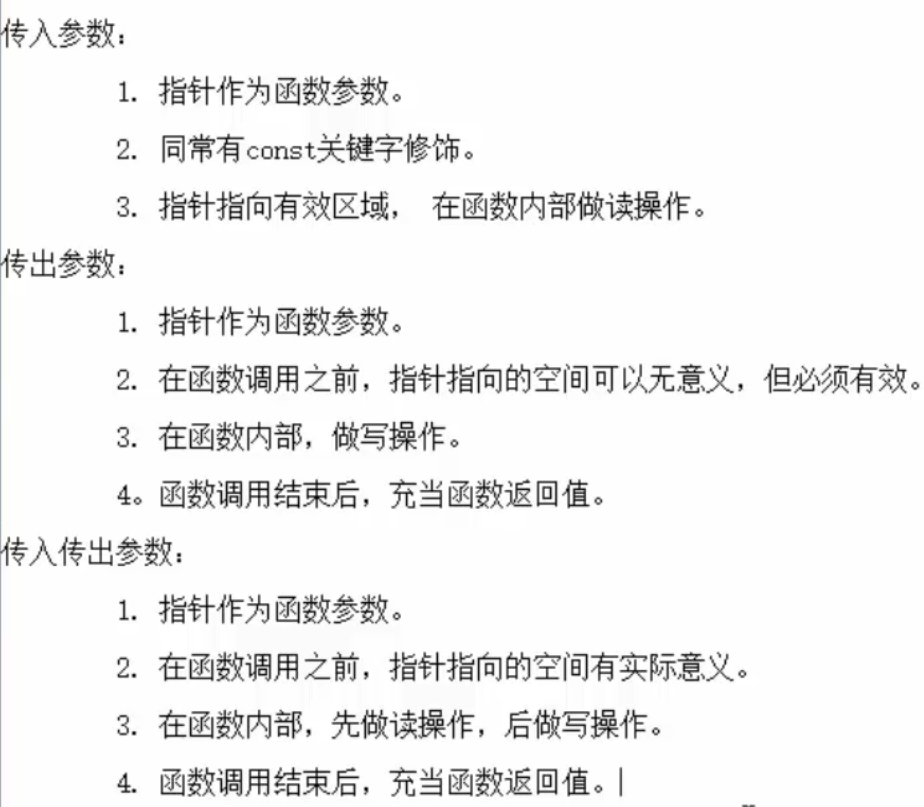
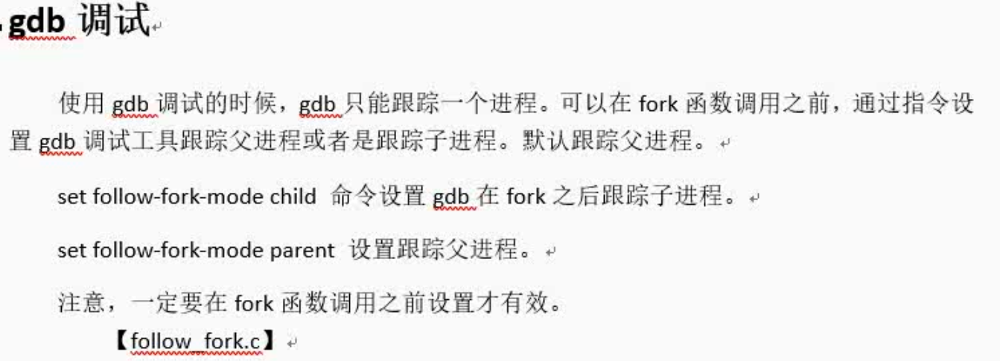

# ..Linux基础学习day1

## 1、快捷键

- 记住常用的终端快捷键可以提高开发效率

  ctrl+alt+t：新开终端

  ctrl+shift+t：新开并堆叠终端窗口

  ctrl+shift+w：关闭当前终端窗口

  alt+数字可以切换堆叠的终端窗口

  ctrl+shift+c：复制

  ctrl+shift+v：粘贴

  ctrl+u：删除行

  del：包括光标本身在内往后删除

  backspace：不包括光标在内往前删除

  书写是在光标前面写入

  记住下面图片快捷键可以摆脱方向键盘

##2、系统根目录

- bin：存放二进制可执行文件，平时在终端写命令都是通过shell（bash）解释然后调用bin中的可执行文件

- boot：系统开机启动相关的程序

- dev：存放设备的映射文件

	 etc：存放系统配置和用户信息的配置文件，	像用户信息文件passwd文件和组信息group文件

- lib：存放系统的库文件，像c的标准库等

- media和mnt：挂载外部磁盘相关的，默认挂载在media

- opt和proc：系统编程和进程相关的

- usr：用户资源管理文件，存放用户安装的软件和第三方库等，

- root：管理员宿主目录（家目录：根目录下的root目录   即：/root）

  ​

  

  ​

## 3、常用目录文件命令

### 1、cd

- cd 可以回到当前用户的用户目录
- cd -  可以在最近两次工作目录下来回切换

### 2、rm

- -r  递归删除文件夹
- -f 强制删除

### 3、ls

- -l 查看文件夹和文件信息
- -h 人性化显示
- -R 递归查看
- 最后参数可以加文件夹路径，即为查看该文件夹下的文件信息
- -d 查看该文件夹的信息

### 4、which

- which+命令查看该命令的执行文件所在的目录

### 5、cp

- -a 用于拷贝文件夹包括其所有权限
- -r 用于递归拷贝文件夹

### 6、cat

- 倒着写可以倒着输出，方便查看大文件
- cat后可以进行终端回显，你打什么它显示什么

### 7、more

- 分屏显示

### 8、head

- 默认显示文件前十行加上-数字可以指定显示行数

### 9、tail

- 与head相反，显示末尾

### 10、du和df

- du用于查看某个目录大小
- df用于查看磁盘挂载的终端进程

## 4、文件属性和用户组管理命令

### 1、whoami

### 2、chmod

- 文字设定法 使用± u g o设定用户、组、其他人的权限 

- 更改权限 +rwx或-rwx

- 使用数字作为选项，二进制选择，3个数字分别代表用户权限、组权限、其他人的权限。

  例子：chmod 675 文件名  ==数字前不用一个短杆==

### 3、chown和chgrp

- 修改文件所属用户 chown 

- 

- 修改文件所属组chgrp

- 

- 一次修改文件所属者和所属组

- 

  ​

### 4、useradd

- 使用选项-m，默认创建用户目录
- adduser 创建时默认创建用户家目录，并且提示设置密码

### 5、userdel

- 使用选线-r，删除用户目录和邮件等
- deluser

## 5、查找命令

### 1、find

- 查找的是文件

- 
- -exec 后面{} \;   注意分号要有，相当于管道，将前面find的结果集进行-exec后面的指令
- -xargs默认是以空格拆分，当文件名中含有空格时，需要在查到的每个结果print0，然后以print0为拆分依据
- find 查找结果想通过管道处理得加上xargs

### 2、grep

- 查找的是文件内容，一般配合cat或more命令加上管道进行查找

  cat 文件路径|grep 搜索内容

- grep -r是递归查找 比如grep -r  -n  "copy"  ./ 表示在当前目录下递归查找文件中内容有copy的行，并标识行号

## 6、Linux系统文件类型

- 普通文件：- ，但是查找的时候使用-f进行查找
- 目录文件：d
- 字符设备文件：c
- 块设备文件：b
- 软连接：l
- 管道文件：p
- 套接字：s
- 位置文件
- Tip：用ls -l显示的第一个字母为文件类型

## 7、软链接和硬链接

### 1、软链接

ln -s  绝对路径  快捷方式路径+名称

相当于一个快捷方式，一般使用绝对路径进行创建，这样移动快捷方式后还能继续使用

### 2、硬链接

ln  绝对路径 快捷方式路径+名称

相当于给文件起了个别名，删除原本的文件是不会导致硬链接运行不了

tip：Linux中的文件名和文件内容是分开的，通过文件名去寻找文件内容，所以删除硬链接原本的文件，只是删除了文件名，文件内容仍存在，可以通过硬链接打开。且通过一个文件名球员更改其中的内容，其他文件名访问的内容也会改变。他们有相同的iNode。类似指向相同的内存空间。硬链接数减为0时该文件内容就被删除，即释放内存。

## 8、进程管理命令

### 1、ps au

终端运行的程序

### 2、ps aux

所有运行的程序，任务管理器

### 3、htop

好看动态的显示当前程序运行情况

### 4、who

查看用户在线情况

### 5、进程挂起、后台前台运行、终止

[fg、jobs、&等指令](https://ehlxr.me/2017/01/18/Linux-%E4%B8%AD-fg%E3%80%81bg%E3%80%81jobs%E3%80%81-%E6%8C%87%E4%BB%A4/)

查看用户级后台运行的程序

### 6、查看环境变量

- echo $环境变量名
- env用来显示所有的环境变量

## 9、软件安装与卸载、压缩解压

 ### 1、终端下载

- sudo apt-get install +软件名
- 注意的是选择合适的源

### 2、下载安装包方式下载

- Ubuntu下载的安装包是.deb
- 

### 3、卸载

- sudo apt-get remove 软件名

### 4、源码安装

- 

### 5、压缩解压

##10、网络管理

### 1、ifconfig

- 查看ip地址

### 2、ping

- 测试网络能否连接上某个ip或域名

## 11、其他命令

### 1、man 

- 
- 查阅命令和函数，文件格式和规范，内核例程

### 2、ctrl+l

- 清屏

### 3、alias

- 用于给命令起别名，类似宏定义

### 4、umask

- 使用权限掩码来创建文件让文件具有一定的权限，注意会去掉可执行权限

## 12、关机与重启

- shutdown
- poweroff：
- reboot：重启

## 13、远程ssh连接

- 使用 ssh  用户名@+ip即可

- 可以配置免密码和配置用户信息封装，可以使用别名进行登录

- 使用scp命令进行数据传输

- 

  在Ubuntu下进行ssh连接后，将远程的文件拷贝到Ubuntu本地

- 换种思路就是将需要配置的东西连上window，或者Ubuntu，然后在需要配置的机器上进行远程传输到本地。

- 使用tabby terminal 的STEP进行文件上传更快，且方便。

## 14、补丁命令

# Linux基础学习day2

## 1、vi命令（未特殊说明均在命令模式下）

安装neovim：[Ubuntu16.04安装neovim - 简书 (jianshu.com)](https://www.jianshu.com/p/ebd17d53b5c1)

vim插件的安装：[vim极为详细的教程（三）插件的使用 - 哔哩哔哩 (bilibili.com)](https://www.bilibili.com/read/cv6476117/)

vim插件网站：https://vimawesome.com

常用的插件：[多语言编程必备的十大 Vim 插件 - 知乎 (zhihu.com)](https://zhuanlan.zhihu.com/p/95596162)

在neovim下安装各种语言调试器：https://github.com/puremourning/vimspector

调试的配置.json：[Vim 最强调试插件：vimspector - 不告诉你我是谁 - 博客园 (cnblogs.com)](https://www.cnblogs.com/kongj/p/12831690.html#%E4%BE%9D%E8%B5%96)

升级python3至3.8：https://cloud.tencent.com/developer/article/1626765

配置为系统默认python3：[(44条消息) 如何将 Ubuntu 16 和 18 上的 python 升级到最新 3.8 版_haiiiiiyun的博客-CSDN博客_ubuntu更新python3.8](https://blog.csdn.net/haiiiiiyun/article/details/104771086?spm=1001.2101.3001.6650.2&utm_medium=distribute.pc_relevant.none-task-blog-2%7Edefault%7ECTRLIST%7ERate-2.pc_relevant_aa&depth_1-utm_source=distribute.pc_relevant.none-task-blog-2%7Edefault%7ECTRLIST%7ERate-2.pc_relevant_aa&utm_relevant_index=5)

使用pip3安装

==neovim配置过程==

- 首先是基本配置，像快捷键，缩进等，放在配置文件最开始，一些基本的其实可以放后面，插件管理放前面

  键表对应的值和表示：https://blog.csdn.net/JasonDing1354/article/details/45372007

  键盘符号的详细说明，请使用:h key-notation命令查看帮助信息

使用的是镜像进行安装，不知道为什么自己安装总是找不到包，估计是镜像源选取的问题

==------------------------------------------------------nvim中快捷键使用-----------------------------------------------------------------------==

- 使用nvim 进行c/c++调试

  

  快速注释：leader+cc

  删除注释：leader+cu

  全选并复制：ctrl+a

  格式化代码：leader+s

  退出调试窗口：leader+r

  查看当前错误和警告：leader+d

  （快捷键不知道可以去对应插件github上找）

  ​

- 窗口和文件相关

  新建文件：ctrl+n

  打开文件：ctrl+o

  文件另存为：ctrl+s

  缓存区的文件切换视图：space+n：向下

  ​					  space+u：向上

  sp+文件名：有则新建无则打开并水平分屏显示；vsp有则新建无则打开并垂直分屏

  ​

  ​

  切换光标所在窗口：

  | 顺序切换                         | ctrl+ww        |
  | :------------------------------- | :------------- |
  | 左下上右切换，跟移动光标方向一致 | ctrl+w+h/j/k/l |

  ​

- vim-markdown快捷键

  [[ "跳转上一个标题
  ]] "跳转下一个标题
  ]c "跳转到当前标题
  ]u "跳转到副标题
  zr "打开下一级折叠
  zR "打开所有折叠
  zm "折叠当前段落
  zM "折叠所有段落
  :Toc "显示目录（定义为leader+d）

### 1、插入和输入

- i：在光标之前插入
- I：光标移动到行首插入

- a：光标之后插入
- A：光标移动到行末插入
- o：开新的下一行并在行首插入
- O：开新的上一行并在行首插入
- s：删除光标所在字符并插入
- S：删除行并进入插入模式

### 2、退出插入模式进入命令模式

- ESC键

### 3、跳转

- 行号+G：跳转到指定行
- 进入末行模式，输入行号也可以跳转

### 4、gg：跳转到首行

### 5、gg=G：自动格式化程序

### 6、%：括号对应匹配跳转

### 7、删除

- x：删除当个字符
- r+字符：将光标所在字符替换
- dw：删除一个单词（前提光标在单词首字母上）
- dd：删除一行
- D：从当前位置删除到行尾（也可以使用d+$）
- d0：删除光标至行首

### 8、光标移动

- 0：移动到行首
- $：光标移动到行尾

### 9、光标移动选择区域

- v：可视化选中，移动光标来选中待操作区域

  后可以执行的操作有 

  1. d：剪切选中区域
  2. y：复制
  3. p：往后粘贴剪切板内容
  4. P：往前粘贴剪切板内容

- ctrl+v实现块可视化，选择要操作的块，并将光标停在需要更改的列，shift+i后输入要插入的字符

  或者删除几个列

### 10、撤销操作

- u：撤销上一步操作，可以撤销多步
- ctrl+r：反撤销

### 11、数字加操作表示该操作重复进行多少次

- 3dd：删除三行

### 12、查找

- /查找内容    
- 按n查找下一处，N查找上一处
- 选中单词后按*（向前）或者#（向后）进行查找单词

### 13、替换

- 单个替换：将光标置于要替换目标所在行，进入末行模式，输入s/欲替换字符串/目标字符串

- 通篇替换：进入末行模式，输入%s/欲替换字符串/目标字符串 /g

  (如果不加最后的/g只替换每一行的第一个)

- 指定行号替换  ：起始行，终止行s/欲替换字符串/目标字符串 /g

### 14、切换到末行模式下

- ctrl+p：呼出上一条历史执行记录
- ctrl+n：呼出吓一条历史执行记录

### 15、分屏

- 末行模式下sp进行横屏分屏，使用ctrl+ww进行切换区域
- 末行模式下vsp进行竖屏分屏，使用ctrl+ww进行区域切换
- 末行模式下wq退出当前区域，并保存，对单块命令还是一样
- 想一次性退出所以得在平时命令加上all

### 16、跳转至man手册进行匹配查询

- 将光标置于想查询的关键字下，按K进行查找，默认查找到第一个
- 如果想查找对应卷的说明，应该按数字+K

### 17、查看宏定义对应的东西

- [+d就会在末行进行宏定义显示

### 18、vim中执行终端命令

- 在末行模式下使用！+终端命令等价与在终端执行该命令
- 执行完看完结果按enter可返回vim下

###==19、==可以配置vim变得好用

- 配置/etc/vimrc
- 或者在用户目录下面创建隐藏文件.vimrc文件进行配置
- 如果二者均配置，优先使用用户的配置

## gcc

### 1、gcc编译四步骤

### 2、常用参数

- -I+头文件路径：用于指定预处理的头文件（如果源文件和头文件在同一目录下不需要指定）

  但是一般会分开存储，并且个人想法是一个项目中将头文件包含到一个总的头文件，每次修改只需要修改该文件，往里面加文件即可，编译时也只需包含这个大的文件

- 每一个命令都包含了前面的几个命令。

- -c：得到二进制文件

- -o ：输出的文件名

- -g：编译时添加调试语句(使代码可以使用gdb进行调试)

- -O+数字：表示优化等级，嵌入式是使用优化0级，因为需要用到一个变量的中间量。

- -Wall：显示所有警告，默认不严重的警告不显示，像定义的变量未使用等

- -D：动态注册一个宏定义，一般用宏作为一个flag，例如写不同板子程序时可以通过宏定义使对应板子的程序进行编译

- -l：指定动态库名

- -L：指定动态库路径

  ​

## 3、静态库和动态库

### 1、静态库

- 每个.c文件需要使用到静态库均得复制一份去编译生成可执行文件，生成的可执行文件会变得很大
- 对空间要求较低，而时间要求较高的核心程序
- 静态库制作步骤：先生成二进制文件（一系列.o文件），然后使用命令ar  rsc lib库名.a  +一些列.o文件路径
- 静态库的使用：和.c文件一起进行编译，库名放在.c文件的后面 库名使用绝对路径

 ### 2、动态库

- 程序运行时去动态库链接函数，但是动态库调用的时间长，调用到了才动态绑定内存地址，延迟绑定，在运行.out文件时调用到动态库的函数才进行内存绑定

- 对时间要求较低，对空间要求较高

- 动态库在程序编译时并不会被连接到目标代码中，而是在程序运行是才被载入。**不同的应用程序如果调用相同的库，那么在内存里只需要有一份该共享库的实例**，规避了空间浪费问题。动态库在程序运行时才被载入，也解决了静态库对程序的更新、部署和发布页会带来麻烦。用户只需要更新动态库即可，**增量更新**。

- 动态库的制作步骤：生成与位置无关的代码使用 -fPIC  ，即代码使用的是相对地址，可以加载到内存任意位置

  gcc -c   .c文件名  -o  .o文件名  -fPIC

  gcc  -shared  lib库名.so  +一些列.o文件

- 动态库的使用：编译成可执行文件时，指定所用的动态库 。 -l：指定库名 -L：指定库路径

  gcc .c文件 -o 输出可执行文件名 -l 库名   -L库路径  

  ==注意库名是上面生成的动态库命令中的库名，不包括lib和.so==

  链接器是工作在链接阶段

- **运行可执行文件时还需要动态链接器，它工作与程序运行的阶段，提供动态库所在目录位置**

- 解决方法是提供动态库链接的目录路径：LD_LIBRARY_PATH=动态库路径（==最好使用绝对路径==）

  使环境变量生效，即进行值覆盖:export LD_LIBRARY_PATH=动态库路径

  而且这种环境变量配置只对当前终端有效，重新开启终端需要重新配置

  解决方法是修改配置文件~/.bashrc，配置完保存后记得source  ~/.bashrc 使之生效或者使用.   .bashrc在终端中运行该文件

  还有一种滥竽充数的方法是把动态库放到系统库目录下（/lib），因为每次运行都会动态链接系统库（但是不推荐，因为用户级的东西尽量不要放在系统目录下）

  最后一种方法是修改配置文件

  1. 修改/etc/ld.so.conf   使用sudo vim /etc/ls.so.conf，然后把动态库的绝对路径粘贴进去
  2. 更新查找动态库的路径使配置文件生效  使用 sudo ldconfig -v

- 这种改配置文件的话后续一旦更改库路径的话需要重新配置（个人觉得使用向配置文件写入环境变量并使用相对路径方法更合适，并且保持文件结构不变即可，还有一个方法是把动态库统一放到一个目录下进行管理，路径相对稳定，但是注意还有头文件的问题，源文件使用什么库记得包含头文件）

- 测试程序能否找到动态库的命令 ldd a.out

### 3、动态库和静态库一起使用优先使用动态库

## 4、常见警告

- 隐式声明：编译器在碰到函数时如果没有函数定义和函数声明，编译器会帮你实现隐式声明

  隐式声明默认返回值为int，函数名和参数根据你给的进行

  解决方法是在头文件里进行函数声明，并且包含头文件

  因为一般静态库你也不知道里面具体的函数，静态库在制作的时候应该附带有.h头文件

## 5、常见错误

### 1、预处理

- 缺少头文件

- 重复包含头文件

  可以通过条件编译进行避免

  

  ​

  ​

### 2、编译

- 主要是检查语法错误，比如未定义变量等

### 3、汇编

- 一般没有错误

### 4、链接

- 找不到链接的函数等

#Linux基础学习day3

## 1、gdb调试工具

- 在使用gcc编译时加上-g（编译时忘记加-g时，可以在进入gdb调试工具后使用file+可执行文件进行加入调试信息）
- gdb + 带调试的可执行文件路径：进入对程序的调试
- 常用指令：
  1. list 1：列出源码，，查看代码行号设置断点
  2. b+行号，设置断点|d +breakpoints NUM：删除断点
  3. r/run：运行程序
  4. n/next：下一步（不进函数），s单步（进函数）
  5. p/print+变量名：查看变量值
  6. finish：结束函数调用，返回函数调用点，即跳出函数
  7. continue：继续执行程序
  8. quit：退出gdb调试
- 其他指令
  1. run：使用run查找段错误出现位置
  2. set args：设置main函数命令行参数/run +字符串1，字符串2...：也可以设置main函数参数并运行
  3. info b ：查看断点信息表
  4. b +行号  if +条件：设置条件断点，一般用于循环语句和递归，当循环变量值为多少时才在对应行停止
  5. ptype+变量名：打印变量类型
  6. bt：列出程序正存活的栈帧（栈帧就是在栈上为每个函数各自开辟的一块存储局部变量和临时值的内存）
  7. frame+数字，切换到不同编号的栈帧中
  8. display+变量名：跟踪变量值   |   undisplay+跟踪变量编号：取消跟踪变量

## 2、Makefile：项目编译管理

### 1、基本原理

- 命名：makefile或者Makefile

- 1个规则：

  ==目标：依赖条件==

  ==（一个tab缩进）命令==

  1. 目标时间必须晚于依赖时间，否则更新目标

  2. 依赖条件如果不存在，寻找新的规则去产生依赖

     （类似递归去找依赖）

  ALL:写在Makefile文件的最开始，指定Makefile要生成的最终目标文件，如果没有ALL，默认第一个目标为最终目标

  tip：这里的命令即为终端执行的命令，比如gcc -o hello.o -c 

  ​	目标为文件名，依赖条件为提供的编译文件路径

- 2个函数：

  src=$（wildcard ./*.c）:提取当前工作目录下的所有.c文件名，将文件名组成列表赋值给src

  obj=$（patsubst %.c，%.o，$（src））：将参数3中的，包含参数1的部分，替换为参数2,并形成一个列表赋值给obj。

  tip：$(变量名)是取出变量值

  clean没有依赖，用于执行删除文件，命令最开始加上-是当文件不存在时不报错

  clean:
          -rm -rf $(obj) a.out

  ​

- 3个自动变量：

  $@：在规则命令中，表示规则中的目标。

  $^：在规则的命令中，表示所有的依赖条件。

  $<：在规则的命令中，表示第一个依赖条件。如果将该变量运用在模式规则中，它可将依赖条件列表中的依赖依次取出，套用模式规则：

  ​	%.o:%.c

  ​		gcc -c  $<   -o  %@

  静态模式规则：

  ​	指明该规则专门给生成obj的时候用（即在使用模式规则生成obj时寻找的是.c文件）

  ​	$(obj):%.o:%==.c==

  ​		gcc -c  $<   -o  %@

  ​	指明该规则专门给生成obj1的时候用（即在使用模式规则生成obj时寻找的是.s文件）

  ​	$(target):%.o:%.s

  ​		gcc -c  $<   -o  %@

- 伪目标：(不用生成该文件，但是要去执行下面的命令，防止当前目录有跟clean和ALL重名的文件，会包已经是最新了的错误)

  .PHONY:clean ALL

  学会自定义变量

  args=字符串

  使用变量时$(args)即可类似宏替换

- 参数

  -n：模拟执行make、make clean命令，防止出错删错东西

  -f：指定文件执行文件名非makefile/Makefile的makefile文件，如果Makefile文件文件名为Makefile就不需要指定该参数

- 如果有多个可单独运行的.c文件在一个文件夹下（多个main函数），可以使用静态模式规则创建多个可执行文件，，即终极目标为多个文件，定义目标变量ALL：$(target)

  （==多个.c文件编译的话，一个可执行文件一个makefile==）

 # Linux基础学习day4

## 1、文件IO

### 1、系统调用

- 系统调用就是通过内核与底层硬件打交道，实现底层调用，主要是学习系统调用的函数
- 
- ​

###2、open()/close()函数

1. open（）函数

   - 有哪几个形参数和参数有哪些取值看手册，并且需要记忆，返回值（出错返回-1）

   - 三个参数分别为，操作的文件路径，方式，新创建的文件权限（文件权限指定时受umask影响为mode&（~umask））。==参数的宏定义在头文件<fcntl.h>中==

   - 常见错误，打开不存在的文件、以只写方式打开只读文件，以只写打开一个目录而不是文件

   - 

     ​

2. close（）函数

   - int close(int fd);

3. 

   ​

   ​

### 3、read和write函数

1. 

   ​

2. 直接使用read 和write一次写一个字节比使用fgetc和fputc相比慢的原因

   用户字节设定缓冲区为4096字节可以最快提高速度

   预读入缓输出，先暂存，凑多点再一起送过去，避免次数过多的资源消耗

   

   ​

3. 学了系统调用函数后，还是优先使用库函数，因为自己还是不了解系统调用函数的执行机制

   但是当库函数逻辑满足不了需求时，应该使用系统调用实现，比如不需要一次性读写4096字节

### 4、文件描述符

- PCB进程控制块：本质  结构体

- 成员：文件描述符表

- 文件描述符：0、1、2...1023  表中最小的可用

  0-STDIN_FILENO

  1-STDOUT_FILENO

  2-STDERR_FILENO

- 

### 5、阻塞和非阻塞：阻塞是文件的属性

- 产生阻塞的场景。读设备文件（像键盘，等待输入）。读网络文件（读常规文件无阻塞概念）
- /dev/tty ----终端文件
- open("/dev/tty",O_RDWR|O_NONBLOCK)  ----设置非阻塞打开终端终端（默认为阻塞状态）

### 6、fcntl函数

该函数可以更改标准输入设备（键盘）为非阻塞，就不用使用open打开终端设定为O_NONBLOCK

函数原型为int (int fd,int cmd,...);不同的cmd参数，后面有不同的设置参数

int flags =fcntl(fd,F_GETFL);

flags|=O_NONBLOCK

fcntl(fd,F_SETFL,flags);

获取文件状态：F_GETFL

设置文件状态：F_SETFL

(获取flags和修改flags)

### 7、lseek函数

- 函数原型：off_t lseek(int fd, off_t offset, int whence);

- 参数：

  fd：文件描述符 

  offset：偏移量

  whence：起始偏移位置（SEEK_SET/ SEEK_CUR/ SEEK_END）

- 返回值：

  成功返回较起始的偏移量

  失败返回-1 设置errno

- 应用场景：

  - 文件读写使用同一偏移量，比如写完文件进行读文件内容应使用lseek进行偏移再进行读

  - 使用lseek获取（把光标偏移到最后获取返回值即可）

  - 拓展文件大小：要想使文件大小真正拓展，必须引起IO操作，即要写入东西。

    可以使用truncate函数，直接拓展文件 int ret =truncate("文件路径"，拓展字节数)

 ### 8、传入传出参数

==指针作为函数参数充当函数返回值，本质就是改值并且不会在块内销毁==

## 2、文件系统

### 1、文件存储

- 目录项：包含文件名和inode，建立文件硬链接就是创建新的文件名和inode，多个文件均指向同一个inode结构体，里面包含文件属性等、其中有存储了对应的磁盘存储信息。

### 2、stat函数

- 函数原型： int stat(const char *pathname, struct stat *buf);

  参数：

  path：文件路径

  buf：传入传出参数作为缓存区

  返回值：

  成功：0

  失败：-1   设定errno

  获取文件大小：buf.st_size

  获取文件权限和类型的一个变量：buf.st_mode

  获取文件类型：buf.st_mode（将该参数传入给宏）

- 有一些宏函数可以进行文件类型的判断

  

  ​

### 3、lstat函数

与lstat的区别就是stat会穿透符号链接，lstat不会（在判断软链接是什么文件类型时穿透是会返回链接的源文件的类型）

### 4、其他简单操作文件函数

- access函数：获取访问权限属性
- chmod函数：修改访问权限
- truncate函数：拓展或截取文件大小
- readlink函数：读符号链接文件本身内容，得到链接文件的路径
- rename函数：重命名，跟实现mv类似，新建硬链接，删除旧的硬链接（目录项）

###5、在程序中将文件硬链接数减为零，仍然可以进行读写操作，实际写到缓冲区

文件硬链接数变为0，若还有进程打开该文件，该内存资源不会被释放，操作系统在程序结束会自动回收内存空间

### 6、目录操作

#### 1、函数

- getcwd函数：获取当前工作路径

- chdir函数：改变工作目录   

- DIR * opendir(char *name)函数：进入目录

- int closedir(DIR *dp)函数：关闭目录

- struct dirent * readdir( DIR *dp)函数：读取目录，有类似获取文件属性的函数lstat的功能

  读出了一个目录项，常用成员为d_name[256],目录名为一个静态数组，可见目录名最长为255字节

####2、文件目录权限

### 7、实现ls -R

- 关键点：实现读目录，是目录先打印，在读目录中进行是否是文件判断并打印并递归调用读目录函数

  容易出问题是因为含有 “.”这个目录，会进入一个循环调用“.”。需要单独判断跳出。

- 

### 8、重定向

-  函数原型：int dup(int oldfd); 

  oldfd：旧文件描述符

  返回新的文件描述符 

  作用是产生一个文件副本，是一个拷贝，对该文件描述符的操作会引起改变，一起共用一个内存空间

- int dup2(int oldfd, int newfd);  ==实现重定向输出==

  （ 3  dup2  4  ，改4会影响3；即两个文件描述符是指向原本三指向的内存。）

  本质是返回newfd，可以对旧文件进行直接操作，对两个文件描述符进行读写均会改变oldfd所指的内容。

- fcntl函数实现dup2的功能   ==fcntl这个函数比较万能，根据cmd的不同，再传不同参数，实现不同功能==

  cmd：D_DUPFD

  参3：被占用，返回最小可用的文件描述符，未被占用的即返回参3的值

# Linux基础学习day5

## 1、进程（查看进程ps aux）

- 程序：死的。只占用磁盘空间  --剧本。
- 进程：活的。运行起来的程序，占用内存、cpu系统资源。 --戏
- 并发：开始是并发是分时复用。类似动态数码管，但是由于频率过快，看起来就像是并行的。

## 2、虚拟内存和物理内存的映射关系

- 除了内核段外，其余是通过CPU上的一个叫MMU（内存管理单元）的进行虚拟映射，把不连续的物理地址映射成为逻辑上连续的内存，MMU相当于帮你排序成连续的数据，但这个映射关系是自己储存

- 内核段是共享的，操作系统只有一个

- 解释图

  

- 进程结构体 struct task_struct 

  在头文件/usr/src/linux-headers-4.15.0-142/include/linux/sched.h 下面定义的

  重点掌握

  

  环境变量：命令env可以查看

  查找的PATH：使用echo$PATH可以打印环境变量

    SHELL：命令解释器（脚本），通常是/bin/bash（其实还有sh）

## 3、fork函数

在fork（）函数后产生子进程，成功返回，子进程的fork函数返回0，父进程返回子进程的pid

fork（）函数产生多个子进程后，得想办法让子进程不利用后序代码进行创建孙子进程，可以利用返回值来阻止其创建，同时，使用for循环创建时，后面会争资源去运行程序，取决于内核所使用的调度算法。

输出结果一秒打一个，可见是同时产生的，不同的子进程sleep时间不同，每个按顺序间隔1秒

父进程和所以子进程遵循读时共享写时复制的原则。只要进行写操作，就会复制一份。全局变量一样会复制一份，不是共享的。

## 4、exec函数族

此处子进程调用的函数，传入的第一个参数为argv[0]，所以在调用时记得，把path或file作为第一个arg参数。

==执行exec成功的话就直接跑exec中调用的程序了，原本程序后续的代码都作废，可以用来做错误处理的事情。==

重新加载环境变量指定可执行文件的路径

## 5、回收子进程

僵尸进程是指子进程结束后，父进程还在执行，此时init不会领养子进程进行残留资源回收，需要kill父进程，二者才会一起结束。或者父进程调用wait函数，阻塞等待子进程死亡将其回收再继续执行，可以使用宏函数查看wait的传入参数，进而判断子进程的结束状态。如果不关心子进程的终止状态，则传入参数为null。

父进程可以进行子进程的回收。

- 命令ps aux查看当前系统进程
- ps ajx查看父子进程pid 

