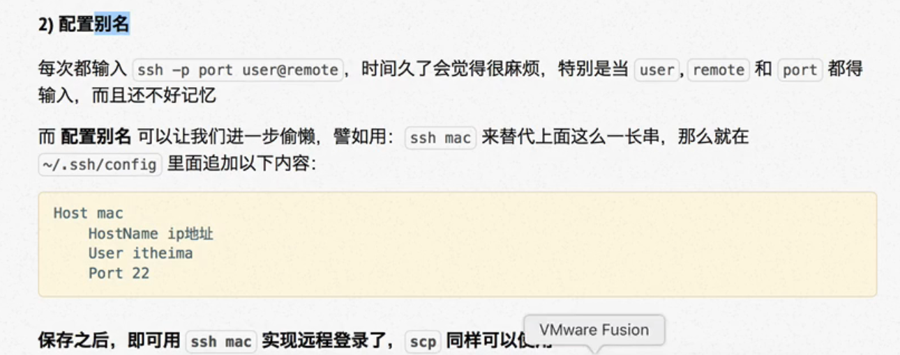
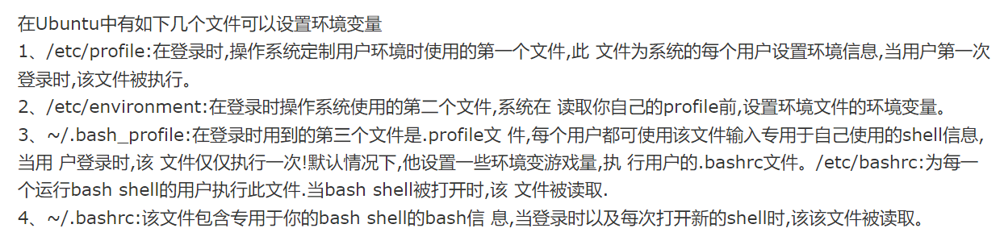
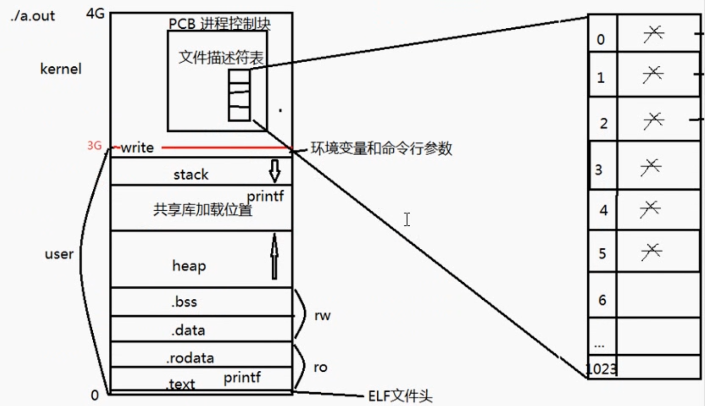
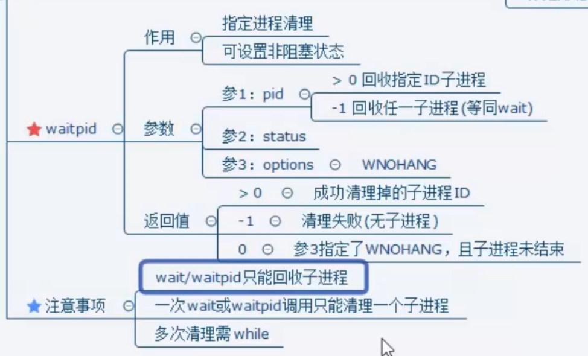
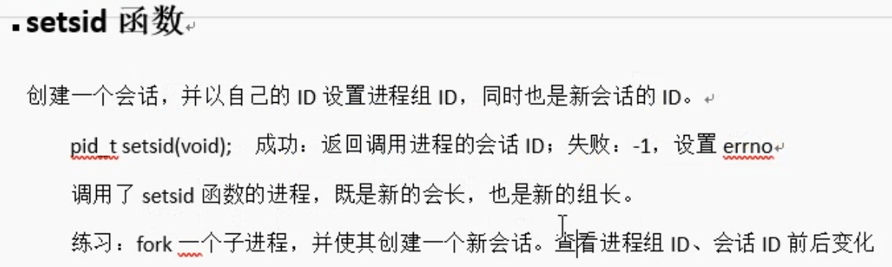
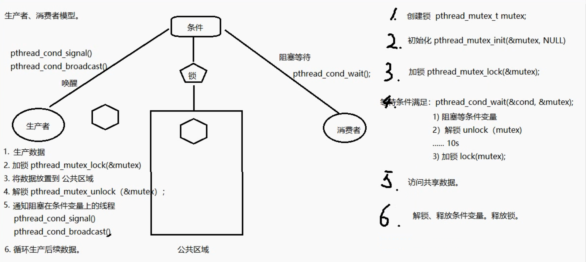
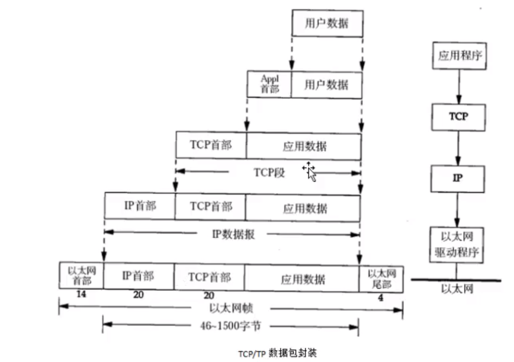
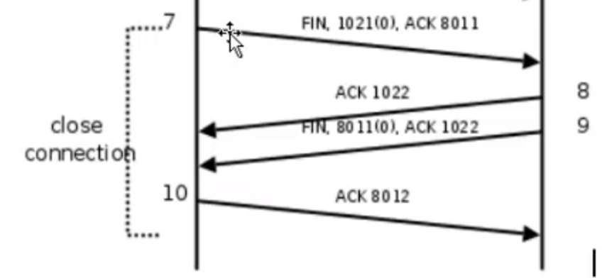
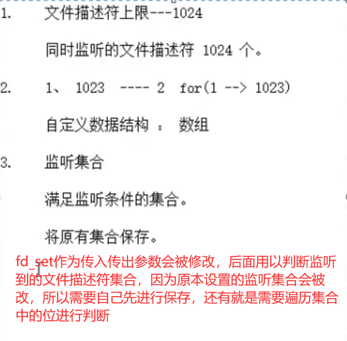
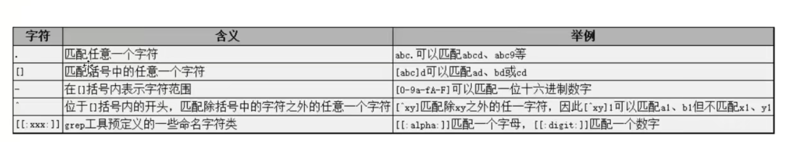

#  Linux基础学习day1

## 1、快捷键

- 记住常用的终端快捷键可以提高开发效率

  ctrl+alt+t：新开终端

  ctrl+shift+t：新开并堆叠终端窗口

  ctrl+shift+w：关闭当前终端窗口

  alt+数字可以切换堆叠的终端窗口

  ctrl+shift+c：复制

  ctrl+shift+v：粘贴

  ctrl+u：删除行

  del：包括光标本身在内往后删除

  backspace：不包括光标在内往前删除

  书写是在光标前面写入

  记住下面图片快捷键可以摆脱方向键盘


##2、==系统根目录==

- bin：存放二进制可执行文件，平时在终端写命令都是通过shell（bash）解释然后调用bin中的可执行文件

- boot：/boot  存放开机时所要用的文件，包括linux核心文件、开机菜单和开机所要的配置文件。

   ​

- dev：存放设备的映射文件，包含了所有Linux系统中使用的外部设备。但是这里并不是放的外部设备的驱动程序，这一点和**windows**,dos操作系统不一样。它实际上是一个访问这些外部设备的端口。我们可以非常方便地去访问这些外部设备，和访问一个文件，一个目录没有任何区别。

   [(86条消息) Linux /dev目录详解和Linux系统各个目录的作用linux各个目录的作用](https://blog.csdn.net/maopig/article/details/7195048)

   ​

- etc：存放系统配置和用户信息的配置文件和网络配置文件等，像用户信息文件passwd文件和组信息group文件

- lib：存放系统的库文件，像c的标准库等

- media：有些linux的发行版使用这个目录来挂载那些usb接口的移动硬盘（包括U盘）、CD/DVD驱动器等等

- mnt：挂载外部磁盘相关的，默认挂载在media

- proc：系统编程和进程相关的

   Linux系统上的/proc目录是一种文件系统，即proc文件系统。与其它常见的文件系统不同的是，/proc是一种伪文件系统（也即虚拟文件系统），**存储的是当前内核运行状态的一系列特殊文件，用户可以通过这些文件查看有关系统硬件及当前正在运行进程的信息，甚至可以通过更改其中某些文件来改变内核的运行状态**。

   ​

- opt：可选的应用软件包，这是为所有用户安装的

   /opt 目录用来安装附加软件包，是**用户级的程序目录**，可以理解为 D:/Software。

   **/opt 这个目录是一些大型软件的安装目录，或者是一些服务程序的安装目录 。**

   安装到 /opt 目录下的程序，它所有的数据、库文件等等都是放在同个目录下面。

   在硬盘容量不够时，也可将 /opt 单独挂载到其他磁盘上使用

   ​

- usr：用户资源管理文件，存放用户安装的应用程序和第三方库的位置

   /usr：系统级的目录，可以理解为 C:/Windows/。

   /usr/lib：理解为 C:/Windows/System32。

   /usr/local：用户级的程序目录，可以理解为 C:/Progrem Files/。用户自己编译的软件默认会安装到这个目录下。

- root：管理员宿主目录（家目录：根目录下的root目录   即：/root）

  ​

  

  ​

## 3、常用目录文件命令

### 1、cd

- cd 可以回到当前用户的用户目录
- cd -  可以在最近两次工作目录下来回切换

### 2、rm

- -r  递归删除文件夹
- -f 强制删除

### 3、ls

- -l 查看文件夹和文件信息
- -h 人性化显示
- -R 递归查看
- 最后参数可以加文件夹路径，即为查看该文件夹下的文件信息
- -d 查看该文件夹的信息

### 4、which和whereis

- which+命令查看该命令的执行文件所在的目录
- whereis 是来寻找命令的二进制文件，同时也会找到其帮助文件；

### 5、cp

- -a 用于拷贝文件夹包括其所有权限
- -r 用于递归拷贝文件夹

### 6、cat

- 倒着写可以倒着输出，方便查看大文件
- cat后可以进行终端回显，你打什么它显示什么

### 7、more

- 分屏显示

### 8、head

- 默认显示文件前十行加上-数字可以指定显示行数

### 9、tail

- 与head相反，显示末尾

### 10、du和df

- du用于查看某个目录的文件情况，默认递归  

    du -hs查看目录的大小

- df用于查看磁盘挂载的终端进程

## 4、文件属性和用户组管理命令

### 1、whoami

### 2、chmod

- 文字设定法 使用± u g o设定用户、组、其他人的权限 


- 更改权限 +rwx或-rwx

- 使用数字作为选项，二进制选择，3个数字分别代表**用户权限、组权限、其他人的权限**。

  例子：chmod 675 文件名  ==数字前不用一个短杆==

### 3、chown和chgrp

- 修改文件所属用户 chown 

- 

- 修改文件所属组chgrp

- 

- 一次修改文件所属者和所属组

- 

  ​

### 4、useradd

- 使用选项-m，默认创建用户目录
- adduser 创建时默认创建用户家目录，并且提示设置密码

### 5、userdel

- 使用选线-r，删除用户目录和邮件等
- deluser

### 6、sudo权限设置

在/etc/sudoers

可以将某个组设置为有sudo权限后

组内的所有用户都具有sudo权限

在建立他们自己的用户时，将其添加入wheel组中（用wheel组作为用户的主组），或者使用vigr来编辑/etc/group文件，将他们的用户名追加到wheel组那行的末尾。

设置sudo不用密码：在/etc/sudoers下添加一行 `"yong1 ALL = NOPASSWD: ALL"`(yong1为用户名)

让yong1用户sudo不用密码即可执行某几个命令，可这样写``"yong1 ALL = NOPASSWD: /usr/bin/abc.sh, /usr/sbin/adduser"``

## 5、查找命令

### 1、find

- 查找的是文件


- 
- -exec 后面{} \;   注意分号要有，相当于管道，将前面find的结果集进行-exec后面的指令
- -xargs默认是以空格拆分，当文件名中含有空格时，需要在查到的每个结果print0，然后以print0为拆分依据
- find 查找结果想通过管道处理得加上xargs

### 2、grep

- 查找的是文件内容，一般配合cat或more命令加上管道进行查找

  cat 文件路径|grep 搜索内容

- grep -r是递归查找 比如grep -r  -n  "copy"  ./ 表示在当前目录下递归查找文件中内容有copy的行，并标识行号


## 6、Linux系统文件类型

- 普通文件：- ，但是查找的时候使用-f进行查找
- 目录文件：d
- 字符设备文件：c
- 块设备文件：b
- 软连接：l
- 管道文件：p
- 套接字：s
- 位置文件
- Tip：用ls -l显示的第一个字母为文件类型

## 7、软链接和硬链接

### 1、软链接（是真存着路径的文件，本质也就是）

ln -s  绝对路径  快捷方式路径+名称

相当于一个==快捷方式==（软链接记录的只是一个路径名），一般使用绝对路径进行创建，这样移动快捷方式后还能继续使用，删除原本文件后软链接失效

### 2、硬链接

ln  绝对路径 快捷方式路径+名称

相当于给文件起了个别名，删除原本的文件是不会导致硬链接运行不了，因为还有别的指着同一内存空间的目录项存在，内存不会释放。

tip：Linux中的文件名和文件内容是分开的，通过文件名去寻找文件内容，所以删除硬链接原本的文件，只是删除了文件名，文件内容仍存在，可以通过硬链接打开。且通过一个文件名更改其中的内容，其他文件名访问的内容也会改变。他们有相同的iNode。类似指向相同的内存空间。硬链接数减为0时该文件内容就被删除，即释放内存。


**Inode：**

在Linux的文件系统中，保存在磁盘分区中的文件不管是什么类型都给它分配一个编号，称为索引节点号(Inode Number)。是UNIX内部用于描述文件特性的数据结构.我们通常称I节点为文件索引结点(信息结点).i节点 含有关于文件的大部分的重要信 息,包括文件数据块在磁盘上的地址.每一个I节点有它自己的标志号,我们称为文件顺序号.I节点包含的信息 1.文件类型 2.文件属主关系 3.文件的访问权限 4.文件的时间戳.

**软链接和硬链接的对比**：

1. 软连接可以跨文件系统，硬链接不可以（也不可以跨分区);
2. 软连接可以对一个不存在的文件名(filename)进行连接(当然此时如果你vi这个软连接文件，[**linux**](javascript:;)会自动新建一个文件名为filename的文件）,硬链接不可以（其文件必须存在，inode必须存在）；
3. 软连接可以对目录进行连接，硬链接不可以。

## 8、进程管理命令

### 1、ps au

终端运行的程序

### 2、ps aux

所有运行的程序，任务管理器

### 3、htop

好看动态的显示当前程序运行情况

### 4、who

查看用户在线情况

### 5、进程挂起、后台前台运行、终止

[fg、jobs、&等指令](https://ehlxr.me/2017/01/18/Linux-%E4%B8%AD-fg%E3%80%81bg%E3%80%81jobs%E3%80%81-%E6%8C%87%E4%BB%A4/)

查看用户级后台运行的程序

### 6、查看环境变量

- echo $环境变量名
- env用来显示所有的环境变量


## 9、软件安装与卸载、压缩解压

 ### 1、终端下载

- sudo apt-get install +软件名
- 注意的是选择合适的源

### 2、下载安装包方式下载

- Ubuntu下载的安装包是.deb
- 

### 3、卸载

- sudo apt-get remove 软件名

### 4、源码安装

- 

### 5、压缩解压


### 6、默认版本选择

**update-alternatives**：可以添加一些备选版本，并在需要的时候进行切换

- 常用命令：

1. --display：显示当前加入的版本和类型

2. --install：将某个可执行文件添加到可供选择的列表中

   `update-alternative --install [连接的名字] [加入后在列表中的名字] [可执行程序bin的路径] [优先级]`

3. --config:可以更改为手动选择使用的版本，选择对应序号即可

4. --remove：从可供选择的列表中移除某个版本选项

5. --help：帮助文档很详细清晰，忘记可以查看

##10、网络管理

### 1、ifconfig

- 查看ip地址

### 2、ping

- 测试网络能否连接上某个ip或域名

### 3、nc

- 命令和参数：

  1. -p<通信端口> 设置本地主机使用的通信端口
  2. ​

- 例子：默认是在终端显示数据

  发送端：默认使用本地IP地址

  nc -l  -p 6666 < test.txt

  【监听6666端口，等待连接】（设发送端IP为10.20.133.152）
  接收端：
  nc 10.20.133.152 6666 > test1.txt
  如上面的操作，即可将文件test.txt从发送端传送到接收端，保存为test1.txt

## 11、其他命令

### 1、man 

- 
- 查阅命令和函数，文件格式和规范，内核例程

### 2、ctrl+l

- 清屏

### 3、alias

- 用于给命令起别名，类似宏定义

  若要每次登入是即自动设好别名，可在.profile或.bashrc中设定指令的别名。

  **只能指定指令名称和参数**，不能当成变量使用。就是不能alias path=‘/home/yong1/workdir'，然后使用cd path是不可以的

  例子：`alias num='ls -A|wc -l'`使用num可以查看当前目录下除了.和..之外的所有文件数目

### 4、umask

- 使用权限掩码来创建文件让文件具有一定的权限，注意会去掉可执行权限


## 12、关机与重启

- shutdown
- poweroff：
- reboot：重启

## 13、远程ssh连接

- 端口转发后要使用ssh先连接远程服务器，在通过远程服务器连接到内网主机，（远程主机登录的ssh和内网一致），此时可以在外网连接服务器进而连接本地的刚刚转发的那个端口，该端口转发的是内网中主机的ssh端口22


- 使用 ssh  用户名@+ip即可，如果更改了ssh的端口号不再是22的话需要指定端口号

  1. 使用ssh-keygen 一路回车会在~/.ssh下生成公钥和私钥

  2. 使用ssh-copy-id 远程用户名@+ip地址，可以将公钥拷贝到远程主机的~/.ssh文件夹 下

     至此，可以实现ssh免密登录


- 可以配置免密码和配置用户信息封装，可以使用别名进行登录

  

  相当于 Host后面的变量可以代替 用户名@ip地址

  ==第一次新建config会出现没有权限的问题，需要更改config的权限==

  [(81条消息) Bad owner or permissions on .ssh/config的解决_zcc_heu的博客-CSDN博客](https://blog.csdn.net/zcc_heu/article/details/79017606)


- 使用scp命令进行数据传输

- 

  在Ubuntu下进行ssh连接后，将远程的文件拷贝到Ubuntu本地

- 换种思路就是将需要配置的东西连上window，或者Ubuntu，然后在需要配置的机器上进行远程传输到本地。

- 使用tabby terminal 的STEP进行文件上传更快，且方便。

## 14、补丁命令


## 15、环境变量问题

在/etc/environment中存着PATH，每次启动会加载这个系统环境变量

每次运行bash都会加载~/.bashrc中的信息，可以在其中定义永久的环境变量，比如常用的变量，像工作路径

1 2 4比较比较常用



==/etc/profile修改的是所有用户的，~/.bashrc修改的是用户的环境变量==

修改PS1的值可以修改终端中的开头提示符

[(86条消息) PS1应用之——修改linux终端命令行各字体颜色_aokaoqi1145的博客-CSDN博客](https://blog.csdn.net/aokaoqi1145/article/details/101485132?spm=1001.2101.3001.6650.9&utm_medium=distribute.pc_relevant.none-task-blog-2%7Edefault%7EBlogCommendFromBaidu%7Edefault-9.pc_relevant_default&depth_1-utm_source=distribute.pc_relevant.none-task-blog-2%7Edefault%7EBlogCommendFromBaidu%7Edefault-9.pc_relevant_default&utm_relevant_index=15)

## 16、Ubuntu启动过程

1. 读取MBR信息，启动Boot Manger（使用的是GRUB）
2. 加载系统内核，启动init进程
3. init进程读取/etc/inittab文件中的信息，加载/etc/rcx.d/文件，并加载图像用户系统
4. 启动登录管理器，等待用户登录

## 17、硬盘分区和挂载

linux系统中每个分区都是一个文件系统，都有自己的目录层次结构。linux会将这些分属不同分区的、单独的文件系统按一定的方式形成一个系统的总的目录层次结构。这里所说的“按一定方式”就是指的挂载。将一个文件系统的顶层目录挂到另一个文件系统的子目录上，使它们成为一个整体，称为挂载。把该子目录称为挂载点.例如要读取硬盘中的一个格式化好的分区、光盘或软件等设备时，必须先把这些设备对应到某个目录上，而这个目录就称为“挂载点（mount point）”，这样才可以读取这些设备。 挂载后将物理分区细节屏蔽掉，用户只有统一的逻辑概念。所有的东西都是文件。

注意：

1. 挂载点必须是一个目录。
2. 一个分区挂载在一个已存在的目录上，这个目录可以不为空，但挂载后这个目录下以前的内容将不可用。


**硬盘分区和挂载的步骤：**

参考链接：[ ubuntu 16.04 硬盘分区，挂载，硬盘分区方案_小鹿学长的博客-CSDN博客_ubuntu 挂载分区](https://blog.csdn.net/u010409517/article/details/88081911)

**顺序**：创建一个新的分区，需要先格式化，然后在挂载到某个文件上，最后设置永久挂载。

1. 硬盘分区:

`sudo fdisk /dev/sdx`(x是具体得看自己的分区进行更改)，按照提示输入m获取帮助后面输入n，然后输入p设置主分区，输入分区号，起始块默认2048，终止块大小即为可以使用的空间大小，也就是为此分区分配多少存储空间，根据提示输入+xG（x表示要分的空间大小），输入p显示分区表，输入w保存分区表


2. 分区格式化：

`sudo mkfs -t ext4 /dev/sdx?`(x?根据实际情况填写)

3. 硬盘挂载：

新建data目录，用于挂载新分区；把分区/dev/sdb1挂载到/data目录下,文件作为一个挂载点（Linux一切皆文件）
`sudo mkdir /media/data`

`sudo mount -t ext4 /dev/sdb1 /media/data`

4. 配置硬盘在系统启动自动挂载：

`sudo blkid`查看UUID

`sudo mount -o remount,rw /`表示重新修改 根目录/的读写属性

`sudo vim /etc/fstab` ，直接编辑（E）

最后一行加上**UUID=072495b1-f395-4706-92b0-7226441bc91f /media/data ext4 defaults 0 2**

UUID根据查到的填写，后面的路径挂载点文件路径，ext4是文件系统类型，default默认选项，0是dump，2是pass

**fstab文件的每一列的含义：**

- **device**：指定加载的磁盘分区或移动文件系统，除了指定设备文件外，也可以使用UUID、LABEL来指定分区；
- **dir**：指定挂载点的路径；
- **type**：指定文件系统的类型，如ext3，ext4等；
- **options**：指定挂载的选项，默认为defaults，其他可用选项包括acl，noauto，ro等等；
- **dump**：表示该挂载后的文件系统能否被dump备份命令作用；0表示不能，1表示每天都进行dump备份，2表示不定期进行dump操作。
- **pass**：表示开机过程中是否校验扇区；0表示不要校验，1表示优先校验（一般为根目录），2表示为在1级别校验完后再进行校验；

# Linux基础学习day2

## 1、vi命令（未特殊说明均在命令模式下）

安装neovim：[Ubuntu16.04安装neovim - 简书 (jianshu.com)](https://www.jianshu.com/p/ebd17d53b5c1)

vim插件的安装：[vim极为详细的教程（三）插件的使用 - 哔哩哔哩 (bilibili.com)](https://www.bilibili.com/read/cv6476117/)

vim插件网站：https://vimawesome.com

常用的插件：[多语言编程必备的十大 Vim 插件 - 知乎 (zhihu.com)](https://zhuanlan.zhihu.com/p/95596162)

在neovim下安装各种语言调试器：https://github.com/puremourning/vimspector

调试的配置.json：[Vim 最强调试插件：vimspector - 不告诉你我是谁 - 博客园 (cnblogs.com)](https://www.cnblogs.com/kongj/p/12831690.html#%E4%BE%9D%E8%B5%96)

升级python3至3.8：https://cloud.tencent.com/developer/article/1626765

配置为系统默认python3：[(44条消息) 如何将 Ubuntu 16 和 18 上的 python 升级到最新 3.8 版_haiiiiiyun的博客-CSDN博客_ubuntu更新python3.8](https://blog.csdn.net/haiiiiiyun/article/details/104771086?spm=1001.2101.3001.6650.2&utm_medium=distribute.pc_relevant.none-task-blog-2%7Edefault%7ECTRLIST%7ERate-2.pc_relevant_aa&depth_1-utm_source=distribute.pc_relevant.none-task-blog-2%7Edefault%7ECTRLIST%7ERate-2.pc_relevant_aa&utm_relevant_index=5)

使用pip3安装

==neovim配置过程==

- 首先是基本配置，像快捷键，缩进等，放在配置文件最开始，一些基本的其实可以放后面，插件管理放前面

  键表对应的值和表示：https://blog.csdn.net/JasonDing1354/article/details/45372007

  键盘符号的详细说明，请使用:h key-notation命令查看帮助信息

使用的是镜像进行安装，不知道为什么自己安装总是找不到包，估计是镜像源选取的问题

==------------------------------------------------------nvim中快捷键使用-----------------------------------------------------------------------==

- 使用nvim 进行c/c++调试

  

  快速注释：leader+cc

  删除注释：leader+cu

  全选并复制：ctrl+a

  格式化代码：leader+s

  退出调试窗口：leader+r

  查看当前错误和警告：leader+d

  （快捷键不知道可以去对应插件github上找）

- 调试方法

  1. 在工作目录下新建一个.vimspector.json进行调试器配置和可执行文件目录配置配置

     方法参考[Vim 最强调试插件：vimspector - 不告诉你我是谁 - 博客园 (cnblogs.com)](https://www.cnblogs.com/kongj/p/12831690.html#%E4%BE%9D%E8%B5%96)

  2. 使用F9打断点

  3. F5运行层序

  4. ctrl+w 再加hjkl跳转分块窗口，布局和vscode一致，快捷键也和vscode一致

  5. F10是单步跳过函数，F11是步进函数（shift+F11是跳出函数）

  6. **调试多进程多线程程序的方法**

     还是使用gdb吧，即使使用vscode也是配置gdb命令进入子进程逻辑。

- 代码块补全：snippets

  snippets的github官网：[vim-snippets/README.md at master · theniceboy/vim-snippets (github.com)](https://github.com/theniceboy/vim-snippets/blob/master/README.md)

  使用方式是在下面这些路径下放置代码块文件

  `:echo &runtimepath`

  然后在init.vim文件中添加

  let g:UltiSnipsSnippetDirectories=[ “自己的配置文件夹名称”]，后面只要使用到代码块补全就会在这些路径下寻找代码块文件

  

  自己定义代码块：

  

  **在代码块中定义变量${数字}，冒号后面为该变量的值，该位置变其他引用该变量的位置也会跟着变，在补全的时候使用快捷键ctrl+k和ctrl+j进行上下变量的跳转进行选择更改。**

  

  表示定义个3个光标跳转的位置，冒号后面是该变量一开始的初值$+数字 表示取变量值，且会跟着变量变化。

- coc的使用

  ```
  ：help coc-nvim  可以查看帮助，各种配置命令的作用
  :CocInstall+插件名称 可安装插件
  或者在vim配置文件中let g:coc_global_extensions，中添加上插件名称也可实现安装
  :CocUninstall 插件名称 卸载插件
  :CocList marketplace 可以查看有哪些插件
  :CocList 查看自己已经安装了哪些插件
  ```

  1. 空格+“+”跳转到下一个错误

  2. 空格+“-”跳转到下一个错误

  3. g+d跳转到函数定义

  4. ctrl+o进行跳回

  5. 空格+“qf”根据提示进行修改错误

  6. ctrl+j补全函数后跳转到下一个参数

  7. ctrl+space是随时显示自动补全

  8. 

     使用gD找到定义并显示在新文件中。

  9. 对于大型项目可能会出现找不到头文件，有cmake文件或者makefile文件，只需在其目录下建一个 .vscode文件，然后执行下面语句生成一个 compile_commands.json在.vscode中，把头文件都包含进来了

     针对含有makefile文件的需要使用bear工具生成一个 compile_commands.json文件在 .vscode文件夹下。

     -C 是用于指定生成的路径

     

- 通过文件树打开多个文件后，想来回切换文件使用如下命令

  

  ​

- Linux下vscode的c++的配置参考：[Get Started with C++ on Linux in Visual Studio Code](https://code.visualstudio.com/docs/cpp/config-linux)

  ​

  ​

- 窗口和文件相关

  新建文件：ctrl+n

  打开文件：ctrl+o

  文件另存为：ctrl+s

  缓存区的文件切换视图：space+n：向下

  ​					  space+u：向上

  sp+文件名：有则打开无则新建并水平分屏显示；vsp有则新建无则打开并垂直分屏

  翻下一页：ctrl+f

  翻上一页：ctrl+b

  切换光标所在窗口：

  | 顺序切换                         | ctrl+ww        |
  | :------------------------------- | :------------- |
  | 左下上右切换，跟移动光标方向一致 | ctrl+w+h/j/k/l |

- vim-markdown快捷键

  [[ "跳转上一个标题
  ]] "跳转下一个标题
  ]c "跳转到当前标题
  ]u "跳转到副标题
  zr "打开下一级折叠
  zR "打开所有折叠
  zm "折叠当前段落
  zM "折叠所有段落
  :Toc "显示目录（定义为leader+m）

  快速预览markdown快捷键

  

### 1、插入和输入

- i：在光标之前插入
- I：光标移动到行首插入


- a：光标之后插入
- A：光标移动到行末插入
- o：开新的下一行并在行首插入
- O：开新的上一行并在行首插入
- s：删除光标所在字符并插入
- S：删除行并进入插入模式

### 2、退出插入模式进入命令模式

- ESC键

### 3、跳转

- 行号+G：跳转到指定行
- 进入末行模式，输入行号也可以跳转

### 4、gg：跳转到首行

### 5、gg=G：自动格式化程序（缩进）

### 6、%：括号对应匹配跳转

### 7、删除

- x：删除当个字符
- r+字符：将光标所在字符替换
- dw：删除一个单词（前提光标在单词首字母上）
- dd：删除一行
- D：从当前位置删除到行尾（也可以使用d+$）
- d0：删除光标至行首

### 8、光标移动

- 0：移动到行首
- $：光标移动到行尾

### 9、光标移动选择区域

- v：可视化选中，移动光标来选中待操作区域

  后可以执行的操作有 

  1. d：剪切选中区域
  2. y：复制
  3. p：往后粘贴剪切板内容
  4. P：往前粘贴剪切板内容

- ctrl+v实现块可视化，选择要操作的块，并将光标停在需要更改的列，shift+i后输入要插入的字符

  或者删除几个列

### 10、撤销操作

- u：撤销上一步操作，可以撤销多步
- ctrl+r：反撤销

### 11、数字加操作表示该操作重复进行多少次

- 3dd：删除三行

### 12、查找

- /查找内容    
- 按n查找下一处，N查找上一处
- 选中单词后按*（向前）或者#（向后）进行查找单词

### 13、替换

- 单个替换：**将光标置于要替换目标所在行**，进入末行模式，输入s/欲替换字符串/目标字符串

- 通篇替换：进入末行模式，输入%s/欲替换字符串/目标字符串 /g

  (如果不加最后的/g只替换每一行的第一个)

- 指定行号替换  ：起始行，终止行s/欲替换字符串/目标字符串 /g

### 14、切换到末行模式下

- ctrl+p：呼出上一条历史执行记录
- ctrl+n：呼出吓一条历史执行记录

### 15、分屏

- 末行模式下sp进行横屏分屏，使用ctrl+ww进行切换区域
- 末行模式下vsp进行竖屏分屏，使用ctrl+ww进行区域切换
- 末行模式下wq退出当前区域，并保存，对单块命令还是一样
- 想一次性退出所以得在平时命令加上all

### 16、跳转至man手册进行匹配查询

- 将光标置于想查询的关键字下，按K进行查找，默认查找到第一个
- 如果想查找对应卷的说明，应该按数字+K

### 17、查看宏定义对应的东西

- [+d就会在末行进行宏定义显示

### 18、vim中执行终端命令

- 在末行模式下使用！+终端命令等价与在终端执行该命令
- 执行完看完结果按enter可返回vim下


###==19、==可以配置vim变得好用

- 配置/etc/vimrc（全局）
- 或者在用户目录下面创建隐藏文件.vimrc文件进行配置
- 如果二者均配置，优先使用用户的配置

## 正则表达式

- 符号说明  配合使用管道和grep、sed、awk等命令进行查找


## gcc

### 1、gcc编译四步骤


### 2、常用参数

- -I+头文件路径：用于指定预处理的头文件（如果源文件和头文件在同一目录下不需要指定）

  但是一般会分开存储，并且个人想法是一个项目中将头文件包含到一个总的头文件，每次修改只需要修改该文件，往里面加文件即可，编译时也只需包含这个大的文件

- 每一个命令都包含了前面的几个命令。

- -E：得到预处理后的文件

- -S：得到汇编代码

- -c：得到链接前的代码

- -C：得到编译后的代码，最终输出的代码

- -o ：输出的文件名

- -g：编译时添加调试语句(使代码可以使用gdb进行调试)

- -O+数字：表示优化等级，**嵌入式是使用优化0级**，因为需要用到一个变量的中间量。

- -Wall：显示所有警告，默认不严重的警告不显示，像定义的变量未使用等

- -D：动态注册一个宏定义，一般用宏作为一个flag，例如写不同板子程序时可以通过宏定义使对应板子的程序进行编译

- **-l：指定动态库名**

- **-L：指定动态库路径**

  ​


## 3、静态库和动态库

### 1、静态库

- 每个.c文件需要使用到静态库均得复制一份去编译生成可执行文件，生成的可执行文件会变得很大
- 对空间要求较低，而时间要求较高的核心程序
- 静态库制作步骤：先生成二进制文件（一系列.o文件），然后使用命令ar  rsc lib库名.a  +一些列.o文件路径
- **静态库的使用：和.c文件一起进行编译，库名放在.c文件的后面 库名使用绝对路径**

 ### 2、动态库

- 程序运行时去动态库链接函数，但是动态库调用的时间长，**调用到了才动态绑定内存地址，延迟绑定**，在运行.out文件时调用到动态库的函数才进行内存绑定

- 对时间要求较低，对空间要求较高

- 动态库在程序编译时并不会被连接到目标代码中，而是**在程序运行是才被载入**。**不同的应用程序如果调用相同的库，那么在内存里只需要有一份该共享库的实例**，规避了空间浪费问题。动态库在程序运行时才被载入，也解决了静态库对程序的更新、部署和发布页会带来麻烦。用户只需要更新动态库即可，**增量更新**。

- 动态库的制作步骤：生成与位置无关的代码使用 -fPIC  ，即代码使用的是相对地址，可以加载到内存任意位置

  gcc -c   .c文件名  -o  .o文件名  -fPIC

  gcc  -shared  lib库名.so  +一些列.o文件

- 动态库的使用：编译成可执行文件时，指定所用的动态库 。 -l：指定库名 -L：指定库路径

  gcc .c文件 -o 输出可执行文件名 -l 库名   -L库路径  

  ==注意库名是上面生成的动态库命令中的库名，不包括lib和.so==

  链接器是工作在链接阶段

- **运行可执行文件时还需要动态链接器，它工作与程序运行的阶段，提供动态库所在目录位置**

- 解决方法是提供动态库链接的目录路径：LD_LIBRARY_PATH=动态库路径（==最好使用绝对路径==）

  使环境变量生效，即进行值覆盖:export LD_LIBRARY_PATH=动态库路径

  而且这种环境变量配置只对当前终端有效，重新开启终端需要重新配置

  解决方法是修改配置文件~/.bashrc，配置完保存后记得source  ~/.bashrc 使之生效或者使用.   .bashrc在终端中运行该文件

  还有一种滥竽充数的方法是把动态库放到系统库目录下（/lib），因为每次运行都会动态链接系统库（但是不推荐，因为用户级的东西尽量不要放在系统目录下）

  最后一种方法是修改配置文件

  1. 修改/etc/ld.so.conf   使用sudo vim /etc/ls.so.conf，然后把动态库的绝对路径粘贴进去
  2. 更新查找动态库的路径使配置文件生效  使用 sudo ldconfig -v

- 这种改配置文件的话后续一旦更改库路径的话需要重新配置（个人觉得使用**向配置文件写入环境变量**并使用相对路径方法更合适，并且保持文件结构不变即可，还有一个方法是**把动态库统一放到一个目录下进行管理**，路径相对稳定，但是注意还有**头文件的问题，源文件使用什么库记得包含头文件**）

- 测试程序能否找到动态库的命令 ldd a.out

- 动态库使用方法：包含头文件、指定动态库的链接路径（可以使用**环境变量**的方式或**修改/etc/ld.so.conf**）


### 3、动态库和静态库一起使用优先使用动态库


## 4、常见警告

- 隐式声明：编译器在碰到函数时如果没有函数定义和函数声明，编译器会帮你实现隐式声明

  隐式声明默认返回值为int，函数名和参数根据你给的进行

  解决方法是在头文件里进行函数声明，并且包含头文件

  因为一般静态库你也不知道里面具体的函数，静态库在制作的时候应该附带有.h头文件

## 5、常见错误

### 1、预处理

- 缺少头文件

- 重复包含头文件

  可以通过条件编译进行避免

  

  ​

  ​

### 2、编译

- 主要是检查语法错误，比如未定义变量等

### 3、汇编

- 一般没有错误

### 4、链接

- 找不到链接的函数等


#Linux基础学习day3

## 1、gdb调试工具

- 在使用gcc编译时加上-g（编译时忘记加-g时，可以在进入gdb调试工具后使用file+可执行文件进行加入调试信息）
- gdb + 带调试的可执行文件路径：进入对程序的调试
- 常用指令：
  1. list 1：列出源码，，查看代码行号设置断点
  2. b+行号，设置断点|d +breakpoints NUM：删除断点
  3. r/run：运行程序
  4. n/next：下一步（不进函数），s单步（进函数）
  5. p/print+变量名：查看变量值
  6. finish：结束函数调用，返回函数调用点，即跳出函数
  7. continue：继续执行程序
  8. quit：退出gdb调试
- 其他指令
  1. run：使用run查找段错误出现位置
  2. set args：设置main函数命令行参数/run +字符串1，字符串2...：也可以设置main函数参数并运行
  3. info b ：查看断点信息表
  4. b +行号  if +条件：设置条件断点，一般用于循环语句和递归，当循环变量值为多少时才在对应行停止
  5. ptype+变量名：打印变量类型
  6. bt：列出程序正存活的栈帧（栈帧就是在栈上为每个函数各自开辟的一块存储局部变量和临时值的内存）
  7. frame+数字，切换到不同编号的栈帧中
  8. display+变量名：跟踪变量值   |   undisplay+跟踪变量编号：取消跟踪变量

## 2、Makefile：项目编译管理

### 1、基本原理

- 命名：makefile或者Makefile

- 1个规则：

  ==目标：依赖条件==

  ==（一个tab缩进）命令==

  1. 目标时间必须晚于依赖时间，否则更新目标

  2. 依赖条件如果不存在，寻找新的规则去产生依赖

     （类似递归去找依赖）

  ALL:写在Makefile文件的最开始，指定Makefile要生成的最终目标文件，如果没有ALL，默认第一个目标为最终目标

  tip：这里的命令即为终端执行的命令，比如gcc -o hello.o -c 

  ​	目标为文件名，依赖条件为提供的编译文件路径

- 2个函数：

  src=$（wildcard ./*.c）:提取当前工作目录下的所有.c文件名，将文件名组成列表赋值给src

  obj=$（patsubst %.c，%.o，$（src））：将参数3中的，包含参数1的部分，替换为参数2,并形成一个列表赋值给obj。

  tip：$(变量名)是取出变量值

  clean没有依赖，用于执行删除文件，命令最开始加上-是当文件不存在时不报错

  clean:
          -rm -rf $(obj) a.out

  ​

- 3个自动变量：

  $@：在规则命令中，表示**规则中的目标**。

  $^：在规则的命令中，表示**所有的依赖条件**。

  $<：在规则的命令中，表示**第一个依赖条件**。如果将该变量运用在**模式规则中**，它可**将依赖条件列表中的依赖依次取出**，套用模式规则：

  ​	%.o:%.c

  ​		gcc -c  $<   -o  %@

  静态模式规则：

  ​	表示下面的两个百分号是取自目标$(obj)，并执行依次使用.c生成.o

  ​	$(obj):%.o:%==.c==

  ​		gcc -c  $<   -o  $@

  ​	表示下面的两个百分号是取自目标$(obj)，并执行依次使用   文件名.s   生成   文件名.o

  ​	$(obj):%.o:%.s

  ​		gcc -c  $<   -o  $@  

- 伪目标：(不用生成该文件，但是要去执行下面的命令，防止当前目录有跟clean和ALL重名的文件，会包已经是最新了的错误)

  .PHONY:clean ALL

  学会自定义变量

  args=字符串

  使用变量时$(args)即可类似宏替换

- 参数

  -n：模拟执行make、make clean命令，防止出错删错东西

  -f：指定文件执行文件名非makefile/Makefile的makefile文件，如果Makefile文件文件名为Makefile就不需要指定该参数

- 如果有多个可单独运行的.c文件在一个文件夹下（多个main函数），可以使用静态模式规则创建多个可执行文件，，即终极目标为多个文件，定义目标变量ALL：$(target)

  （==多个.c文件编译的话，一个可执行文件一个makefile==）

- 显示命令：

  1. 在makefile中

  　　如果在命令行下添加“@”符号，则只执行，不显示命令；

  2. 在执行make时，make -n 表示只显示命令而不执行；

  　　　　　　　 make -s 表示只执行命令而不显示；

  3. 在命令行前添加一个减号 “-”，表示命令不管怎么样都必须执行命令；

  　　如：-rm winshare -rf

### 2、makefile各种等号赋值

参考文章：[(81条消息) Makefile中:=, =, ?=和+=的含义_keep_forward的博客-CSDN博客_makefile中?=](https://blog.csdn.net/b876144622/article/details/80372161)

- =  ：单纯的等号会变量的值会算到最后才算,经过下面的赋值后，最后VIR_B的值是AA B，而不是A B。在make时，会把整个makefile展开，拉通决定变量的值，相当于VIR_A变量的值是最后一个VIR_A的值

  ```
  VIR_A = A
  VIR_B = $(VIR_A) B
  VIR_A = AA
  ```

- :=   ：就是赋当前位置的值出去，没有算到最后的

- ?=   :就是如果当前这个变量之前没有被赋值，就按等号后面的值给它赋值，如果之前赋值了，这个等号作废。

- +=  ：就是在此变量后面拼接字符上去。

 # Linux基础学习day4

## 1、文件IO

### 1、系统调用

- 系统调用就是通过内核与底层硬件打交道，实现底层调用，主要是学习系统调用的函数
- 
- ​

###2、open()/close()函数

1. open（）函数

   - 有哪几个形参数和参数有哪些取值看手册，并且需要记忆，返回值（出错返回-1）

   - 三个参数分别为，操作的文件路径，方式，新创建的文件权限（文件权限指定时受umask影响为mode&（~umask））。==参数的宏定义在头文件<fcntl.h>中==

   - 常见错误，打开不存在的文件、以只写方式打开只读文件，以只写打开一个目录而不是文件066

   - 

     ​

2. close（）函数

   - int close(int fd);

3. 

   ​

   ​

### 3、read和write函数

- 在写和读文件时注意创建或者打开文件的权限，并在读的时候注意光标的位置。

1. 

   

   ​

   ​

2. 直接使用read 和write一次写一个字节比使用fgetc和fputc相比慢的原因

   用户字节设定缓冲区为4096字节可以最快提高速度

   预读入缓输出，先暂存，凑多点再一起送过去，避免次数过多的资源消耗

   

   ​

3. 学了系统调用函数后，还是优先使用库函数，因为自己还是不了解系统调用函数的执行机制

   但是当库函数逻辑满足不了需求时，应该使用系统调用实现，比如不需要一次性读写4096字节

### 4、文件描述符

- PCB进程控制块：本质  结构体

- 成员：文件描述符表

- 文件描述符：0、1、2...1023  表中最小的可用

  0-STDIN_FILENO

  1-STDOUT_FILENO

  2-STDERR_FILENO

- 

### 5、阻塞和非阻塞：阻塞是文件的属性

- 产生阻塞的场景。读设备文件（像键盘，等待输入）。读网络文件（读常规文件无阻塞概念）
- /dev/tty ----终端文件
- open("/dev/tty",O_RDWR|O_NONBLOCK)  ----设置非阻塞打开终端终端（默认为阻塞状态）

### 6、fcntl函数

该函数可以更改标准输入设备（键盘）为非阻塞，就不用使用open打开终端设定为O_NONBLOCK

函数原型为int (int fd,int cmd,...);不同的cmd参数，后面有不同的设置参数

int flags =fcntl(fd,F_GETFL);

flags|=O_NONBLOCK

fcntl(fd,F_SETFL,flags);

获取文件状态：F_GETFL

设置文件状态：F_SETFL

(获取flags和修改flags)

### 7、lseek函数

- 函数原型：off_t lseek(int fd, off_t offset, int whence);

- 参数：

  fd：文件描述符 

  offset：偏移量

  whence：起始偏移位置（SEEK_SET/ SEEK_CUR/ SEEK_END）

- 返回值：

  成功返回较起始的偏移量

  失败返回-1 设置errno

- 应用场景：

  - 文件读写使用同一偏移量，比如写完文件进行读文件内容应使用lseek进行偏移再进行读

  - 使用lseek获取（把光标偏移到最后获取返回值即可）

  - 拓展文件大小：要想使文件大小真正拓展，必须引起IO操作，即要写入东西。

    可以使用truncate函数，直接拓展文件 int ret =truncate("文件路径"，拓展字节数)

 ### 8、传入传出参数


==指针作为函数参数充当函数返回值，本质就是改值并且不会在块内销毁==


## 2、文件系统

### 1、文件存储

- 目录项：包含文件名和inode，建立文件硬链接就是创建新的文件名和inode，多个文件均指向同一个inode结构体，里面包含文件属性等、其中有存储了对应的磁盘存储信息。

### 2、stat函数

- 函数原型： int stat(const char *pathname, struct stat *buf);

  参数：

  path：文件路径

  buf：传入传出参数作为缓存区

  返回值：

  成功：0

  失败：-1   设定errno

  获取文件大小：buf.st_size

  获取文件权限和类型的一个变量：buf.st_mode

  获取文件类型：buf.st_mode（将该参数传入给宏）

- 有一些宏函数可以进行文件类型的判断

  

  ​


### 3、lstat函数

与lstat的区别就是stat会穿透符号链接，lstat不会（在判断软链接是什么文件类型时穿透是会返回链接的源文件的类型）

### 4、其他简单操作文件函数

- access函数：获取访问权限属性
- chmod函数：修改访问权限
- truncate函数：拓展或截取文件大小
- readlink函数：读符号链接文件本身内容，得到链接文件的路径
- rename函数：重命名，跟实现mv类似，新建硬链接，删除旧的硬链接（目录项）

###5、在程序中将文件硬链接数减为零，仍然可以进行读写操作，实际写到缓冲区

文件硬链接数变为0，若还有进程打开该文件，该内存资源不会被释放，操作系统在程序结束会自动回收内存空间


### 6、目录操作

#### 1、函数

- getcwd函数：获取当前工作路径


- chdir函数：改变工作目录   

- DIR * opendir(char *name)函数：进入目录

- int closedir(DIR *dp)函数：关闭目录

- struct dirent * readdir( DIR *dp)函数：读取目录，有类似获取文件属性的函数lstat的功能

  读出了一个目录项，常用成员为d_name[256],目录名为一个静态数组，可见目录名最长为255字节

####2、文件目录权限

### 7、实现ls -R

- 关键点：实现读目录，是目录先打印，在读目录中进行是否是文件判断并打印并递归调用读目录函数

  容易出问题是因为含有 “.”这个目录，会进入一个循环调用“.”。需要单独判断跳出。

- 

### 8、重定向

- 函数原型：int dup(int oldfd); 

  oldfd：旧文件描述符

  返回新的文件描述符 

  作用是产生一个文件副本，是一个拷贝，对该文件描述符的操作会引起改变，一起共用一个内存空间

- int dup2(int oldfd, int newfd);  ==实现重定向输出==

  （ 3  dup2  4  ，改4会影响3；即两个文件描述符是指向原本三指向的内存。）

  本质是返回newfd，可以对旧文件进行直接操作，对两个文件描述符进行读写均会改变oldfd所指的内容。

- fcntl函数实现dup2的功能   ==fcntl这个函数比较万能，根据cmd的不同，再传不同参数，实现不同功能==

  cmd：D_DUPFD

  参3：被占用，返回最小可用的文件描述符，未被占用的即返回参3的值

-  命令行重定向

   - 输出重定向
     1. 重定向标准输出（覆盖）ls -alh xxx > text.md
     2. 重定向标准输出（追加）ls -alh xxx >> text.md
     3. 重定向标准错误输出 ls -alh xxx 2> error.md  (2> 表示文件描述符为2的重定向)
   - 输入重定向 ls -alh < input.txt
   - 混合使用 ls -alh < input.txt > ouput.md

# Linux基础学习day5

## 1、进程（查看进程ps aux）

==进程的描述==：一个进程是怎样产生一直到结束的。对于进程的一生可以用一些形象的比喻作一个小小的总结：随着一句fork，一个新进程呱呱落地，但它这时只是老进程的一个克隆。然后随着exec，新进程脱胎换骨，离家独立，开始了为人民服务的职业生涯。人有生老病死，进程也一样，它可以是自然死亡，即运行到main函数的最后一个”}”，从容地离我们而去；也可以是自杀，自杀有2种方式，一种是调用 exit函数，一种是在main函数内使用return，无论哪一种方式，它都可以留下遗书，放在返回值里保留下来；它还甚至能可被谋杀，被其它进程通过另外一些方式结束他的生命。进程死掉以后，会留下一具僵尸，wait和waitpid充当了殓尸工，把僵尸推去火化，使其最终归于无形。

- 程序：死的。只占用磁盘空间  --剧本。
- 进程：活的。运行起来的程序，占用内存、cpu系统资源。 --戏
- 并发：开始是并发是分时复用。类似动态数码管，但是由于频率过快，看起来就像是并行的。

## 2、虚拟内存和物理内存的映射关系

- 除了内核段外，其余是通过CPU上的一个叫MMU（内存管理单元）的进行虚拟映射，把不连续的物理地址映射成为逻辑上连续的内存，MMU相当于帮你排序成连续的数据，但这个映射关系是自己储存

- 内核段是共享的，操作系统只有一个

- 解释图

  

- 进程结构体 struct task_struct 

  在头文件/usr/src/linux-headers-4.15.0-142/include/linux/sched.h 下面定义的

  重点掌握

  

  环境变量：命令env可以查看

  查找的PATH：使用echo$PATH可以打印环境变量

    SHELL：命令解释器（脚本），通常是/bin/bash（其实还有sh）

  - 切换默认shell的命令为 ：chsh -s  +shell的可执行文件路径 ==（需要重新启动才生效）==

## 3、fork函数

在fork（）函数后产生子进程，成功返回，子进程的fork函数返回0，父进程返回子进程的pid

fork（）函数产生多个子进程后，得想办法让子进程不利用后序代码进行创建孙子进程，可以利用返回值来阻止其创建，同时，使用for循环创建时，后面会争资源去运行程序，取决于内核所使用的调度算法。


输出结果一秒打一个，可见是同时产生的，不同的子进程sleep时间不同，每个按顺序间隔1秒

父进程和所以子进程遵循读时共享写时复制的原则。只要进行写操作，就会复制一份。全局变量一样会复制一份，不是共享的。


vscode中跟踪子进程需要在launch.json中添加

```
launch.json添加：
 "setupCommands": [
                {"text": "-gdb-set follow-fork-mode child"}
            ]
```


## 4、exec函数族


此处子进程调用的函数，传入的第一个参数为argv[0]，所以在调用时记得，把path或file作为第一个arg参数。

==执行exec成功的话就直接跑exec中调用的程序了，原本程序后续的代码都作废，可以用来做错误处理的事情。==


重新加载环境变量指定可执行文件的路径

## 5、回收子进程


**僵尸进程概念**：
僵尸进程(Zombie [**Process**](javascript:;))：就是已经结束了的进程，但是没有从进程表中删除。太多了会导致进程表里面条目满了，进而导致系统崩溃，倒是不占用其他系统资源。
在[**Linux**](javascript:;)进程的状态中，僵尸进程是非常特殊的一种，它已经放弃了几乎所有内存空间，没有任何可执行代码，也不能被调度，仅仅在进程列表中保留一个位置，记载该进程的退出状态等信息供其他进程收集，除此之外，僵尸进程不再占有任何内存空间。它需要它的父进程来为它收尸，如果他的父进程没安装SIGCHLD信号处理函数调用wait或waitpid()等待子进程结束，又没有显式忽略该信号，那么它就一直保持僵尸状态，如果这时父进程结束了，那么init进程自动会接手这个子进程，为它收尸，它还是能被清除的。但是如果如果父进程是一个循环，不会结束，那么子进程就会一直保持僵尸状态，这就是为什么系统中有时会有很多的僵尸进程。

僵尸进程是指子进程结束后，父进程还在执行，此时init不会领养子进程进行残留资源回收，需要kill父进程，二者才会一起结束。或者父进程调用wait函数，阻塞等待子进程死亡将其回收再继续执行，可以使用宏函数查看wait的传入参数，进而判断子进程的结束状态。如果不关心子进程的终止状态，则传入参数为null。


**查看僵尸进程个数**：top命令即可





==一次调用只回收一个子进程，清理多个使用循环==

父进程可以进行子进程的回收。

- 命令ps aux查看当前系统进程
- ps ajx查看父子进程pid 


## 6、==进程间通信==


### 1、管道 


==fd为文件描述符，传出参数==


pipe函数是创建并且打开管道


demo：子进程实现将ls标准输出重定向到管道，并使用父进程执行wc-l +（从管道获取的结果），并输出到标准输出。

tips：可以多个写管道，一个进行读管道。使用ulimit -a 查看管道缓冲区大小


- FIFO：有名管道

  可用于无血缘关系的进程之间的管道通信

  操作就是读写文件，一边以只写方式往FIFO中写，另一边以只读方式往FIFO中读。

  可以多个读端多个写端


## 7、共享存储映射

### 1、文件通信

- **无血缘关系**的两个进程可以通过文件进行进程间通信，但是得掌握好时序和光标位置，记住是无阻塞的

### 2、存储映射IO

-        void *mmap(void *addr, size_t length, int prot, int flags,
                    int fd, off_t offset);


注意事项 ：指定的映射存储区大小不能大于文件大小（总线错误），文件大小不能为0（无效参数）

用于创建映射区的文件属性为只读，映射区为读写。

使用扩展文件大小的函数需要写权限，创建映射区的过程调用mmap需要读文件

访问权限指定为MAP_SHARED时，mmap的读写权限<=文件的open的权限（至少需要读权限）

文件描述符fd，在mmapp创建映射区完成即可关闭，后续不需要用到它。

offset必须是4096的整数倍（MMU最小映射为4k）

MAP_PRIVATE是对映射区的内存进行读写，不对磁盘操作，所以权限不需要（mmap的读写权限<=文件的open的权限），文件打开可以只读，因为mmp需要读fd，而mmp中权限看自己情况需要。


无需创建文件和关闭文件，fd传入-1占位

tips：Linux系统下，/dev/zero是一个任意大小的空洞文件，均为为\0

​				/dev/null是一个无限大小的黑洞，可以丢任何东西进去


## 8、信号

- 简单、不能携带大量信息、满足条件才发送。

- 信号的机制：**软件层面的“中断”** ，每个进程收发信号都是内核负责发送的，内核处理

- 与信号相关的事件和状态

  

  

  

  信号4要素：名称、编号、对应的事件、默认处理动作 

  常用信号是前20个

  

  alarm每次调用返回上次调用到现在剩余的定时时间，传入0作为参数会将闹钟取消

  kill函数（本质就是一个发送信号的函数，主要是用来让内核杀死进程的）

  

  signum是指待发送的信号（可以是编号和名称）

  setitimer函数（可以更精细的设置定时时间，并且可以选择计时是自然时间还是用户时间，或者是内核+用户计时时间，注意的是参数为结构体变量，一个为传入参数，一个为传出参数）

  

- 信号集操作

  


**==信号捕捉是重点==**

 signal函数：用来**注册一个信号捕捉函数**，捕捉此信号并执行自己传入的函数（自定义函数）

 sigaction函数： 

```c
       int sigaction(int signum, const struct sigaction *act,
                     struct sigaction *oldact);
```


信号捕捉特性：

​	1、捕捉函数执行期间，信号屏蔽字由mask-》sa_mask，捕捉函数执行结束，恢复回mask

​	2、信号捕捉函数期间，本信号自动被屏蔽（前提是sa_flgs = 0）

​	3、捕捉函数执行期间，被屏蔽信号多次发送，解除屏蔽后只处理一次（因为未决信号只能记录一次）

内核实现信号捕捉的过程：需要有进入内核的机会（中断、异常、系统调用），类似FreeRTOS中的任务切换

在内核处理完异常后准备返回用户模式前处理可以递送的信号，如果信号处理动作为自定义则回到用户模式执行信号处理函数（如果不是自定义 ，内核直接进行处理），还需返回到信号处理函数处（内核），最后再返回用户模式进行向下执行。


- 利用信号回收原本可能回收不了的子进程（注意父进程不能先结束，不然注册函数会被回收了）

  

  

  ​

  阻塞和解除阻塞是防止信号**捕捉函数还没注册完，已经有子进程回收了，发来了信号，和自己预想的操作不符，所以先阻塞了子进程死亡的信号，后面注册完再进行处理。**

- 慢速系统调用

  造成阻塞的系统调用

  如果中间等到了一个信号，被信号处理中断了，这肯定是打断了原本阻塞的逻辑，所以需要在处理完信号后让这个阻塞重新启动，通过对信号的设置可以做到，在调用信号处理函数 sigaction函数时sa_flag传入SA_RESTART即可，后续慢速系统调用被该函数信号捕捉函数中断后可以得到重新启动，默认是不重启的。


## 9、进程组和会话


- 创建会话




 ## 10、守护进程


- 守护进程创建步骤：

  更改工作目录是为了防止守护进程的工作目录被卸载，改变工作目录到不会被卸载的位置

  关闭文件描述符是**关闭标准输入，重定向标准输出和标准错误输出，因为守护进程没有终端，防止误操作**


- 线程与进程的区别（红字有误，看下面一条）

## 11、线程


==进程和线程的联系与区别==：[进程与线程的联系和区别？ - 云+社区 - 腾讯云 (tencent.com)](https://cloud.tencent.com/developer/article/1334756)

​			[(107条消息) Linux下的LWP（轻量级进程）、进程 、 线程、用户级线程、内核线程_轻量级进程](https://blog.csdn.net/mm_hh/article/details/72587207)

进程：有独立的进程地址空间。有独立的PCB ，且三级映射不同，所以会有独立的进程地址空间，**分配资源的最小单位**

线程：是**最小的执行单位**，一个进程创建成多个线程后，这几个线程共同参与CPU调度，共享进程资源，有独立的TCB。没有独立的进程地址空间（共享）

**命令**：ps  -Lf  进程号  可查看线程号  LWP是CPU执行的最小单位。


线程**独有的资源是寄存器和栈（内核栈和用户栈）**，类似FreeRTOS中任务的概念


###1、线程控制原语

- 获取线程ID，该ID用于标识线程身份的ID号：使用pthread_t  pthread_self(void)；
- 创建线程：   

int pthread_create(pthread_t *thread, const pthread_attr_t *attr,   void *(*start_routine) (void *), void *arg);

创建多个线程 


- 将当前线程退出：void pthread_exit(void *retval);  ==注意如果使用exit(0);是退出当前进程，所有的线程都会结束==

- 回收线程： int pthread_join(pthread_t thread, void **retval);    默认阻塞回收子线程

  retval为传出参数，自己提前定义，因为退出参数为一级指针，作为传出参数必须就为二级指针

  

  ​

- 线程分离就是当线程被设置为分离状态后，线程结束时，它的资源会被系统自动的回收，而不再需要在其它线程中对其进行 pthread_join() 操作。我们使用默认属性创建一个线程的时候，线程是 joinable 的。 joinable 状态的线程，必须在另一个线程中使用 pthread_join() 等待其结束，如果一个 joinable 的线程在结束后，没有使用 pthread_join() 进行操作，这个线程就会变成”僵尸线程”。每个僵尸线程都会消耗一些系统资源，当有太多的僵尸线程的时候，可能会导致创建线程失败。
  ​

  

- 设置线程初始创建的属性为分离状态，使用系统提供的函数接口，初始化属性，并修改属性，最后销毁前面初始化属性的指针

  

  不做错误检查可以比较明显看出逻辑

  

- 杀死线程：int pthread_cancel(pthread_t thread);  被pthread_cancel杀死的线程返回-1，使用pthread_join对僵尸线程进行回收 

  ==需要有进内核的契机才能将线程杀死，如果整个线程的执行过程 都没有进入内核，则pthread_cancel得不到执行，此时可以通过调用pthread_testcancel()添加一个进内核的契机==

tip：回收和终止不太一样，终止是无条件停止，回收是有条件的停止，可以阻塞等待回收等。

- 在线程中检查出错返回的错误号，需要配合使用strerror();函数将错误号转换为错误信息

  使用fprintf(stderr，“xxx error：%s\n”，strerror(ret));（使用perror("")）

### 2、进程和线程控制原语对比


### 3、使用线程的注意事项


  # Linux基础学习day6

生产者消费者模型：

线程同步（协调）pthread_cond_wait和访问互斥（竞争）mutex


## 1、线程同步

- 一些学习的文章：

[线程同步的几种方式 - sherlock_lin - 博客园 (cnblogs.com)](https://www.cnblogs.com/sherlock-lin/p/14538083.html)

同步和互斥访问包括硬件资源和软件资源

硬件资源，比如多处理器对进程的调度

软件，对临界资源的访问和修改（互斥锁和条件变量）


 ## 2、互斥量\互斥锁 mutex（建议锁）

[(107条消息) 互斥锁(mutex)_清风徐来Groot的博客-CSDN博客_mutex](https://blog.csdn.net/qq_39736982/article/details/82348672)

### 1、建议锁

在访问互斥量前先拿锁，成功加锁后才能操作互斥量，但是不是强制要求，只是提供该机制实现互斥访问


###2、使用方法


restrict关键字：限定指针，指定某内存空间（即变量）只能由该指针进行内存操作，不能通过除该指针外所有其他直接或间接的方式修改该对象的内容

  ## 3、读写锁

读写锁只有一把，只是加锁的方式不同


tip：就是写时只能一个线程在写，读可以多个线程同时读且不能写。当有一个在写，其他同时来的有读也有写，此时不是读共享，因为读完马上就被同时来的写给改了，所以此时是写优先，读继续堵塞，写完再读


- 使用锁不恰当导致的现象：自锁和互锁，还有震荡（哲学家吃面问题）


## 4、条件变量

- 本身不是锁，但通常结合锁来使用。 mutex 

  


- 条件变量使用步骤：

  

- 条件变量实现生产者消费者模型：一个线程生产数据，另一个线程消费数据【重要】

  

  下面说明即使wait出来后拿到了锁，也得再一次判断共享数据区非空才能进行数据访问

  

  条件变量唤醒阻塞在条件变量上的进程的函数：

  

### 条件变量深究与陷阱

2.1 条件变量的加锁问题
1.pthread_cond_wait(&cond, &mutex)做了哪些事情？
答：该函数执行时会将线程放在条件变量的请求队列后，内部解锁线程等待被pthread_cond_broadcast信号唤醒或者pthread_cond_signal信号唤醒，唤醒后去竞争锁，若竞争到互斥锁，内部再次加锁。

2.消费者线程使用前要加锁的原因？
答：因为多线程访问，为了避免资源竞争，所以要加锁，使得每个线程互斥的访问公有资源。

3.pthread_cond_wait内部为什么要解锁？
答：使用while判断的时候，满足执行条件，线程便会调pthread_cond_wait阻塞自己，此时它还在持有锁，如果他不解锁，那么其他线程将会无法访问公有资源。具体到pthread_cond_wait的内部实现，当pthread_cond_wait被调用线程阻塞的时候，pthread_cond_wait会自动释放互斥锁。

4.为什么要把调用线程放入条件变量的请求队列后再解锁？
答：线程是并发执行的，如果在把调用线程A放在等待队列之前，就释放了互斥锁，这就意味着其他线程比如线程B可以获得互斥锁去访问公有资源，这时候线程A所等待的条件改变了，但是它没有被放在等待队列上，导致A忽略了等待条件被满足的信号。倘若在线程A调用pthread_cond_wait开始，到把A放在等待队列的过程中，都持有互斥锁，其他线程无法得到互斥锁，就不能改变公有资源。

5.为什么pthread_cond_wait函数最后还要加锁？
答：将线程放在条件变量的请求队列后，将其解锁，此时等待被唤醒，若成功竞争到互斥锁，再次加锁，则该消费者线程获得公共资源的消费权。

2.2 消费线程的虚假唤醒
为什么判断线程执行的条件用while而不是if？

答：一般来说，在多线程资源竞争的时候，消费者线程判断资源是否可用，不可用，便调用pthread_cond_wait，生产者线程如果判断资源可用的话，则调用pthread_cond_signal发送一个资源可用信号。

然而，在pthread_cond_wait成功之后，消费者线程就一定可以消费资源么？答案是否定的，如果同时有两个或者两个以上的线程正在等待此资源，wait返回后，资源可能已经被使用了，于是被唤醒但却没有获得消费权利的情况就叫做虚假唤醒。

再具体点，有可能多个线程都在等待这个资源可用的信号，信号发出后只有一个资源可用，但是有A，B两个消费者线程都在等待，B线程的比较速度快，获得互斥锁，然后加锁，消耗资源，然后解锁，之后A获得互斥锁，但A回去发现资源已经被使用了，它便**有两个选择，一个是去访问不存在的资源，另一个就是继续等待，那么继续等待下去的条件就是使用while（正常应该重新进入等待）**，要不然使用if的话pthread_cond_wait返回后，就会顺序执行下去。

所以，在这种多消费者情况下，应该使用while而不是if，如果只有一个消费者，那么使用if是可以的。


## 5、信号量（可用于进程和线程）

[(107条消息) 操作系统——信号量（理解什么是信号量，信号量如何解决同步互斥问题，信号量一些注意点）_五斤w的博客-CSDN博客_信号量](https://blog.csdn.net/weixin_43914272/article/details/108317212?spm=1001.2101.3001.6661.1&utm_medium=distribute.pc_relevant_t0.none-task-blog-2%7Edefault%7ECTRLIST%7ERate-1-108317212-blog-119204741.pc_relevant_paycolumn_v3&depth_1-utm_source=distribute.pc_relevant_t0.none-task-blog-2%7Edefault%7ECTRLIST%7ERate-1-108317212-blog-119204741.pc_relevant_paycolumn_v3&utm_relevant_index=1)


类似FreeRTOS中的计数信号量

- **初始化值为N的互斥量。N值，表示可以同时访问信号量的线程数。**
- 使用信号量实现生产者消费者模型（数据使用队列进行模拟），二者关注信号的方式不同。
- 下面的代码实现应该是少了生产者之间或消费者之间的互斥访问共享资源。


生产者：wait生产数据并通知消费者，生产前检查数据区是否满了


消费者：wait消费数据并通知生产者生产数据


## 6、文件锁

- 同样的，文件锁也是读时共享，写时独占，与读写锁相同

  但是**文件锁只能用于进程间，线程间无法使用**，因为文件加锁是通过修改文件描述符所指向的文件结构体中的成员变量实现，而线程间**文件结构体是共享的（因为共享地址空间）**，无法单独修改。（线程间使用读写锁进行）


# Linux基础学习day7

网络编程：

## 网络的知识

[IP地址，子网掩码，默认网关，DNS服务器详解 - wangtao169447 - 博客园 (cnblogs.com)](https://www.cnblogs.com/JuneWang/p/3917697.html)

IP和子网掩码决定了你处于的网段

DNS是域名解析，将域名解析为IP地址，正确解析才能正常访问浏览器

默认网关是你这个网段中的一个有效IP，只有网关设置正确才能正常访问外网。和不同网段的网络通信。

## 1、协议

TCP协议注重数据的传输。http 协议着重于数据的解释。


NAT映射：


## 2、网络应用程序设计模式


1. C/S模型

   客户端和服务器端，客户端位于目标主机上，将数据缓存到客户端本地，使用在数据量较大，所采用的协议相对灵活，要求稳定的场景下

2. B/S模型

   借助浏览器作为客户端，只需要开发服务器端，降低开发难度，但数据传输较小，无法预先缓存，使用在数据量较小的场景下

## 3、分层模型

OSI七层模型


- 物理层：物理传输设备，线路光纤，电平
- 数据链路层：帧，将物理层电平进行封装，并进行校验什么的（可以自定义协议，收发双方解读数据一致即可）
- 网络层：在路由之间进行传输数据，主要使用APR在各节点的路由器之间传输（中间没帧传输的数据可以使用自定义协议）
- 传输层：传输到对应的IP主机后，一个主机上面的进程有多个，需要确定是那个进程发送和接收，需要封装收发的端口号
- 应用层：

## 4、数据包封装

数据传输必须得封装。

==最终一次传输的最大数据量取决于每一层协议所能容纳的数据量，并不是越大越好，因为可见在TCP传输协议可见，可能会发生丢包，所以拆包可以避免因为丢包重传损失过多的发送效率。==


数据在网络中的传输，借助路由网路，且在数据包中封装了目标IP，根据目标IP进行寻路（TCP记录第一次寻路路径，每次传输都是同个路径，而UDP则每次都会重新寻路）




##5、以太网帧格式（数据链路层）

==首先是解网络层获取最终以太网目的IP，并一直通过数据链路层的ARP进行传输下去，最后找到目标IP，目标IP主机收到源IP请求后，发送ARP应答将硬件地址发送过去。==

逐层封装，到网络传输层时，网络由路由器节点组成，每个路由器节点都有自己连接上的路由器表，可以传输下去，传输前需要寻路，是通过以太网帧协议中的ARP类型进行传输，ARP中存有目标地址和源地址还有接受端的IP每经过一个路由器节点都会进行解包并将接收端ip与自己比对，不是自己的ip就继续向下传输。（经过中间n个路由器节点都是进行解包查看ip并重新封包，改了目的mac和源mac 并进行传输）


ARP的作用是通过IP地址获取MAC地址，获得IP和MAC的对应关系


NAT映射：也很好的理解了公网IP段数目少，但却可以满足巨大数量的终端主机网络传输的需求。

## 6、网络层


TTL生存时间是防止包在网络层循环传输次数过多且没有到目的主机，而设置的传输结果路由器的次数，数据包每经过一跳TTL减一，为0时进行包丢弃。


## 7、传输层（操作系统帮忙封装，16位端口）


   ## 8、打洞机制


局域网内类似公对公，因为有在同一个映射表存着局域网中的两个主机的局域网IP。


## 9、socket--套接字


- socket成对出现
- 确定端口号和IP
- 一个socket文件描述符，两个缓冲区，一个读缓冲，一个写缓冲

### 1、预备知识

- 大小端存储


- 网络字节序和IP地址转换函数

  

  下面是实现字符串转网络字节序的库函数

  

  ​

- sockadd数据结构（man 7 ip 可以查看其结构体成员）

  

- MUS：最大的传输上限，受协议限制

  mss:除去协议头

  win:本端能接受的数据上限

- 

### 2、网络套接字函数

```c
//服务端：
socket()
bind()
listen()
accept()

//客户端：
socket()
connect()
    


```


### 3、C/S模型典型流程图

客户端没有bind绑定端口号和ip是因为自动生成了（也可以加一个bind固定地址和端口号），而服务器端需要绑定IP和端口号是为了客户端能够找到其IP和端口，与其进行连接


### 4、C/S实现代码


头文件：


==下面代码还需要添加错误提示，可以将库函数封装成成带错误提示的再调用==

慢速系统调用阻塞被中断后需要重启


服务端代码：

服务器开始创建套接字是为了能让客户端连上，后面的接收到的套接字用于连接和双向传输


客户端代码：


- 读文件100字节

  一次my_read读到100个字节，在没有将读到的字节全部输出到传出参数ptr中是不会进入if进行下一个100字节的读取，而且是变量是静态的，所以在下一次调用时会把原本读了还剩的数据送出，也就是用在下面的读一行，要是read_cnt没减到0是不会再读100字节的（静态变量在此起到了记忆字节数的功能）

  

- 读一行，同时也实现读一定长度为一个串

  

## 10、TCP协议


### 1、三次握手（总共发送三次数据）


### 2、传输数据


==在建立连接或者断开连接时需要在原本的包号基础上+1个标志位SYN或者FIN==

在建立连接后，在开始发送的包号后继续往后编号，包号为当前的字节标号，比如上面的三次握手后客户端的发送包号应从1001开始（因为SYN占一个字节），并在包号后的括号中加上发送的数据字节数，而服务器端类似的从8001开始

### 3、四次挥手



允许只有一端关闭，要关闭的一端发起FIN请求，收到ACK后进入半关闭状态，此时**还能接收对端发来的数据，并且做应答**（半关闭），但是无法主动发送数据。直到接收到FIN和ACK包后发送ACK并关闭。


###4、建立连接和断开连接的示意图


### 5、TCP异常断开与重连

- 心跳包：处于应用层的协议，用于判断网络连接是否断开
- 乒乓包：简单数据传输，像判断有没有等此类简单数据
- 探测分节：现在基本不用，时间过长，等待过久

## 11、高并发服务器

### 1、多进程版的并发服务器

服务端代码思路：

1. 创建socket套接字lfd
2. bind  IP和端口号
3. listen 设置同时申请连接的上限数，linux中有上限128
4. accept 阻塞等待连接，得到连接后返回与客户端通信的套接字 cfd
5. 此时需要fork子进程，通过fork返回值进行判断，并进行错误处理和父子进程业务分别写；父进程关闭cfd，子进程关闭lfd，父进程负责等待客户端连接，子进程和每个连接的客户端进行业务处理。子进程可以通过break跳出while并进行子进程业务处理。
6. **父进程业务中需要注册信号函数，传入子进程状态改变的信号，并实现回调函数，在回调函数中进行结束的子进程的回收，回调函数中使用while循环调用waitpid（）实现可以一次回收多个**；

### 2、多线程版的并发服务器

==可以用于管理多个客户端，实现一个类似上位机的功能==

服务器代码思路：

1. 创建socket套接字lfd

2. bind  IP和端口号

3. listen 设置同时申请连接的上限数，linux中有上限128

4. 与进程不同的可以创建一个存储一个封装有 accept连接上的套接字文件描述符和客户端的地址信息（下面的结构体），每个线程对应处理数组中对应的下标的套接字的客户端的东西。传参只需传对应下标的结构体

   ```c
          struct sockaddr_in {
              sa_family_t    sin_family; /* address family: AF_INET */
              in_port_t      sin_port;   /* port in network byte order */
              struct in_addr sin_addr;   /* internet address */
          };
   ```

5. 线程创建后需要进行分离，脱离主线程的管控，在结束由系统自动回收

   do_work为线程函数入口，最后一个参数为线程函数参数，如上面所述把连接用的结构体作为参数传入即可。


==以上两种高并发服务器对CPU的消耗较大，在客户端数据量不是很大时可以采用==


## 12、实现远程服务器作为服务端

本地电脑为客户端进行连接，进行服务端代码编写

==要连接上公网IP必须要服务器开放对应所使用的端口。==

要实现任意设备通过ssh或其他方式（其他程序的IP和端口）访问局域网IP

使用FRP实现反向代理（内网穿透），实际上是局域网本地ssh端口连接到远程服务器，并在服务器上开一个端口作为转发，使局域网IP在公网有一个端口可供访问。

本质就是将局域网部署到服务器上，使局域网可以被任意网络访问。也是服务器这个公网IP穿透内网，是内网得以被其他网络访问（也就是局域网借助服务器成为了公网的一个端口可供所有网络进行访问）。（==类似打洞机制==）

实现步骤：使用服务器的一个端口，开启一个服务端。局域网的ssh端口或其他进程的端口连接到服务器的一个开放的端口，注意端口不能重复占用。这样就借助服务器的服务端将内网暴露于公网中可供访问。


要使用服务器上访问局域网，（只需要做一个端口转发）局域网使用ssh连接上服务器，再进行端口转发，相当于在服务器上的一个端口分配局域网的IP和ssh端口22即可。


## 13、TCP的状态转换

==netstat  -apn  | grep 端口号    可以查看对应端口的服务器和客户端的状态==

主动连接（客户端）：发起连接，发送SYN包，对方应答并发送SYN包，主动端发送应答建立连接。

被动连接：（服务端）：accept等待连接，接收到连接请求后，发送SYN包和应答，等待对端发送应答进入建立状态。

==主动的最后需要等待两分钟确保应答信号的可靠发送，因为应答信号没有递达时对方还会重新发来FIN包==

主动关闭（两端都有可能）：主动发起关闭一端发送FIN包（进入FIN_WAIT_1），接收到应答后进入**半关闭状态**（FIN_WAIT2），对端如果也想关闭了，那就对方发送应答的同时也发了个FIN包，此时主动发起一方发出应答后会进入TIME_WAIT状态，等待2分钟，因为应答可能丢了（为了确保很好的关闭），如果应答真的丢了，此时被动关闭一端会再发FIN包，主动端也再应答，直到关闭成功。（**确保了可靠的关闭）**

被动关闭（）：接收到FIN包**并应答**，**进入等待关闭状态**（CLOSE_WAIT），此时还能再发送数据，对端处于**半关闭**状态，再**发送FIN包请求关闭（LAST_ACK），等待此次通信的最后一次应答，接收到应答后直接关闭**，对端就一直处于FIN_WAIT2等待2MSL时长（如果服务器关闭，就进入了TIME_WAIT状态），怕没收到ACK（仁至义尽，可靠关闭）。


连接特殊情况：在客户端连接到最后由于某些原因没有回应答，客户端的操作系统会发送一个RST信号请求重新发起连接

关闭的特殊情况：当使用dup2将别的输入输出重定向到socket套接字的文件描述符上，此时close只能关闭最开始的文件描述符，其他重定向依旧可以读写套接字，此时需要调用**shutdown函数进行全部关闭，shutdown还可以单独关闭读端或者写端。实现了半关闭状态。**


- 端口复用，实现端口在服务器关闭时处于TIME_WAIT状态下重新启动不会因为端口占用发现错误。但仍然TIME_WAIT状态仍然保持。

  使用setsocketopt函数（），man page中描述较少，可以参考书目是《UNIX 网络编程》

## 14、多路I/O转接服务器

思想：多路IO转接服务器也叫做多任务IO服务器。该类服务器实现的主旨思想是，不再由应用程序自己监视客户端连接，取而代之由内核替应用程序监视文件。（类似信号通知的方式，像中断，借助内核进行监听与通知）

### 1、select（）

- int select(int nfds, fd_set *readfds, fd_set *writefds,
                    fd_set *exceptfds, struct timeval *timeout);

  最后一个参数穿NULL阻塞等待，传0立即返回，大于0表示等待的时长


- select（）的弊端：



自定义数据结构，**数组中存储自己需要监听的文件描述符**，当**select（）返回返回个数时，只需要遍历自定义的数组中的文件描述符是否在返回的集合（传出参数 ）中即可**（配合FD_ISSET()）。

### 2、poll（）

- poll函数实现了将数组的定义（第一个形参就是监听的数组），并把情况封装在对应的结构体中，方便遍历，不用再使用函数进行判断。（当需要监听同一个文件描述符的读写时需要向数组中加入两个结构体）
- nfds是前面数组中需要监听的文件描述符的个数


### 3、epoll（）

内核实现是使用红黑树，调用epoll_creat（）创建出一个树根节点，返回一个句柄，再通过调用epoll_ctl()对树进行插入节点，节点就是需要监听的文件描述符，最重要的参数就是**struct  epoll_events**，**其成员data后续是作为传出参数返回文件描述符，其数据类型时候一个联合体。**


通过epoll_wait中的struct epoll_event[]作为传入传出参数进行处理


**利用结构体中的data这个联合体中有一个void *ptr**，可以让它指向一个结构体，结构体中又有自己的成员，成员中有对应的处理函数，通过fd形参进行判断，就可以封装一个比较万能的函数。而在节点上的data的初值是自己开始赋值的，在插入前已经确定的，所以后续返回什么样的文件描述符就执行对应的参数，典型的回调函数。


边沿触发：epoll ET  只有当监听的文件描述符有数据才会触发，即客户端发数据了才会被触发，节省cpu的使用（此方式可以提高效率，只接收一小部分对数据进行判断是否需要在执行后面的读取，若不需要了就把缓冲区清空即可）,**需要一次性读取完毕**(监听连接用的文件描述符可以使用边沿触发)

水平触发：epoll LT  只要文件==缓冲区中有数据就会一直触发== ，只要有数据就会多次进入epoll_wait，然后进行数据处理（监听数据处理的文件描述符使用电平触发，只要缓冲区中有数据就进行处理，不用一次处理完毕）

非阻塞I/O：通过设置读缓冲区的方式为非阻塞，通过循环轮询的方式实现边沿触发也能一次将缓冲区读完


==上面几种监听文件描述符的函数可以用于其他 使用文件描述符通信的情况，像管道和文件等==


- epoll反应堆模型：


几个关键点：

1. 封装了创建socket()的过程

2. 加了用于判断状态变量

3. 超时剔除的机制

4. 使用泛型指针指向一个结构体，==给此结构体提供初始化方法==(eventset()）

5. 回调传参将本结构体自己传进去(因为此**结构体也作为状态和数据的存储，回调函数可能需要对数据进行处理和状态的改变**)

6. 在==初始化结构体时已经指定了回调函数的选择==。（连接的回调和接收数据的回调）

   回调函数中的实现是处理的关键，包括查找数组空位，增减就绪的节点和修改监听的状态。

7. tip：监听树上的文件描述符，满足就绪会存到epoll_event events[MAX_EVENTS+1]数组中，提高遍历的效率，同时在==处理完后也会从就绪态转为非就绪==，同时==修改监听其写事件是否满足，以便服务端得到写通知进行写出==，防止了阻塞。

   ​

### 4、线程池(用于管理多个线程，派活与销毁 等)


1. 线程池作为就绪任务的消费者，阻塞在就绪任务为空上；生成者为server，阻塞就绪任务队列为满上，==就绪任务为共享资源，需要上锁==
2. server作为消费者将连接和已就绪文件描述符消费添加到就绪任务中，客户端作为生成者，server阻塞在连接和就绪文件描述符为空上，客户端阻塞在就绪任务存储列表为满上
3. 在访问任务队列这个共享资源时需要上锁，对临界资源进行保护。
4. 线程池中在访问线程池结构体时也是在访问共享资源，需要上锁对临界资源进行保护。

==代码实现==

上面图的左半边实现：

1. 线程池结构体和任务队列结构体

2. 在创建线程池时初始化结构体和线程数组，开辟任务队列，初始化锁，==以启动最小线程数启动线程==和==管理者线程==

3. 在创建线程时进行线程创建并将已经初始化好的线程池结构体作为参数传入，作为线程函数的参数使用

   

4. 线程函数即为回调函数，在回调函数中，进行一些线程池状态判断，如果线程池状态为关闭，那么线程一个释放；后面就是阻塞等待任务到来后的通知后解除阻塞或者已经有任务从任务队列的头取出处理函数和参数然后执行（出队后需要更新任务队列情况）。（本线程在忙之前应该先改变线程池结构体的计数，记得上锁，处理完任务后也得修改线程池结构体的计数并且解锁）。

5. 线程管理器：进行回收算法实现，并发通知使阻塞的线程任务调用pthread_exit()退出。进行开辟线程算法实现，满足将创建一定数量的线程。


终止过多空闲线程的操作，通过==设置了需要退出的线程数和发信号唤醒（发能使线程结束pthread_cond_wait()的信号）使线程自己pthread_exit()==,注意需要提前设置线程分离，不然会残留僵尸线程。


# Linux基础学习day8

## 1、UDP协议

优缺点和适用场景

TCP

- 面向连接的可靠数据包传递
- 优点：稳定 ：
  1. 数据回传机制 （丢包率千分之97），丢包会重新发
  2. 速率稳定
  	. 流量稳定（滑动窗口）	
- 缺点：效率低速率慢
- 使用场景：大文件、重要文件传输（不容易丢包、重传）

UDP

- 无连接的不可靠的报文传递 ---完全不弥补
- 缺点：不稳定：数据、速率、流量
- 优点：效率高、速度快
- 应用场景：对**实时性要求较高**，视频会议等
- 在使用UDP协议时，为了弥补丢包的不足，传输层使用UDP+应用层使用自定义的协议进行包校验。

## 2、CS模型

- 对比TCP协议，不需要进行建立连接，直接收直接发，在服务器一端的recfrom需要定义传出参数接收客户端的IP地址和端口号（以便处理完后进行回传），客户端发送数据需要指定服务器的IP地址和端口号，但是客户端在接收服务器端发来的数据的函数中，不需要保存IP地址和端口号，==因为目前程序已经是知道了（连接的时候就知道了）==。
- 服务器端套接字不像TCP有两个，现在只有一个，TCP是需要一个用于建立连接，一个用于和客户端进行通信。

重点是：发送和接收函数的使用（发送数据是传入参数，指定发送到哪，接收数据是传出参数，判断数据来源）


- UPD多个客户端对服务器进行发数据是可以的，因为不需要建立连接，UDP默认支持高并发服务器。


## 3、广播

- 两个特殊IP地址
  1. 192.168.42.255:以255结尾的为广播IP
  2. 192.168.42.1：以1结尾的为网关IP

需要某个套接字使用广播IP时，需要给套接字进行权限开放，使用setsockopt函数

服务器在进行广播时套接字bind绑定的IP和端口不那么重要，后面需要发送的客户端的IP和端口必须严格指定，因为端口对应这广播发送给某个进程


 客户端的程序只需要接收服务端发来的数据

下面的0.0.0.0表示的是本地任意IP，如 127.0.0.1


## 4、组播


 服务器端：

客户端：


组播的一个小应用：


## 5、setsockopt

1. 端口复用，在服务端关闭后，进行重启时，重复使用同一个端口会出错，设置了端口复用后就不会了。
2. 设置缓冲区大小
3. 开放广播权限
4. 开放组播权限
5. 加入组播组


## 6、domain 本地套

- 几种进程间通信方式

  

- 本地套接字实现思想 ：socket文件在内核空间，互相可以看到

- 创建套接字时传的类型是不需要使用到的，随便传一个即可

- 

  

  offsetof是一个宏函数，实现在上面 

  offsetof函数计算一个结构成员在结构体中的偏移量。，而sun_path为最后一个成员，加上它使用的空间为结构体实际的长度，使用sizeof算出来的是整个包括空数据的结构体的大小。

- 

  参3 len是结构体实际用到的大小，而不是整个结构体的大小

  相当于不管文件在不在先尝试删除，防止bind失败

- ==和非本地套接字的通信方式比较，区别在于结构体长度的计算，还有结构体变为了sockaddr_un，记住强转为（struct sockaddr *）一样需要;连接的方式不是使用IP地址和端口号，而是使用创建的socket文件进行通信。socket文件是一种伪文件，没有大小==

  

  还有一点就是服务器端在accept获取客户端时socket文件名时也需要减去偏移，并且在路径末尾加上字符串结束符，如下代码所示。**本质就是要算出实际文件名的长度。**

  

  ​

  客户端在进行连接服务端之前也要对套接字描述符进行显示绑定，不能依赖于隐式绑定（绑定前依然要先求出结构的真实大小）。

  **socket文件是在bind的时候创建的**


# Linux基础学习day9

## 1、开源库一般使用方法

1. ./configure -》check当前主机环境是否适合安装 ----makefile

2. make

3. sudo make install

  或者查看README怎么使用

# shell脚本

## 1、运行脚本的几种方式

- 记得先赋予执行权限

假设脚本文件名为shell.sh

1. ./ shell.sh

2. /bin/bash  shell.sh

3. .  shell.sh

4. source shell.sh

5. bash < 脚本文件

   使用的是将脚本文件重定向到bash命令

- 使用bash 执行(这种方式可以不用在脚本中指定解释器)
- 没有在脚本中指定解释器使用默认的解释器。

bash中有一些内建的命令，不是在可执行文件中的，使用 man bash-builtins查看

## 2、shell脚本的语法

### 1、小括号

使用小括号时执行完会返回运行此脚本的目录，不会进入执行cd的目录中

### 2、变量

1. 本地变量

   - 定义本地变量：变量名=值

   - 使用export可以将本地变量导出为环境变量

   - 取变量值应该使用 $变量名

   - ==如果想让变量echo出来是可以执行的语句，定义变量时需要使用``将变量的值括起来或者使用**$(值)**命令作为值并显示命令本身的运行结果，只是显示一下结果==

     ​

2. 环境变量

   - 使用env可以查看环境变量的值

3. 使用unset + 变量名 可以删除变量

### 2、文件名代换

1. 通配符：*     ？      []
   - *代替任意个任意字符
   - ?代替任意一个任意字符
   - []在中括号中的字符任意取一个匹配

### 3、算术运算

避免取出来的值直接进行字符串拼接

使用$()相当于把里面当做命令执行，命令代换符


$[16#10+10#8]  表示16进制表示的10加上8进制表示的10

### 4、转义字符

遇到终端中有含义的字符，需要把该字符看出单纯的字符需要在其前面加上反斜杠

- 坑爹的文件名  类似----xyz这样的文件，删除需要在文件名前面加上--，或者./  ，表示当前文件夹下的文件，而不是一个选项。

### 5、单双引号和反引号

- 可以供嵌套使用，比如需要输出一个 hello “小明”，应使用echo ‘hello “小明”’ 或者printf ‘hello “小明”’
- ==单引号不会解出 $变量 中的值==
- ==使用双引号，在双引号中使用$变量 是会解出变量中的值进行替换的==
- **被双引号用括住的内容，将被视为单一字串。它防止通配符扩展，但允许变量扩展。这点与单引号的处理方式**
  **不同**
- ==命令只要被单引号括起来就不会执行==
- ==双引号括起来的命令是会执行的==
- ==反引号括起来相当于可执行命令==

## 3、shell条件判断

### 1、test

- 使用test命令可以进行大小比较、判断文件类型、文件夹等

  返回值0代表真，1代表假

  test  A -ge B    ：判断A是否大于等于B

  | 选项                 | 含义                                                    |
  | -------------------- | ------------------------------------------------------- |
  | -gt                  | >                                                       |
  | -ge                  | >=                                                      |
  | -lt                  | <                                                       |
  | -le                  | <=                                                      |
  | -d                   | 是否是目录                                              |
  | -f                   | 是否是文件                                              |
  | -z                   | 字符串是否长度为0                                       |
  | -n                   | 字符串长度是否非0                                       |
  | VAR1 OP VAR2         | OP（-eq -ne -lt -le），两个变量比较，两端必须是整数数值 |
  | string   =   string2 | 判断两个字符串是否相等，两端必须有空格                  |
  | string1  != string2  | 判断两个字符串是否不等，两端必须有空格                  |

- 

  ​

- 对变量取值的时候一般加上双引号“$var”，因为当变量值为空时进行非零判断如果没加双引号会出现为真的情况

  ==作为一个良好shell编程习惯，变量取值需要加上双引号==

- test 命令可以替换为[  且与选项之间必须要有空格隔开，最后要加上 ]，前面同样需要空格隔开

### 2、[]

- []可以代替test作为判断命令使用

### 3、if条件语句

```shell
#注意中括号需要留有空格，then后面没有空格，所以shell会自动续行，分号是代表一条命令的结束，默认是一行一条命令，如果一行需要写多条命令使用分号隔开，fi表示if语句的结束
if [ 判断式子 ]; then
	do thing
elif [ 判断式子 ]; then
	do thing
else
	do thing
fi

#也可以将then写到下一行
if [ 判断式子 ]
	then do thing
elif [ 判断式子 ]
	then do thing
else
	do thing
fi
```

- read +变量名 可以在终端接收用户输入存储到变量中


- 

  -a 和 -o只能用于连接两个测试条件。

  &&和||用于连接两个命令，执行返回值用于判断。 

  tips：冒号作为一条语句表示为真（1）

## 4、switch语句

```bash
#两个分号代表一个分支的结束,记得解变量值要加双引号 
case 变量 in
	值)
	dothing;;
	值）
	dothing;;
esac
```

## 5、foreach遍历循环

```shell
for 变量名 in 循环列表 ; do
	do  thing
done

#$()是把ls看成命令执行,可见列表是一个字符串，以空格隔开每个元素 当成python的for循环理解即可
for MYFILE in $(ls) ; do
    printf "$MYFILE"
done
```

### 6、while

```shell
#while后面跟着逻辑表达式即可，必须是一个逻辑式子
read var
while [ $var -eq 2 ];do                                                                                                                   
     echo "var=2"
done
  	echo "var!=2"
```

- 可以使用break跳出循环，还可以使用break[n]指定跳出几层循环
- continue是一样的，跳过当前本轮循环，即跳过


## 7、位置参数和特殊shell变量


shift可以使参数列表出队

## 8、输入输出

- echo

  - -e：解析转义字符

  - -n：不回车换行

    ​

- 管道：把一个命令的输出作为另一个命令的输入

- tee 将 结果输出到标准输出，另一份输出到tee后面的文件中（tee加上-a选项表示追加）

- 重定向

  第三条表示命令结果，即标准输出重定向到file中，后面再将标准错误输出2重定向到文件描述符1中，而1作为标准输入已经重定向到file中了。所以二者一起重定向到file中了

  tip：标准输出是行缓冲的，标准错误是无缓冲的，有就打印


## 9、函数

```shell
#可以传参数，但是不是传在括号中的，是在调用函数的时候传进去的，和main函数的参数顺序一样
fun()
{
    echo $0
    echo $1
    echo $2
    echo $3
    echo fun
}
#下面是调用
foo 参1 参2 参3 
#$0不管在函数外还是函数内都是只脚本文件名，相当于argv[0],只有$0,内外保持不变，其他都改变了

```

## 10、shell文件的debug

- 一般写完后使用 -n选项进行运行检查，查找语法错误
- 常见的调试手段


- -x 可以设置调试区间（开始和结束）

  ```
  set -x
  调试命令区间
  set +x
  ```

  ​

- -v是打印一条命令，输出一个结果在该命令下

# 正则表达式

- 具有通用性，处理字符串和文件的内容
- 正则表达式会匹配尽可能长的字符串，贪心

## 1、字符类



## 2、数量类


## 3、位置限定符


##4、其他特殊字符


## 5、基础正则和扩展正则

基础 正则上面 的？+{}（）解释为普通字符，如果想表示为特殊字符，需要加\进行转义

- grep 默认支持基础正则，可以加上-E选项支持扩展正则
- egrep 默认支持扩展正则

## 6、sed


注意都是对行进行操作，插入也是插入一行，追加也是追加一行

替换命令同vi：/s/source/des

- 使用脚本进行操作，本质就是将命令中的脚本语句写入了脚本


- 命令：

  - -f：指定脚本文件

  - -n：静默，没匹配和处理的行不进行输出

  - -i：动作作用到源文件上面

  - -r：指定使用扩展正则，不然得使用转义字符\

  - -e：指定不同的替换命令，有几个替换命令添加几个-e

    `sed -e 's/yes/no/'-e 's/static/dhcp/' testfile`

    或者使用分号分隔

    ``sed -e 's/yes/no/;s/static/dhcp/' testfile`

- 动作：

  - p：打印
  - d：删除匹配行
  - s：替换匹配串（后面加上/g表示全局替换）

## 7、awk

- 处理列数据，用于处理表格比较合适

- **awk的action需要有{}括起来**（像打印、赋值等动作）

- awd中可以使用各种编程的语法结构

  


- 可以理解为，第一个/ 匹配串/执行动作  ==执行动作需要加上{}==

- 每次处理还是一行一行处理，只是 有了代表列的变量，列的分隔符可以自己定义，默认的分隔符是空格和制表符

  分隔符使用 -F 选项进行指定   例如-F：表示分隔符为冒号

- 如果没有进行匹配，默认匹配到所有行

- $0表示所有列，$1表示第一列，$2表示第二列.......


- 该例子是分割符为：，默认匹配文件的所有行并打印出第七列，使用的printf和C语言的printf语法一致，只是不需要小括号	,使用print就是直接打印字符串，默认带换行。

  `awk -F: '{printf("%s\n",$7)}' /etc/passwd` 

  `awk -F: '{print $7}' /etc/passwd`

   ==注意写在脚本文件中不需要加两个’==

- awk两个内建变量

  - BEGIN:pattern未匹配文件之前，执行某些操做

    ```shell
    #在进行匹配之前使用BEGIN指定分隔符
    awk BEGIN {FS=":"}(print $7)' /etc/passwd
    #直接使用参数指定分隔符
    awk -F:(print $7)/etc/passwd
    ```

  - END:pattern匹配文件结束，执行某些操作。

    使用END指定END前所有动作执行完后再执行END后面的操作

    `ps aux awk '$2>6000 &$2<=7000 {num=num+1}END (print num)'`

- 其他常用的内建变量：

  配合内建变量可以进行大文件拆分，更加可视化


## 8、C语言中的正则

- 两个重要函数

  ```C
  int regcomp(regex_t *preg, const char *regex, int cflags);

  int regexec(const regex_t *preg, const char *string, size_t nmatch,
                     regmatch_t pmatch[], int eflags);
  ```

  

- 两个次要点的函数

  ```c
  //用于打印错误信息，注意存储的长度和越界的问题
  size_t regerror(int errcode, const regex_t *preg, char *errbuf,
                         size_t errbuf_size);
  //用于释放申请的regex_t结构体的内存
  void regfree(regex_t *preg);
  ```

  ​

## 9、grep

- 主要参数：


- 使用grep查找一些结构体和和函数的定义等


## 10、find

1. -name

   find 查找路径  name  查找的文件名

2. -type

   find 查找路径  -type  f(d/p/c/b/s/l)

3. -size

   默认单位是512byte-》一个扇区

   单位可以是512byte/k/M，注意大小写；大于用+，小于用-

   在某路径下寻找文件大小大于3M小于7M的文件

   `find 寻找路径 -size +3M -size -7M`

4. -maxdepth 

   查找文件夹的递归深度

   位置应该放在前面

5. -exec

   {}表示find的结果，作为wc -l 的参数去执行

   ==\;==左斜杆表示转移，分号表示结束

    `find ./ -maxdepth 1 -name "*.sh" -exec wc -l {} \;`

   使用-ok在删除时会有提示是否删除，防止删错了东西无法恢复

   `find ./ -maxdepth 1 -name "*.sh" -ok rm {} \; `

   ​

6. xargs

   和管道配合使用，原本find的结果无法直接传给管道使用，需要加上xargs（即| xargs）但是对结果xargs是以空格拆分前面find的结果的。

   所以需要在每个结果后面加上print0，后面xargs以0进行拆分

   `find ./ -maxdepth 1 -type f print0| xargs -0 ls -lh `

7. -print0

8. time是以天为单位，min以分钟为单位（参数-atime +5  表示五天前访问的   -5表示5天以内访问的）

   访问时间

   -atime

   `find ./ -atime -5 -exec ls -lh {} \;`

   -amin

   文件内容修改时间

   -mtime

   -mmin

   文件属性修改时间

   -ctime

   -cmin


---


# Linux驱动开发

==-驱动介于文件系统和底层硬件之间，是嵌入到内核中的程序==

上层是文件系统和应用,中间是Linux内核和下层是硬件。Linux设备驱
动附着在Linux内核上。

## 1、理论

### Linux驱动程序是什么

- 对于Linux系统，不管在什么硬件平台上源码都是一样的
- 但是由于硬件不同，需要的驱动程序就不一样（这也就是为什么需要移植）
- 应用程序是依赖操作系统的，应用程序需要调用Linux操作系统的库函数实现
- 驱动程序是连接操作系统和硬件之间的桥梁，使操作系统可以操作硬件
- 应用程序不能直接操作硬件
- 驱动程序开发只要保证接口稳定，无序考虑上层应用

### 操作系统的优点

- 安全，避免应用程序直接操作硬件
- 开发效率高

### 驱动分类

- 字符设备：GPIO、按键、蜂鸣器、串口、
- 块设备：硬盘、TF卡、EMMC、FLASH
- 网络设备：WIFI、以太网网卡、

### CPU


- 哈佛结构是取指和执指同时进行，提高运算速度
- 冯诺依曼结构是取指和执指分开

### 在没有MMU情况下外部设备操作的三步曲

1. 原理图
2. 数据手册（寄存器和物理地址）
3. 编程实现对寄存器操作

###有MMU（）的情况下对外设操作的步骤

- MMU

1. 虚拟地址到物理地址的转换（ioremap函数可以实现从物理地址找到虚拟地址，对虚拟地址进行操作，MMU会通过虚拟地址找到物理地址进行操作硬件）
2. 辅助实现虚拟内存
3. 辅助实现多任务管理

tip：可以将MMU理解为一个映射表，这个表由操作系统实现

计算机的位数决定对虚拟内存的访问能力和范围（32位ARM内存空间为4G）


### RISC/CISC

- RISC：ARM、MIPS、POWERPC（每条指令的长度和时间一样，便于实现流水线和提高性能）
- CISC：8051、x86（每条指令占的字节数和所需时钟周期/ 机器周期不同）

### 高速缓存cache

使存储器和处理器速度尽可能匹配

### ARM的野心，涵盖面广


目前自己学的


## 2、Linux内核开发基础

### Linux体系结构


- 这种底层硬件驱动和应用分开，中间通过系统内核建立连接，优点是

  1. 实现分工，提高开发效率，底层无需管应用，只要保证自己的驱动接口，应用无需管底层，只要调用接口

  2. 更加安全，保护内核，用户态和内核态拥有的权限不同

     内核从本质上看是一种软件——控制计算机的硬件资源，并提供上层应用程序运行的环境。

     用户态即上层应用程序的活动空间，应用程序的执行必须依托于内核提供的资源，包括CPU资源、存储资源、I/O资源等

- 用户态和内核态的切换：对不同的操作赋予不同的执行等级

  与系统相关的操作由最高的特权的程序完成，Linux采用0和3两个特权级，分别对应内核态和用户态。很多程序开始时运行于用户态，但在执行的过程中，一些操作需要在内核权限下才能执行，这就涉及到一个从用户态切换到内核态的过程。如C函数库中的内存分配函数malloc()，它**具体是使用sbrk()系统调用来分配内存**，当malloc调用sbrk()的时候就涉及一次从用户态到内核态的切换，类似的函数还有printf()，调用的是wirte()系统调用来输出字符串。

  切换一般存在以下三种情况：

  1. 系统调用（软中断）
  2. 异常事件
  3. 外围设备中断（硬中断）


- 内核结构：


 


- arch目录

arch目录是平台目录。内核支持的所有CPU架构,在该目录下都有对应的子目录。每个CPU的子目录，又进一步分解为boot , mm , kerne|等子目录, 分别控制系统引导，内存管理,系统调用。还有动态调频，主频率设置部分等。

内核源码目录结构：


### c语言寄存器操作


## 驱动学习的重点

**学习的重点是驱动开发相关的知识、函数的调用、驱动的协议、简单的硬件知识**


## 3、设备驱动

### 与单片机的比较


- 对照单片机Led驱动和嵌入式Led灯驱动

   单片机点灯驱动5行左右，Linux驱动200行左右

- 设备驱动分离和驱动又分层

-  操作系统中引入了内存（不用再繁琐的查手册中的寄存器）

- 内核提供了大量的驱动接口


c/c++、单片机、对常见的通信协议有一定了解(CAN、IIC、SPI、UART、BLUETEETH)、RTOS、Linux系统编程、了解网络编程、