# Linux驱动学习

## 理论基础 ：uboot Linux内核 文件系统

# 内核源码阅读

## 环境配置

- 将源码路径添加到.vscode文件夹下`c_cpp_properties.json`的includePath中

- 将下面两个配置添加到.vscode文件`settings.json`
  
  ```json
  {
     "C_Cpp.intelliSenseEngineFallback": "disabled",
     "C_Cpp.intelliSenseEngine": "Tag Parser",
  }
  ```

# Linux驱动开发

驱动介于文件系统和底层硬件之间，是嵌入到内核中的程序

上层是文件系统和应用,中间是Linux内核和下层是硬件。Linux设备驱动附着在Linux内核上。

## 1、Linux内核开发基础

### Linux体系结构

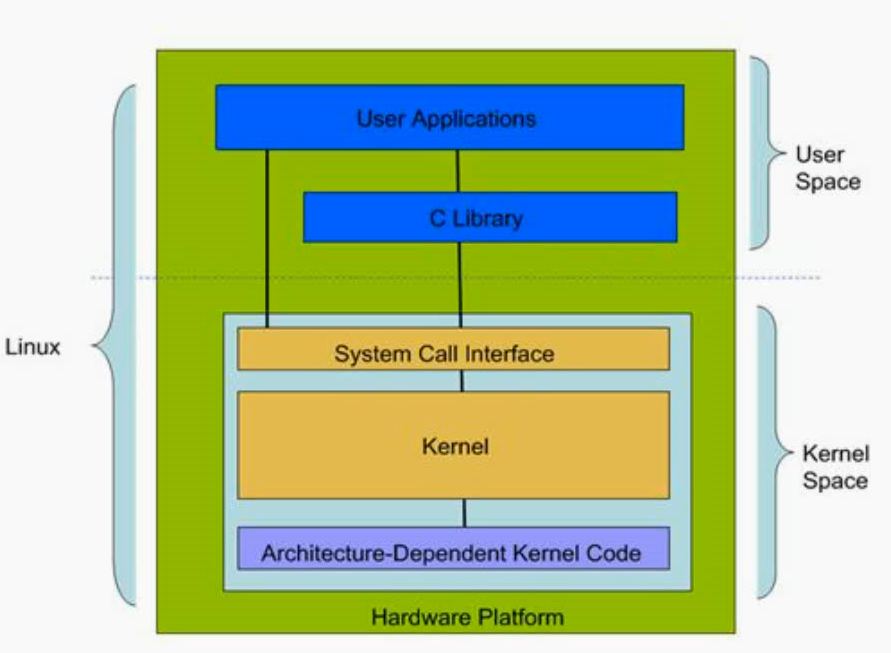

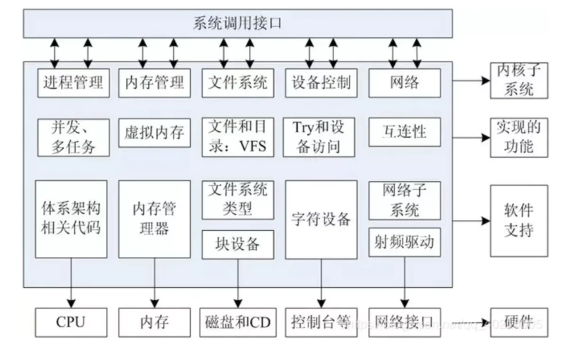

- 这种底层硬件驱动和应用分开，中间通过系统内核建立连接，优点是
  
  1. 实现分工，提高开发效率，底层无需管应用，只要保证自己的驱动接口，应用无需管底层，只要调用接口
  
  2. 更加安全，保护内核，用户态和内核态拥有的权限不同
     
     内核从本质上看是一种软件——控制计算机的硬件资源，并提供上层应用程序运行的环境。
     
     用户态即上层应用程序的活动空间，应用程序的执行必须依托于内核提供的资源，包括CPU资源、存储资源、I/O资源等

- 用户态和内核态的切换：对不同的操作赋予不同的执行等级
  
  与系统相关的操作由最高的特权的程序完成，Linux采用0和3两个特权级，分别对应内核态和用户态。很多程序开始时运行于用户态，但在执行的过程中，一些操作需要在内核权限下才能执行，这就涉及到一个从用户态切换到内核态的过程。如C函数库中的内存分配函数malloc()，它**具体是使用sbrk()系统调用来分配内存**，当malloc调用sbrk()的时候就涉及一次从用户态到内核态的切换，类似的函数还有printf()，调用的是wirte()系统调用来输出字符串。
  
  切换一般存在以下三种情况：
  
  1. 系统调用（软中断）
  2. 异常事件
  3. 外围设备中断（硬中断）

- 内核结构：
  
  - System Call  Interface
    
    为用户空间提供一套标准的系统调用函数来访问Linux内核
  
  - Process Management（PM）
    
    进程管理是创建进程(fork、eec),停止进程(kil、exit),并控制他们之间的通信(signal等)。还包括进程调度，控制活动进程如何共享CPU
  
  - Memory Management（MM）
    
    内存管理的主要作用是控制读个进程的安全共享区域
  
  - Virtual File Systems（VFS）
    
    虚拟文件系统，隐藏各种文件系统的具体细节，为文件操作提供统一的
    接口，Linux提供了一个大的通用模型，使这个模型包含了所有文件系统功能的
    集合（一切皆文件）
  
  - Device Drivers设备驱动
    
    Liux内核中有大量的代码在设备驱动程序部分，用于控制特定的硬件设
    备。
    Linux驱动一般分为网络设备、块设备、字符设备、杂项设备

- 目录结构：
  
  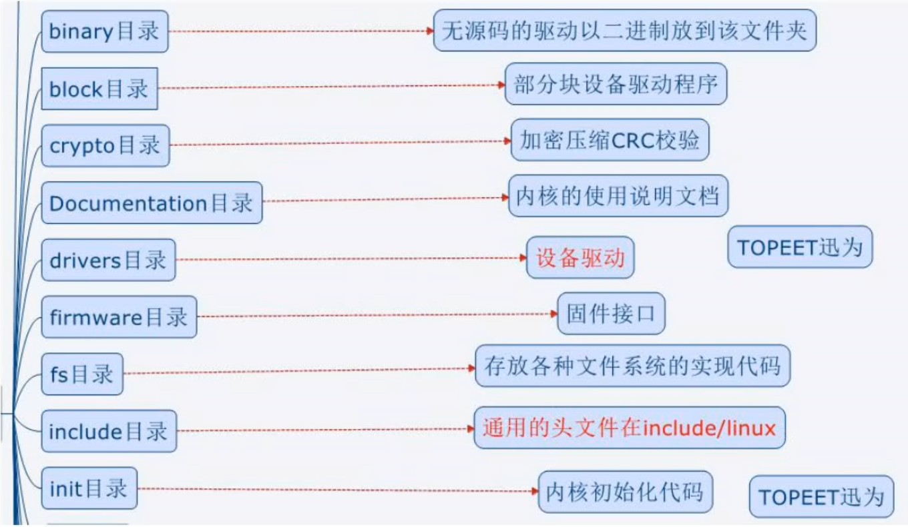
  
  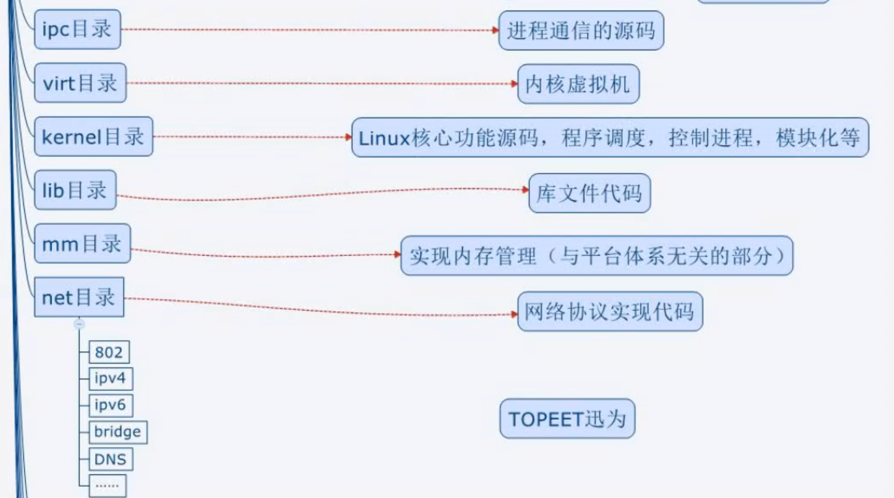
  
  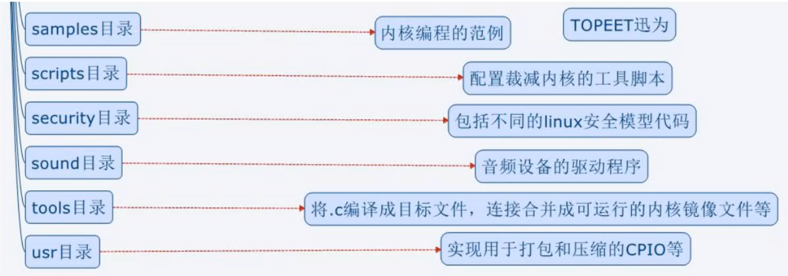

- arch目录
  
  arch目录是平台目录（不同芯片原厂有对应的架构）。内核支持的所有CPU架构,在该目录下都有对应的子目录。每个CPU的子目录，又进一步分解为boot , mm , kerne|等子目录, 分别控制系统引导，内存管理,系统调用。还有动态调频，主频率设置部分等。
  
  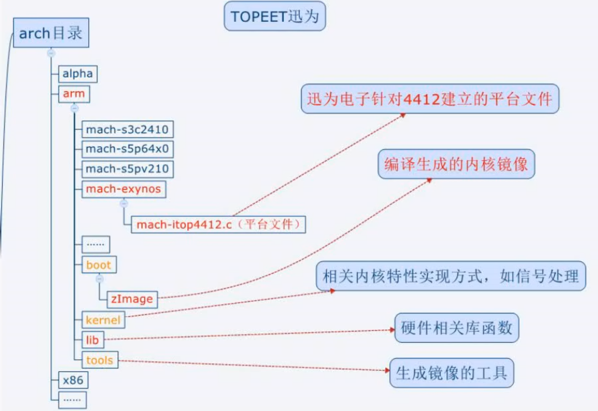

内核源码目录结构：[Linux源码](https://github.com/torvalds/linux)

### 内核裁剪

- Linux编译器通过.config文件确认哪些代码编译进内核，哪些被裁减掉menuconfigz是生成.config的一个工具

Kconfig：用于配置可视化的菜单,和Menuconfig对应

> Kconfig是层级嵌套，上层Kconfig调用(source)下层Kconfig
> 
> 修改Kconfig只要依照着写即可
> 
> bool只有y和n两种状态
> 
> tristate有三种状态：y、n和M(M是模块形式加载)

Menuconfig：可视化配置，用于对.config进行配置和生成

.config：用于make的

makefile：编译生成内核镜像

- 交叉编译工具的路径需要根据下载的位置进行设置
  
  ```makefile
  CROSS_COMPILE   ?= /usr/local/arm/arm-2009q3/bin/arm-none-linux-gnueabi-
  ```

- `obj-y`表示强制编译进内核

- `obj-$(CONFIG_XXX)`表示只有定义了CONFIG_XXX这个宏才将此文件编译进内核

- 如果一个驱动的编译需要另外驱动支持，不需要另外写编译脚本，只要在Kconfig中进行配置即可

#### 内核配置说明

- 对内核进行编译前使用make menuconfig对编译选项进行配置

- 可以对各个部分进行选择和取消，具体可以查找网上资料了解。

## 2、驱动学习的重点

**学习的重点是驱动开发相关的知识、函数的调用、驱动的协议、简单的硬件知识**

### 学习内容

- GPIO(General Purpose Input Output Port),通用输入输出口

- 内存管理单元(MMU)

- Linux把设备看成了文件(open,read,write,ioctrl,close)

- Liux字符设备驱动的编程思想：做一组设备对应的驱动函数

- 设备节点（设备文件）

- 举例说明上层应用程序如何对某个外设进行操作

- 举例说明底层驱动的编写方式以及如何注册到系统(register_.chrdev0)

- MISC杂项设备（混杂设备）

- 模块(module)

- 学会查看开发板原理图

- 学会查看处理器的数据手册(datasheet)

- 对外部设备操作的步骤（三部曲）
  
  - 通过原理图找到设备连接的PIN脚
  
  - 根据该PN脚找到控制这个引脚的相关寄存器，并找到寄存器对应的物理地址
  
  - 最后，通过编写程序来实现对该设备的操作

## 3、设备驱动学习

### 与单片机的比较

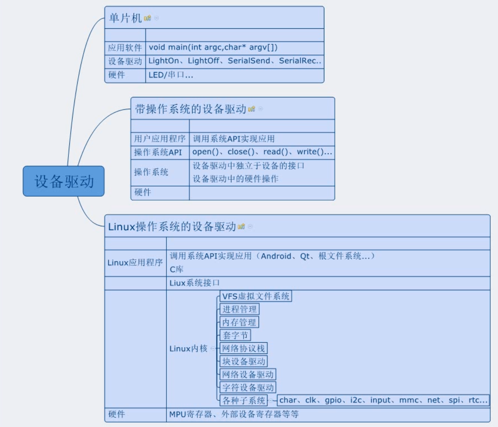

- 对照单片机Led驱动和嵌入式Led灯驱动
  
  单片机点灯驱动5行左右，Linux驱动200行左右

- 设备驱动分离和驱动又分层

- 操作系统中引入了内存（不用再繁琐的查手册中的寄存器）引入了MMU（虚拟内存）
  
  单片机为MCU，处理器为MPU

- 内核提供了大量的驱动接口

- 驱动是提供给操作系统操作硬件的接口

- 单片机程序是应用程序直接对硬件进行操作

### 驱动本质

- 为了将统一硬件移植到不同的操作系统上，需要给操作系统提供调用接口，驱动就是封装出这样的接口，根据硬件编写。使得应用程序的执行只依赖于操作系统，通过系统调用去实现对硬件的操作。

- 驱动介于文件系统和底层硬件之间，是嵌入到内核中的程序。

- 上层是文件系统和应用，中间是Linux内核，下层是硬件。Linux驱动附着在Linux内核上。
  
  - 对上：Linux设备驱动给上层提供调用的接口
  
  - 对中：Linux设备驱动要注册的Linux内核中（或者挂载在总线）
  
  - 对下：操作具体的硬件（GPIO、IO中断、PWM、IIC、SPI）
  
  > 以上三个，Linux内核均提供了接口函数

### Linux设备驱动分类

#### 字符设备

- 鼠标、键盘、串行口

#### 块设备

- 硬盘软盘设备、CD-ROM

#### 网络设备

### Linux驱动调试方法

#### 使用printk

- 功能与printf一样，不同的是printk可以在打印字符串前面加上内核定义的宏
  
  ```c
  printk(KERN_ALERT "wakeup by signal in process %d\n",current->pid)
  ```
  
  > 宏和字符串之间没有逗号。
  > 
  > 使用printk可以在使用宏进行打开和关闭，区别debug和release模式

- 宏是用来定义打印的字符串的级别，值越小，级别越高

#### 使用ioctl方法

- 驱动中的ioctl函数可以将驱动的一些信息返回给用户程序，让用户可以通过ioctl系统调用设置一些驱动参数。驱动开发过程中可以扩展一些ioctl的命令用于传递和设置驱动时所需的信息和参数，已达到调试驱动的目的

- TODO：补充相关示例

#### 利用/proc文件系统

- /proc文件系统用于内核向用户暴露一些内核的信息。为了进行驱动调试，可以在驱动代码中增加向/proc文件系统导出有助于监视驱动的信息代码，从而可以查看/proc中的相关信息来监视和调试代码。

### 理论

#### Linux驱动程序是什么

- 对于Linux系统，不管在什么硬件平台上源码都是一样的
- 但是由于硬件不同，需要的驱动程序就不一样（这也就是为什么需要移植）
- 应用程序是依赖操作系统的，应用程序需要调用Linux操作系统的库函数实现
- 驱动程序是连接操作系统和硬件之间的桥梁，使操作系统可以操作硬件
- 应用程序不能直接操作硬件
- 驱动程序开发只要保证接口稳定，无序考虑上层应用

#### 操作系统的优点

- 安全，避免应用程序直接操作硬件
- 开发效率高,分工更加明确

#### 驱动分类

- 字符设备：GPIO、按键、蜂鸣器、串口、
- 块设备：硬盘、TF卡、EMMC、FLASH
- 网络设备：WIFI、以太网网卡、

#### CPU

- 哈佛结构是取指和执指同时进行，提高运算速度
- 冯诺依曼结构是取指和执指分开

#### 在没有MMU情况下外部设备操作的三步曲

- 单片机的外设操作方式，linux下一般会启动MMU
1. 原理图
2. 数据手册（寄存器和物理地址）
3. 编程实现对寄存器操作

#### 有MMU（）的情况下对外设操作的步骤

- MMU
1. 虚拟地址到物理地址的转换（ioremap函数可以实现从物理地址找到虚拟地址，对虚拟地址进行操作，MMU会通过虚拟地址找到物理地址进行操作硬件）
2. 辅助实现虚拟内存
3. 辅助实现多任务管理

> tip：可以将MMU理解为一个映射表，这个表由操作系统实现

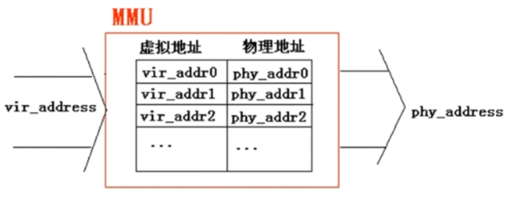

- 计算机的位数决定对虚拟内存的访问能力和范围（32位ARM内存空间为4G）

- 实际编程都是对虚拟内存进行访问，当访问的虚拟内存没有对应的物理地址时，会触发缺页中断，需要将数据从磁盘交换到内存中

#### RISC/CISC

- RISC：ARM、MIPS、POWERPC（每条指令的长度和时间一样，便于实现流水线和提高性能）
  
  便于实现指令管线化，也就是流水线执行。
  
  参考示例：[指令管线化 - 维基百科，自由的百科全书](https://zh.wikipedia.org/zh-hans/%E6%8C%87%E4%BB%A4%E7%AE%A1%E7%B7%9A%E5%8C%96)
  
  > 每个指令都需要经过
  > 
  > 1. 到内存取指令
  > 
  > 2. 解析指令
  > 
  > 3. 执行指令
  > 
  > 4. 写回执行结果
  > 
  > 将这个过程流水线化，通过时钟进行控制时序，提高利用率。
  
  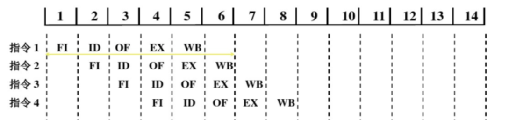
  
  
  
  FI（取指）：从Cache或主存取指令
  ID（译码）：产生指令执行所需的控制信号
  OF（取操作数）：读取存储器或寄存器中的操作数
  EX（执行）：对操作数完成指定的操作
  WB（写回）：将操作数写回存储器或寄存器

- CISC：8051、x86（每条指令占的字节数和所需时钟周期/ 机器周期不同）

#### 高速缓存cache

使存储器和处理器速度尽可能匹配,处理器增速快，而存储器的速度取决于工艺，使用高速缓存削弱二者之间的速度不匹配

#### 对ARM架构的了解学习

- ARMv3、ARMv4、ARMv5、ARMv6、ARMv7、ARMv8

- Cortex-A9基于AMRv7架构，Cortex-M3基于ARMv7-M架构

#### 可以解决问题的方法

- Linux官方
  
  [Linux官方](https://www.kernel.org)

- 主控芯片MPU原厂(4412、4418、iMX6.)
  
  在开发产品选择主控芯片后主控芯片产商会提供驱动

- 外设芯片原厂(MTK…)

- 大量的Linux工程师（大量的内核驱动分析文章和代码）

- 开发板厂商（迅为大量资料）

### 基本概念

#### Uboot

- BootLoader的运行顺序：iROM->BL1->BL2->Uboot->Linux

- Uboot的主要工作是进行检测内存，存储等设备，并且设置处理器等设备的时钟等等，最后引导内核，将内核镜像zImage从硬盘中拷贝到内存（RAM）中去运行。开始执行内核代码说明Uboot已经寿终正寝了。

#### 文件系统

- Linux运行到最后（等所有驱动都初始化完成）再挂载文件系统

- Android、QT和Ubuntu这几套系统底层都是Linux，这几套系统都是Linux内核运行起来以后挂载的文件系统，这些都是挂载完文件系统后执行文件系统里面的程序，实际上可以把Android看做Linux上面跑的一个应用程序。而所有学的驱动就是包含在zImage内核代码中。

#### 步骤

- 搞清楚Uboot、zImage、文件系统之间的关系

- 学会将这个几个文件烧写系统

- 之后需要学会如何编译出这些文件，内核裁剪和编译。

- 然后再是驱动学习和内核学习。

### 烧写

#### 制作TF卡

- 硬件连接
  
  - 串口usart2通过转串口连接到pc
  
  - tf卡插入板子卡座

- PC软件驱动按装
  
  - 串口工具和串口驱动
  
  - PC的USB驱动安装（ADB驱动）

- 插入TF卡，启动开发板进入Uboot模式

- 制作TF卡分区，在超级终端输入命令
  
  - fdisk -c 1(注意这里的参数是“1”) 
  
  - fatformat mmc 1:1 
  
  - ext3format mmc 1:2 
  
  - ext3format mmc 1:3
  
  - ext3format mmc 1:4

- Uboot
  
  - 将光盘文件夹“06_源码_uboot 和kernel”中压缩包 “iTop4412_uboot_xxx.tar.gz”拷贝到Ubuntu系统。
  
  - 根据硬件将文件夹“CodeSign4SecureBoot_xxx”拷贝到Ubuntu系 统，和压缩包放在同一目录
  
  - 解压压缩包，得到文件夹“iTop4412_uboot”
  
  - 将光盘“04_镜像_QT 文件系统”-->“uboot”中的镜像“u-bootiTOP-4412.bin”文件（根据硬件选择）拷贝到上一步解压出来的文件夹“iTop4412_uboot”中
  
  > 使用上面的文件对TF卡进行Uboot制作

- 将tf卡从开发板取出，和Ubuntu系统连接 – 通过命令“df -l”可以查看到盘符名称

- 进入文件夹“iTop4412_uboot”，在Ubuntu 命令行中，执行Linux 命令：
  
  - ./mkuboot /dev/sdx
  
  - sdx表示盘符名称（不清楚盘符名，不要执行这个命令）
  
  - 出现“u-boot-iTOP-4412.bin image has been fused successfully” 提示，则制作成功
  
  - 制作好的tf卡，在windows下查看，会少2G左右

#### 不同镜像和文件系统的烧写

- 在TF卡中新建文件夹“sdupdate”，名字一定要是“sdupdate"

- 拷贝Qt对应的四个镜像到“sdupdate”文件夹中（不建议拷贝 uboot镜像，因为Uboot已经烧写过了，Uboot都是一样的）

- TF卡插入开发板，启动开发板，进入uboot模式

- 开发板启动模式为从TF卡启动
  
  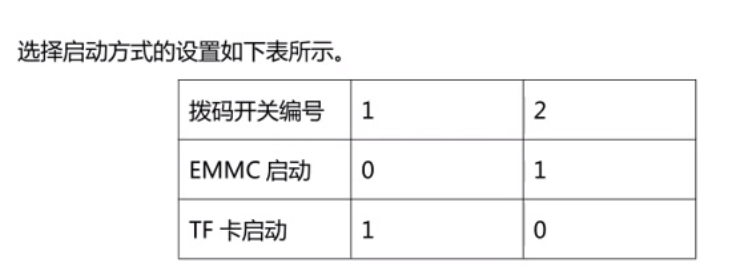

- 烧写命令，在uboot模式下，超级终端中输入
  
  - 一次性烧写：sdfuse flashall
  
  - 分开烧写：
    
    - **sdfuse flash bootloader u-boot-iTOP-4412.bin**
    
    - sdfuse flash kernel zImage 
    
    - sdfuse flash ramdisk ramdisk-uboot.img
    
    - sdfuse flash system system.img
  
  > 第一次烧写建议分开烧写，而且不要烧写uboot

- 烧写完成之后，超级终端中输入重启命令:reset

#### 重复烧写文件系统

> 可以使用下面擦除命令后再进行烧写

- 方式一：在Uboot下执行
  
  - ext3format mmc 0:3
  
  - ext3format mmc 0:4

- 方式二：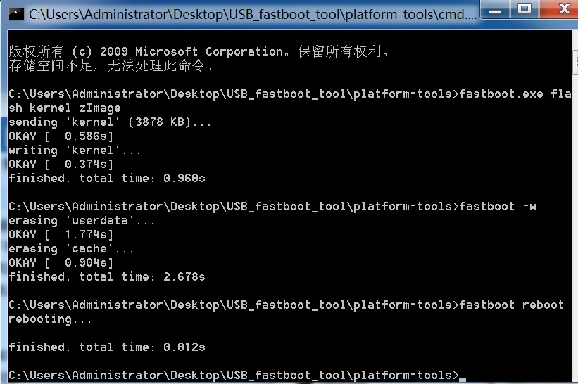

#### U盘挂载问题

- Linux无法挂载文件格式为NFS的U盘，需要格式化为fat32格式

- 插入U盘到开发板后将U盘识别为/dev/sda1

- 使用命令mount /dev/sda1 [挂载文件路径]
  
  > example:mount /dev/sda1 /mnt/udisk

#### 使用fastboot烧写

- 在uboot模式下进入fastboot，然后执行擦除和烧写操作。如上重复烧写文件系统的方式二

### 最简Linux驱动

- 最简单的Makefile

- 无配置文件

- 最小驱动的四个部分
  
  - 头文件
    
    - 必备头文件
      
      - 类似`#include<linux/module.h>`的头文件，位于Linux源码目录下的include/linux/module.h
        
        所有的Linux代码必须遵循GPL协议，如果不声明GPL协议，模块无法在Linux中使用
        
        `MODULE_LICENSE(_license)`添加遵循GPL协议
        
        `MODULE_AUTHOR(_author)`代码作者
      
      - `#include<linux/init.h>`
        
        包含初始化宏定义的头文件，代码中的函数module init和module exit在此
        文件中
        入口函数module_init(x)
        出口函数module_exit(x)
  
  - 申明模块信息
  
  - 模块驱动的入口、出口
    
    - 入口函数module_init(x);
    
    - 出口函数module_exit(x);
  
  - 功能区

- 执行make需要将makefile中的执行路径改为kernel源码目录
  
  ```makefile
  #!/bin/bash
  #通知编译器我们要编译模块的哪些源码
  #这里是编译itop4412_hello.c这个文件编译成中间文件itop4412_hello.o
  obj-m += mini_linux_module.o
  
  #源码目录变量，这里用户需要根据实际情况选择路径
  #作者是将Linux的源码拷贝到目录/home/topeet/android4.0下并解压的
  KDIR := /home/yong/ws/linux_driver/iTop4412_Kernel_3.0
  
  #当前目录变量
  PWD ?= $(shell pwd)
  
  #make命名默认寻找第一个目标
  #make -C就是指调用执行的路径
  #$(KDIR)Linux源码目录，作者这里指的是/home/topeet/android4.0/iTop4412_Kernel_3.0
  #$(PWD)当前目录变量
  #modules要执行的操作
  all:
         make -C $(KDIR) M=$(PWD) modules
  
  #make clean执行的操作是删除后缀为o的文件
  clean:
         rm -rf *.o *.ko *.mod.o *.order *.symvers *.temp_versions 
  ```

- 执行make后生成中间文件和模块文件module.ko

- 使用U盘将module.ko文件拷贝到开发板中

- 执行`insmod [模块路径] `对模块进行加载

- 使用`lsmod`或者`cat /proc/modules`查看模块的加载情况。

- 执行`rmmod [模块路径]`对模块进行卸载

### 内核裁剪和编译查看上面

### 总线、设备和驱动注册

- 总线bus，上面有许多其他通讯线
  
  `ls /sys/bus`可以查看总线上的通讯线

- 总线上的Platform是虚拟总线，许多的设备都是挂载在这个虚拟总线(平台总线)上
  
  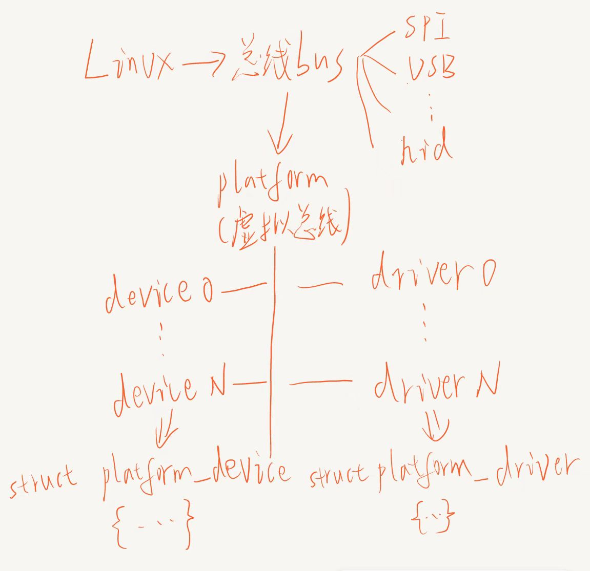
  
  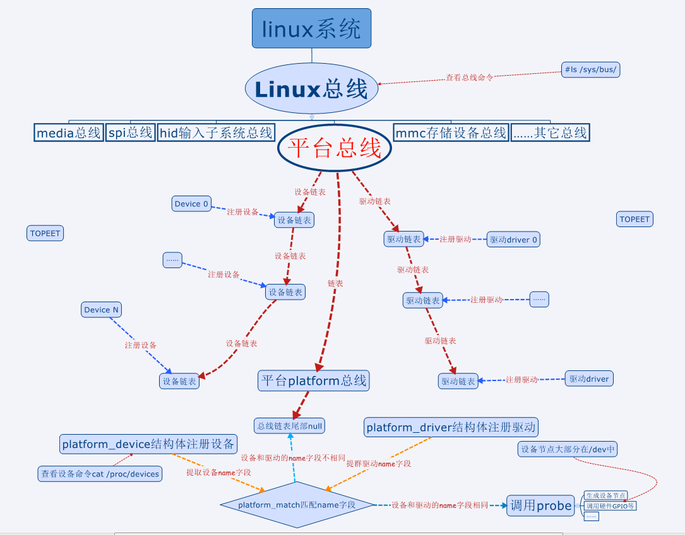

- 设备一般都需要先注册，才能注册驱动，对于热拔插设备即反过来，先注册驱动，需要使用时在进行设备注册注册。

- 查看设备号的命令：`cat /proc/devices`
  
  设备都有主设备号和次设备号（255个设备号不够用）
  
  查看次设备号使用命令：`cat /proc/misc`

### 设备注册

- 将设备添加到kconfig中，并将设备添加到`arch/arm/mach-exynos/mach-itop4412.c`下，重新进行内核编译，生成zImage即可。

- 烧写内核后使用`ls /sys/devices/platform`查看设备是否注册成功

- `cat /proc/devices`查看注册的设备

> 备号肯定是有限的，一共就只有 256 个主设备号，这里引入了从设备号的概念，理论上就有 256*256 个设备号

- 上层应用使用设备节点访问对应的设备。 设备节点一般是放在“/dev”目录下，在开发板下输入命令`ls /dev`,上层应用有一套标准的接口文件和函数用来和底层通信。 Linux 将所有对设备的操作全部都抽象为对文件的操作，常用的文件操作函数有 open、close、write、read、write 等。

### 驱动注册

- 驱动程序一般以一个模块初始化函数作为入口,需要会写的是字符设备的驱动，块设备和网络设备要么是 soc 原厂已经集成，要么是外围器 件芯片厂商提供源代码，主要工作在管脚配置和调试。

### Linux 驱动和设备的注册

> Linux设备和驱动的注册属于是“对中”，即将代码嵌入到Linux内核中。
> 
> 对下是指对硬件的操作
> 
> 对上是指对上面提供操作硬件的接口

- 每出现一个设备就要像总线汇报，或者说注册，出现一个驱动，也要向 总线汇报，或者叫注册。

- 系统初始化的时候，会扫描连接了哪些设备，并为每一个设备建立一个 struct_device 的 变量，然后将设备的变量插入到 devices 链表
  
  ```c
  struct device{}
  ```

- Linux 总线是为了将设备和驱动绑定，方便管理。在系统每注册一个设备的时候，会寻找与之匹配的驱动。相反，在系统每注册一个驱动的 时候，会寻找与之匹配的设备，而匹配由总线完成。

> 热拔插的设备不同：在热拔插设备中，是有了设备 devices 接入之后，内核会去 driver 链表中寻找寻找驱动。

- 注册驱动的时候，系统会通过 platform_match 函数匹配设备和驱动。

- 注册设备到平台总线的结构体,在`include/linux/platform_device.h`文件中
  
  ```c
  struct platform_device {
        const char  * name;
        int     id;
        struct device   dev; //内嵌device结构体
        u32     num_resources;
        struct resource * resource;
  
        const struct platform_device_id *id_entry;
  
        /* MFD cell pointer */
        struct mfd_cell *mfd_cell;
  
        /* arch specific additions */
        struct pdev_archdata    archdata;
    };
  ```
  
  大多数驱动中，需要写的只有设备名\*name 和设备编号 id， 常用的还有资源数组\*resource
  
  ```c
  #ifdef CONFIG_LEDS_CTL
  struct platform_device s3c_device_leds_ctl = {                      
           .name   = "leds",
           .id             = -1,
    };
  #endif
  ```

- 在注册设备时，还需要将指定的宏定义打开，使用Kconfig进行选择，配置使能时将CONFIG_LEDS_CTL打开
  
  ```
  config LEDS_CTL
         bool "Enable LEDS config"
         default y
         help
           Enable LEDS config
  ```
  
  在Menuconfig中配置为enable时就会在.config中设置`CONFIG_LEDS_CTL=y`，也就是定义了`CONFIG_LEDS_CTL`这个宏定义

- 在平台文件`arch/arm/mach-exynos/mach-itop4412.c`中添加`platform_device`结构体
  
  ```c
  #ifdef CONFIG_LEDS_CTL
  struct platform_device s3c_device_leds_ctl = {                      
           .name   = "leds",
           .id             = -1,
    };
  #endif
  
  #ifdef CONFIG_LEDS_CTL
        &s3c_device_leds_ctl,
  #endif
                                                                                                 #endif
  ```

- 完成以上步骤即可编译内核进行烧写，并可以通过`ls /sys/devices/platform/`查看平台总线上的设备

- 将驱动注册到平台总线上步骤
  
  `platform_driver`结构体，几乎所有的驱动都会用到，在文件`include/linux/platform_device.h`中
  
  ```c
    struct platform_driver {                                                                                                    int (*probe)(struct platform_device *);
        int (*remove)(struct platform_device *);
        void (*shutdown)(struct platform_device *);
        int (*suspend)(struct platform_device *, pm_message_t state);
        int (*resume)(struct platform_device *);
        struct device_driver driver;
        const struct platform_device_id *id_table;
    };
  ```
  
  - 结构中包含了一组操作函数和一个`struct device_driver`的对象
  
  - 驱动中首先要做的 就是定义platform_driver 中的函数,并创建这个结构的一个对象实例，然后在 init()函数（模块的init函数）中调用 platform_driver_register()向系统注册驱动。
    
    - 函数`int (*probe)(struct platform_device *);`
      
      进行设备的探测和初始化，例如：想调用一个GPIO，那么首先需要探测这个GPIO是 否被占用了，如果被占用了那么初始化失败，驱动注册也就失败了；如果没有被占用，那么就申明要占用它。
      
      该函数中一般还会添加生成设备节点的函数，如果初始化成功，那么就会需要添加设备节 点。
    
    - 函数` int (*remove)(struct platform_device *);`
      
      移除驱动，该函数中一般用于去掉设备节点或者释放软硬件资源。
    
    - 函数`void (*shutdown)(struct platform_device *); `
      
      关闭驱动,并在函数中执行一些东西
    
    - 函数`int (*suspend)(struct platform_device *, pm_message_t state); `挂起驱动（休眠），并执行一些东西
    
    - 函数`int (*resume)(struct platform_device *);`
      从挂起恢复驱动时要做什么
    
    - 结构体 `struct device_driver driver`
      
      包含两个参数，一个是 name 参数，驱动名称（**需要和设备驱动结构体中的 name参数一样，platform_device中的name成员**）；一个是 owner，一般是 THIS_MODULE。
  
  - 注册一个驱动，需要先初始化这么一个`platform_driver`结构体
    
    函数`extern int platform_driver_register(struct platform_driver *)`
    
    和`extern void platform_driver_unregister(struct platform_driver *)`都使用了`platform_driver`类型的结构体，分别用于注册驱动和卸载驱动，在先注册设备在注册驱动的驱动中，在device_init中调用进行注册，在device_exit中调用进行卸载。
    
    `extern int platform_driver_probe(struct platform_driver *driver,int (*probe)(struct platform_device *));`函数会调用已经初始化的结构体
    
    其实`platform_driver`结构体中参数probe指向的函数为`platform_driver_probe`,注册一个驱动就会调用`platform_driver`结构体
    
    关键是`platform_driver_probe`将`platform_device`和`platform_driver`联系起来，只有当platform_device和platform_driver的name字段匹配，才调用platform_driver中的`int (*probe)(struct platform_device *);`进行驱动初始化,并注册到驱动链表上
    
    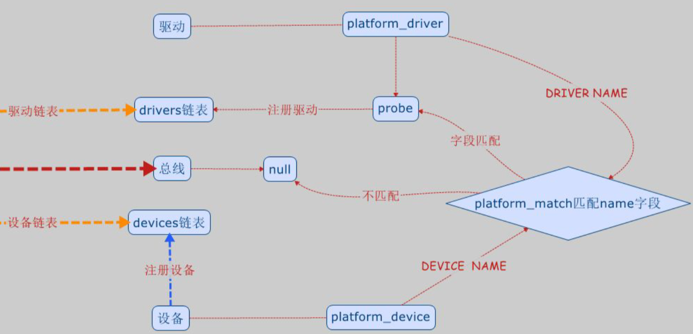

### 以模块的方式注册设备和驱动

- 先将设备注册，需要定义设备结构体
  
  ```c
  struct platform_device platform_device_hello = {
     .name   = "my_code_led",
     .id     = -1,
     .dev = {
          .release = leds_release,
     }
  };
  static int hello_init(void)
  {
      platform_device_register(&platform_device_hello);
      return 0;
  }
  
  static void hello_exit(void)
  {
      platform_device_unregister(&platform_device_hello);
  }
  module_init(hello_init);
  module_exit(hello_exit);
  ```
  
  调用`platform_device_register`即可注册
  
  调用`platform_device_unregister`卸载设备

- 驱动注册，定义`platform_driver`结构体，并实现几个函数，在`platform_driver_register`函数中进行驱动注册，在注册驱动是会进行驱动和设备名称匹配，匹配成功执行系统的probe函数，系统probe函数会调用自己的probe函数并进行初始化工作。

- **设备必须先于驱动注册才能进行匹配并调用probe函数进行驱动初始化。**

### 杂项设备驱动

- 使用`cat /proc/misc`查看系统的杂项设备

- 将无法归类的设备统称为杂项设备，杂项设备可能用到字符设备、快设备、网络设备中的 一项或者多项设备。

- 杂项设备在makefile中是强制被编译的

- 杂项设备注册函数以及结构体
  
  - 结构体
    
    ```c
    struct miscdevice  {
        int minor;
        const char *name;
        const struct file_operations *fops;
        struct list_head list;
        struct device *parent;
        struct device *this_device;
        const char *nodename;
        mode_t mode;
    };
    ```
  
  > 常用的参数是
  > 
  > int minor；设备号
  > 
  > const char *name;设备节点名称，可以和设备名称不同
  > 
  > const struct file_operations *fops；指向一个设备节点文件
  
  - 函数
  
  ```c
  extern int misc_register(struct miscdevice * misc);
  extern int misc_deregister(struct miscdevice *misc);
  ```
  
    和平台总线设备类似：
  
    杂项设备注册函数；一般在 probe 中调用，参数是miscdevice
  
    杂项设备卸载函数；一般是在 hello_remove 中用于卸载驱动。
  
  - `file_operations`结构体
    
    file_operations 结构体的成员函数属于驱动设计的主体内容，里面的函数和 Linux 系统 给应用程序提供系统接口一一对应。
    
    `file_operations` 结构体在头文件`include/linux/fs.h`中
    
    > 驱动实验手册P149
    
    需要将open、release、ioctl等接口进行实现
  
  - 头文件添加
    
    ```c
    #include <linux/fs.h>
    #include <linux/miscdevice.h>
    #include <linux/platform_device.h>
    ```

- 实现杂项设备节点可以供上层调用，为上层提供了open、close（对应release）、ioctl(对应unlocked_ioctl)

- 设备节点在哪里进行注册和设备和驱动注册并没有必然联系，只是在probe中注册完驱动后进行注册也可以。

### 点亮LED

#### 对内存和MMU等的思考

- 本质就是在写驱动时对底层寄存器的操作也有映射到对应的地址，而在进程中对

- 芯片上的内存，在访问时直接对内存进行访问，即对外设等的控制寄存器进行设置时是需要访问对内存进行访问，内存是有物理地址的（比如4412最大可以扩展到3G的IO控制地址），特殊寄存器也是有物理地址的，其虚拟地址的范围和内存的物理地址重合。
  
  使用ioremap返回的地址一定在上面所说的物理地址范围内的。
  
  > 在实际操作外设和寄存器中使用ioremap返回的是CPU内存中的地址，即虚拟地址对应的物理地址，(而程序中可以跳过MMU直接访问到那个地址)，程序运行的内存是虚拟内存，指RAM中的地址(即程序访问到的段都是在运行内存，但存储的位置可以因为没有运行而被交换到硬盘中)，是运行内存中的地址，和CPU内存不一样，但都能访问到，同时也都可以借助MMU进行映射访问。但是进程在输出地址时都是使用的虚拟地址进行输出，所以可以看到不同的数据存储在不同的段，这也就是进程虚拟内存分布
  
  因为虚拟地址也只是一种逻辑映射，是为了实现多个程序同时在有限的内存中运行的问题，如果所有程序都是4G空间，那么一个时刻下只能加载一个程序执行，通过虚拟地址映射就可以将运行的程序不需要运行的部分存储到内存以外，在需要时再通过映射找到物理地址并进行加载。

- 每个进程运行都是使用的虚拟地址，CPU读取指令然后根据地址映射去取指令执行指令，CPU的寻址空间决定了它访问虚拟地址的范围，借助MMU可以实现将4G的虚拟 内存映射到不同的物理地址上，进而获取到指令和数据。同时MMU可以对一些虚拟地址进行访问权限控制，以便于对用户程序的访问权限和范围进行管理，如代码段一般设置为只读，如果有用户程序对代码段进行写操作，系统会触发异常。

#### 配置GPIO

- 在`gpio-exynos4.c`可以找到需要配置的GPIO的宏定义，在数组`struct s3c_gpio_chip exynos4_gpio_common_4bit[]`中，可以查看片上GPIO的结构体，里面存着对应的虚拟地址和物理地址等信息。

- 在`gpio-config.c`中，可以找到配置GPIO的函数`s3c_gpio_cfgpin`

- 三星已经将虚拟地址和物理地址的映射处理好，并将信息都封装在`s3c_gpio_chip`结构体中，在使用时只需要将宏传入即可，配置函数中会通过宏获取到对应的GPIO结构体，并通过偏移量等确定好虚拟地址然后映射到物理地址对寄存器进行配置
  
  > 深入的话应该学习将枚举值层层封装为宏然后定义一个获取到结构体的函数，根据宏（枚举）获取到对应的结构体（全局结构体变量）然后进行计算和转换得到寄存器地址进行配置

- 理解了怎么进行映射的后，在初始化(probe中)时进行gpio申请，如果被占用了会申请失败，申请后进行gpio模式配置（`arch/arm/plat-s3c/include/plat/gpio-cfg.h`）,配置完模式后即可在ioctl函数中进行控制，添加对上接口，上层应用只需通过ioctl使用不同的命令和参数对gpio进行控制

> 考虑框架设计理念，在进行接口提供时，需要做到上层接口实现与底层硬件解耦合，即需要将驱动层进行封装，实现出控制接口，在实现给上层的接口时使用。例如：拿led举例，led有打开、关闭、翻转、闪烁等，将这些功能再封装一层，后续底层硬件更换了，对上的接口就不需要改变，只需改底层的驱动。一旦硬件相关的东西和上层接口耦合，后续修改将会十分混乱与麻烦

#### LED驱动的步骤

- 模块初始化，同时进行驱动注册

- 在驱动结构体函数probe中进行硬件初始化和设备节点注册

- 在驱动卸载时会调用remove，在remove中进行设备节点卸载

- 最后在模块卸载函数中进行驱动卸载

#### 模块参数

- 在运行模块时，可以将参数通过命令行传入，提前在模块中定义好变量并使用内核函数进行设置,具体可以查看头文件`linux/moduleparam.h`
  
  ```c
  #include <linux/moduleparam.h>
  
  static int module_arg;
  static int array[20];
  static int array_written;
  module_param(module_arg, int, S_IRUSR);
  module_param_array(array, int, &array_written, S_IRUSR);
  ```
  
  加载模块时在命令行写好对应的参数的值module_arg和array
  
  `“insmod /mnt/udisk/module_param.ko module_arg=10 array=11,12,13,14,15,16,17,18”`

- 加载完模块参数后可以在`sys/module/module_param/parameters/`查看

#### 字符设备注册

- `cdev_init(struct cdev *, const struct file_operations *)`用于初始化字符设备

- 注册字符设备的函数为`cdev_add(struct cdev *, dev_t, unsigned)`
  
  - 参数
    
    - 参数 struct cdev *：cdev 字符设备文件结构体 
    
    - 参数 dev_t：设备号 dev,前面已经介绍和使用过了
    
    - 参数 unsigned：设备范围大小

- 卸载驱动的函数 `void cdev_del(struct cdev *)`只有一个参数，cdev 字符设备结构体

- 步骤：
  
  1. 在申请了设备号的基础上
  
  2. 定义注册设备需要使用变量的结构体，并定义变量，为结构体申请内存使用`kmalloc()`，并将申请的内存进行清零，然后对结构体进行初始化，对结构体中的char *data 需要再进行内存申请，然后进行清零，在对设备号进行初始化时需要转换成内核能识别的类型，使用MKDEV 转化成 `dev_t `类型。
     
     > 将结构体指针看成数组名。类似定义整形指针作为数组名进行索引访问
  
  3. 内存申请失败时需要进行设备号注销，使用`unregister_chrdev_region`
  
  4. 注册设备到系统**调用设备结构体初始化，进行结构体赋值，注册设备到系统**
  
  5. file_operations 参数只需先对.onwer成员进行赋值为THIS_MODULE
  
  6. 在模块退出时，进行设备去除和设备号注销
     
     > 设备号申请和设备注册都是在模块初始化函数中进行

#### 类

- class结构体，是设备驱动模型中通用的设备类结构

- 使用`class_create`函数创建类文件

- 使用`device_create`创建设备节点
  
  - 参数1：class结构体变量
  
  - 参数2：父设备NULL
  
  - 参数3：dev_t设备号
  
  - 参数4：数据NULL
  
  - 参数5：设备节点名称

- 使用`class_destroy`释放设备class
  
  - 参数1：设备所属的类
  
  - 参数2：设备号
