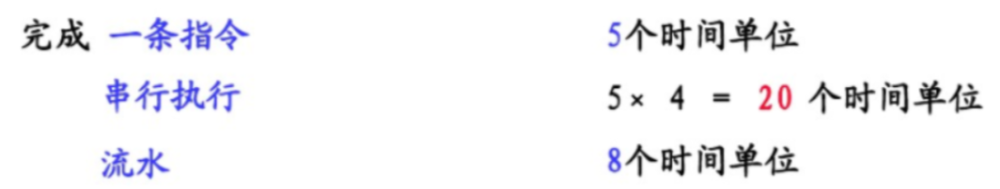

# Linux驱动学习

## 理论基础 ：uboot Linux内核 文件系统

# Linux驱动开发

驱动介于文件系统和底层硬件之间，是嵌入到内核中的程序

上层是文件系统和应用,中间是Linux内核和下层是硬件。Linux设备驱动附着在Linux内核上。

## 1、Linux内核开发基础

### Linux体系结构


- 这种底层硬件驱动和应用分开，中间通过系统内核建立连接，优点是
  
  1. 实现分工，提高开发效率，底层无需管应用，只要保证自己的驱动接口，应用无需管底层，只要调用接口
  
  2. 更加安全，保护内核，用户态和内核态拥有的权限不同
     
     内核从本质上看是一种软件——控制计算机的硬件资源，并提供上层应用程序运行的环境。
     
     用户态即上层应用程序的活动空间，应用程序的执行必须依托于内核提供的资源，包括CPU资源、存储资源、I/O资源等

- 用户态和内核态的切换：对不同的操作赋予不同的执行等级
  
  与系统相关的操作由最高的特权的程序完成，Linux采用0和3两个特权级，分别对应内核态和用户态。很多程序开始时运行于用户态，但在执行的过程中，一些操作需要在内核权限下才能执行，这就涉及到一个从用户态切换到内核态的过程。如C函数库中的内存分配函数malloc()，它**具体是使用sbrk()系统调用来分配内存**，当malloc调用sbrk()的时候就涉及一次从用户态到内核态的切换，类似的函数还有printf()，调用的是wirte()系统调用来输出字符串。
  
  切换一般存在以下三种情况：
  
  1. 系统调用（软中断）
  2. 异常事件
  3. 外围设备中断（硬中断）

- 内核结构：
  
  - System Call  Interface
    
    为用户空间提供一套标准的系统调用函数来访问Linux内核
  
  - Process Management（PM）
    
    进程管理是创建进程(fork、eec),停止进程(kil、exit),并控制他们之间的通信(signal等)。还包括进程调度，控制活动进程如何共享CPU
  
  - Memory Management（MM）
    
    内存管理的主要作用是控制读个进程的安全共享区域
  
  - Virtual File Systems（VFS）
    
    虚拟文件系统，隐藏各种文件系统的具体细节，为文件操作提供统一的
    接口，Linux提供了一个大的通用模型，使这个模型包含了所有文件系统功能的
    集合（一切皆文件）
  
  - Device Drivers设备驱动
    
    Liux内核中有大量的代码在设备驱动程序部分，用于控制特定的硬件设
    备。
    Linux驱动一般分为网络设备、块设备、字符设备、杂项设备

- 目录结构：
  
  
  
  
  
  

- arch目录
  
  arch目录是平台目录（不同芯片原厂有对应的架构）。内核支持的所有CPU架构,在该目录下都有对应的子目录。每个CPU的子目录，又进一步分解为boot , mm , kerne|等子目录, 分别控制系统引导，内存管理,系统调用。还有动态调频，主频率设置部分等。
  
  

内核源码目录结构：[Linux源码](https://github.com/torvalds/linux)

### 内核裁剪

- Linux编译器通过.config文件确认哪些代码编译进内核，哪些被裁减掉menuconfigz是生成.config的一个工具

Kconfig：用于配置可视化的菜单,和Menuconfig对应

> Kconfig是层级嵌套，上层Kconfig调用(source)下层Kconfig
> 
> 修改Kconfig只要依照着写即可
> 
> bool只有y和n两种状态
> 
> tristate有三种状态：y、n和M(M是模块形式加载)

Menuconfig：可视化配置，用于对.config进行配置和生成

.config：用于make的

makefile：编译生成内核镜像

- 交叉编译工具的路径需要根据下载的位置进行设置
  
  ```makefile
  CROSS_COMPILE   ?= /usr/local/arm/arm-2009q3/bin/arm-none-linux-gnueabi-
  ```

- `obj-y`表示强制编译进内核

- `obj-$(CONFIG_XXX)`表示只有定义了CONFIG_XXX这个宏才将此文件编译进内核

- 如果一个驱动的编译需要另外驱动支持，不需要另外写编译脚本，只要在Kconfig中进行配置即可

#### 内核配置说明

- 对内核进行编译前使用make menuconfig对编译选项进行配置

- 可以对各个部分进行选择和取消，具体可以查找网上资料了解。

## 2、驱动学习的重点

**学习的重点是驱动开发相关的知识、函数的调用、驱动的协议、简单的硬件知识**

### 学习内容

- GPIO(General Purpose Input Output Port),通用输入输出口

- 内存管理单元(MMU)

- Linux把设备看成了文件(open,read,write,ioctrl,close)

- Liux字符设备驱动的编程思想：做一组设备对应的驱动函数

- 设备节点（设备文件）

- 举例说明上层应用程序如何对某个外设进行操作

- 举例说明底层驱动的编写方式以及如何注册到系统(register_.chrdev0)

- MISC杂项设备（混杂设备）

- 模块(module)

- 学会查看开发板原理图

- 学会查看处理器的数据手册(datasheet)

- 对外部设备操作的步骤（三部曲）
  
  - 通过原理图找到设备连接的PIN脚
  
  - 根据该PN脚找到控制这个引脚的相关寄存器，并找到寄存器对应的物理地址
  
  - 最后，通过编写程序来实现对该设备的操作

## 3、设备驱动学习

### 与单片机的比较


- 对照单片机Led驱动和嵌入式Led灯驱动
  
  单片机点灯驱动5行左右，Linux驱动200行左右

- 设备驱动分离和驱动又分层

- 操作系统中引入了内存（不用再繁琐的查手册中的寄存器）引入了MMU（虚拟内存）
  
  单片机为MCU，处理器为MPU

- 内核提供了大量的驱动接口

- 驱动是提供给操作系统操作硬件的接口

- 单片机程序是应用程序直接对硬件进行操作

### 驱动本质

- 为了将统一硬件移植到不同的操作系统上，需要给操作系统提供调用接口，驱动就是封装出这样的接口，根据硬件编写。使得应用程序的执行只依赖于操作系统，通过系统调用去实现对硬件的操作。

- 驱动介于文件系统和底层硬件之间，是嵌入到内核中的程序。

- 上层是文件系统和应用，中间是Linux内核，下层是硬件。Linux驱动附着在Linux内核上。
  
  - 对上：Linux设备驱动给上层提供调用的接口
  
  - 对中：Linux设备驱动要注册的Linux内核中（或者挂载在总线）
  
  - 对下：操作具体的硬件（GPIO、IO中断、PWM、IIC、SPI）
  
  > 以上三个，Linux内核均提供了接口函数

### Linux设备驱动分类

#### 字符设备

- 鼠标、键盘、串行口

#### 块设备

- 硬盘软盘设备、CD-ROM

#### 网络设备

### Linux驱动调试方法

#### 使用printk

- 功能与printf一样，不同的是printk可以在打印字符串前面加上内核定义的宏
  
  ```c
  printk(KERN_ALERT "wakeup by signal in process %d\n",current->pid)
  ```
  
  > 宏和字符串之间没有逗号。
  > 
  > 使用printk可以在使用宏进行打开和关闭，区别debug和release模式

- 宏是用来定义打印的字符串的级别，值越小，级别越高

#### 使用ioctl方法

- 驱动中的ioctl函数可以将驱动的一些信息返回给用户程序，让用户可以通过ioctl系统调用设置一些驱动参数。驱动开发过程中可以扩展一些ioctl的命令用于传递和设置驱动时所需的信息和参数，已达到调试驱动的目的

- TODO：补充相关示例

#### 利用/proc文件系统

- /proc文件系统用于内核向用户暴露一些内核的信息。为了进行驱动调试，可以在驱动代码中增加向/proc文件系统导出有助于监视驱动的信息代码，从而可以查看/proc中的相关信息来监视和调试代码。

### 理论

#### Linux驱动程序是什么

- 对于Linux系统，不管在什么硬件平台上源码都是一样的
- 但是由于硬件不同，需要的驱动程序就不一样（这也就是为什么需要移植）
- 应用程序是依赖操作系统的，应用程序需要调用Linux操作系统的库函数实现
- 驱动程序是连接操作系统和硬件之间的桥梁，使操作系统可以操作硬件
- 应用程序不能直接操作硬件
- 驱动程序开发只要保证接口稳定，无序考虑上层应用

#### 操作系统的优点

- 安全，避免应用程序直接操作硬件
- 开发效率高,分工更加明确

#### 驱动分类

- 字符设备：GPIO、按键、蜂鸣器、串口、
- 块设备：硬盘、TF卡、EMMC、FLASH
- 网络设备：WIFI、以太网网卡、

#### CPU

- 哈佛结构是取指和执指同时进行，提高运算速度
- 冯诺依曼结构是取指和执指分开

#### 在没有MMU情况下外部设备操作的三步曲

- 单片机的外设操作方式，linux下一般会启动MMU
1. 原理图
2. 数据手册（寄存器和物理地址）
3. 编程实现对寄存器操作

#### 有MMU（）的情况下对外设操作的步骤

- MMU
1. 虚拟地址到物理地址的转换（ioremap函数可以实现从物理地址找到虚拟地址，对虚拟地址进行操作，MMU会通过虚拟地址找到物理地址进行操作硬件）
2. 辅助实现虚拟内存
3. 辅助实现多任务管理

> tip：可以将MMU理解为一个映射表，这个表由操作系统实现


- 计算机的位数决定对虚拟内存的访问能力和范围（32位ARM内存空间为4G）

- 实际编程都是对虚拟内存进行访问，当访问的虚拟内存没有对应的物理地址时，会触发缺页中断，需要将数据从磁盘交换到内存中

#### RISC/CISC

- RISC：ARM、MIPS、POWERPC（每条指令的长度和时间一样，便于实现流水线和提高性能）
  
  便于实现指令管线化，也就是流水线执行。
  
  参考示例：[指令管线化 - 维基百科，自由的百科全书](https://zh.wikipedia.org/zh-hans/%E6%8C%87%E4%BB%A4%E7%AE%A1%E7%B7%9A%E5%8C%96)
  
  > 每个指令都需要经过
  > 
  > 1. 到内存取指令
  > 
  > 2. 解析指令
  > 
  > 3. 执行指令
  > 
  > 4. 写回执行结果
  > 
  > 将这个过程流水线化，通过时钟进行控制时序，提高利用率。
  
  
  
  
  
  FI（取指）：从Cache或主存取指令
  ID（译码）：产生指令执行所需的控制信号
  OF（取操作数）：读取存储器或寄存器中的操作数
  EX（执行）：对操作数完成指定的操作
  WB（写回）：将操作数写回存储器或寄存器

- CISC：8051、x86（每条指令占的字节数和所需时钟周期/ 机器周期不同）

#### 高速缓存cache

使存储器和处理器速度尽可能匹配,处理器增速快，而存储器的速度取决于工艺，使用高速缓存削弱二者之间的速度不匹配

#### 对ARM架构的了解学习

- ARMv3、ARMv4、ARMv5、ARMv6、ARMv7、ARMv8

- Cortex-A9基于AMRv7架构，Cortex-M3基于ARMv7-M架构

#### 可以解决问题的方法

- Linux官方
  
  [Linux官方](https://www.kernel.org)

- 主控芯片MPU原厂(4412、4418、iMX6.)
  
  在开发产品选择主控芯片后主控芯片产商会提供驱动

- 外设芯片原厂(MTK…)

- 大量的Linux工程师（大量的内核驱动分析文章和代码）

- 开发板厂商（迅为大量资料）

### 基本概念

#### Uboot

- BootLoader的运行顺序：iROM->BL1->BL2->Uboot->Linux

- Uboot的主要工作是进行检测内存，存储等设备，并且设置处理器等设备的时钟等等，最后引导内核，将内核镜像zImage从硬盘中拷贝到内存（RAM）中去运行。开始执行内核代码说明Uboot已经寿终正寝了。

#### 文件系统

- Linux运行到最后（等所有驱动都初始化完成）再挂载文件系统

- Android、QT和Ubuntu这几套系统底层都是Linux，这几套系统都是Linux内核运行起来以后挂载的文件系统，这些都是挂载完文件系统后执行文件系统里面的程序，实际上可以把Android看做Linux上面跑的一个应用程序。而所有学的驱动就是包含在zImage内核代码中。

#### 步骤

- 搞清楚Uboot、zImage、文件系统之间的关系

- 学会将这个几个文件烧写系统

- 之后需要学会如何编译出这些文件，内核裁剪和编译。

- 然后再是驱动学习和内核学习。

### 烧写

#### 制作TF卡

- 硬件连接
  
  - 串口usart2通过转串口连接到pc
  
  - tf卡插入板子卡座

- PC软件驱动按装
  
  - 串口工具和串口驱动
  
  - PC的USB驱动安装（ADB驱动）

- 插入TF卡，启动开发板进入Uboot模式

- 制作TF卡分区，在超级终端输入命令
  
  - fdisk -c 1(注意这里的参数是“1”) 
  
  - fatformat mmc 1:1 
  
  - ext3format mmc 1:2 
  
  - ext3format mmc 1:3
  
  - ext3format mmc 1:4

- Uboot
  
  - 将光盘文件夹“06_源码_uboot 和kernel”中压缩包 “iTop4412_uboot_xxx.tar.gz”拷贝到Ubuntu系统。
  
  - 根据硬件将文件夹“CodeSign4SecureBoot_xxx”拷贝到Ubuntu系 统，和压缩包放在同一目录
  
  - 解压压缩包，得到文件夹“iTop4412_uboot”
  
  - 将光盘“04_镜像_QT 文件系统”-->“uboot”中的镜像“u-bootiTOP-4412.bin”文件（根据硬件选择）拷贝到上一步解压出来的文件夹“iTop4412_uboot”中
  
  > 使用上面的文件对TF卡进行Uboot制作

- 将tf卡从开发板取出，和Ubuntu系统连接 – 通过命令“df -l”可以查看到盘符名称

- 进入文件夹“iTop4412_uboot”，在Ubuntu 命令行中，执行Linux 命令：
  
  - ./mkuboot /dev/sdx
  
  - sdx表示盘符名称（不清楚盘符名，不要执行这个命令）
  
  - 出现“u-boot-iTOP-4412.bin image has been fused successfully” 提示，则制作成功
  
  - 制作好的tf卡，在windows下查看，会少2G左右

#### 不同镜像和文件系统的烧写

- 在TF卡中新建文件夹“sdupdate”，名字一定要是“sdupdate"

- 拷贝Qt对应的四个镜像到“sdupdate”文件夹中（不建议拷贝 uboot镜像，因为Uboot已经烧写过了，Uboot都是一样的）

- TF卡插入开发板，启动开发板，进入uboot模式

- 开发板启动模式为从TF卡启动
  
  

- 烧写命令，在uboot模式下，超级终端中输入
  
  - 一次性烧写：sdfuse flashall
  
  - 分开烧写：
    
    - **sdfuse flash bootloader u-boot-iTOP-4412.bin**
    
    - sdfuse flash kernel zImage 
    
    - sdfuse flash ramdisk ramdisk-uboot.img
    
    - sdfuse flash system system.img
  
  > 第一次烧写建议分开烧写，而且不要烧写uboot

- 烧写完成之后，超级终端中输入重启命令:reset

#### 重复烧写文件系统可以使用下面擦除命令后再进行烧写

- 方式一：在Uboot下执行
  
  - ext3format mmc 0:3
  
  - ext3format mmc 0:4

- 方式二：


#### U盘挂载问题

- Linux无法挂载文件格式为NFS的U盘，需要格式化为fat32格式

- 插入U盘到开发板后将U盘识别为/dev/sda1

- 使用命令mount /dev/sda1 [挂载文件路径]
  
  > example:mount /dev/sda1 /mnt/udisk

### 最简Linux驱动

- 最简单的Makefile

- 无配置文件

- 最小驱动的四个部分
  
  - 头文件
    
    - 必备头文件
      
      - 类似`#include<linux/module.h>`的头文件，位于Linux源码目录下的include/linux/module.h
        
        所有的Linux代码必须遵循GPL协议，如果不声明GPL协议，模块无法在Linux中使用
        
        `MODULE_LICENSE(_license)`添加遵循GPL协议
        
        `MODULE_AUTHOR(_author)`代码作者
      
      - `#include<linux/init.h>`
        
        包含初始化宏定义的头文件，代码中的函数module init和module exit在此
        文件中
        入口函数module_init(x)
        出口函数module_exit(x)
  
  - 申明模块信息
  
  - 模块驱动的入口、出口
    
    - 入口函数module_init(x);
    
    - 出口函数module_exit(x);
  
  - 功能区

- 执行make需要将makefile中的执行路径改为kernel源码目录
  
  ```makefile
  #!/bin/bash
  #通知编译器我们要编译模块的哪些源码
  #这里是编译itop4412_hello.c这个文件编译成中间文件itop4412_hello.o
  obj-m += mini_linux_module.o
  
  #源码目录变量，这里用户需要根据实际情况选择路径
  #作者是将Linux的源码拷贝到目录/home/topeet/android4.0下并解压的
  KDIR := /home/yong/ws/linux_driver/iTop4412_Kernel_3.0
  
  #当前目录变量
  PWD ?= $(shell pwd)
  
  #make命名默认寻找第一个目标
  #make -C就是指调用执行的路径
  #$(KDIR)Linux源码目录，作者这里指的是/home/topeet/android4.0/iTop4412_Kernel_3.0
  #$(PWD)当前目录变量
  #modules要执行的操作
  all:
         make -C $(KDIR) M=$(PWD) modules
  
  #make clean执行的操作是删除后缀为o的文件
  clean:
         rm -rf *.o *.ko *.mod.o *.order *.symvers *.temp_versions 
  ```

- 执行make后生成中间文件和模块文件module.ko

- 使用U盘将module.ko文件拷贝到开发板中

- 执行`insmod [模块路径] `对模块进行加载

- 使用`lsmod`或者`cat /proc/modules`查看模块的加载情况。

- 执行`rmmod [模块路径]`对模块进行卸载

### 内核裁剪和编译查看上面

### 总线、设备和驱动注册

- 总线bus，上面有许多其他通讯线
  
  `ls /sys/bus`可以查看总线上的通讯线

- 总线上的Platform是虚拟总线，许多的设备都是挂载在这个虚拟总线(平台总线)上
  
  
  
  

- 设备一般都需要先注册，才能注册驱动，对于热拔插设备即反过来，先注册驱动，需要使用时在进行注册。

- 查看设备号的命令：`cat /proc/devices`
  
  设备都有主设备号和次设备号（255个设备号不够用）
  
  查看次设备号使用命令：`cat /proc/misc`
