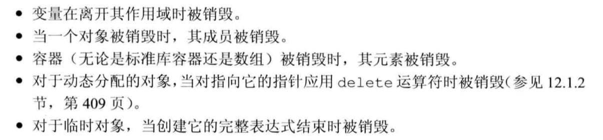
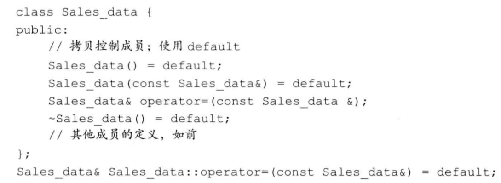
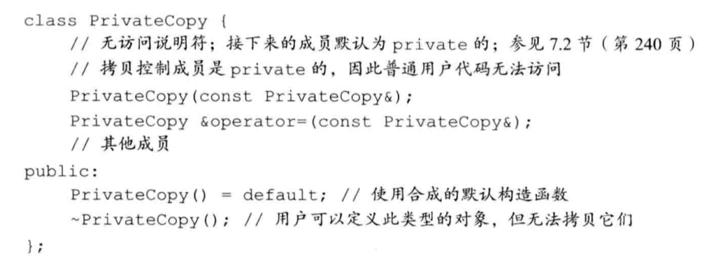
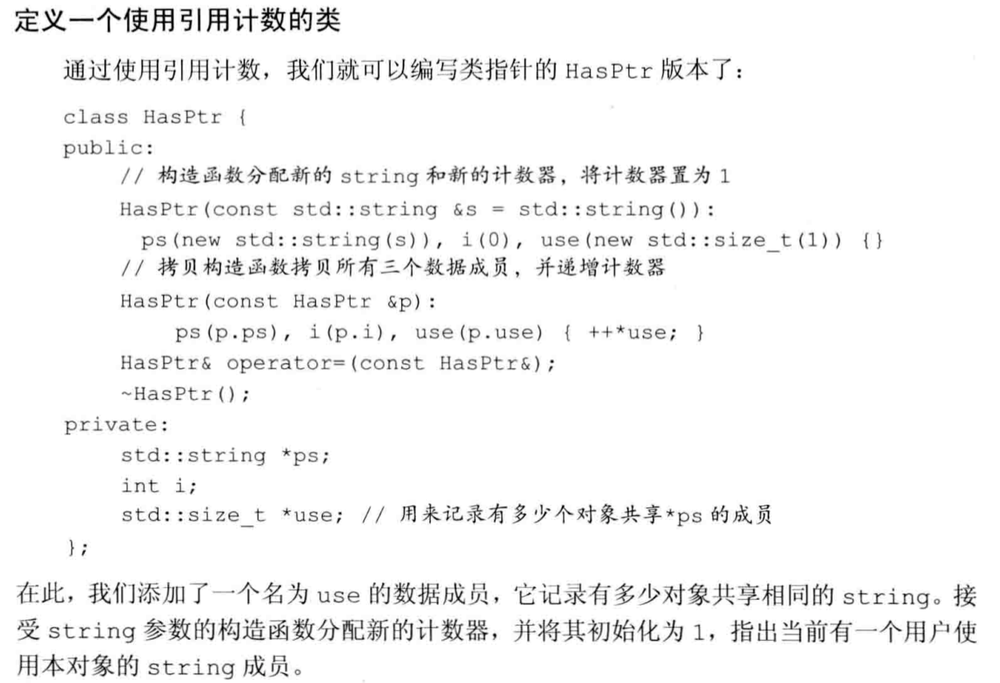
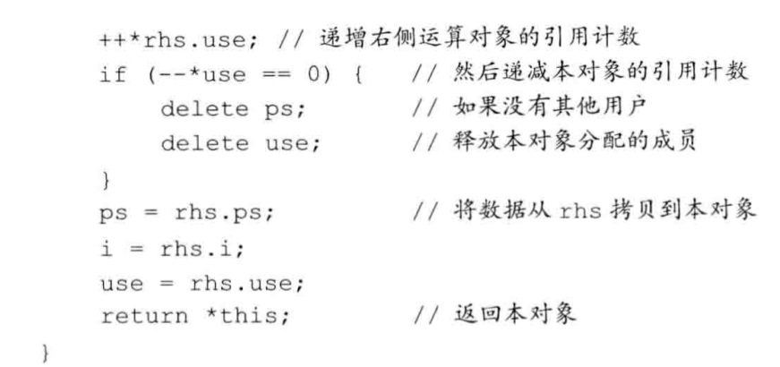
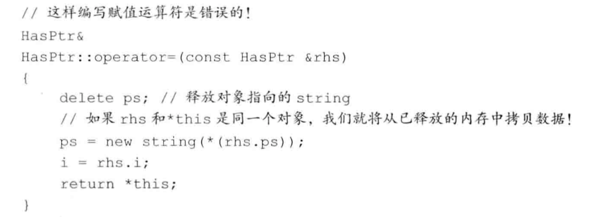
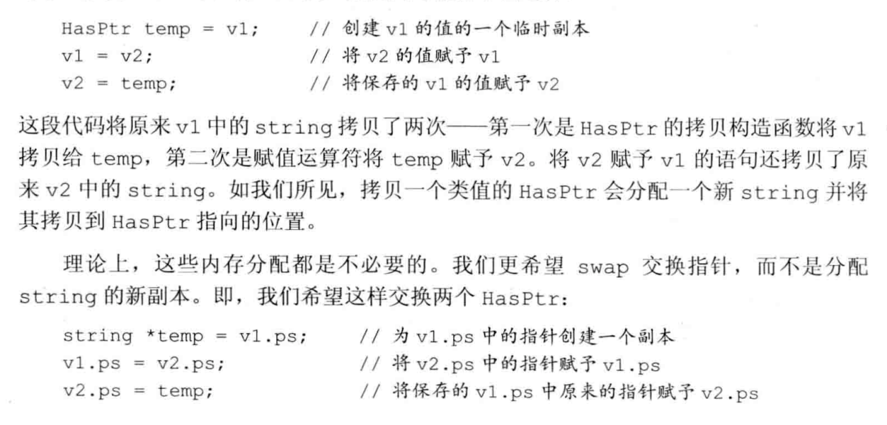
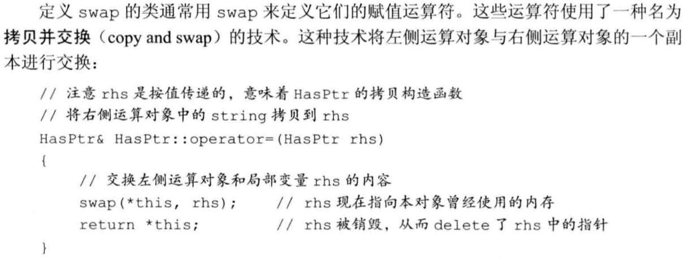
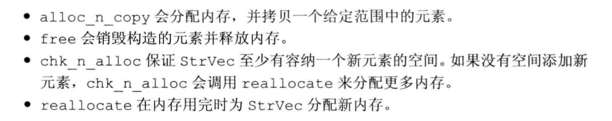

# C++理论基础

## 类型转换

- 发生隐式类型转换的情况
  
  

- 算术转换
  
  运算符对象转换为最宽的类型。
  
  - 整型提升
    
    将小整数类型转换为较大的整数类型
    
    > bool、char、signed char、unsigned char、short、unsigned short只要他们所有可能的值都能存在int里，就会提升为int类型；否则，提升为unsigned int类型
    
    > 较大的char类型(wchar_t、char16t、char32_t)提升成int、unsigned int、long、unsigned long、long long和unsigned long long中最小的一种类型，前提是转换后的类型要能容纳原类型所有可能的值。
  
  - 无符号类型的运算对象
    
    类型不一致，将转换为同一种类型。如果运算对象是无符号类型，转换结果依赖各个整数类型的相对大小
  1. 类型匹配就无需转换；
  
  2. 如果都是有符号或者都为无符号，那就整型提升、小的变为大的类型
  
  3. 一个对象为无符号一个为有符号，并且无符号类型不小于带符号的类型，那么带符号对象转换为与无符号类型相同的类型
  
  4. 一个对象为无符号一个为有符号，并且无符号类型小于带符号的类型，此时的转换结果依赖于机器。**如果无符号类型的所有值都能存在带符号类型中**，无符号转换为带符号类型。如果不能存下，那么带符号类型的对象转换为无符号类型（大小相同是不能存下）
     
     > 例如，如果两个运算对象的类型分别是long和unsigned int,并且int和long的大小相同，则long类型的运算对象转换成unsigned int类型：如果long类型占用的空间比int更多，则unsigned int类型的运算对象转换成long类型。
  
  tip：算术运算符两个对象优先转化为相同种且大的类型，涉及无符号的只要无符号对象不能存在带符号的或者无符号对象中时，那就提升类型位数到相同大小并且为无符号，只要能存下（无符号类型位数小于另一个无符号或者带符号对象），那就转换为另一个对象的类型

- 其他隐式类型转换
  
  - 数组转换为指针（数组自动转换为指向首元素的指针）
    
    
    
    > 意思也就是不是一个指向首元素的指针，是作为数组名去理解
    > 
    > ```c++
    > int (&array)[10] 为一个int [10] 的引用
    > ```
  
  - 指针的转换
    
    - 常量整数值0或者字面值nullptr能转换为任意类型的指针
    - 指向任意非常量的指针能转换为void *
    - 指向任意对象的指针能转换为const void *
    - 在有继承关系还有另一种指针转换形式（c++prime  P530）
  
  - 转化为布尔类型
    
    如果指针或算术类型的值为0，转化为false，否则转化为true
  
  - 转化为常量
    
    允许将指向非常量的指针转换为指向常量的指针，引用也是一样

- 显示类型转换
  
  一个命名的强制类型转换具有如下形式：
  
  ```c++
  cast-name<type>(expression);
  ```
  
  cast-name为static_cast、dynamic_cast、const_cast、reinterpret_cast中的一种
  
  type为目标转换类型
  
  - dynamic_cast：（P730介绍）
  - static_cast：只要不包含底层const就可以使用static_cast，就是一个显示的类型转换，使编译器不再警告
  - const_cast：改变对象的底层const
  - reinterpret_cast：改变了对象的类型，内容的类型是变了，但是写的还是别的类型，表里不一。

## 容器

### 顺序容器类型：

顺序容器构造函数接受大小参数，关联容器不支持

- vector：自动扩容数组

- deque：双头队列

- list：双向链表

- forward_list：单向链表，迭代器不支持--

- array：大小固定的数组，方法比原本的数组多，支持整体赋值
  
  不支持assign和花括号包围的值列表进行赋值

- string：字符串类，支持随机访问，支持“+”重载

### 容器操作

- 类型别名，可以通过容器作用域使用，比如`vector<int>::iterator it`
  
  - iterator：迭代器类型
  - size_type：无符号整型，足够保存此容器类型最大可能容器大小
  - value_type：元素类型

- 构造函数
  
  ```c++
  C c;//默认构造
  
  C c1(c2);//赋值构造
  C c(begin,end);//迭代器拷贝
  C c{a,b,c...};//列表初始化c
  ```

- 赋值和交换
  
  ```c++
  c1 = c2;
  c1 = {a,b,c...};
  a.swap(b);
  swap(a,b);
  ```

- 大小
  
  ```c++
  c.size();
  c.max_size();
  c.empty();
  c.resize();
  ```
  
  

- 添加和删除元素（不适用于array），**不同容器操作接口不同**
  
  向vector、string、deque插入元素会使所有指向容器的迭代器、引用和指针失效。
  
  ```c++
  c.insert(args);
  c.emplace(inits);//使用inits构造一个c中的元素
  c.erase(args);
  c.clear();
  ```


forward_list使用的插入和删除方法为

```c++
insert_after();
emplace_after();
erase_after();
```


- 访问元素
  
  

### 迭代器

- 迭代器范围为**左闭右开**
- begin()和end()获取迭代器首尾，当不需要写访问时使用cbegin()和cend()
- 使用迭代器参数拷贝一个范围时不需要类型相同
- erase元素后迭代器会指向删除的元素的后面，而插入则会指向插入的元素


- 插入迭代器：对迭代器进行赋值就会在迭代器指定位置插入元素
  
  - inserter：在迭代器前面插入
  - front_inserter：在容器首插入（在容器支持push_front下才可以使用）
  - back_inserter：在容器尾插入（在容器支持push_back下才可以使用）

- iostream迭代器
  
  向流迭代器赋值可以忽略解引用和递增运算，可以使用流进行初始化流迭代器
  
  

- 反向迭代器
  
  - 反向迭代器是从后往前递增的，即递增含义和原本迭代器递增颠倒。
  - 一个反向迭代器可以通过调用类方法中的base进行反向，使其正向递增。
  - 

### vector

- 使用预留空间的策略减少容器空间重新分配次数，每次需要分配新的内存空间时将当前的容量翻倍
  
  管理容量的成员函数
  
  ```c++
  c.capacity();//用于查看容器当前不扩张的情况下的容量
  c.reserve(n);//分配至少能容纳n个元素的内存空间，可能更大
  c.size();//查看容器元素的个数
  c.shrink_to_fit();//请求系统退回多余的内存，不保证退还
  ```

### string

- 构造string的方法
  
  ```c++
  string s(cp,n);//拷贝数组的前n个字符
  string s(s2,pos2);//从s2的pos2开始拷贝
  string s(s2,pos2,len2);//从s2的pos2开始拷贝len2个字符
  ```

- substr操作
  
  ```c++
  string s("hello world");
  string s1 = s.substr(pos,n);//表示从pos开始截取n个字符
  ```

- 其他改变string的方法
  
  ```c++
  s.insert(pos,n,char);//表示在pos开始插入n个char
  s.erase(pos,n);//擦除pos后n个字符
  s.assign(char* str,n);//用str的前n个字符替换s
  s.append();//追加字符串
  s.replace(pos,n,char* str);//从pos开始的n个字符用str替换了
  ```

- 字符串搜索
  
  


- string比较campare函数
  
  

- 数值转换
  
  ```c++
  to_string(int);//将整数转换为字符串
  stod(string);//将字符串转换为double
  stoi(string);//将字符串转换为整数
  ```
  
  

### 容器适配器

- 顺序容器适配器：
  
  - stack：默认底层实现为deque，也可选择为list
  
  - queue：默认底层实现为deque，也可选择为list
  
  - priority_queue：默认底层实现为vector，也可选择deque
    
    
    
    tip：选择什么底层数据结构是看需要什么操作，多插入删除选择list，多随机访问选择deque和vector

- 所有容器适配器支持的操作和类型
  
  

### 关联容器

元素是按关键字保存和访问的。

- map：键值对
- multimap：关键字可重复的键值对
- unordered_map：用哈希函数组织的map
- unordered_multimap：哈希组织的map，关键字可以重复
- set：保存关键字的容器
- multiset：关键字可以重复出现的set
- unordered_set：哈希组织的set
- unordered_multiset：哈希组织的set，关键字可以重复

#### pair

- 模板类型

- 保存两个名分别为first和second的公有数据成员

- 

#### 关联容器操作

- 类型别名


- 迭代器
  
  - 当解引用一个关联容器迭代器时，我们会得到一个类型为容器的value_type的值的引用。对map而言，value_type是一个pair类型，其first成员保存const的关键字，second成员保存值。
  - 必须记住，一个map的value type是一个pair,我们可以改变pair的值，但不能改变关键字成员的值。
  - 虽然set类型同时定义了iterator和const iterator类型，但两种类型都只允许只读访问set中的元素。与不能改变一个map元素的关键字一样，一个set中的关键字也是const的。可以用一个set迭代器来读取元素的值，但不能修改。

- 关联容器和算法
  
  使用关联容器定义的专用的find成员会比调用泛型find快很多。

- 添加元素
  
  - insert
    
    - ```c++
      set.insert(迭代器);
      set.insert(初始化列表);
      ```
    
    - ```c++
      map.insert({key,val});
      map.insert(pair<type,type>(key,val));
      map.insert(make_pair(key,val));
      map.insert(map<type,type>::value_type(key,val));
      ```
    
    - 
    
    - 检测insert的返回值
      insert(或emplace)返回的值依赖于容器类型和参数。对于不包含重复关键字的容器，添加单一元素的insert和emplace版本返回一个pair,告诉我们插入操作是否成功。
      
      pair的first成员是**一个迭代器，指向具有给定关键字的元素**：second成员是一个bool值，指出元素是插入成功还是已经存在于容器中。如果关键字已在容器中，则insert什么事情也不做，且返回值中的boo1部分为false。如果关键字不存在，元素被插入容器中，且bool值为true。
  
  - 删除元素
    
    - 
  
  - map的下标操作
    
    - 对一个map使用下标操作，其行为与数组或vector上的下标操作很不相同：使用一个不在容器中的关键字作为下标，会添加一个具有此关键字的元素到map中。
    
    - 
    
    - map的下标运算符与我们用过的其他下标运算符的另一个不同之处是其返回类型。通常情况下，解引用一个迭代器所返回的类型与下标运算符返回的类型是一样的。但对map则不然：当对一个map进行下标操作时，会获得一个mapped type对象；但当解引用一个map迭代器时，会得到一个value_type对象。下标运算符返回的是一个左值，既可以读也可写。
      
      **若单纯只是想查看某个关键字是否在map中应该使用find。当允许重复时，需要计数时使用count。**（find返回迭代器，count返回数目）
  
  - 访问元素
    
    
    
    使用c.lower bound (k)和c.upper bound (k)可以配合在multimap中找出关键字为k的迭代器范围
    
    使用c.equal_range(k)可以代替上一行的方法

### 无序容器

#### 哈希

- 使用哈希函数将给定类型的值映射到整型值
- 哈希碰撞，不同的值映射到同一个整型值中，需要使用桶，在查找时效率会变低，因为需要遍历桶内的元素

> 不是使用比较运算符组织元素，而是使用一个哈希函数和关键字类型的==运算符。在元素不需要维持序时，使用无序可以提高效率，避免不必要的效率损失。

> 如果关键字类型固有就是无序的，或者性能测试发现问题可以用哈希技术解决，就可以使用无序容器。

> 无序容器使用关键字类型的==运算符来比较元素，使用一个hash\<key_type>类型的对象生成每一个元素的哈希值，标准库为内置类型（包含指针）、string和智能指针提供了hash模板，所以可以定义关键字是内置类型、string还是智能指针类型的无序容器。
> 
> 自定义数据类型作为关键字时不能直接使用hash模板，需要提供自己的hash模板。

无序容器在遍历输出时不是按字典顺序

#### 自定义数据类型


#### 管理桶


## 泛型算法


- 算法永远不会执行容器的操作，像插入，删除等。

- 理解算法最基本的方法就是了解它们是否读取元素（find、accumulate、equal）、改变元素（fill、fill_n、copy）或重排元素(sort、unique)
  
  可以猜到unique使用双指针
  
  防止在调用fill_n填充多余容器大小的元素，越界。

- 只读算法最好传递只读迭代器

### 定制操作

- 默认情况下，这类算法使用元素类型的<或=运算符完成比较，允许我们提供自己定义的操作来代替默认运算符
  
  sort算法使用<运算符，我们需要排序与<所定义的顺序不同或者我们的序列中的元素未定义<运算符的元素类型(自定义的数据类型)。这两种情况下需要重载sort的默认行为。

- 向算法传递函数
  
  - 比如sort的一个重载版本接收第三个参数，该参数是一个谓词，该谓词是一个可调用的表达式，返回结果是一个能用作条件的值
    
    

- 标准库算法使用的谓词分两类
  
  1. 一元谓词：表示接收单一参数
  2. 二元谓词：表示接收两个参数

- lambuda表达式
  
  - 可以克服谓词有时多余两个参数的情况，有时可以进行的操作需要更多的参数，超出算法对谓词的限制
    
    比如使用多一个参数来确定多种分级或分类的使用情况
  
  - 一个lambda表达式表示一个可调用的代码单元，未命名的内联函数
    
    具有一个返回类型、一个参数列表和一个函数体
  
  - 关键是lambda表达式可以定义在函数内部
  
  - lambda表达式的形式
    
    [capture list]  (parameter list) -> return type {function body}
    
    capture list：为捕获列表是一个lambda表达式所在函数中定义的局部变量的列表（通常为空）
    
    其他的和普通函数的意义一样，唯一与普通函数不同的是使用尾置返回来指定返回类型
  
  - 可以忽略参数列表和返回值，但必须包含捕获列表和函数体
    
    auto f = [] {return 42;};
  
  - lambda捕获和返回
    
    - 值捕获，被捕获的变量的值是在创建lambda表达式时拷贝的，不是调用时拷贝不会受后面值修改影响
    
    - 引用捕获，在使用引用捕获时确保调用lambda表达式时该引用存在，并且修改其值后调用值会是修改后的。（引用捕获是必要的，比如有时不能拷贝对象，像ostream）
      
      tip：**以引用方式捕获一个变量时，必须保证在lambda执行时变量是存在的。**
    
    
    
    - 隐式捕获，通过在捕获列表中写一个&或者=，&告诉编译器采用引用捕获，=采用值捕获，并且可以混用隐式捕获和显示捕获，==并且混用必须是一个是引用捕获一个是值捕获==
      
      
    
    - 可变lambda，希望值被拷贝的变量值可以被改变，可以在参数列表后加上mutable
      
      
  
  - 指定lambda返回类型
    
    - 使用尾置返回类型
      
      ```c++
      [] () -> type
      {
      }
      ```
    
    lambda表达式相比于普通函数的优点在于可以捕获局部变量
  
  - bind绑定参数减少传参数目或者重排参数顺序
    
    借助bind和占位符生成一个新的可调用对象，其中某些参数已经通过bind绑定，在调用新的可调用对象时只需传递少数参数，并且顺序可以实现自定义

- 四种可调用对象
  
  1. 函数
  2. 函数指针
  3. 重载了函数调用运算符的类
  4. lambda表达式

- 泛型算法结构
  
  - 迭代器类别
    
    - 输入迭代器：只读，只作为右值，支持推进和比较
    - 输出迭代器：只写，只作为左值，支持推进
    - 前向迭代器：可读可写，迭代器只能延一个方向推进
    - 双向迭代器：可以正向和反向读写序列中的元素
    - 随机访问迭代器：提供时间常量访问序列中任意元素的能力
  
  - 
  
  - 特定容器算法
    
    对于list和forward_list,应该优先使用**成员函数版本**的算法而不是通用算法。

## 动态内存

> 标准库定义了两个智能指针类型管理分配的对象，当一个对象应该被释放时，指向它的智能指针可以确保自动释放它

- 使用动态内存出于以下三种原因：
  1. 程序不知道自己需要使用多少对象（比如vector容器）
  2. 程序不知道所需对象的准确类型
  3. 程序需要在多个对象间共享数据（多个智能指针指向同一个动态内存对象）

### 动态内存和智能指针

#### shared_ptr类


#### make_shared函数


```c++
auto p6 = make_shared<vector<string>>();//p6指向一个动态分配的空vector<string>,已经动态分配好了
```

#### shared_ptr拷贝、赋值和销毁

- 每个shared_ptr都有一个引用计数，拷贝一个shared_ptr，其引用计数都会增加无论何时我们拷贝一个shared ptr,计数器都会递增。例如，当用一个shared_ptr初始化另一个shared_ptr,或将它作为参数传递给一个函数以及作为函数的返回值时，它所关联的计数器就会递增。当我们给shared ptr赋予一个新值或是shared ptr被销毁（例如一个局部的shared ptr离开其作用域）时，计数器就会递减。

- > 到底是用一个计数器还是其他数据结构来记录有多少指针共享对象，完全由标准库的具体实现来决定。关键是智能指针类能记录有多少个shared ptr指向相同的对象，并能在恰当的时候自动释放对象。

- 指向动态内存对象的最后一个shared_ptr销毁时，shared_ptr类会销毁此对象，是通过析构函数完成销毁

- 由于在最后一个shared ptr销毁前内存都不会释放，保证shared ptr在无用之后不再保留就非常重要了。如果忘记了销毁程序不再需要的shared ptr,程序仍会正确执行，但会浪费内存。share ptr在无用之后仍然保留的一种可能情况是，将shared ptr存放在一个容器中，随后重排了容器，从而不再需要某些元素。在这种情况下，应该确保用erase删除那些不再需要的shared ptr元素。
  
  如果你将shared_ptr存放于一个容器中，而后不再需要全部元素，而只使用其中一部分，要记得用erase删除不再需要的那些元素。

- 借助标准库容器实现底层共享的vector容器
  
  - 数据类型使用shared_ptr，当新创建对象并进行拷贝时，智能指针的指向相同，引用计数会增加，在最后一个shared_ptr对象销毁前，数据不会被销毁，并且是共享的。
  - 新创建对象进行拷贝时，使用的默认版本的拷贝对此对象进行操作。

#### 直接管理内存

- new和delete
  
  - ```c++
    int* p = new int; //分配一个值未初始化的int
    int* p1 = new int(); //分配一个值初始化为0的int
    int* p2 = new int[n]; //分配一个值未初始化的int[n]数组
    
    delete p；
    delete p1；
    delete []p2;
    ```
  
  - 在释放内存后，需要将指针赋值为空，防止还指向那块地址，但是那块内存已经回收了，成为了一个空悬指针，和野指针一样的缺点。

- shared_ptr和new结合使用
  
  - 不初始化一个智能指针它会被初始化为一个空指针。
  
  - 初始化智能指针的普通指针必须指向动态内存。
  
  - 
  
  - **不要混用内置指针和智能指针，无法将普通指针转换为一个智能指针，但可以使用一个内置指针显示构造一个临时的shared_ptr**
    
    ```c++
    int *x(new int(12));
    process(shared_ptr<int>(x)); //结束后x指向的动态内存被释放，不能再对x解引用。
    int j = *x; //错误，因为x所指的动态内存已经被释放了。
    ```
  
  - 当将一个shared_ptr绑定到一个普通指针时，就将内存的管理责任交给shared_ptr，之后就不应该使用内置指针访问shared_ptr所指的内存了。
    
    使用一个内置指针来访问一个智能指针所负责的内存和对象是很危险的，因为我们无法知道shared_ptr对象何时会被销毁。
  
  - 智能指针使用get方法返回一个内置指针，这种情况是为了解决有些情况只能使用内置指针（不支持智能指针）。
    
    **需要注意的是不能将另一个智能指针绑定到get返回的指针上，这导致了两个独立的智能指针绑定到同一个内存上的问题。**

#### shared_ptr的其他操作

> reset可以将一个新的指针赋予给shared_ptr，但在修改shared_ptr之前先检查自己目前是否是仅有的用户，不是的话需要进行shared_ptr拷贝，这样别人用原来的那份内存，自己便使用新的拷贝去赋值给智能指针。

#### 智能指针和异常

> 使用智能指针可以防止在函数发生异常返回时没有手动回收内存也能将分配的内存销毁。
> 
> 也就是在分配资源和释放之间发生了异常，程序也会发生内存泄漏。

#### 使用自己的释放操作

定义一个函数，将该函数指针在创建智能指针时作为参数传入，在智能指针要销毁时就会调用，执行该函数的内容，类似一个钩子函数。


#### 智能指针陷阱

智能指针可以提供对动态分配的内存安全而又方便的管理，但这建立在正确使用的前提下。为了正确使用智能指针，我们必须坚持一些基本规范：

- 不使用相同的内置指针值初始化(或reset)多个智能指针。（会导致重复释放）

- 不delete get（）返回的指针。

- 不使用get（）初始化或reset另一个智能指针。

- 如果你使用get（）返回的指针，记住当最后一个对应的智能指针销毁后，你的指针就变为无效了。

- 如果你使用智能指针管理的资源不是new分配的内存，记住传递给它一个删除器。（因为默认的delete就是回收new分配的动态内存，如果是自己的内存分配函数就需要自己定义删除器，就是定义delete行为）

#### unique_ptr

> unique_ptr没有类似make_shared函数返回一个unique_ptr，在定义时需要将其绑定到一个new返回的指针

> unique_ptr不支持拷贝和赋值

- unique_ptr操作
  
  

> 虽然不能拷贝和赋值，但是可以调用release或者reset将指针的所有权从一个非const的unique_ptr转移到另一个上


- reset函数
  
  

- release函数
  
  

- 传递unique_ptr参数和返回unique_ptr
  
  > 不能拷贝和赋值unique_ptr，但是有个例外是可以拷贝和赋值一个将要销毁的unique_ptr
  
  

- unique_ptr管理删除器的方式和shared_ptr不同，在创建时指向类型之后提供删除器类型
  
  ```c++
  shared_ptr<type> p(q,delete_fun);
  unique_ptr<type,delT> p(q,delete_fun);
  ```

#### weak_ptr

- 是一种不控制所指向对象生存期的智能指针，作为一种从动，不参与计数。
- 在创建一个weak_ptr要用一个shared_ptr初始化，由于是弱共享，不会增加shared_ptr的引用计数
- 对象可能已经销毁，所以不能直接使用weak_ptr访问对象，必须调用lock函数检查对象是否仍存在，只有lock函数返回true才能访问对象。

### 动态数组

- 分配动态数组的类必须定义直接版本的操作，在拷贝、复制和销毁对象时要管理所关联的内存

- `int *p = new int[42]`,分配得到的是动态数组，并不是一个数组类型，不能对动态数组调用begin和end返回首尾元素的指针，也不能使用范围for语句处理里面的元素。
  
  > 动态数组并不是数组类型

#### 数组别名

```c++
typedef int arr_type[12];//arr_type是一个int[12]的类型
int * p = new arr_type;
```

#### 动态数组初始化


#### 释放动态数组

```c++
delete [] p;//delete的是动态数组必须使用[]
```

p 中的元素逆序销毁释放内存。

#### 智能指针和动态数组

使用unique_ptr管理动态数组

```c++
unique_ptr<int[]> up(new int[10]);
up.release();//自动调用delete[] 释放内存
```

> 指向数组的unique_ptr的操作与之前的有些不同，不能使用点和箭头成员运算符，但是可以使用下标对元素进行访问。


可以这么理解，就是管理的动态数组他不是一个对象，就是一个指针指向的内存块，所以支持索引。

#### shared_ptr管理动态数组

- shared_ptr不支持直接管理动态数组，如果需要的话要自己提供一个自定义的删除器。


> 而unique_ptr在定义时已经加入了[]，表示管理的是动态数组。
> 
> unique_ptr\<int[]> p(new int[12]);

- 使用shared_ptr管理动态数组对数组进行访问的方式


#### 使用new分配动态数组缺点

- 分配内存和对象构造函数组合在一起可能导致了不必要的浪费
  
  比如new分配了n个string，我们只需要少量的string，而new分配n个后并且进行了初始化，这样就创建了一些我们本来不需要的对象，浪费了时间和空间
  
  > 注：使用new动态分配的话，没有默认构造函数的类就不能动态分配数组了，但可以自己提供初始化器

### allocator类

- allocator是一个模板

- 位于memory头文件中，它用于帮助将内存分配和对象构造分离，提供一种类型感知的内存分配方法，分配的内存是原始的、未构造的。

- 

- allocator分配**未构造内存**
  
  ```c++
  allocator<string> alloc;
  auto const p = alloc.allocate(n);//分配n个未初始化的string
  auto q = p;//q用于遍历
  alloc.construct(q++);//*q为空字符
  alloc.construct(q++,10,'c');//*q为ccccccccc
  alloc.construct(q++,"hi");//*q为hi
  ```

> 对于还未用construct构造的对象，不能进行访问，访问位构造的内存的行为是未定义的。

- 使用完这些用allocator类分配的对象后，需要调用destroy进行销毁，即析构
  
  ```c++
  alloc.destroy(--q);//销毁上面已经用alloc.construct初始化的string对象
  ```
  
  destroy后，这部分内存可以继续重新初始化使用，也可以调用deallocator释放该alloctor对象。
  
  ```c++
  alloc.deallocate(p,n);//p必须是原本指向alloc对象分配的指针，并且n必须是allocate分配内存是的值
  ```

- 拷贝和填充未初始化内存的算法
  
  
  
  > uninitialized_copy()会返回递增后的一个指针，可以供后续初始化使用

> tip：在需要进行数据共享时又不想要进行拷贝时，可以使用智能指针shared_ptr，后续互斥和同步问题以后再考虑

# 类设计

## 类

- 类的实现和接口
  
  - 实现：包括类的数据成员和负责接口实现的函数体，以及定义类所需要的各种私有函数（提供给接口实现调用的）
  - 接口：就是用户能对类进行的操作（公有方法）

- 封装实现了类的接口和实现的分离，封装隐藏了类实现的细节，只暴露接口供用户调用

- 类就是一个抽象数据类型，类设计者负责考虑类的实现过程（实现和接口），而使用该类的程序员只需抽象地考虑怎么使用接口，调用该类来做什么。**类的用户是程序员**

- this指针
  
  ```c++
  obj.oper();
  //等价于
  class::oper(&obj);
  ```
  
  在成员函数内部，无需通过成员访问运算符来对象成员，可以使用this指针，因为this指针就是指向该对象的指针
  
  > 默认情况下this指针是一个const指针，不能改指向
  > 
  > 且不能在参数的位置定义自己的this指针

- const 成员函数
  
  表示不能通过this指针来修改对象，也就是this指针是一个指向常量对象的指针，是const class *const的指针

> 常量对象、常量对象的引用或者指针都只能调用常量成员函数（因为调用普通函数会有隐式的非const的this指针传入，this的权限就变高了能够改变对象的值，而将权限变高一般是非法的）

- 在类外部定义成员函数需要在函数名前面加上类的作用域，表示函数内的代码都是在类的内部实现的
  
  ```c++
  ret_type class::fun()
  {
  
  }
  ```

- 定义一个返回this对象的函数
  
  

- 定义类相关的非成员函数
  
  需要用到类作为参数，但不需要在类内对接口进行实现，就是不需要访问到私有的东西。

> tip:将给定流作为参数传入函数，一般是传入引用，因为IO属于不能拷贝的类型。

### 构造函数

- 构造函数没有返回类型，有一个可能为空的参数列表，和一个可能为空的函数体。

- 构造函数重载和其他重载函数差不多，不同的构造函数之间必须在参数数量或者参数类型上有区别

- 构造函数不能被声明为const，在创建一个对象直到初始化完成才能取得常量属性，构造函数在const对象的构造过程中需要向其写值，所以会修改对象的值，所以构造函数不能声明为const

- 在没有显示定义构造函数时，编译器会隐式的定义一个默认构造函数（合成的默认构造函数）
  
  初始化类的数据成员规则如下：
  
  1. 如果存在类内的初始值，那就用它来初始化成员
  2. 否则执行默认初始化该成员

- 默认和自定义构造函数
  
  
  
  > =default要求编译器生成构造函数。既可以在类的内部也可以在类的外部，在内部为inline函数
  
  **使用默认构造函数创建对象时，不需要加上空的小括号**

- 默认构造函数（合成的构造函数）的作用
  
  
  
  > 在实际中，如果定义了其他构造函数，那么最好也提供一个默认构造函数

- 构造函数初始值列表
  
  可以作为编译器不支持类内初始值时进行初始化的方法
  
  
  
  形参后面的称为构造函数初始值列表
  
  当某个参数被初始值列表忽略时，以合成默认构造函数相同的方式隐式初始化
  
  当然如果编译器不支持类内初始值的话，那就需要在初始值列表提供所有参数的初始化值
  
  初始值列表和初始化顺序无关，初始化顺序和变量的声明顺序一致
  
  > 当构造函数初始值列表中的顺序和声明顺序不一致时编译器会警告
  > 
  > 初始化尽量避免使用其他成员进行初始化

- 构造函数初始值列表
  
  - 区别构造函数作用和赋值的区别
    
    构造函数是用于初始化的，在定义变量时的赋值属于初始化，调用的是构造函数
  
  - 构造函数的初始值有时必不可少
    
    **存在const成员变量或者存在引用时都必须在定义对象时马上进行初始化，必须在初始值列表中就进行初始化，在构造函数体中的赋值不是初始化，是等号赋值。**
    
    
    
    > 如果成员是cost、引用，或者属于某种未提供默认构造函数的类类型，我们必须通过构造函数初始值列表为这些成员提供初值。为提供默认是因为自定义构造函数了且没有定义默认构造函数，所以得手动初始化

- 转换构造函数
  
  构造函数只接受一个实参，定义了转换为此类类型的隐式转换规则
  
  阻止只有一个参数的构造函数进行隐式创建该类对象时，需要在声明构造函数时，加上explicit关键字。
  
  加上了explicit关键字的一个参数的构造函数只能用于显示初始化。
  
  声明了explicit，可以将需要转换的作一个显示转换再作为参数传递进去构造函数中。

### 委托构造函数

- 一个委托构造函数使用它所属类的其他构造函数执行它自己的初始化过程，把它自己的一些职责委托给其他构造函数
- 委托构造函数也有一个成员初始值列表和一个函数体，多了可以在参数列表后面调用类中的其他构造函数

### 拷贝、赋值和析构


在涉及到动态内存分配时，不能简单的依赖编译器生成的版本为我们进行拷贝、赋值和销毁操作

需要自定义去进行**深拷贝、重载=和析构函数**

### 访问控制和封装


访问说明符指定了接下来成员的访问级别，有效范围到下一个访问说明符或者类结尾为止。

- struct和class默认访问权限不一样，这也是他们的唯一区别
  
  - 使用struct时，在第一个访问说明符出现之前为public
  - 使用class时，在第一个访问说明符出现之前为private

- 友元
  
  - 类要把一个函数作为它的友元，只要在**类中**（类作用域中）增加一条以friend关键字开始的函数声明即可
    
    一般友元的声明会集中在类开始或者结束的地方
    
    声明为友元函数，仍需在类外部对函数进行声明
    
    声明为友元的函数可以在类中访问类的私有成员
  
  - 类可以指定友元类，并且友元关系不具有传递性，每个类负责控制自己的友元类和友元函数
  
  - 友元和重载函数的关系，如果需要和一些列的重载函数建立友元关系，需要一一进行友元声明

- **封装的优点**
  
  - 确保用户代码不会无意间破坏封装对象的状态
  
  - 被封装的类的具体实现细节可以随时改变，无需调整用户级代码
    
    > 数据成员定义为private，类作者可以比较自由的修改数据，只要确保类的接口没有改变，用户级代码就不会有影响。相反如果数据类型定义为public，一旦修改数据成员，由于用户使用可能会访问public成员，所以修改会使用户级代码失效。
  
  - 同时数据定义为private可以防止用户代码造成数据破坏，把用户对数据的操作用接口开放出来。

### 类的其他特性

- 定义某种数据类型在类中的别名
  
  ```c++
  typedef std::string::size_type pos;
  using pos = std::string::size_type;
  ```

- 令成员函数为内联函数
  
  - 在类外部用inline修饰函数定义，inline成员函数也应该与相应的类定义在同一个头文件（实现）

- 重载成员函数
  
  - 和正常的函数重载一样

- 返回 *this的成员函数，返回调用对象的引用
  
  - 可以对某个对象执行链式操作
  - 从const成员函数返回的*this无法对返回的调用对象进行修改

- 基于const的重载
  
  

- 类声明
  
  可以在定义前对类先进行声明（前向声明）
  
  但是在进行创建对象之前类必须被定义过，不能仅仅是声明，因为编译器无法为类对象分配存储空间。
  
  类只有在被定义后才能引用或者指针访问其成员。
  
  > 类的成员类型不能是类自己，但是可以是指向自身类型的引用或指针

### 类的作用域

- 在类作用域外，普通的数据和成员只能由对象、引用或者指针使用成员运算符访问

- 在类外部定义成员函数需要加上类作用域，一旦遇到了类名，定义剩下的部分就是在类的作用域内了（包括剩参数列表和函数体）

- 函数的返回类型在函数名之前，成员函数定义在类外部时，返回类型使用的名字位于类的作用域之外，返回类型需要加上类的作用域（也就是函数名前和返回类型前都需要加上类作用域）
  
  

- 名字查找和类作用域
  
  
  
  > 编译器处理完类中的全部声明后才会处理成员函数的定义
  
  - 类成员声明的名字查找
    
    优先在类作用域中进行查找
  
  - 类型名查找
    
    类中的成员先使用了类外定义的类型名，在使用之后类内就不能进行定义一样的类型名，所以一般想使用类中自定义类型都需要在类一开始就进行定义。
  
  - 类方法是最后再定义的，类数据类型和数据成员先声明和定义的。
    
    
    
    - verify声明在setHeight定义之前，可以正常使用，虽然类是先进行定义的，但是成员函数是在后面才定义，类的定义先完成类内类型和成员变量的定义。
  
  - 在类内需要使用到的外部变量，不要在类内定义重复的变量名，会覆盖掉外部变量，导致在使用时需要加上::

### 聚合类

> 跟C的结构体类似

- 满足以下条件为聚合类
  
  

- 使得用户可以直接访问其成员

- 特殊的初始化语法形式
  
  使用花括号括起来的成员初始值列表。
  
  ```c++
  Struct Data{
      int ival;
      string s;
  }
  Data val1 = {0,"string"};
  ```

- 显示地初始化类的对象存在三个明显的缺点：
  
  - 所有类的成员都是public，因为吧初始化的权利交给了使用类的用户
  - 初始化过程交给了用户，初始化过程冗长且易出错，容易忘记
  - 添加或者删除一个成员后，之前的代码进行初始化的语句都需要更新

### 字面值常量类

常量表达式（constexpr),那就需要赋值的表达式为编译期间的常量

普通变量我们比较好理解，但是C++的类，也能声明成为字面值的常量类。

1. 数据成员都是字面值类型(算术类型，引用和指针，以及字面值常量类)的聚合类是字面值常量类。
2. 或者满足如下的定义：
   - 数据成员都必须是字面值类型(算术类型，引用和指针，以及字面值常量类)。
   - 类必须至少含有一个constexpr构造函数。
   - 如果一个数据成员含有类内初始值，则内置类型的初始值必须是一条常量表达式。或者如果成员属性某种类类型，则初始值必须使用成员自己的constexpr构造函数。
   - 类必须使用析构函数的默认定义，该成员负责销毁类的对象。

## 类设计者的工具

### 拷贝控制

> 学习如何控制对象的拷贝、赋值、移动和销毁时做什么
> 
> 通过拷贝构造函数、移动构造函数、拷贝赋值运算符、移动赋值运算符、析构函数进行以上的操作

- 拷贝构造函数
  
  > 一个构造函数的第一个参数是自身类类型的引用，任何额外的参数都有默认值。
  
  拷贝构造函数在几种情况下都会被隐式使用，拷贝构造函数不应该是explicit的。

- 合成拷贝构造函数
  
  和默认构造函数不一样的是，即使定义了自己的拷贝构造函数，编译器也会为我们合成拷贝构造函数
  
  合成的拷贝构造函数就是一对象中非static成员的逐个拷贝。拷贝的规则取决于类型，内置类型是值拷贝，类类型的成员会调用其拷贝构造函数拷贝。如果有数组，数组是每个元素值逐一拷贝，如果数组中的元素为类类型，则使用类的拷贝构造函数。

- 拷贝初始化发生的情况：
  
  - 使用=进行赋值
  - 将一个对象作为实参传递给一个非引用类型的形参
  - 用花括号列表初始化一个数组中的元素或一个聚合类中的成员。
  - 初始化标准容器或调用insert或push成员，容器会对元素进行拷贝初始化（emplace成员创建的元素进行直接初始化）

- 参数和返回值
  
  > 函数调用过程中，具有非引用类型的参数要进行拷贝初始化
  > 
  > 参数需要是类的引用类型是因为在调用拷贝构造函数本身如果也是一个传值过程，会出现无限循环

- 拷贝初始化的限制
  
  通过explicit来防止构造函数在调用是发生隐式转换

- 拷贝赋值运算符
  
  - 重载赋值运算符
    
    ```c++
    c& operator=(const c&); //对类c重载赋值运算符
    ```
    
    > 一般要返回对象的引用

### 析构函数

```c++
~c(); //析构函数
```

- 析构函数的工作
  
  - 释放对象在生存期分配的所有资源
  
  - 销毁类类型的成员需要执行成员自己的析构函数（智能指针也是类类型，具有析构函数）

- 何时调用析构函数
  
  
  
  > tip:指向一个对象的引用或者指针离开作用域时，析构函数不会执行
  > 
  > 析构函数体自身并不直接销毁成员，析构函数提是作为成员销毁步骤之外的另一部分而进行的

- 三/五法则
  
  三个基本操作可以控制类的拷贝操作：拷贝构造函数、拷贝复制运算符、析构函数

- 需要析构函数的类也需要拷贝和赋值操作
  
  合成析构函数不会delete一个指针成员，需要定义一个析构函数来释放构造函数分配的内存

- 自定义拷贝构造函数和赋值操作是需要一起存在的

- 使用 =default来显示要求编译器生成合成的版本
  
  

- 阻止拷贝
  
  - 对于某些类，拷贝构造函数和拷贝赋值运算符可能没有意义，需要定义某种阻止机制
  
  - 定义删除的函数
    
    在参数列表后面加上 **=delete**指出希望将该函数定义为删除的，不希望定义这些成员
    
    > tip: =delete必须出现在函数第一次声明的时候
  
  - 定义删除的函数是防止生成默认的
    
    一个类有数据成员不能默认构造、拷贝、复制或销毁，对应的成员函数应该定义为删除
    
    对于具有引用或者无法默认构造的const成员的类，编译器不会为其合成默认构造函数。
  
  **本质上，当不可能拷贝、赋值或者销毁类的成员时，类的合成拷贝控制函数就会被定义为删除的**
  
  - 在新标准发布前，private拷贝控制，类可以通过将其拷贝构造函数和拷贝赋值运算符声明为private来阻止拷贝，只进行声明不进行定义，这样阻止友元和成员函数进行拷贝
    
    
  
  > 希望阻止拷贝的类应该使用=delete来定义他们自己的拷贝构造函数和拷贝赋值运算符，而不应该将他们声明为private的。

- 拷贝控制和资源管理
  
  一个类需要析构函数，那么它几乎肯定也需要一个拷贝构造函数和一个拷贝赋值运算符
  
  - 类的行为像一个值，拷贝一个这种类的对象，副本和对象完全独立，改变副本不会影响原对象。（标准库容器和string类）
  
  - 行为像指针的类则共享状态，拷贝一个这种类的对象，原对象和副本使用相同的底层数据。改变副本也会改变原对象，反之亦然。（智能指针）
    
    自己使用引用计数实现底层数据共享，指针的值进行拷贝，并且使用另一个指针进行计数
    
    
    
    拷贝赋值运算符与往常一样执行类似拷贝构造函数和析构函数的工作。即，它必须递增右侧运算对象的引用计数(即，拷贝构造函数的工作)，并递减左侧运算对象的引用计数，在必要时释放使用的内存(即，析构函数的工作)。

    而且与往常一样，赋值运算符必须处理自赋值。我们通过先递增rs中的计数然后
    再递减左侧运算对象中的计数来实现这一点。通过这种方法，当两个对象相同时，在我们检查ps(及use)是否应该释放之前，计数器就已经被递增过了：
    
    HasPtr& HasPtr:: operator=(connst HasPtr &rhs)
    
    {
    
    

- 编写赋值运算符时需要记住的两点：
  
  1. 如果将一个对象赋予它自身，赋值运算符必须能正确工作
  
  2. 大多数赋值运算符组合了析构函数和拷贝构造函数的工作
  
  > 因此，一个好的模式是先将右侧的运算对象拷贝到一个局部临时对象中，拷贝完成后再销毁左侧运算对象的成员（析构左侧对象），然后将数据从临时对象拷贝到左侧运算对象的成员中。
  
  错误示例：需要先拷贝rhs.ps，因为防止自赋值，delete ps后 ps指向未知
  
  

- 交换操作
  
  - 如果一个类定义了自己的swap，算法将使用类自定义的版本，即进行了重载。
  
  - 类对象成员中有指针，不希望产生临时的类对象，即用于拷贝，使用消耗资源更少的方法，交换指针的指向，其他对象采用值交换。
    
    
  
  > tip:调用swap应该未加限定，如果有更合适的或者重载的版本会自动进行调用匹配
  
  - 在赋值运算符的函数体中使用swap进行交换和赋值，自动异常安全，且能正确处理自赋值问题
    
    

- 拷贝控制示例：Message和Folder
  
  - Message
    
    - 底层有string context，在存入Folder使用指针即可做到底层数据共享
    
    - 且每个Message对象存着一个set放着该Message存在的Folder
    
    - 公共函数包含将Message添加到某个Folder中和将Message从某个Folder中删除
    
    - 拷贝控制成员：拷贝时必须遍历存着Folder指针的set，对每个指向原Message的Folder添加一个指向新Message的指针。需要定义一个公共函数，add_to_Folders(const Message &m)去遍历操作
    
    - Message析构函数：将Message从的Folders中删除
    
    - Message拷贝赋值运算符：需要先将Message从Folders中移除，然后再进行赋值。
    
    - Message的swap函数：先将两个Message从各自的folders中移除，然后交换两个Message的folders，再交换contents，最后将Message添加到folders中。

### 动态内存管理

- 使用allocator类进行分配为初始化的内存空间。需要使用construct构建，释放前需要使用destroy销毁，使对象调用析构函数，不需要使用的内存使用deallocate释放。

- 定义四个工具函数，为后面定义拷贝控制成员准备：
  
  

- 在迁移内存时，为了避免值拷贝，使用移动元素而不是拷贝。
  
  - 使用移动构造函数：移动构造函数可以理解为在创建对象时是使用指针指向资源，后续只要改指即可，而不是值拷贝
    
    > 例如像每个string都有一个指向一个char数组的指针
  
  - 使用std::move
    
    本质就是先接受管理权后再释放原本内存，即数据交接，只是将数据的管理权交给新的内存，就内存管理者退出。

### 对象移动
