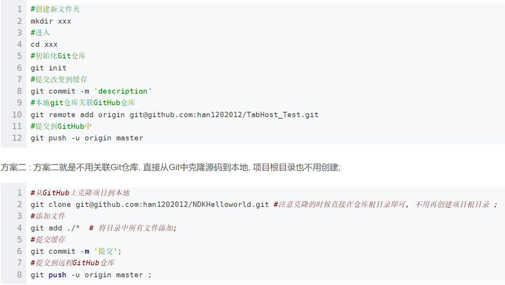

# Git

## 基本概念

- 克隆：如果是使用ssh克隆则建立远程连接；如果使用HTTPS克隆则只是拷贝一个本地副本

- fork：fork仓库后会添加在自己的仓库中，修改后可以进行推送并且请求PR。

## Git的基本原理

### 分布式存储

- 每一次提交推送都会有一个版本号（commit号），存储的方式git是存整个文件，svn保存的是文件差异

- 使用hash进行查找，根据版本号找到对应的代码文件

### 数据结构

- commit节点、tree，blob
  
  - 每一次commit会生成一个commit节点，commit节点会存着指向上个commit的指针，也会存着本次提交的所有内容，包括tree和blob
  
  - tree是这次提交下的所有文件结构
  
  - blob是文件内容，内容相同的文件只会保存一个blob，tree中的每个对象会指向blob文件，如果blob文件内容是，如果是相同的文件，则tree中会有不同的对象指向相同的blob。
  
  - 新建分支相当于创建了一个指针，指向当前的commit，如果进行了新的commit，则会指向新的commit
  
  - 合并分支，如果没有冲突，则把最新的分支的commit作为两个分支的最新commit，即修改了落后的分支的head指向最新的commit。
    
    如果出现冲突，则会解决冲突，此时会新建一个commit并将合并后的分支指向最新的commit

## Git 的基本操作

- 参考网站：[多人协作 - 廖雪峰的官方网站](https://www.liaoxuefeng.com/wiki/896043488029600/900375748016320)

- 常用的操作
  
  显示分支信息：git branch
  
  显示远程仓库信息（显示了可以fetch（全部分支）、pull（拉取一个分支）和push的远程地址)：git remote -v
  
  克隆代码到本地：git
  clone +代码地址
  
  在远程仓库创建功能分支并建立联系：git push --set-upstream origin opencv
  
  切换分支：git
  checkout +分支名
  
  上传代码：
  
  git add + 暂存文件（git add .是暂存所有文件）
  
  纳入仓库管理：git commit  -m “描述”
  
  推送到远程仓库：git push origin dev
  
  请求合并到合作仓库：github 上pull request
  
  改完代码后可以push到远程，然后可以到github上提出PR，同步管理者仓库要到github上面同意并合并到远程仓库中。

- 开发新功能
  
  开一个新分支，本地和远程都开，在本地拉取主分支代码，修改完毕后推送到功能分支的远程，最后在github上进行PR

- 一个简单的仓库创建过程
  
  - 方法一：直接在github上新建仓库，然后直接克隆，并进行初次提交
  
  - 方法 二：
    
    - 本地创建文件夹
    
    - 初始化：`git init`
    
    - 添加远程连接`git remote add +  github仓库地址`
    
    - 拉取数据：`git pull`
  
  
  
  

## Lazygit

> tip: 后续使用到可以快速查看笔记中的视频 
> 
> D:\workspace\git\Note\git笔记\temp

### 基本操作

- 简单的操作是看终端下面即可

- 在对应分区打出：？可以查看有哪些命令可以操作

- **在查看文件时回车选中**

- 在file区a可以将所有文件进行stage

- 在file区使用空格进行对某个文件进行stage

- 在某个已更改的文件中a是选中所有，加上空格可以进行全部stage

- 在unstage或者stage文件中使用v可以进行块选择

- 在文件区a是将所有更改文件进行stage

- 使用Tab在stage和unstage面板之间切换

- 拉取：在文件区使用`p`
  
  推送：在文件区使用`P`

### 分支管理（功能分支）

### 提交管理（版本回退，可撤销）

### 解决冲突（融合或者推送）

- 融合时的冲突直接在本地解决，推送的冲突需要拉取远程然后在本地解决冲突后再推送

### 小技巧：

查看某个文件涉及到的所有提交

对比两次提交
