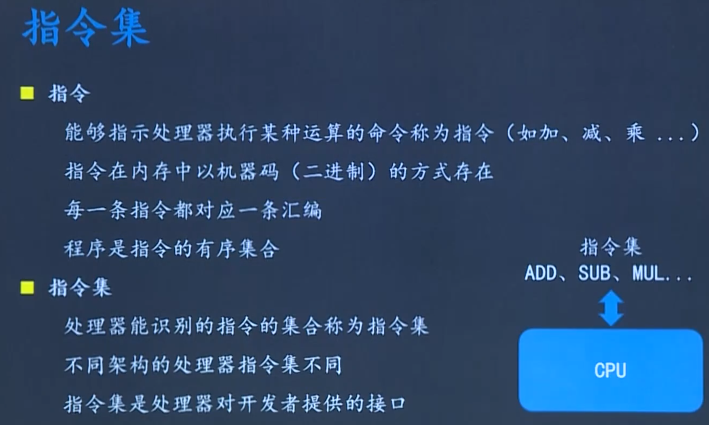
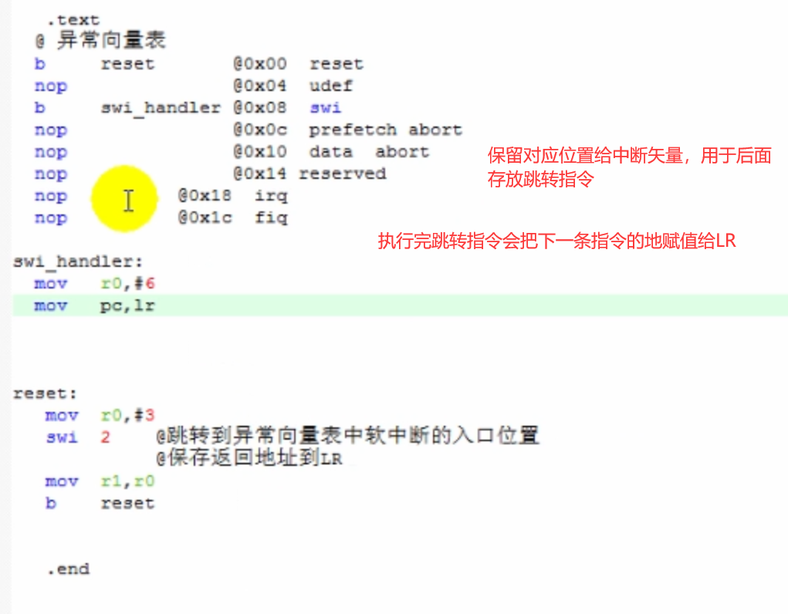

# 嵌入式系统

## 1、概述

### 1、嵌入式系统的定义

学习的方法：博、专、实践。

---

## 2、嵌入式操作系统

### 1、特点

### 2、RTOS

### 3、uc/OS-II

### 4、FreeRTOS

###5、嵌入式Linux

- linux层次结构（一切皆文件）

## 3、ARM处理器构架

###1、预备知识

- CPU的一些知识

  ==一般较好的处理器现在都有DMA总线，直接数据访问，从存储器直接传输到外设不经过CPU==

  CPU所能访问的数据称为地址空间。

###2、ARM处理器概述

####1、由来

####2、产品系列

####3、精简指令集和片上系统概念

####4、指令集

 

**编译原理：**所以在不同的处理器上运行需要安装不同的编译器

### 3、ARM存储模型

#### 1、数据类型和存储要求

字节对齐是可以提高CPU的处理效率，不需要去进行识别和裁剪

int a=0x12345678  ，其中12为高位（注意大小端对齐是对单个数据表示而言，像到了数组是不用考虑的，但是数组中的元素在内存中的存储需要考虑，其实就是按字节解读数据的顺序）

==因为取址是按4个字节去取的，所以最低2个bit一定是0，当在写程序pc的最低2个bit非0时，会被强制转为0（向下取4的整数倍的地址）。

 ### 4、ARM的八种工作模式

### 5、补充c/c++内存分区

## 4、ARM开发环境搭建

#### 1、教程

# ARM开发学习

## 1、工作模式和寄存器框图

## 2、CPSR寄存器

## 3、ARM指令

###1、搬移指令

----------------

# 基于4412学习linux和ARM

## 1、ARM学习

### 1、开发学习的框架

- Linux系统的搭建过程

  应用、内核、硬件

  

- 芯片性能与用途相对于，降低成本。

- 框架学习方法：

### 2、ARM指令

机器码为32位，所以涉及到一个操作数为立即数如果过大时，需要使用伪指令ldr进行赋值

1. 搬移指令：mov，mrs，msr

   

2. 条件执行：一个cmp可供下面多条条件执行使用

- 状态寄存器高四位用于条件判断

3. 逻辑指令：

   

4. 算术指令：

   

5. 跳转指令：

   

   在函数结束时写一个标号fun_end:MOV PC,LR（==当嵌套调用函数时，需要使用一个寄存器记录返回的地址值==）

   ==tips:编写汇编可以先用c语言实现，再转化为汇编进行实现==

6. load和store指令：

   

7. 前索引和后索引：

   

   8. GNU汇编伪指令（程序段）：

      

   9. 批量操作指令

      

   10. 堆栈操作指令：

       

       首先是需要保存中断函数跳转地址LR，将其压栈，方便后续mov lr ，pc跳出中断

       其次是^是因为进入中断模式会改变，需要保存原来的模式转态，在中断结束后恢复原来的模式

       总的来说进入中断保护现场就是保护寄存器中的值，需要保护的寄存器有R0-R12，LR，cpsr

### 3、异常处理

#### 1、定义：处理突发事件的机制

#### 2、异常种类：

#### 3、中断异常

- 异常处理过程：CPU 扫描，检测到有触发信号（电平触发和边沿触发），置位中断标志位（防止中断丢失），从中断矢量表（启动文件中定义的）找到进入中断函数的入口，中断控制器进行映射，进栈的保护现场，中断函数处理（清除中断标志），中断返回（包括出栈 恢复现场）

- 最简单的软中断程序的实现：

  

  

    以下根据软中断号的不同执行不同分支的内容：

  

  在swi_handler中获取软中断号存于r0，用sub r0，lr，#4进行获取本身b swi_handler这个指令的地址存于r0，间址出该指令的内容，再获取软中断编号

  ​

  ==b跳转指令只能上下跳转32M空间，因为一条 机器指令占的空间有限，使用类似立即数的方法进行赋值给pc即可，但是得定义swi_handler的字存储位置（如下图）==，ldr实现由原本立即数直接存于指令转变为地址存于指令，突破存储位数的限制

  

#### 4、开发环境的搭建（裸机与交叉编译）

==裸机开发还是借助stm32进行学习，使用到可以上linux系统的使用在系统上进行文件操作来对外设进行驱动控制，而且stm32还有成熟的库函数，但其实linux底层的驱动也是在直接与硬件打交道==

- 本地编译与交叉编译

  

  采用交叉编译的原因是运行linux系统的muc资源受限，借助x86的性能在Ubuntu下进行编译后，下载到muc中

- 交叉编译环境的搭建

  

  在vscode下进行代码编写，在keil中进行仿真，在linux下使用arm的编译环境进行编译生成文件，使用rs232串口在windows下使用超级终端烧录到板子上，在uboot模式下输入==loadb +下载在板子flash的哪个地址==，然后选择传入二进制文件，即可在flash上面下载，输入go就可以运行了（==还可以参考讯为的裸机开发文档==）

- 一般的开发流程：先通过原理图找到要控制的外设对应的CPU管脚，去芯片手册查看对应的特殊功能寄存器的位描述，写程序修改寄存器的值实现对应的功能控制。（关键是看懂原理图和芯片手册，多使用搜索功能）

- keil编译调试环境的搭建：新建工程并选择芯片，将keil关联到ARM的交叉编译工具链，可以到下面网站进行下载并安装[arm-none-linux-gnueabi-gcc下载 - 代码天地 (codetd.com)](https://www.codetd.com/article/885380)

  **流程如下**：

- Ubuntu上安装arm-gcc：apt-get install gcc-arm-linux-gnueabihf

  然后就可以在Ubuntu上使用arm-gcc对程序进行编译然后可以在ARM平台上运行

- 为了方便后续在Ubuntu系统上编译程序后传给开发板，安装NFS，可以实现文件夹共享

  

  ​

  

  ​

