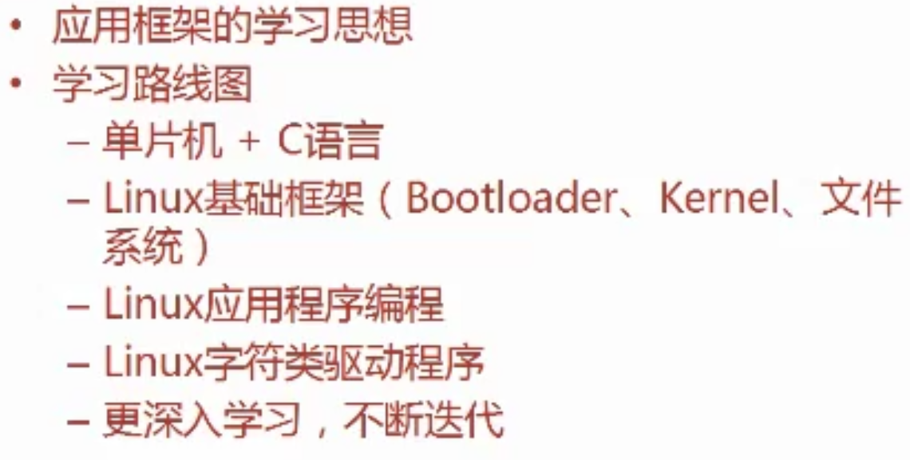

# STM32

## 0、开发模式：

vscode结合keil5（vscode编写代码，keil进行调试）

并利用STM32Cube生成配置文件

附：

STM32Cube下载教程：

https://blog.csdn.net/Brendon_Tan/article/details/107685563

STM32Cube 生态系统之网站、视频、文档及教程汇总

https://blog.csdn.net/Brendon_Tan/article/details/107722164


### 1、bootloader

- 选择启动程序从哪里开始

### 2、使用IAP进行固件更新

- 将IAP程序使用ICP或ISP进行烧写进Flash

  IAP程序实现：

  1. 通信方式的选择，通信协议，可以分包进行传输与写入，可以实现上位机进行（以太网、wifi网络传输、蓝牙、串口、can）
  2. flash擦写，主要为解锁，擦除页，写入页，上锁
  3. App跳转，实现从IAP程序跳转到App程序，需要重新指定中断向量表（flash的起始位置），并且做好启动程序所做的事情后开始执行。

### 3、MDK编译

- 几个段（code、ro-data、rw-data、zi-data）（区分初值为0或者非0是因为静态和动态对数据的要求不一样，静态时如果初值为0，就不需要存在flash浪费空间，在后面用到时再申请存到RAM中）

  程序静态存储时：flash中存着code、ro-data、rw-data

  动态时：flash中存着code、ro-data

- 编译工具链

  

  使用fromelf.exe可以在链接完成后生成.bin文件

  ```
  fromelf.exe --bin --output USART.bin .\USART.axf
  ```

  使用fromelf.exe生成反汇编（-c命令disassemble）

  ```
  fromelf.exe -c --output USART.list .\USART.axf
  ```

- 输出的中间文件都在output文件夹下，工程的一些配置会存在project下的.uvprojx文件中

- elf文件包括可重定位文件（.o文件）、可执行文件（不可重定位）、共享目标文件（也是可以重新定位）

  .o文件链接生成可执行文件

- .axf文件里面存的是整个程序的实际存储地址，各种类型的数据存储的位置和占用空间大小

- .htm可以查看静态栈空间的大小，一般分配的栈空间要是其大小的两倍


- map文件

从map文件可以看出程序链接了什么，用到了多少存储空间（flash和RAM），移除了工程哪些没用到的东西

==tip：关于flash从0x0800000开始的原因，地址映射，将flash映射到0x0（其实可以理解为互相映射），复位后从0x0开始运行没问题，更改向量表位置也没关系，前提是设置好中断向量表的起始地址，映射关系没变，变的是CPU找中断向量表的位置==


- 分散加载文件.sct，实现内存自己分配，可以为程序和变量分配空间，后续编译器会自己链接

  指定使用的RAM区和指定某个节区存储在哪个段

  

  上面指定数组EXtestGrup[1024]分配到EXRAM节区，在.sct文件中可以进行节区存储位置设置

  也可以使用____attribute____at(地址)

  如果使用了外部SRAM的话初始化应该放在__main之前，

  如果在初始化SRAM没有用到局部变量而是采用操作寄存器的方式进行的话就可以把栈空间放在外部SRAM。

  默认优先分配到大一点的空间，关于时钟stm32f103rcc.o最好也是分配在内部SRAM中

- 读写内部flash

  内部flash如果还有剩余空间，可以使用此空间进行掉点的数据保护，下次上电还能读取之前的运行数据

  

  flash读写结合野火的ppt和STM32F10xxx闪存编程参考手册.pdf进行操作。

  - 读：解锁、写寄存器、读取、上锁

  - 写：解锁、写寄存器、擦除（赋值基地址）、写寄存器（PG位）、写、写寄存器（清楚刚刚对寄存器的操作）、上锁（写入是一次只能写入16位，且为小端对齐）

    在知道flash中怎么存代码，也知道如何对flash进行写入，便可以实现程序对flash进行写入实现APP

  - 读写保护：对代码进行保护，防止泄露

- 在RAM调试

  

  ​					5记得修改向量表基地址


### 4、电源管理


- 四种模式：

  - 睡眠：除了内核时钟，片上外设和CM3的外设正常运行
  - 停止：外设正常工作  ，所有外设停止工作，但保留了之前的运行状态，唤醒后可继续执行
  - 待机：程序实现关电源，唤醒后相当于复位

  

- PVD掉电保护

  选择阈值，需要配置PVD中断，当电压低于阈值后，触发中断，在中断中进行紧急操作。


--------------------


# RTOS学习

## 1、项目搭建

参考野火---《FreeRTOS 内核实现与应用开发实战—基于STM32》第四章

1. 新建工程，选择芯片（启动文件等）

   

2. 新建文件组，工程目录结构

   

3. 添加头文件路径，并修改仿真的时钟


## 2、裸机程序

### 1、轮询系统

轮询系统即是在裸机编程的时候，先初始化好相关的硬件，然后让主程序在一个死循环里面不断循环，顺序地做各种事情


### 2、前后台系统

前后台系统是在轮询系统的基础上加入了中断。外部事件的响应在中断里面完成，事件的处理还是回到轮询系统中完成，中断在这里我们称为前台，main 函数里面的无限循环我们称为后台，==借助中断进行选择执行对应的代码==。但是如果处理时间较短，可以在中断内处理，但是过长的处理需要到后台进行处理。相比轮询系统，前后台系统确保了事件不会丢失，再加上中断具有可嵌套的功能，这可以大大的提高程序的实时响应能力。

**通常在中断子程序中是不调用延时子程序的，这样会增加中断处理时间，如果有其它低级中断了，就会延误响应中断了。所以，中断子程序中不要写调用延时子程序，中断子程序也不要写得过长，处理过多的任务，要尽快处理后及时返回，如果中断一次有很多任务需要执行完全，可以在中断子程序中设置一个标志位，在主程序中查这个标志位，当标志为1时，就在主程序中完成这些任务，这样就不会影响其它中断源的中断，也不会使中断产生混乱。**


## 3、多任务系统

**相比前后台系统，多任务系统的事件响应也是在中断中完成的，但是事件的处理是在任务中完成的。在多任务系统中，任务跟中断一样，也具有优先级，优先级高的任务会被优先执行。当一个紧急的事件在中断被标记之后，如果事件对应的任务的优先级足够高，就会立马得到响应。相比前后台系统，多任务系统的实时性又被提高了。**


## 4、裸机系统和多任务系统的对比


## 5、数据结构列表与列表项的实现（双向链表）

- freeRTOS文件中的list.c和list.h实现

## 6、任务的定义与切换


- 创建任务

  tcb：任务控制块，将任务控制块挂载在就绪列表中，由系统完成对任务的调度

  （核心函数是vListInsert，将任务控制块的列表项插入就绪列表中）

- 实现就绪列表

  实际就是一个初始化一个有序的数组可以存储任务节点的列表，可以将任务节点插入（vListInsert）

- 实现调度器

  tip：定义变量加上volatile时，就是该变量会以编译器无法预知的方式发生变化，请编译器不要做优化（所有的编译器的优化均假设编译器知道变量的变化规律）

- 任务切换

  显示手动调用了taskYIELD()，进行任务切换，实则也是触发PendSV，产生上下文切换。

- ==任务开始==

  

  

  ​

  ​

## 7、临界段保护

- 临界段就是一段在执行的时候不能被中断的代码段。在 FreeRTOS 里面，这个临界段最常出现的就是对全局变量的操作。临界段在系统调度（PendSV）和外部中断时会被打断，所以最后FreeRTOS 对临界段的保护最终还是回到对中断的开和关的控制，控制好中断的开与关实现对临界段的保护，让它能执行完。

- 

  


## 8、空闲任务

- 在CPU没有被任何其他任务占用时会执行空闲任务，实现一些内存管理和用户钩子函数

## 9、阻塞延时

- 将任务在延时时不去进行执行，使用系统systick进行中断为其计时，延时到时间再切换回来执行该任务，大大提高了对CPU的性能的利用，在中断中都会进行任务延时时间的检查，然后调用任务切换函数，进行任务块的切换

## 9、支持优先级

- 在FreeRTOS中，序号越低，优先级越低，比如空闲任务的优先级是0，最低，

- 在任务块中增加了表示任务优先级变量 uxPriority，记录任务的优先级；

- 增加了一个任务切换时选择最高优先级任务的任务块赋给当前任务块；

- 进而就需要实现找到最高优先级任务的方法，有通用的遍历方法和优化后借助CM3的导零指令获取第一个为1的位置，进而知道最高优先级为多少。，将该任务置为当前任务即可

  ==question==：同一优先级可以挂载多个任务块到就绪列表中吗，应该得实现挂起时移除才能实现这样类似的功能

  ==answer==：这就是时间片的问题，在处理链表的数据结构是已经考虑到这一点，留有一个链表节点索引指针，可以用它遍历同一优先级下链表中的任务，顺序执行，每个tick切换一次。


## 10、任务延时列表实现

- 使用两个列表（考虑了计时变量溢出导致时间戳重新从零开始的问题）对正在延时的任务进行记录，且插入是按需要延时时间的长度进行排序
- 在每次systick中断中的xTaskIncrementTick() 函 数 中判断是否需要切换任务（在该中断中有两种情况需要切换任务，**1**是有高优先级的任务延时结束；**2**是同一优先级有多个任务就绪，需要顺序切换去执行，时间片问题）

## 11、支持时间片

- 本质就是用 listGET_OWNER_OF_NEXT_ENTRY( pxTCB, pxList )这个宏函数实现的在同一优先级级下的链表进行遍历切换任务，也是借助了链表中的一个链表当前索引指针实现对当前任务进行选择，对任务进行切换。

- FreeRTOS的时间片其实就是任务的调度实现任务均可运行，都是等长的一个tick

  tips:在RT-Thread和uC/OS中可以设置时间片的大小，即每个任务运行多少个tick。


==流程==

1. 两种情况触发切换任务：1、任务加入延时列表；2进入systick中断（有高优先级加入就绪列表或者同一优先级下有多个任务在执行）

   ​

tips：

1. 通过在切换任务条件成立时返回值在systick中进行判断，进而才切换任务（节省不必要的任务原地切换）
2. 就绪列表中是按优先级存到对应序号的链表下 ，延时列表是按延时时间从短到长排序，节点中的xStateListItem成员用于计时，同时插入也是按这个进行链表的排序。
3. 任务切换的过程都是通过汇编实现的，在中断中进行任务切换前应该进行临界段保护，防止被打断。

## FreeRTOS移植

1. 首先是新建固件库项目
2. 下载源码，在项目中新建存放FreeRTOS文件的项目文件，将源码中的source文件夹下的.c文件复制到FreeRTOS/src中，将include文件和RVDS中对应的芯片文件夹添加到头文件路径中，最后在例程demo文件夹下找到对应的例程复制配置文件FreeRTOSConfig.h到user文件夹下。
3. 在配置文件中修改配置，设置对应的宏即可（开关某个功能，设置一些实现方法和堆栈大小和优先级等）
4. 并在systick中断函数写上对void xPortSysTickHandler( void )函数的调用 ，记得加上需要的头文件，与配置和任务相关的==#include "FreeRTOS.h"//FreeRTOS使用#include "task.h"==


## FreeRTOS应用

### 1、静态创建任务

定义好任务创建需要的变量和实现相应的函数：

1. 堆栈变量

2. 任务控制块

3. 空闲任务堆栈、定时器任务堆栈

   

   ​

4. 实现静态内存分配的函数（只是简单的赋值）

   

   

5. 在创建任务的任务体中实现对其他任务的调度，调度完后将该任务删除，在进行其他任务创建时需要进行临界段保护

### 2、动态任务创建

- 不用自己分配内存比较简单，但需要改配置文件为动态内存分配

- 同静态一样需要先创建任务句柄，用于存创建成功后返回的任务控制块（几个任务几个句柄）

- 配置完后，只需要调用下面创建函数进行任务创建，也不用配置那些定时器任务的信息等

- ```
  - BaseType_t xTaskCreate(TaskFunction_t pxTaskCode,
    							const char * const pcName,
    							const uint16_t usStackDepth,
    							void * const pvParameters,
    							UBaseType_t uxPriority,
    							TaskHandle_t * const pxCreatedTask )
  ```

### 3、FreeRTOS启动流程

- 大致有两种启动流程：一是将所有任务都创建好后，启动调度器进行调度；二是创建一个AppTaskCreate任务并马上开启调度器，在该任务中进行后续所有任务的创建，最后创建完后将AppTaskCreate任务删除。

- 一般用第二种比较稳健，因为一创建完AppTaskCreate就开启调度器进行任务调度，再在AppTaskCreate任务中一步一步将任务创建完毕，直到AppTaskCreate任务执行到最后再把自己给删除了。

  

- ==**流程**：上电->复位->PC指针下一时刻指向Reset_Handler入口，调用Reset_Handler->调用____main初始化系统的堆和栈，最后调用 C 中 的 main 函数，进行硬件初始化，FreeRTOS系统初始化（初始化化堆栈，定义一些静态变量等），创建任务按上面流程，每创建任务如果是动态创建会进行动态内存分配==

### 4、任务管理

- 任务的状态由就绪、阻塞、挂起、结束

- 主要操作是添加到某个列表，从某个列表中删除，理解什么时候状态进行切换，切换的时候需要做什么

  掌握操作任务的函数（tasks.c）。

- 阻塞延时和绝对延时：阻塞延时就是任务运行没有周期，绝对延时就是一个任务在多少时间内必须运行一次，有一个运行周期vTaskIncreasement，只需要设定好上一次唤醒的时间（在运行前获取系统运行时间即可）和任务运行的周期即可，实现非常精准的计时

- 中断：在FreeRTOS中有一套中断中调用的API，中断必须要注意上下文环境，不能进行挂起当前任务的操作，不允许调用会阻塞的API函数接口

  ==一般中断函数都是快进快出，进行一些标志位的改变，进而影响任务主体的运行，在中断中使用主栈指针MSP，在任务中使用任务栈指针PSP；而且必须注意中断的频率==

- 任务中不允许出现没有阻塞机制的死循环，因为出现了之后，优先级低于该任务的任务将永远无法运行

- 空闲任务中可以使用钩子函数，在空闲任务中插入一个函数，但注意不能调用带阻塞/死循环和将空闲任务挂起的API，因为空闲任务有其他功能需要运行，空闲任务是唯一一个不能进行阻塞的任务，因为系统一直都要在运行。

- 任务运行的时间处理：考虑任务周期和任务运行时间（当然任务周期一般也会远远大于运行时间）的关系，运行时间短，周期长的任务一般优先级可以设置得高一点（因为有个任务1运行时间>任务2任务周期，这样的打断会导致任务2周期错乱），当然，越重要的任务优先级理应设置得更高。

==TIP==：最关键的就是掌握对任务操作的API，和任务切换的的机制

### 5、消息队列

#### 1、消息队列的基本理解和使用

- 用来通讯，实现任务间的数据通讯

- 队列： 
  - 数据采用引用传递，需要等待消息被处理后才能将其改变 ，以为是同个东西，优点是节省空间
  - 采用数据拷贝的话不会因为发送方将存储的数据改变而改变，但是占用空间，浪费时间，但其实FreeRTOS也可以使用指针传递，只要将数据的地址作为消息传递即可

- 出队阻塞：
  - 一种是看一眼有没有数据；
  - 一种是阻塞等待一段时间，还是没有数据报出信息然后去执行下面的代码；
  - 一种是一直等到有数据

- 出队阻塞：与入队阻塞类似，变成看数据有没有满而已

- 创建队列（队列创建函数）：队列结构体，位置和存储空间（分为静态创建和动态创建）

- 入队操作（入队函数）：三个参数为 队列句柄，数据地址，阻塞时间  

  如果在中断中数据入队后有任务解锁了，需要在出中断前进行一次任务切换，因为有任务在读消息阻塞，可能获取到数据且优先级更高。紧急的消息 从队首写入

- 出队操作（出队函数）：从指定队列中读取数据到任务定义的缓冲区，如果在阻塞读取消息的任务读取到消息进入就绪态，其优先级可能高于当前任务，读取成功后需要进行一次任务切换，如果是在中断中读取，需要在读取到后出中断前进行一次任务切换

tip：入队出队其实就是数据的两次拷贝，数据拷贝也好地址拷贝也好，当数据量大的时候可以使用指针进行数据传递。

- 删除队列：将消息队列的句柄传入即可将消息队列删除

  ==**个人理解与体会：**发送信号一般和接收信号是双向的，如果发送信号后发不进去（满了），设置了阻塞，就会将该消息加载到发送消息阻塞列表中，等待该队列实现了出队（在消息出队的函数中会进行查看等待的队列是否为空，不为空会通知其可以接触阻塞状态将数据发送进来）后通知 它可以将数据存进队列（当然设置了阻塞时间，一旦超出阻塞时间还没人通知，便会以阻塞溢出返回掉这个发送函数）==

- 消息队列的使用方法较为简单，只需掌握创建、发送、接受的函数应用即可（在理解了内部机制的情况下，如上面的高亮字所说）

#### 2、信号量

- 信号量的主要目的有两个：一个是共享资源的同步，另一个是任务的同步


- 二值信号量
  - 用于任务与任务之间的同步，我有动作后通知你动作
  - 中断与任务之间的同步（以前都是在中断中改变标志位，后续运行到对应任务的地方进行标志位的判断决定是否要执行，采用信号量的优点在于其有阻塞机制，有信号量阻塞等待列表，等待不到信号量是不会执行，以后信号量可以很快执行，不用轮询）
- 计数信号量
  - 用于事件计数和资源管理，用于统计还有多少个事件未处理
  - 运作的机制类似抢车位，运行所有任务对资源进行访问，资源都被占了后还有任务要获取会进入阻塞
- 创建信号量
  - 创建二值信号量（创建后得先进行一次信号释放）
  - 创建计数信号量（有多个信号资源可占用）
  - 创建互斥信号量（只允许一个任务占用，且不可以被打断，拥有优先级继承机制，在高优先级想获取一个低优先级任务正在占领的互斥信号时，高优先级会提高低优先级任务的优先级和自己一样高，防止自己进入阻塞后被中优先级的乘虚而入）
  - 创建递归互斥信号量（允许占有该信号的任务在任务中多次获取改信号，u.uxRecursiveCallCount用于计数获取了多少次，获取几次最后就得释放几次）


==tip：uxMessagesWaiting：用于表示现在队列中消息和信号量的个数，可供获取     uxLength：用于记录允许的存储长度，可以存几个信号量==

​	**关键是创建信号量，信号量的获取与释放**

### 6、事件

- 创建事件，只需创建一个事件句柄。

- 设置事件位（在设置完后会判断是否有等待该标志的时间在事件等待列表中，有就换到就绪中，并且函数最后设置成功会返回设置的位，可以通过与要设置的位进行按位与运算判断是否真的设置了该事件）

- 获取（等待）感兴趣的事件位（会从事件中判断需要获取的标志位是否置1，最后需要根据返回值与感兴趣的为进行按位与运算判断是否真的发生，获取到后可以选择是否清除）

- 使用流程：创建事件-》设置时间位（一般使用宏定义给设置对应位的数字起个有意义的名字）-》需要使用到该事件的任务在任务中获取该事件的对应位（宏定义）

  tip：在中断中设置事件位是通过软件定时器去调用对应的回调函数进行设置的，清除事件位也是一样的。


### 7、软件定时器

- 使用时需要将宏打开，使用软件定时器的方法和其他内核资源类似，但是它是可裁剪的。
- 使用方法：定义软件定时器句柄-》创建软件定时器（设定好重复与否和定时周期）-》启动软件定时器任务（启动后执行软件定时器任务，1获取下一个到期的定时器时间，2判断溢出切换列表，3读取定时器命令队列，处理相应命令，包括所有的处理，包括回调函数的调用）


### 8、任务通知

- 任务通知是隶属于任务控制块的，所以是只能由单个任务来接受信息，且信息没有发送阻塞

- 是一种更加简洁的通信机制，同时速度也更快，更节约资源，在一般情况可以替代事件和信号量

- 使用的函数：

  

- 使用任务通知可以代替消息（但一次只能传4字节的消息）、二值信号量（无法代替互斥信号量，因为有优先级继承）、计数信号量、事件组。使用方法比IPC（消息队列、信号量、事件）方便且快捷。

### 9、内存管理


## 直播课程

裸机，使用状态机进行程序拆分


程序的实质就是指令（flash和CPU）与数据（RAM）


- 入栈出栈顺序原因：一部分是硬件原因，另一部分是汇编指令原因


[(49条消息) ARM的规则ATPCS和AAPCS_猿猿_yzg的博客-CSDN博客_aapcs规则](https://blog.csdn.net/weixin_42135997/article/details/80575937)


产生中断会保存所有寄存器，有些是硬件保存，有些是程序保证保存，比如在切换任务时手动保存的r4-r11。（保护现场相当于保存所有寄存器）

会保存中断地址，方便返回到产生中断的地方，返回地址和函数入口地址（压在lr中）是两码事


RTOS本质：

1. 任务切换（旧任务现场保护，新任务的恢复）

2. 休眠和唤醒，根据状态决定是否运行（延时阻塞、等待消息通知等）

3. 实时，中断>任务

   ​	   任务之间也有优先级，同级时间片轮转

-----------------------------------


# 嵌入式系统

## 1、概述


### 1、嵌入式系统的定义


学习的方法：博、专、实践。

---

## 2、嵌入式操作系统

### 1、特点


### 2、RTOS


### 3、uc/OS-II


### 4、FreeRTOS


###5、嵌入式Linux


- linux层次结构（一切皆文件）


## 3、ARM处理器构架


###1、预备知识


- CPU的一些知识

  ==一般较好的处理器现在都有DMA总线，直接数据访问，从存储器直接传输到外设不经过CPU==

  CPU所能访问的数据称为地址空间。


###2、ARM处理器概述

####1、由来


####2、产品系列


####3、精简指令集和片上系统概念


####4、指令集

 


**编译原理：**所以在不同的处理器上运行需要安装不同的编译器


### 3、ARM存储模型

#### 1、数据类型和存储要求

字节对齐是可以提高CPU的处理效率，不需要去进行识别和裁剪


int a=0x12345678  ，其中12为高位（注意大小端对齐是对单个数据表示而言，像到了数组是不用考虑的，但是数组中的元素在内存中的存储需要考虑，其实就是按字节解读数据的顺序）


==因为取址是按4个字节去取的，所以最低2个bit一定是0，当在写程序pc的最低2个bit非0时，会被强制转为0（向下取4的整数倍的地址）。

 ### 4、ARM的八种工作模式


### 5、补充c/c++内存分区


## 4、ARM开发环境搭建

#### 1、教程


# ARM开发学习

## 1、工作模式和寄存器框图


## 2、CPSR寄存器


## 3、ARM指令

###1、搬移指令


----------------


# 基于4412学习linux和ARM

## 1、ARM学习

### 1、开发学习的框架

- Linux系统的搭建过程

  应用、内核、硬件

  

- 芯片性能与用途相对于，降低成本。

- 框架学习方法：


### 2、ARM指令


机器码为32位，所以涉及到一个操作数为立即数如果过大时，需要使用伪指令ldr进行赋值


1. 搬移指令：mov，mrs，msr

   


2. 条件执行：一个cmp可供下面多条条件执行使用

- 状态寄存器高四位用于条件判断


3. 逻辑指令：

   

4. 算术指令：

   

5. 跳转指令：

   

   在函数结束时写一个标号fun_end:MOV PC,LR（==当嵌套调用函数时，需要使用一个寄存器记录返回的地址值==）

   ==tips:编写汇编可以先用c语言实现，再转化为汇编进行实现==

6. load和store指令：

   

7. 前索引和后索引：

   

   8. GNU汇编伪指令（程序段）：

      

   9. 批量操作指令

      

   10. 堆栈操作指令：

       

       首先是需要保存中断函数跳转地址LR，将其压栈，方便后续mov lr ，pc跳出中断

       其次是^是因为进入中断模式会改变，需要保存原来的模式转态，在中断结束后恢复原来的模式

       总的来说进入中断保护现场就是保护寄存器中的值，需要保护的寄存器有R0-R12，LR，cpsr

### 3、异常处理

#### 1、定义：处理突发事件的机制

#### 2、异常种类：


#### 3、中断异常

- 异常处理过程：CPU 扫描，检测到有触发信号（电平触发和边沿触发），置位中断标志位（防止中断丢失），从中断矢量表（启动文件中定义的）找到进入中断函数的入口，中断控制器进行映射，进栈的保护现场，中断函数处理（清除中断标志），中断返回（包括出栈 恢复现场）

- 最简单的软中断程序的实现：

  

  

    以下根据软中断号的不同执行不同分支的内容：

  

  在swi_handler中获取软中断号存于r0，用sub r0，lr，#4进行获取本身b swi_handler这个指令的地址存于r0，间址出该指令的内容，再获取软中断编号

  ​

  ==b跳转指令只能上下跳转32M空间，因为一条 机器指令占的空间有限，使用类似立即数的方法进行赋值给pc即可，但是得定义swi_handler的字存储位置（如下图）==，ldr实现由原本立即数直接存于指令转变为地址存于指令，突破存储位数的限制

  

#### 4、开发环境的搭建（裸机与交叉编译）

==裸机开发还是借助stm32进行学习，使用到可以上linux系统的使用在系统上进行文件操作来对外设进行驱动控制，而且stm32还有成熟的库函数，但其实linux底层的驱动也是在直接与硬件打交道==

- 本地编译与交叉编译

  

  采用交叉编译的原因是运行linux系统的muc资源受限，借助x86的性能在Ubuntu下进行编译后，下载到muc中


- 交叉编译环境的搭建

  

  在vscode下进行代码编写，在keil中进行仿真，在linux下使用arm的编译环境进行编译生成文件，使用rs232串口在windows下使用超级终端烧录到板子上，在uboot模式下输入==loadb +下载在板子flash的哪个地址==，然后选择传入二进制文件，即可在flash上面下载，输入go就可以运行了（==还可以参考讯为的裸机开发文档==）

- 一般的开发流程：先通过原理图找到要控制的外设对应的CPU管脚，去芯片手册查看对应的特殊功能寄存器的位描述，写程序修改寄存器的值实现对应的功能控制。（关键是看懂原理图和芯片手册，多使用搜索功能）

- keil编译调试环境的搭建：新建工程并选择芯片，将keil关联到ARM的交叉编译工具链，可以到下面网站进行下载并安装[arm-none-linux-gnueabi-gcc下载 - 代码天地 (codetd.com)](https://www.codetd.com/article/885380)

  **流程如下**：

- Ubuntu上安装arm-gcc：apt-get install gcc-arm-linux-gnueabihf

  然后就可以在Ubuntu上使用arm-gcc对程序进行编译然后可以在ARM平台上运行

- 为了方便后续在Ubuntu系统上编译程序后传给开发板，安装NFS，可以实现文件夹共享

  

  ​

  

  ​


## 2、烧写镜像

读卡器和USB接入虚拟机需要将虚拟机设置为1.1

### 1、制作可以烧写镜像的TF卡

- 进入开发板uboot模式下将TF卡进行格式分区
- 之后在Ubuntu下制作uboot  （参考制作QT镜像那一个章节）
- 最后在TF卡中新建文件夹sdupdate
- 将镜像文件拷贝到此文件夹下
- 最后将TF卡插入TF卡槽，在开发板uboot模式下执行命令进行烧写。


tip：在做好TF卡的情况下，可以使用TF卡启动（TF卡中已经做好了可以启动的Uboot，制作步骤是进行上面的前两个步骤），并在TF卡中的文件夹sdupdate下放置uboot镜像，并执行烧写命令，烧写完毕后可以将启动模式修改为EMMC启动

### 2、编译uboot和kernel

uboot：执行编译脚本 .sh文件 后续会生成uboot.bin文件可用于烧写。

kernel：将源码拷贝去Ubuntu中解压后，选择对应的配置文件在当前目录下拷贝为 .config

再执行zImage，等待编译完成，会在 ./arch/arm/boot/zImage下生成了镜像文件，如果还需要使用安卓wifi功能需要执行make modules，  后面只需要将内核镜像使用TF卡烧入到开发板即可（烧写方法在上面）。


--------------------------------

# C语言学习

## 1、输入输出函数

- fputs：成功，其中每个函数都将返回一个非负值。 发生错误时，**fputs** 将返回 **EOF**。

  puts：用于打印字符串，遇到空字符停止。

```c
int fputs(
   const char *str,
   FILE *stream
);
```

- fgets：限制获取的字符串长度，遇到"\0"（会丢弃后面的字符，缓冲区需要自己处理）或读了numchars-1时停止，并返回。

  如果读到文件尾或者超长，返回NULL。

```c
char *fgets(
   char *str,
   int numChars,
   FILE *stream
);
```

- gets_s:超出则会把buffer首地址赋值为\0(空字符)，并返回NULL

```c
char *gets_s(
   char *buffer,
   size_t sizeInCharacters
);
```

- putchar:打印单个字符
- getchar:从==缓冲区==读取单个字符


