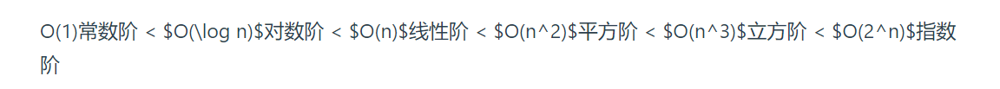
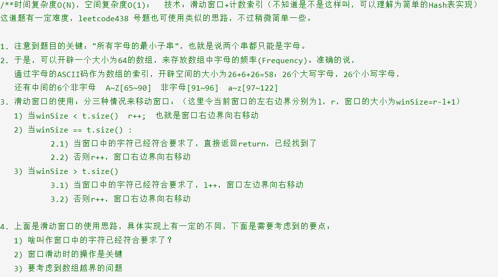
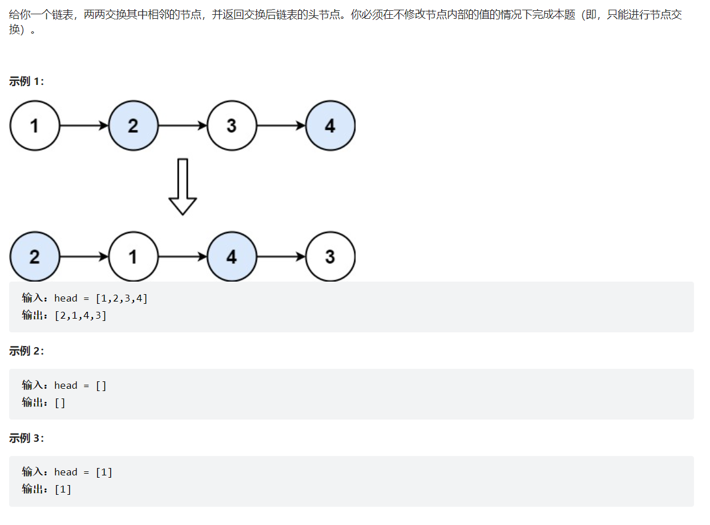
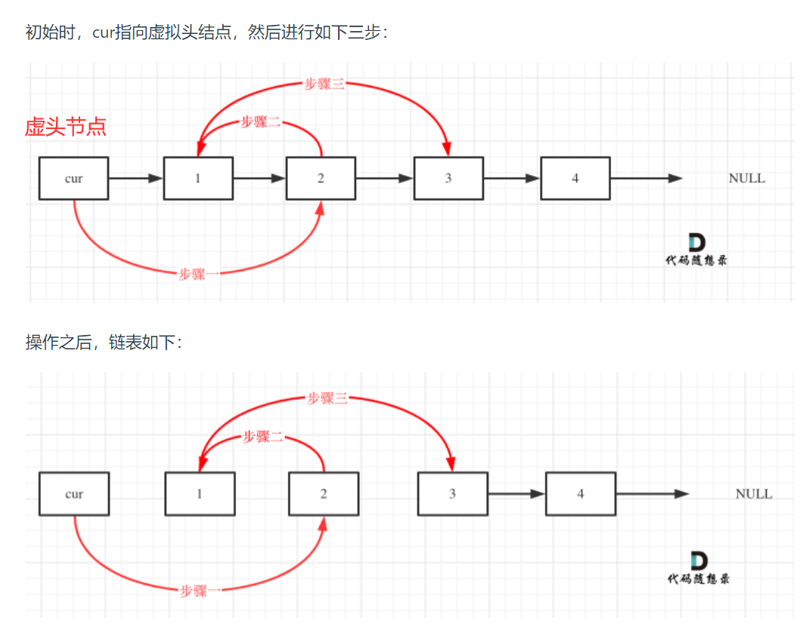
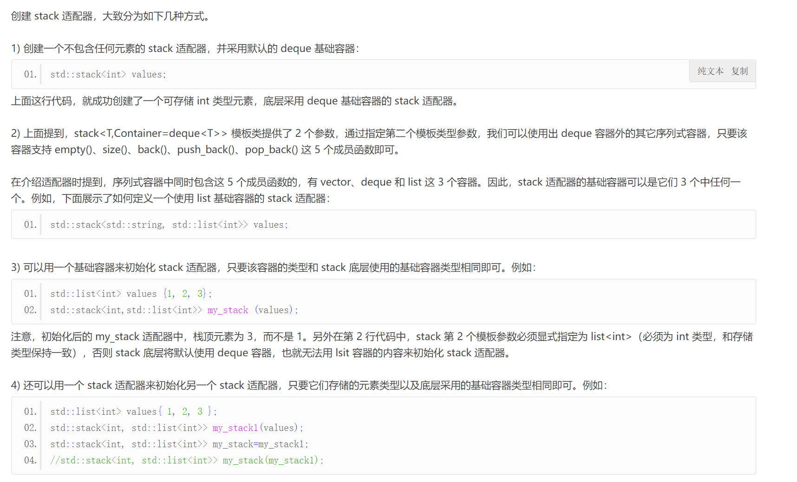
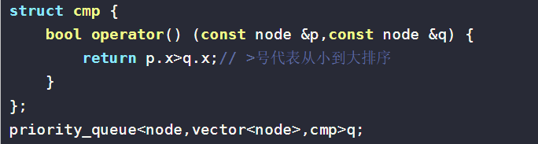
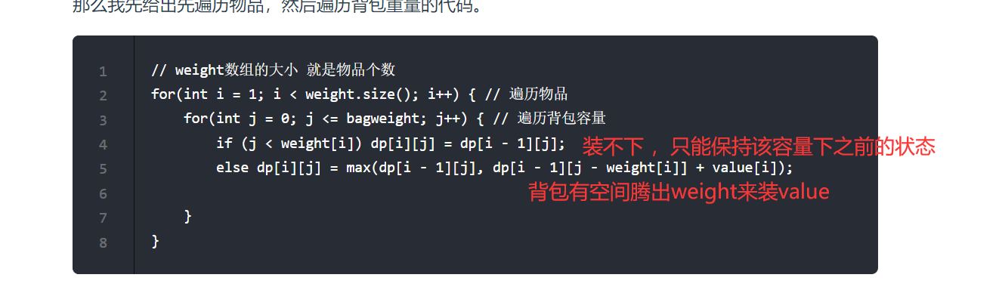
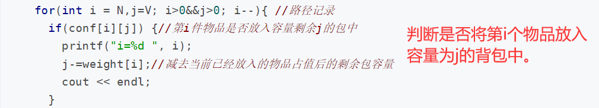
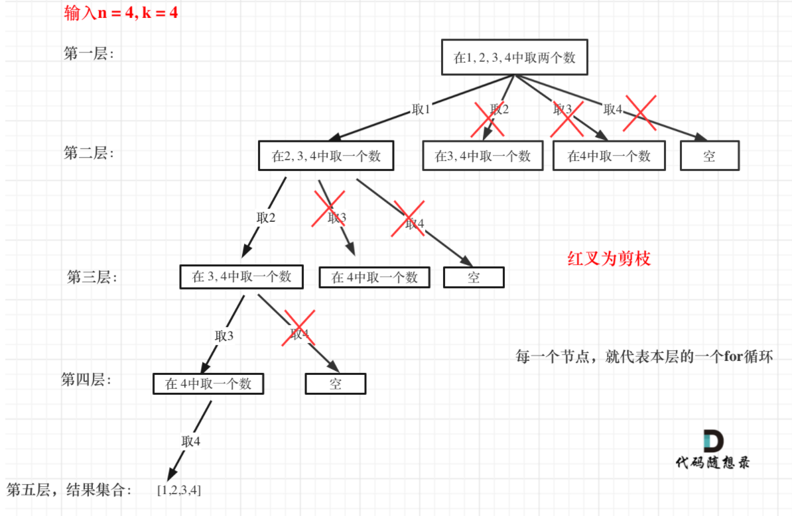

# 数据结构与算法

## 1、算法性能分析

### 1、O

- 算法在数据规模较大，即n—>无穷时，算法的时间复杂度。

  

- tip：对数复杂度底在数据规模大的时候没有影响，使用换底公式可以看出底只是乘个常数。

### 2、时间复杂度

- 随着数据规模的变大，执行时间关于规模数的函数

### 3、递归算法的时间复杂度

- 主要是看递归调用的次数和每次递归执行的操作次数

- 尽量减少递归的深度，比如求一个数的n次方，使用递归可以做到O(logn)（深度是少了，把函数作为返回值使压栈深度小了，时间复杂度降低，每次调用都是n/2，总共调用了log2n次）

  ```
  int function4(int x, int n) {
      if (n == 0) {
          return 1;
      }
      int t = function4(x, n / 2);// 这里相对于function3，是把这个递归操作抽取出来
      if (n % 2 == 1) {//递归中的处理逻辑，每层递归应该返回什么。
          return t * t * x;
      }
      return t * t;
  }
  ```

- 递归经典：斐波那契数列（每次保存两次运算的结果，将时间复杂度从2^n变为n）

  非递归，可以使用循环解决。其实就是使用动态规划。

  ```
  // 版本二
  int fibonacci(int first, int second, int n) {
      if (n <= 0) {
          return 0;
      }
      if (n < 3) {
          return 1;
      }
      else if (n == 3) {
          return first + second;
      }
      else {
          return fibonacci(second, first + second, n - 1);
      }
  }
  ```

  ==循环迭代和递归可以互相转换==

- 递归深度，影响了空间复杂度，递归越深，所需的栈空间越大。

## 2、数组

### 1、数组特点

- 存储空间连续
- 只能覆盖，不能删除

### 2、二分查找

需要注意的是边界条件，是选择下标是开还是闭区间，最后的终止条件将会不同。

1. 左右均闭的话，终止条件为while(begin<=end) begin=0   end=size-1
2. 左右均开，终止条件为while（end-begin>1）begin =-1 end =size ==可以用特殊情况，只有一个元素来判断边界,也就是最后一次可以进行和target比较的情况，下一次就为退出条件==
3. 左闭右开，终止条件为while(begin < end)      begin =0 end=size

#### 三种实现代码

```
// 版本一
class Solution {
public:
    int search(vector<int>& nums, int target) {
        int left = 0;
        int right = nums.size() - 1; // 定义target在左闭右闭的区间里，[left, right]
        while (left <= right) { // 当left==right，区间[left, right]依然有效，所以用 <=
            int middle = left + ((right - left) / 2);// 防止溢出 等同于(left + right)/2
            if (nums[middle] > target) {
                right = middle - 1; // target 在左区间，所以[left, middle - 1]
            } else if (nums[middle] < target) {
                left = middle + 1; // target 在右区间，所以[middle + 1, right]
            } else { // nums[middle] == target
                return middle; // 数组中找到目标值，直接返回下标
            }
        }
        // 未找到目标值
        return -1;
    }
};
```

```
// 左闭右开
class Solution {
public:
    int search(vector<int>& nums, int target) {
        int left = 0;
        int right = nums.size(); // 定义target在左闭右开的区间里，即：[left, right)
        while (left < right) { // 因为left == right的时候，在[left, right)是无效的空间，所以使用 <
            int middle = left + ((right - left) >> 1);
            if (nums[middle] > target) {
                right = middle; // target 在左区间，在[left, middle)中
            } else if (nums[middle] < target) {
                left = middle + 1; // target 在右区间，在[middle + 1, right)中
            } else { // nums[middle] == target
                return middle; // 数组中找到目标值，直接返回下标
            }
        }
        // 未找到目标值
        return -1;
    }
};
```

```
//左右均开
int binarySearch(int *arr, int arrSize, int target) {
    int l = -1, r = arrSize;         // (1)
    int mid;
    while(r - l > 1) {               // (2)
        mid = l + (r - l) / 2;       // (3)
        if( arr[mid] > target )   // (4)
            r = mid;                 // (5)
        else if(arr[mid] < target)
            l = mid;                 // (6)
    	else
    	{
            return mid;
    	}
    }
    return r;                        // (7)
}
```

### 3、移除元素

1. 暴力算法，遍历数组，发现要移除的元素，整个数组向前移动一位。（两层for循环  O(n^2)）

2. 双指针法：一个快指针每次循环都自增，当快指针找到目标值时，慢指针不动，快指针后移一个元素，直到不匹配时，配合慢指针进行覆盖，本质就是将符合的值跳过了。

   ```
   // 时间复杂度：O(n)
   // 空间复杂度：O(1)
   class Solution {
   public:
       int removeElement(vector<int>& nums, int val) {
           int slowIndex = 0;
           for (int fastIndex = 0; fastIndex < nums.size(); fastIndex++) {
               if (val != nums[fastIndex]) {
                   nums[slowIndex++] = nums[fastIndex];
               }
           }
           return slowIndex;
       }
   };
   ```

3. 不保留原本数组的顺序，可以使用相向双指针法，用右边不为val的值去覆盖左边为val的值，双方要通过条件互等，直到双方都找到才进行覆盖，最终左边一定指向了数组的末尾下个元素

   ```
   /**
   * 相向双指针方法，基于元素顺序可以改变的题目描述改变了元素相对位置，确保了移动最少元素
   * 时间复杂度：$O(n)$
   * 空间复杂度：$O(1)$
   */
   class Solution {
   public:
       int removeElement(vector<int>& nums, int val) {
           int leftIndex = 0;
           int rightIndex = nums.size() - 1;
           while (leftIndex <= rightIndex) {
               // 找左边等于val的元素
               while (leftIndex <= rightIndex && nums[leftIndex] != val){
                   ++leftIndex;
               }
               // 找右边不等于val的元素
               while (leftIndex <= rightIndex && nums[rightIndex] == val) {
                   -- rightIndex;
               }
               // 将右边不等于val的元素覆盖左边等于val的元素
               if (leftIndex < rightIndex) {
                   nums[leftIndex++] = nums[rightIndex--];
               }
           }
           return leftIndex;   // leftIndex一定指向了最终数组末尾下一个元素，也即最后数组元素个数
       }
   };
   ```

- 双向有序数组一般可以使用双指针

```
给你一个按 非递减顺序 排序的整数数组 nums，返回 每个数字的平方 组成的新数组，要求也按 非递减顺序 排序。
特殊点是：非递减，且有正负，平方后大小未定

示例 1： 输入：nums = [-4,-1,0,3,10] 输出：[0,1,9,16,100] 解释：平方后，数组变为 [16,1,0,9,100]，排序后，数组变为 [0,1,9,16,100]

示例 2： 输入：nums = [-7,-3,2,3,11] 输出：[4,9,9,49,121]

class Solution {
public:
    vector<int> sortedSquares(vector<int>& A) {
        int k = A.size() - 1;
        vector<int> result(A.size(), 0);
        for (int i = 0, j = A.size() - 1; i <= j;) { // 注意这里要i <= j，因为最后要处理两个元素
            if (A[i] * A[i] < A[j] * A[j])  {
                result[k--] = A[j] * A[j];
                j--;
            }
            else {
                result[k--] = A[i] * A[i];
                i++;
            }
        }
        return result;
    }
};
```

```
给定一个含有 n 个正整数的数组和一个正整数 s ，找出该数组中满足其和 ≥ s 的长度最小的 连续 子数组，并返回其长度。如果不存在符合条件的子数组，返回 0。

示例：

输入：s = 7, nums = [2,3,1,2,4,3] 输出：2 解释：子数组 [4,3] 是该条件下的长度最小的子数组。

//滑动窗口解法，借助双指针。
class Solution {
public:
    int minSubArrayLen(int s, vector<int>& nums) {
        int result = INT32_MAX;
        int sum = 0; // 滑动窗口数值之和
        int i = 0; // 滑动窗口起始位置
        int subLength = 0; // 滑动窗口的长度
        for (int j = 0; j < nums.size(); j++) {
            sum += nums[j];
            // 注意这里使用while，每次更新 i（起始位置），并不断比较子序列是否符合条件
            while (sum >= s) {
                subLength = (j - i + 1); // 取子序列的长度
                result = result < subLength ? result : subLength;
                sum -= nums[i++]; // 这里体现出滑动窗口的精髓之处，不断变更i（子序列的起始位置）
            }
        }
        // 如果result没有被赋值的话，就返回0，说明没有符合条件的子序列
        return （result == INT32_MAX） ? 0 : result;
    }
};
tips：一直往右滑，窗口内之和小或等于s时右指针往右滑，窗口内之和大左指针往右滑
```

```
给你一个字符串 s 、一个字符串 t 。返回 s 中涵盖 t 所有字符的最小子串。如果 s 中不存在涵盖 t 所有字符的子串，则返回空字符串 "" 。

注意：
对于 t 中重复字符，我们寻找的子字符串中该字符数量必须不少于 t 中该字符数量。
如果 s 中存在这样的子串，我们保证它是唯一的答案。
 
示例 1：
输入：s = "ADOBECODEBANC", t = "ABC"
输出："BANC"
示例 2：
输入：s = "a", t = "a"
输出："a"
示例 3:
输入: s = "a", t = "aa"
输出: ""
解释: t 中两个字符 'a' 均应包含在 s 的子串中，
因此没有符合条件的子字符串，返回空字符串。

//思路：滑动窗口
//首先是后指针遍历找子串，并做好记录为前指针的移动开路（此处也需要记录此时符合的子串中各字符的个数，方便后续判断是否是多余的）
//表示子串中的此字符找到,做个记录，后面移动前指针时可以参照，可以记录在一个与str同样大小的数组中
//在已经找到子串时基础上，前指针向后移动，如果判断到指向的位置是子串中的字符时，再判断是否是多余的
//如果是多余的就继续往下移动，如果不是多余的（符合条件的长度小于之前找到的长度时，长度将此时作为结果记录下来,或者不记录，直接使用迭代即可，发现长度长了就不更新就可以了），需要后指针继续往后移动找已经丢失的子串。

```



## 3、链表

### 1、链表的理论基础

1. 虚拟头和非虚拟头，当需要查找链表并删除相应的值时，需要考虑头的问题，可以自己添加一个虚拟头

```
class Solution {
public:
    ListNode* removeElements(ListNode* head, int val) {
        ListNode* dummyHead = new ListNode(0); // 设置一个虚拟头结点
        dummyHead->next = head; // 将虚拟头结点指向head，这样方面后面做删除操作
        ListNode* cur = dummyHead;
        while (cur->next != NULL) {
            if(cur->next->val == val) {
                ListNode* tmp = cur->next;
                cur->next = cur->next->next;
                delete tmp;
            } else {
                cur = cur->next;
            }
        }
        head = dummyHead->next;
        delete dummyHead;
        return head;
    }
};
```

2. 链表操作

   头插头删（重新指头），尾插尾删（记得赋空），中间插入中间删除（常规）

   ==在删除时需要建一个临时的链表进行存储将要删除的节点，因为后续需要进行内存释放，不使用临时变量存储会找不到地址释放==

- 反转链表:主要是中间过程对节点进行反指需要考虑先保存后续节点的地址，同时得保留中间节点的地址，不然后续要指回来就找不到了，所以需要保存两个临时地址（一个是之前的，一个是之后的）加一个当前地址

  ```
  /**
   * Definition for singly-linked list.
   * struct ListNode {
   *     int val;
   *     ListNode *next;
   *     ListNode() : val(0), next(nullptr) {}
   *     ListNode(int x) : val(x), next(nullptr) {}
   *     ListNode(int x, ListNode *next) : val(x), next(next) {}
   * };
   */
  class Solution {
  public:
      ListNode* reverseList(ListNode* head) {
          ListNode *tail = new ListNode(0,NULL);
          ListNode *pre;
          ListNode *temp;
          ListNode *cur = head;
          if(cur == NULL||cur->next ==NULL)
          {
              return head;
          }

          else{
              pre = cur->next;
              cur->next = tail;
          }
          while(pre->next != NULL)
          {
              temp = cur;
              cur = pre;
              pre = pre->next;
              cur->next = temp;
          }
          //收尾，将头重新指回去，并且尾巴赋空
          pre->next = cur;
          head->next = NULL;
          head = pre;
          //删除尾指针，并赋值为空
          delete tail; 
          return head;
      }
  };
  ```

- 熟悉链表交换操作






```
/**
 * Definition for singly-linked list.
 * struct ListNode {
 *     int val;
 *     ListNode *next;
 *     ListNode() : val(0), next(nullptr) {}
 *     ListNode(int x) : val(x), next(nullptr) {}
 *     ListNode(int x, ListNode *next) : val(x), next(next) {}
 * };
 */
class Solution {
public:
    ListNode* swapPairs(ListNode* head) {
        //添加虚拟头结点
        ListNode *dumhead = new ListNode(0);
        dumhead->next = head;
        //交换相邻节点
        ListNode *cur = dumhead;
        while(cur->next != nullptr && cur->next->next != nullptr)
        {
            ListNode *temp1 = cur->next;
            ListNode *temp2 = cur->next->next->next; 
            //此处需要细品，有不同的顺序，可以只借助cur来传递，也可以借助临时变量temp1来传递。
            //只要是有next改了指向就需要考虑是否保存临时变量。
            cur->next = temp1->next;
            temp1->next->next = temp1;
            temp1->next = temp2;

            cur = cur->next->next;
        }

        return dumhead->next;
    }
};
```

### 2、双指针

- 实现删除倒数第n个节点（只需遍历一遍）。（开始均在虚拟头指针，fast移动n+1，移动n+1是为了后面使slow移动

  size-（n+1），实现将slow移动到要删除的点的前一个节点，实现删除）

- 使用双指针判断链表是否有环，fast每次向前移动2，slow向前移动1，直到相遇，说明有环，找到环入口的索引是使用将slow置于起始的虚拟头结点，fast置于相遇的节点，记录遍历的步数直到相遇就是入口的索引。

## 4、哈希表

### 1、哈希理论理解与题目

- 使用哈希表可以用于使用一个映射函数，将搜索的范围通过哈希映射函数唯一映射到一个数组或者集合中，后面需要判断某个元素是否在其中，只需将元素传入哈希函数中，得到索引，判断此索引的值在哈希表中是否 是true。==当判断元素集合是否在时，可以加入计数功能，表现在哈希表中的值就不是单纯的0或者1，而是一个count==

  ```
  给定两个字符串 s 和 t ，编写一个函数来判断 t 是否是 s 的字母异位词。

  注意：若 s 和 t 中每个字符出现的次数都相同，则称 s 和 t 互为字母异位词。

  示例 1:
  输入: s = "anagram", t = "nagaram"
  输出: true
  示例 2:
  输入: s = "rat", t = "car"
  输出: false

  class Solution {
  public:
      bool isAnagram(string s, string t) {
          int array[26] = {0};
          int s_len = s.size();
          int t_len = t.size();
          if(s_len != t_len)
              return  false;
          //建hash表
          for(int i = 0;i < s_len;i++)
          {
              array[t[i]-'a']++;
          }
          for(int i = 0;i < s_len;i++)
          {
              if(array[(s[i]-'a')] == 0)
              {
                  return false;
              }
              else
              {
                  array[(s[i]-'a')]--;
              }
          }
          for(int i = 0;i < 26;i++)
          {
              if(array[i] == 0)
              {
                  continue;
              }
              else
              {
                  return false;
              }
          }
          return true;
      }
  };
  ```

- map：按键排序（排序按键，查找find也按键，返回对应的迭代器，找不到返回尾迭代器）

  **在遍历map的过程中把其中的键值对删除了**

- unordered_map：无序，就是很无规律

  键值对映射，便于创建hash映射表。

- multimap：可以插入相同key值的顺序（按key排列）映射表

- tip：==在数据量不大时，使用数组建立哈希表是一种更高效的方法。==

### sort和qsort

==**记得看sort和qsort使用**==


### 2、哈希总结


在[关于哈希表，你该了解这些！ (opens new window)](https://programmercarl.com/%E5%93%88%E5%B8%8C%E8%A1%A8%E7%90%86%E8%AE%BA%E5%9F%BA%E7%A1%80.html)中，我们介绍了哈希表的基础理论知识，不同于枯燥的讲解，这里介绍了都是对刷题有帮助的理论知识点。

**一般来说哈希表都是用来快速判断一个元素是否出现集合里**。

对于哈希表，要知道**哈希函数**和**哈希碰撞**在哈希表中的作用.

哈希函数是把传入的key映射到符号表的索引上。

哈希碰撞处理有多个key映射到相同索引上时的情景，处理碰撞的普遍方式是拉链法和线性探测法。

接下来是常见的三种哈希结构：

- 数组
- set（集合）
- map（映射）

在C++语言中，set 和 map 都分别提供了三种数据结构，每种数据结构的底层实现和用途都有所不同，在[关于哈希表，你该了解这些！ (opens new window)](https://programmercarl.com/%E5%93%88%E5%B8%8C%E8%A1%A8%E7%90%86%E8%AE%BA%E5%9F%BA%E7%A1%80.html)中我给出了详细分析，这一知识点很重要！

例如什么时候用std::set，什么时候用std::multiset，什么时候用std::unordered_set，都是很有考究的。

**只有对这些数据结构的底层实现很熟悉，才能灵活使用，否则很容易写出效率低下的程序**。

### 数组作为哈希表

一些应用场景就是为数组量身定做的。

在[242.有效的字母异位词 (opens new window)](https://programmercarl.com/0242.%E6%9C%89%E6%95%88%E7%9A%84%E5%AD%97%E6%AF%8D%E5%BC%82%E4%BD%8D%E8%AF%8D.html)中，我们提到了数组就是简单的哈希表，但是数组的大小是受限的！

这道题目包含小写字母，那么使用数组来做哈希最合适不过。

在[383.赎金信 (opens new window)](https://programmercarl.com/0383.%E8%B5%8E%E9%87%91%E4%BF%A1.html)中同样要求只有小写字母，那么就给我们浓浓的暗示，用数组！

本题和[242.有效的字母异位词 (opens new window)](https://programmercarl.com/0242.%E6%9C%89%E6%95%88%E7%9A%84%E5%AD%97%E6%AF%8D%E5%BC%82%E4%BD%8D%E8%AF%8D.html)很像，[242.有效的字母异位词 (opens new window)](https://programmercarl.com/0242.%E6%9C%89%E6%95%88%E7%9A%84%E5%AD%97%E6%AF%8D%E5%BC%82%E4%BD%8D%E8%AF%8D.html)是求 字符串a 和 字符串b 是否可以相互组成，在[383.赎金信 (opens new window)](https://programmercarl.com/0383.%E8%B5%8E%E9%87%91%E4%BF%A1.html)中是求字符串a能否组成字符串b，而不用管字符串b 能不能组成字符串a。

一些同学可能想，用数组干啥，都用map不就完事了。

**上面两道题目用map确实可以，但使用map的空间消耗要比数组大一些，因为map要维护红黑树或者符号表，而且还要做哈希函数的运算。所以数组更加简单直接有效！**

### set作为哈希表

在[349. 两个数组的交集 (opens new window)](https://programmercarl.com/0349.%E4%B8%A4%E4%B8%AA%E6%95%B0%E7%BB%84%E7%9A%84%E4%BA%A4%E9%9B%86.html)中我们给出了什么时候用数组就不行了，需要用set。

这道题目没有限制数值的大小，就无法使用数组来做哈希表了。

**主要因为如下两点：**

- 数组的大小是有限的，受到系统栈空间（不是数据结构的栈）的限制。
- 如果数组空间够大，但哈希值比较少、特别分散、跨度非常大，使用数组就造成空间的极大浪费。

所以此时一样的做映射的话，就可以使用set了。

关于set，C++ 给提供了如下三种可用的数据结构：（详情请看[关于哈希表，你该了解这些！ (opens new window)](https://programmercarl.com/%E5%93%88%E5%B8%8C%E8%A1%A8%E7%90%86%E8%AE%BA%E5%9F%BA%E7%A1%80.html)）

- std::set
- std::multiset
- std::unordered_set

std::set和std::multiset底层实现都是红黑树，std::unordered_set的底层实现是哈希， 使用unordered_set 读写效率是最高的，本题并不需要对数据进行排序，而且还不要让数据重复，所以选择unordered_set。

在[202.快乐数 (opens new window)](https://programmercarl.com/0202.%E5%BF%AB%E4%B9%90%E6%95%B0.html)中，我们再次使用了unordered_set来判断一个数是否重复出现过。

### map作为哈希表

在[1.两数之和 (opens new window)](https://programmercarl.com/0001.%E4%B8%A4%E6%95%B0%E4%B9%8B%E5%92%8C.html)中map正式登场。

来说一说：使用数组和set来做哈希法的局限。

- 数组的大小是受限制的，而且如果元素很少，而哈希值太大会造成内存空间的浪费。
- ==set是一个集合，里面放的元素只能是一个key，而两数之和这道题目，不仅要判断y是否存在而且还要记录y的下标位置，因为要返回x 和 y的下标。所以set 也不能用。==

map是一种`<key, value>`的结构，本题可以用key保存数值，==用value在保存数值所在的下标==。所以使用map最为合适。

C++提供如下三种map：：（详情请看[关于哈希表，你该了解这些！ (opens new window)](https://programmercarl.com/%E5%93%88%E5%B8%8C%E8%A1%A8%E7%90%86%E8%AE%BA%E5%9F%BA%E7%A1%80.html)）

- std::map
- std::multimap
- std::unordered_map

std::unordered_map 底层实现为哈希，std::map 和std::multimap 的底层实现是红黑树。

同理，std::map 和std::multimap 的key也是有序的（这个问题也经常作为面试题，考察对语言容器底层的理解），[1.两数之和 (opens new window)](https://programmercarl.com/0001.%E4%B8%A4%E6%95%B0%E4%B9%8B%E5%92%8C.html)中并不需要key有序，选择std::unordered_map 效率更高！

在[454.四数相加 (opens new window)](https://programmercarl.com/0454.%E5%9B%9B%E6%95%B0%E7%9B%B8%E5%8A%A0II.html)中我们提到了其实需要哈希的地方都能找到map的身影。

本题咋眼一看好像和[18. 四数之和 (opens new window)](https://programmercarl.com/0018.%E5%9B%9B%E6%95%B0%E4%B9%8B%E5%92%8C.html)，[15.三数之和 (opens new window)](https://programmercarl.com/0015.%E4%B8%89%E6%95%B0%E4%B9%8B%E5%92%8C.html)差不多，其实差很多！

**关键差别是本题为四个独立的数组，只要找到A[i] + B[j] + C[k] + D[l] = 0就可以，不用考虑重复问题，而18. 四数之和 (opens new window)，15.三数之和 (opens new window)是一个数组（集合）里找到和为0的组合，可就难很多了！**

用哈希法解决了两数之和，很多同学会感觉用哈希法也可以解决三数之和，四数之和。

其实是可以解决，但是非常麻烦，需要去重导致代码效率很低。

在[15.三数之和 (opens new window)](https://programmercarl.com/0015.%E4%B8%89%E6%95%B0%E4%B9%8B%E5%92%8C.html)中我给出了哈希法和双指针两个解法，大家就可以体会到，使用哈希法还是比较麻烦的。

所以18. 四数之和，15.三数之和都推荐使用双指针法！

### 3、set、multiset、unordered_set、map、multimap、unordered_map

## 5、双指针

- 典型题目：

1. 移除数组元素
2. 翻转字符串（swap()）
3. 翻转字符串中的单词（首先是去除首、尾和中间的空格，再进行逆序，）

```
//去除空格，并且重新设置字符串长度
void removeExtraSpaces(string& s) {
    int slowIndex = 0, fastIndex = 0; // 定义快指针，慢指针
    // 去掉字符串前面的空格
    while (s.size() > 0 && fastIndex < s.size() && s[fastIndex] == ' ') {
        fastIndex++;
    }
    for (; fastIndex < s.size(); fastIndex++) {
        // 去掉字符串中间部分的冗余空格
        if (fastIndex - 1 > 0
                && s[fastIndex - 1] == s[fastIndex]
                && s[fastIndex] == ' ') {
            continue;
        } else {
            s[slowIndex++] = s[fastIndex];
        }
    }
    if (slowIndex - 1 > 0 && s[slowIndex - 1] == ' ') { // 去掉字符串末尾的空格
        s.resize(slowIndex - 1);
    } else {
        s.resize(slowIndex); // 重新设置字符串大小
    }
}
//字符串中的字符全部反转，也是使用双指针，在左闭又闭的区间[start, end]
void reverse(string& s, int start, int end) {
    for (int i = start, j = end; i < j; i++, j--) {
        swap(s[i], s[j]);
    }
}
//单词逆序也是使用双指针，以空格为分隔，并且最后一个单词需要单独通过长度作为边界单独处理
	    int start = 0; // 反转的单词在字符串里起始位置
        int end = 0; // 反转的单词在字符串里终止位置
        bool entry = false; // 标记枚举字符串的过程中是否已经进入了单词区间
        for (int i = 0; i < s.size(); i++) { // 开始反转单词
            if (!entry) {
                start = i; // 确定单词起始位置
                entry = true; // 进入单词区间
            }
            // 单词后面有空格的情况，空格就是分词符
            if (entry && s[i] == ' ' && s[i - 1] != ' ') {
                end = i - 1; // 确定单词终止位置
                entry = false; // 结束单词区间
                reverse(s, start, end);
            }
            // 最后一个结尾单词之后没有空格的情况
            if (entry && (i == (s.size() - 1)) && s[i] != ' ' ) {
                end = i;// 确定单词终止位置
                entry = false; // 结束单词区间
                reverse(s, start, end);
            }
```

## 6、stack 栈 

c++栈容器适配器用法详解：[C++ stack（STL stack）容器适配器用法详解 (biancheng.net)](http://c.biancheng.net/view/6971.html)

```
#include <stack>
using namespace std;
```

### 创建方式：



### stack容器适配器支持的成员函数

和其他序列容器相比，stack 是一类存储机制简单、提供成员函数较少的容器。表 1 列出了 stack 容器支持的全部成员函数。

| 成员函数                     | 功能                                                         |
| ---------------------------- | ------------------------------------------------------------ |
| empty()                      | 当 stack 栈中没有元素时，该成员函数返回 true；反之，返回 false。 |
| size()                       | 返回 stack 栈中存储元素的个数。                              |
| top()                        | 返回一个栈顶元素的引用，类型为 T&。如果栈为空，程序会报错。  |
| push(const T& val)           | 先复制 val，再将 val 副本压入栈顶。这是通过调用底层容器的 push_back() 函数完成的。 |
| push(T&& obj)                | 以移动元素的方式将其压入栈顶。这是通过调用底层容器的有右值引用参数的 push_back() 函数完成的。 |
| pop()                        | 弹出栈顶元素。                                               |
| emplace(arg...)              | arg... 可以是一个参数，也可以是多个参数，但它们都只用于构造一个对象，并在栈顶直接生成该对象，作为新的栈顶元素。 |
| swap(stack<T> & other_stack) | 将两个 stack 适配器中的元素进行互换，需要注意的是，进行互换的 2 个 stack 适配器中存储的元素类型以及底层采用的基础容器类型，都必须相同。 |

## 7、队列

最先进入 queue 的元素，也可以最先从 queue 中出来，即用此容器适配器存储数据具有“先进先出（简称 "FIFO" ）”的特点，因此 queue 又称为队列适配器。

其实，[STL](http://c.biancheng.net/stl/) queue 容器适配器模拟的就是队列这种存储结构，因此对于任何需要用队列进行处理的序列来说，使用 queue 容器适配器都是好的选择。

```
#include <queue>
using namespcae std;
```

queue 容器适配器底层容器可以选择 deque 和 list(默认使用deque)。

初始化和赋值的方法和stack栈一样，数据都是拷贝的，不会对源数据有影响

### queue容器适配器支持的成员函数

queue 容器适配器和 stack 有一些成员函数相似，但在一些情况下，工作方式有些不同。表 2 罗列了 queue 容器支持的全部成员函数。

| 成员函数                    | 功能                                                         |
| --------------------------- | ------------------------------------------------------------ |
| empty()                     | 如果 queue 中没有元素的话，返回 true。                       |
| size()                      | 返回 queue 中元素的个数。                                    |
| front()                     | 返回 queue 中第一个元素的引用。如果 queue 是常量，就返回一个常引用；如果 queue 为空，返回值是未定义的。 |
| back()                      | 返回 queue 中最后一个元素的引用。如果 queue 是常量，就返回一个常引用；如果 queue 为空，返回值是未定义的。 |
| push(const T& obj)          | 在 queue 的尾部添加一个元素的副本。这是通过调用底层容器的成员函数 push_back() 来完成的。 |
| emplace()                   | 在 queue 的尾部直接添加一个元素。                            |
| push(T&& obj)               | 以移动的方式在 queue 的尾部添加元素。这是通过调用底层容器的具有右值引用参数的成员函数 push_back() 来完成的。 |
| pop()                       | 仅用于删除 queue 中的第一个元素，无返回值                    |
| swap(queue<T> &other_queue) | 将两个 queue 容器适配器中的元素进行互换，需要注意的是，进行互换的 2 个 queue 容器适配器中存储的元素类型以及底层采用的基础容器类型，都必须相同。 |

> 和 stack 一样，queue 也没有迭代器，因此访问元素的唯一方式是遍历容器，通过不断移除访问过的元素，去访问下一个元素。

## 8、优先队列（按规则插入排序）

==关键点是一个只能从最大值出的队列==

如果要实现单调且能从最小的值移除，可以自己封装deque，实现pop和push方法（按照单调递减或递增）。

- **first in largest out**

STL中，priority_queue 容器适配器的定义如下：

```
template <typename T, typename Container=std::vector<T>, typename Compare=std::less<T> >class priority_queue{    //......}
```

可以看到，priority_queue 容器适配器模板类最多可以传入 3 个参数，它们各自的含义如下：

- typename T：指定存储元素的具体类型；

- typename Container：==指定 priority_queue 底层使用的基础容器==，**默认使用 vector 容器**。

  > 作为 priority_queue 容器适配器的底层容器，其必须包含 empty()、size()、front()、push_back()、pop_back() 这几个成员函数，[STL](http://c.biancheng.net/stl/) 序列式容器中只有 vector 和 deque 容器符合条件。

- typename Compare：指定容器中评定元素优先级所遵循的排序规则，默认使用

  ```
  std::less<T>
  ```

  按照元素值从大到小进行排序，还可以使用

  ```
  std::greater<T>
  ```

  按照元素值从小到大排序，但更多情况下是使用自定义的排序规则。

  自定义排序规则如下：和sort的大小相反

  ​

  ==以自定义的数据类型构成优先队列，比较的规则可使用以下方法进行定义，priority_queue第二个参数为使用的底层容器为，<>里面填写的是自定义数据类型。最要注意的是，比较规则为类中重载（）时在定义优先队列时不需要括号，而在自定义排序规则时需要加上()。==

  

  > 其中，std::less<T> 和 std::greater<T> 都是以函数对象的方式定义在 <function> 头文件中。

### 创建priority_queue的几种方式

由于 priority_queue 容器适配器模板位于

```
<queue>
```

头文件中，并定义在 std 命名空间里，因此在试图创建该类型容器之前，程序中需包含以下 2 行代码：

```
#include <queue>
using namespace std;
```

创建 priority_queue 容器适配器的方法，大致有以下几种。

1) 创建一个空的 priority_queue 容器适配器，第底层采用默认的 vector 容器，**排序方式也采用默认的 std::less<T> 方法**：

```
std::priority_queue<int> values;
```

2) 可以使用普通数组或其它容器中指定范围内的数据，对 priority_queue 容器适配器进行初始化：

```
//使用普通数组
int values[]={4,1,3,2};
std::priority_queue<int>copy_values(values,values+4);//{4,2,3,1}//使用序列式容器std::array<int,4>values{4,1,3,2};
std::priority_queue<int>copy_values(values.begin(),values.end());//{4,2,3,1}
```

注意，以上 2 种方式必须保证数组或容器中存储的元素类型和 priority_queue 指定的存储类型相同。另外，用来初始化的数组或容器中的数据不需要有序，priority_queue 会自动对它们进行排序。

3) 还可以手动指定 priority_queue 使用的底层容器以及排序规则，比如：

```
int values[]{ 4,1,2,3 };std::priority_queue<int, std::deque<int>, std::greater<int> >copy_values(values, values+4);//{1,3,2,4}
```

事实上，std::less<T> 和 std::greater<T> 适用的场景是有限的，更多场景中我们会使用自定义的排序规则。

> 由于自定义排序规则的方式不只一种，因此这部分知识将在后续章节做详细介绍。

### priority_queue提供的成员函数

priority_queue 容器适配器提供了表 2 所示的这些成员函数。

| 成员函数                       | 功能                                                         |
| ------------------------------ | ------------------------------------------------------------ |
| empty()                        | 如果 priority_queue 为空的话，返回 true；反之，返回 false。  |
| size()                         | 返回 priority_queue 中存储元素的个数。                       |
| top()                          | 返回 priority_queue 中第一个元素的引用形式。                 |
| push(const T& obj)             | 根据既定的排序规则，将元素 obj 的副本存储到 priority_queue 中适当的位置。 |
| push(T&& obj)                  | 根据既定的排序规则，将元素 obj 移动存储到 priority_queue 中适当的位置。 |
| emplace(Args&&... args)        | Args&&... args 表示构造一个存储类型的元素所需要的数据（对于类对象来说，可能需要多个数据构造出一个对象）。此函数的功能是根据既定的排序规则，在容器适配器适当的位置直接生成该新元素。 |
| pop()                          | 移除 priority_queue 容器适配器中第一个元素。                 |
| swap(priority_queue<T>& other) | 将两个 priority_queue 容器适配器中的元素进行互换，需要注意的是，进行互换的 2 个 priority_queue 容器适配器中存储的元素类型以及底层采用的基础容器类型，都必须相同。 |

> 和 queue 一样，priority_queue 也没有迭代器，因此访问元素的唯一方式是遍历容器，通过不断移除访问过的元素，去访问下一个元素。

## 单调队列

实现单调排序，入栈时会将不符合此单调性的进行覆盖

实现过程：自己使用deque实现。

1. 自己实现一个push函数，实现一个pop规则，push其实就多了一个比较的过程，不符合就覆盖，直到符合再入队
2. pop函数其实就是封装了pop_back()函数而已。

tip：统计滑动窗口中的最大值就是使用单调队列进行的。入队和出队都是按单调进行的，比如按从大到小排列，入队时会把末尾小的给覆盖了，出队是先从队头最大的出队。

## 9、二叉树

### 1、二叉树的理论

- 完全二叉树
- 满二叉树

### 2、递归遍历

```
void preorderTraversal(TreeNode *cur, vector<int> &res)
{
    if (cur = NULL)
    	return;
    res.push_back(cur->val);//处理数据位置在哪即为什么序
    preorderTraversal(cur->left, res);
    preorderTraversal(cur->right, res);
 }
```


### 3、使用栈迭代遍历

前序和中序思想完全不同。

前序只是对中节点的先出栈，右左节点就一直往里面压。

中序    用cur记录当前处理的节点，非空就一直压左，到空说明到底了，一次返回两个（左和中）

​        //再把右压进去，进行重复进行压左，如此循环

后序遍历，本质就是将前序的顺序反了 从（中左右）->（中右左）再逆序一下，变为（左右中）

### 4、统一遍历

- 整体有规律，但局部是比较难理解的，会在把中间节点压进去的同时，压进去一个null

  关键就是null，在实现前序遍历时实现将路过的左节点优先输出处理，并且在走到局部最低层时将两个子节点输出

  null还有一个关键的就是用于判断是否需要输出，需要输出时栈顶部会放一个null

### 5、层序遍历

- 使用队列的思想，将每一层存到队列里（存之前处理数据），使用在队列里的节点可以访问下一层的，同时访问完一个节点会把两个子节点存进队列，所以队列长度一直在变，每个for循环处理一层。直到底部（会出现为空，返回）


### 6、翻转二叉树

- 使用前序遍历，每次swap(left,right)，后序遍历也可以使用，使用统一迭代法在处理节点数据的地方改为交换即可
- 注意点：使用中序遍历会导致将另根节点的左右子树换位，而后序对右节点的操作变成在操作原本的左节点，相当于左节点被处理了两次。

### 7、对称二叉树的判断

- 使用后续遍历+递归调用
- 也可使用后序遍历+迭代，使用队列，栈存储成对的比较节点
- 关键都是空节点的判断，只有判断到节点非空才能进队，进栈

### 8、二叉树的最大深度

- 使用层序遍历(符合逻辑 ，即二叉树层数)或者前序遍历获取左右子树深度的最大值

```
//层序遍历
class solution {
public:
    int maxdepth(treenode* root) {
        if (root == NULL) return 0;
        int depth = 0;
        queue<treenode*> que;
        que.push(root);
        while(!que.empty()) {
            int size = que.size();
            depth++; // 记录深度
            //每一次while循环就是一层
            for (int i = 0; i < size; i++) {
                treenode* node = que.front();
                que.pop();
                if (node->left) que.push(node->left);
                if (node->right) que.push(node->right);
            }
        }
        return depth;
    }
};
```

```
//递归遍历，终止递归的条件是节点为空，每个点都返回左右深度的最大值
class solution {
public:
    int getdepth(treenode* node) {
        if (node == NULL) return 0;
        int leftdepth = getdepth(node->left);       // 左
        int rightdepth = getdepth(node->right);     // 右
        int depth = 1 + max(leftdepth, rightdepth); // 中
        return depth;
    }
    int maxdepth(treenode* root) {
        return getdepth(root);
    }
};
```

```
//前序递归遍历，体现了回溯的做法，先访问左节点，把深度depth给改了，可以用于进行调用的递归，在返回后
//depth--使深度回到左节点的父节点，进行访问右节点。
//递归就是一直看到深处返回到result中。
class solution {
public:
    int result;
    void getdepth(treenode* node, int depth) {
    	//更新结果
        result = depth > result ? depth : result; // 中
		//终止条件
        if (node->left == NULL && node->right == NULL) return ;

        if (node->left) { // 左
            depth++;    // 深度+1
            //层层深入，一直在更新result
            getdepth(node->left, depth);
            //回到此节点的上个节点
            depth--;    // 回溯，深度-1
        }
        if (node->right) { // 右
            depth++;    // 深度+1
            getdepth(node->right, depth);
            depth--;    // 回溯，深度-1
        }
        return ;
    }
    int maxdepth(treenode* root) {
        result = 0;
        if (root == NULL) return result;
        getdepth(root, 1);
        return result;
    }
};
```

### 9、二叉树的最小深度

- 注意最小深度的节点必须满足左右子节点均为空

  在递归的时候只有左为空或者右为空时，最小深度应该取另一边节点的较小值。因为是使用后序遍历，一直压到最深后返回取较小（递归思想）

### 10、判断是否是高度平衡二叉树

- 关键点：使用的是高度进行判断，而非深度，所以此处不能使用层序遍历

```
//平衡二叉树的判断，后序递归实现
//思路：后序遍历，入栈时判断是否为空，空就说明到底了 返回高度为0。出栈时判断左右高度差是否超过1，超过直接一路返回-1
//如果高度差没超过1，把较大的高度（应为一个节点的高度应以最高的作为标准）作为返回值并+1

//就是一个后序的遍历，抓住终止条件为左右节点高度差大于1，会返回一个-1作为表示退出（height == -1 ，return -1，之后就会逐层返回-1到最顶层）。.
//每出一层递归深度，高度就加1，要么就是遇到空说明到底了返回高度为0

class Solution {
public:
    // 返回以该节点为根节点的二叉树的高度，如果不是二叉搜索树了则返回-1
    int getHeight(TreeNode* node) {
    //表示到底了，给出初始条件
        if (node == NULL) {
            return 0;
        }
        int leftHeight = getHeight(node->left);
        if (leftHeight == -1) return -1;
        int rightHeight = getHeight(node->right);
        if (rightHeight == -1) return -1;
        return abs(leftHeight - rightHeight) > 1 ? -1 : 1 + max(leftHeight, rightHeight);
    }
    bool isBalanced(TreeNode* root) {
        return getHeight(root) == -1 ? false : true;
    }
};
```

### 11、遍历所有路径

- 回溯思想：每次回溯一次，然后先访问右节点，接着继续一直访问左节点，直到低（null），每次一次到底就已经将路径记录下来，并输出，此时临时路径需要回溯一次，路径回到了父节点，为记录右节点做准备。

### 12、创建树

- 使用递归创建，赋值的位置不同就生成了不同序的树。

  ```
  void createTree(TreeNode *root, const vector<int> nodes)
  {
  	int i = 0;
      if (count > nodes.size() || nodes[i] == 0)
          return;
      //分配节点内存并根据数组赋值，前序遍历
      TreeNode *new_node = new TreeNode(nodes[i++]);
      createTree(root->left, nodes);
      createTree(root->right, nodes);
  }

  ```

  ​

## 10、01背包问题



dp矩阵解决的问题就是在可选的i种物品中，容量为j的背包能装下的最大价值的东西。

- 关键是转移矩阵，迭代公式，选与不选的判断，就是根据当前容量下价值是不是最大来。

- 记录选择路径问题：用个二维数组把装进去的物品标记一下，一行标记一层外层遍历

  从结果找回去，在满足target那一行记为i，遍历i次，每次查看在剩余的包容量中是否将当前行所在的物品放入，有则输出。因此需要有一个数组记录第i件物品是否放入容量剩余j的包中。代码实现如下

  

  其中N为物品数目，j为目标包容量。

  参考链接：[(80条消息) 记录路径的01背包问题_HOXJUN的博客-CSDN博客_背包问题记录路径](https://blog.csdn.net/yumenshizhongjingjie/article/details/56677067)

- 背包一维dp[]问题，内层循环需要逆序遍历，一维数组如果正序遍历会将你需要用的上一个物品计算的数据给覆盖掉了，逆序的话可以实现下标靠前的还存着上一个物品的计算结果。


## 11、动态规划问题

- 动态规划的解题步骤：

1. 设计状态（有几种状态，比如拿与不拿，删与不删）

2. 写出状态转移方程（也就是递推公式，比如斐波那契数列f[n]=f[n-1]+f[n-2]）

3. 设定初始状态（比如斐波那契数列f[0] = 1 f[1] = 1）

4. 执行转态转移，记录在一个数组dp中（每次迭代的最优，为局部最优，为下一步提供决策）

   tip:在需要获取全局最优需要将每个局部最优进行比较（当每次只有拿与不拿，那局部最优也就是全局最优，dp的最后一个元素就是最优解）

5. 返回最终的解（dp的最后一个元素或者存着全局最优解的变量）

- 线性DP：状态数和时间复杂度呈线性关系
- 转态转移的时间复杂度：转态转移的时间与数据规模的关系，也就是计算dp是否关系到数据规模，如果只是取决于某几次状态那就是常数O(1)


## 12、回溯算法

### 1、理解

- 回溯本质就是一种暴力的遍历，但是解决了 循环层数 过多，代之以递归与回退
- 关键点，回退的理解，每次递归调用一次回溯函数都会压了一层for循环，循环中的每次到最后都会回退一格，而且后压的先退完所有先。（妥妥的递归思想）所以最后每个节点都会被遍历到，可以用以寻找组合个数，本质是一个N叉树模型

### 2、三部曲

1. 终止条件（一般为循环的深度（到底）或满足要找的一条路径找完返回的条件了）

2. for循环处理节点数据，并回调（可利用for循环的条件判断进行剪枝）(**选择：本层集合中元素（树中节点孩子的数量就是集合的大小**），比如在计算数的组合时，剩余的数的个数就是本层循环的次数，也就是集合的大小) 

   tip：注意循环的起始是否在改变，如果是在一个集合中 取数来组合，那起始就是会改变的，如果是从多个集合中各取数来组合，那起始就是不变的，而且前者每层for循环的次数是剩余的数的个数，后者是当前集合元素的个数。

3. 回溯（把for循环中的操作回退掉）


### 3、模板

    void backtracking(参数) {
        if (终止条件) //比如在n中找k个数的组合，当找到的长度为k为终止条件
        {
            存放结果; //已经结束，比如把路径输出
            return;
       }
    	for (选择：本层集合中元素（树中节点孩子的数量就是集合的大小）) 
    	{
        	处理节点; //也就是处理每个元素数据，比如将此元素加入到路径中。
       	 backtracking(路径，选择列表); // 递归，里面又有一层for循环，for循环套娃
       	 回溯，撤销处理结果
    	}
    }
### 4、剪枝

- 在进入for循环中对遍历点的判断进行限制。

  在找剪枝的边界条件时使用极端情况确定值，比如是否加1。

  比如在n个数中找k个数的组合第一层for循环没必要取（n-（k + 1））后面的数，后面多层循环需要考虑已经找到的数的个数 ，因此为此层for循环i大于（n-（k  - （已找到的数目）+ 1））就没必要进行了，因为找不到k个数了，之前没有进行剪枝的，找不到k个数就因为跳出了for循环自己结束了这个函数了，没有任何的返回



### 5、问题

- 组合：是最简单的回溯类型题，经典三部曲外加剪枝操作

  1. 终止条件为找到一定数目的数了
  2. for循环处理节点数据，并回调
  3. 回溯

  ==在需要考虑去重时需要加上进入for循环的限制条件，让其在不满足时退出for循环返回void，避免收集到不想要的结果==

- 组合总和：在组合基础上加上一个终止条件，还有for循环的也可以进行剪枝

- 子集：关键在终止条件记录结果的地方需要在进回溯函数时就做结果记录

- 子串分割为全为回文串

- 全排列：因为每层循环都是遍历整个数组，所以需要使用一个used数组记录已经使用过的元素（防止重复）。如果是带有重复数字的数组，那还需要去重，需要先对数组进行排列，再进入for循环后进行去重判断

- 数独：就是二维遍历找到需要填数的位置，接着就使用回溯进行循环递归填数，有一个格子没法填就直接返回 ，加个if和回溯函数加个bool返回值配合看是否找到了最后的结果了。

  ```
  //思路：每一次进入回溯代表要判断某个格子是否是需要填数的，每个格子会在前一个格子确定的情况下遍历所有的情况，相当于遍历了所有的情况，第三层for循环就是判断需要填数的格子是否可以填k这个value
  如果一个格子试了九个数都不行，那说明无解。

  bool backtracking(vector<vector<char>>& board) {
      for (int i = 0; i < board.size(); i++) {        // 遍历行
          for (int j = 0; j < board[0].size(); j++) { // 遍历列
              if (board[i][j] != '.') continue;
              for (char k = '1'; k <= '9'; k++) {     // (i, j) 这个位置放k是否合适
                  if (isValid(i, j, k, board)) {
                      board[i][j] = k;                // 放置k
                      if (backtracking(board)) return true; // 如果找到合适一组立刻返回，因为使用的是引用，结果就存在了board中了
                      board[i][j] = '.';              // 回溯，撤销k
                  }
              }
              return false;                           // 9个数都试完了，都不行，那么就返回false
          }
      }
      return true; // 遍历完没有返回false，说明找到了合适棋盘位置了
  }
  ```


## 13、单调栈问题

**通常是一维数组，要寻找任一个元素的右边或者左边==第一个==比自己大或者小的元素的位置，此时我们就要想到可以用单调栈了**。


## 14、经典排序算法

### 1、选择排序

- 选出最大进行交换
- 代码实现

### 2、插入排序

- 配合上二分查找，找到适合插入的位置
- 代码实现

### 3、冒泡排序

- 每轮把最大冒上来，符合大于就交换相邻
- 代码实现

### 4、堆排序

- 类似冒泡，结合大顶堆。把大的换下（和最底层的最小值交换），换下去的大的即为排好序的
- 代码实现

### 5、快速排序（qsort）

- 找出一个对比基准（与基准对比使用双指针交换左右，比如右边一直找到小的停止，左边指针一直找到大的停止，两个指针都找到时交换，相遇时停止，重新分左右两个区间继续重复上述 步骤）
- 代码实现

### 6、归并排序

- 先二分，分到最小后进行出栈比较合并。合并两个有序的数组快。
- 特点稳定
- 代码实现


## 刷题小知识

### 1、类型转换

- 整数字符串转数字

相同点：
①都是C++的字符处理函数，把数字字符串转换成int输出
②头文件都是#include<string>

不同点：

①atoi()的参数是 **const char*** ,因此对于一个字符串str我们必须调用 c_str()的方法把这个string转换成 const char*类型的,而stoi()的参数是**const string***,不需要转化为 const char*；
如图：

②stoi()会做范围检查，默认范围是在int的范围内的，如果超出范围的话则会runtime error！

### 2、输入输出

- cout和cin：cin会被空格中断。

- getline:从某个流中（cin，stringstream）获取某个标志分割的字符串。getline(参1，参2，参3)

  参1是流，参2是存储读到要处理的变量，参3是分割符（getline的终止符）

  配合while使用getline循环获取流中的数据，直到流为空时返回

- 进制转换：像整数转n进制字符串


### 3、vscode使用技巧

- alt+shift+鼠标选择可以进行列编辑（块编辑）

### 4、局部变量重新定义

会覆盖掉之前的值。

### 5、map

map不能进行自定义排序，如果需要自定义排序可以使用vector<pair<T,T>>

### 6、链表细节

想删除某个值的节点，只需遍历到此节点之前，把此节点跳过即可。关键是需要单独考虑删除头结点，使用虚拟头结点可以避免单独讨论删除头结点的情况。


## 华为机试靠前准备

- [x] ### 1、输入输出处理

- [x] ### 2、排序函数和自定义排序

- [x] ### 3、背包问题保存路径

- [x] ### 4、一些基本的思想和操作（笔记和做过的题代码）


## 华为机试总结

1. 回溯还不够熟悉，细节操作，像在节点处理和结果的处理上
2. 树的构建和遍历 用某种序的数组构建一棵某种序的树，遍历树的方法，递归和迭代，快速写出。
3. 动态规划题目还是见得太少。
4. 对于输入输出的处理要更加熟悉，形成模板，先把一行接收下来再进行处理分割获取到变量中。