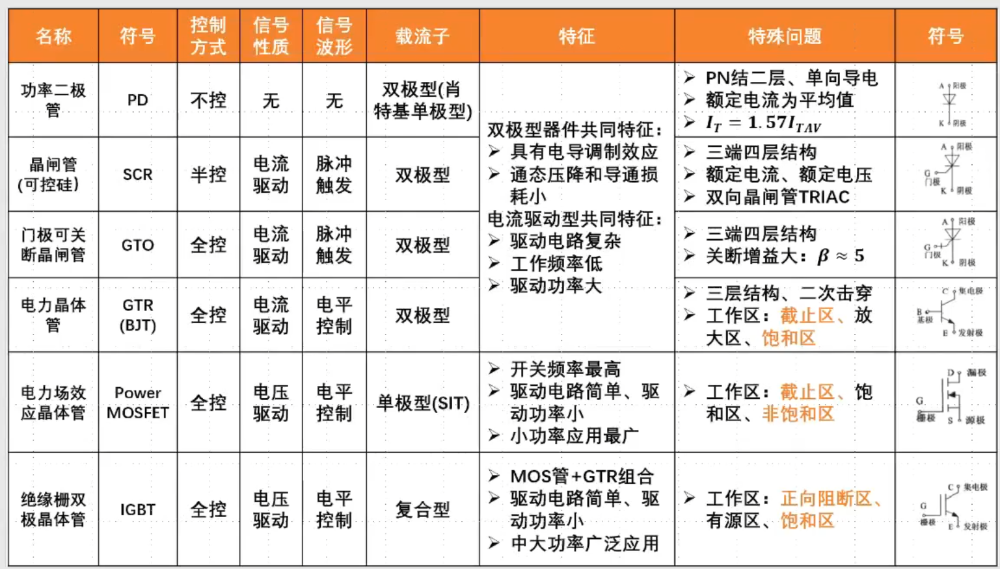
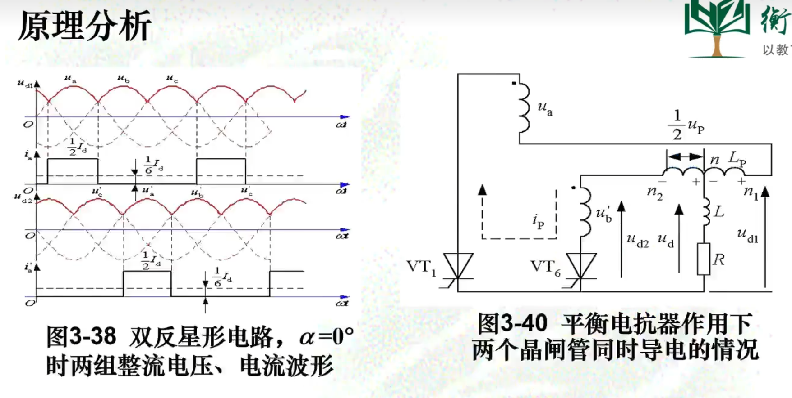
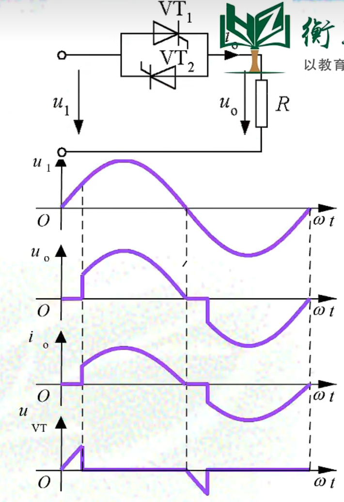
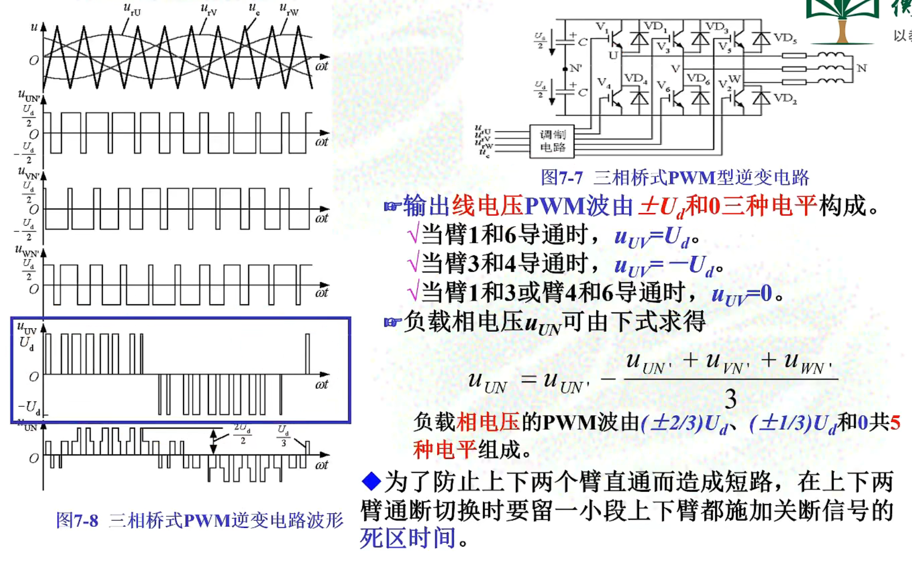

# 模电

## 半导体

### 本征半导体

- 纯洁的半导体晶体，导电能力弱几乎绝缘,本征激发后具有自由电子和空穴，具有较弱的导电能力

### PN结

- 本征半导体，本征激发的数量取决温度

- 掺杂半导体，除了本征激发，还有掺杂的原子由于成键时多出了一个电子或者空穴产生了多子（P型为空穴，N型为电子）

- PN结PN结加正向电压时，具有较大的正向扩散电流，呈现低电阻，PN结导通
  
  PN加反向电压时，具有很小的反向漂移电流，呈现高电阻，PN结截止。
  由此可以得出结论：PN结具有单向导电性。

- PN结
  
  - P型和N型交界多子和隔壁的少子是相同类型的（都是电子或者都是空穴），会有浓度差，会产生扩散运动（宏观上为定向运动），多子扩散运动到隔壁会被隔壁的多子复合，导致隔壁多子附近的原子核呈现带电性，因此形成了电势差，内部的电势差阻止了扩散运动，最终就是电势差和扩散运动的平衡。因此两边多子的浓度差是决定最终的内部阻止扩散运动的电势的因素。所以温度升高会导致导通电压的降低，就是因为本征激发加剧，而掺杂浓度不变导致的浓度差降低，导致最终的内部反向电压变小，开启电压Uon变小。
    
    温度升高本征激发加剧，因为少子的数量较少，此变化给少子带来的增加效果明显，与少子基数和变化相关的特性受温度影响明显，如反向电流。
  
  - 掺杂浓度变高，多子浓度高，两边浓度差更大，扩散运动剧烈，而内建电场的形成是两边多子消耗的结果，浓度高的一边耗尽的地方会更靠近中间的边界，也就是更窄。（两边掺杂浓度都提高，耗尽层会同时压缩）
  
  - 正向电压：削弱了内建电势差，导致多子扩散运动得以重新进行，同时可以理解为电源源源不断的为两边提供多子。
    
    反向电压：增强了内建电势差，导致扩散运动更难以进行，导致多子无法复合，但漂移运动可以进行，因为少子在反向电压下是促进的，存在反向饱和电流，且是源源不断的

# 电力电子技术

## 第一章、绪论

> 电力电子技术是使用电力电子器件对电能进行变换和控制，特指电力网的电力。

> 电力有交流和直流两种，公用电网得交流，蓄电池和干电池得直流。
> 
> 上面的电源得到的电力一般不能直接满足要求，需要进行电力变换。
> 
> 电力变换四大类：AC-DC，DC-AC，DC-DC，AC-AC

- 

## 第二章、电力电子器件

### 常用电力电子器件

- 分类：
  
  - 按控制程度：
    
    - 半控型器件（晶闸管）：只能控制其开通，不能控制其关断
    
    - 全控型器件（GTO、GTR、PMOS）：
    
    - 不可控器件：
  
  - 按驱动性质（电力二极管除外）：
    
    - 电压型
    
    - 电流型
  
  - 驱动信号波形（电力二极管除外）：
    
    - 脉冲触发型
    
    - 电平控制型
  
  - 按载流子参与导电情况
    
    - 单极型：一种载流子参与导电
    
    - 双极型：电子和空穴两种载流子参与导电
    
    - 复合型：单极型器件和双极型器件集成混合成

### 电力电子器件的概念和特征

- 特征
  
  - 所能处理电功率的大小，也就是其承受电压和电流的能力是其最重要的参数，一般都远大于处理信息的电子器件。
  
  - 为了减小本身的损耗，提高效率，一般都工作在开关状态
  
  - 由信息电子电路控制，而且需要驱动电路
  
  - 自身的功率损耗通常仍远大于信息电子器件，在其工作时一般都需要安装散热器。

- 功率损耗
  
  - 通态损耗：功率损耗的主要成因（低频下）
  
  - 断态损耗：小，只有漏电流和和压降乘积
  
  - 开关损耗：开关频率较高时，开关损耗会成为器件功率损耗的主要因素
    
    - 开通损耗
    
    - 关断损耗

- 硬开关和软开关
  
  - 硬开关：开关过程中电压和电流均不为零，出现重叠，有了显著的开关损耗
  
  - 软开关：使开关开通前电压先降为0，关断前电流先降为0
    
    - 软开关分成零电压开关和零电流开关
    
    - 引入了谐振技术，串联谐振就是将电容电感串联，电压为0，相当于短路，所以可以将电压降为0,；并联谐振，电感和电容上的电流之和为0，两者的两端相当于电流为0。

- 动态特性：开关特性（零偏置、正向偏置、反向偏置）
  
  静态特性：伏安特性

- GTR、MOSFET和IGBT工作曲线的对比
  
  

> GTR和IGBT类似，理解时可以将IGBT的有源区理解为GTR的放大区。
> 
> 作为开关管GTR工作在截止区和饱和区；电力MOSFET工作在截止区和非饱和区；IGBT工作在正向阻断区和饱和区

### 应用电力电子器件的系统组成

- 电力电子系统：由控制电路、驱动电路和以电力电子器件为核心的主电路组成。

### 电力二极管

- 与电子电路二极管区别在于需要更高的反向耐压值，通过低掺杂N-实现

- 但高的反向耐压值会带来高的电阻率和低导通率，影响正向导通性能，通过电导调制效应解决（正向电流小时，二极管的电阻主要是低掺杂区的，阻值为常量，但随着正向电流增加，低掺杂区的少子空穴浓度变大，为维持半导体电中性，其多子浓度也增大，导致电阻率下降），最终效果就是正向电流下，二极管呈低阻态。

> 电导调制效应只有双极型器件才具有，具有通态压降和导通损耗小优点

- 关断过程：需要经过一段短暂的时间才能重新获得反向阻断能力，所以关断前有比较大的反向电流出现和伴随有明显的反向电压过冲
  
  > 主要是受到结电容和载流子需要时间恢复的影响

- 重要参数：
  
  - 额定电流，因为其单向导通，所以使用平均值来定义其额定电流，即最大工频正弦半波电流的平均值$I _ { F ( A V )}$
  
  - 正向平均电流 $ I _ { Tn}$ 是按电流的发热效应来定义，选用时使用有效值$ I_{Tn}$（方均根，也就是等效的电阻产生相同热量的等效电流,在交流中就是电流的均方根）
    
    $ I_{Tn} = 1.57 I_{F(AV)}$
  
  - 正向压降：导通时管压降

- 了解参数：
  
  - 反向重复峰值电压$ U_{RRM}$
  
  - 最高工作温度
  
  - 反向回复时间
  
  - 浪涌电流（过电流）

- 分类：
  
  - 普通二极管：频率较低，耐压较高
  
  - 快速恢复二极管：快，耐压较高
  
  - 肖特基二极管（单极型器件金属-N型半导体，载流子只有电子）：速度快损耗低，但耐压低，多200v以下

### 晶闸管（SCR）

- 可控硅，能承受的电压和电流容量仍是当前电力电子器件最高的，在大容量应用有比较中主要地位

- 三端四层结构（PNPN），可以等效成PNP+NPN模型
  
  晶闸管属电流驱动、脉冲触发、双极型、半控型器件
  
  在门级加上触发脉冲电流就会导致正反馈，进入深饱和状态
  
  

- 晶闸管正常工作的基本特点：
  
  - 导通条件：
    
    1. 阳极与阴极之间加正向电压（本质还是使用电压产生触发脉冲电流），同时门极有正向脉冲。
    
    2. 门极只能用来控制晶闸管的导通，晶闸管导通后门极就失去控制作用
  
  - 晶闸管具有半控的单向导电性
    
    - 承受反向电压时，不论门极是否有触发电流，晶闸管都不会导通。
    
    - 承受正向电压时，仅在门极有触发电流的情况下晶闸管才能开通（不然中间层无法导通）。
  
  - 晶闸管属电流驱动、脉冲触发、双极型、半控型器件
  
  - 关断条件：使晶闸管的电流降到接近于0的某个数值（维持电流$I_H$）以下
    
    实现方法：
    
    1. 去掉阳极电源电压。
    
    2. 将阳极电源反向。
    
    3. 设法使流过晶闸管的电流降低到维持电流以下
  
  - 其他导致晶闸管导通的情况：
    
    1. 阳极电压升高至相当高的数值造成雪崩效应
    
    2. 阳极电压上升率du/dt过高（$i = Cdu/dt$）
    
    3. 结温较高
    
    4. 光触发（光直接照射硅片）
  
  > 门级触发是最精确、迅速的控制手段
  > 
  > 光触发可以起到控制电路和主电路隔离的作用

- 基本特性
  
  - 静态特性：
    
    - 正向转折电压：硬导通电压，门级没有触发信号，但电压过大导致导通，不正常工作
    
    - 反向击穿电压：耐压值
    
    - 维持电流（$I_H$）:维持导通的最小导通电流
  
  - 静态参数：
    
    - 电压定额
      
      - 断态重复峰值电压$U_{DRM}$(在没有门级触发时承受的正向电压)
      
      - 反向重复峰值电压$U_{RRM}$
      
      > 取上面两个电压值较小的标值作为器件的额定电压（标值为标准值），一般选工作时承受的峰值电压的2-3倍为额定电压。1000v以下每隔100v为一级，超过1000v每隔200v为一个标准，中间像1100v是没有生产的，1200V为12级。
      
      - 通态平均电压$U_{T(AV)}$：0.4V-1.2V为九个级别，每0.1V为1级
    
    - 电流定额
      
      - 通态平均电流$I_{T(AV)}$(额定电流)：最大工频正弦半波电流的平均值
      
      > 单向导电性，但工作在交流，使用时按有效值选取，即用等效发热量来选取
      
      > 已知电路的参数选器件要乘以安全系数（裕量）
      > 
      > 已知电路中的器件参数，估计电路的参数，要除以安全系数
      
      - 维持电流（$I_H$）:维持晶闸管导通的最小电流
      
      - 擎住电流（$I_L$）:刚从断态转入通态维持导通的最小电流$I_L≈(2-4)I_H$
      
      - 浪涌电流$I_{TSM}$：最大正向过载电流
  
  - 动态参数
    
    - 断态电压临界上升率：结电容原因会导致电流过大，误导通
    - 通态电流临界上升率：上升过快会局部过热
  
  - 型号命名方法
    
    

- 派生器件
  
  - 快速晶闸管
  
  - 双向晶闸管（TRIAC）：由一对反并联连接的普通晶闸管集成，因为其为交流器件，所以使用有效值来衡量其额定电流值
  
  - 逆导晶闸管（RCT）：将晶闸管反并联一个二极管
  
  - 光控晶闸管（LTT）：光触发晶闸管，避免电磁干扰，常用与高压大功率场合（高压直流输电）

- 晶闸管的串联：晶闸管额定电压不满足要求时可以使用多个进行串联分压
  
  - 静态不均压，由于器件无法做到完全一致，所以应该选择参数和特性尽量一致的器件，还可以采用电阻均压
  
  - 动态不均压，响应速度不一致导致某些管子导通但有些管子没有导通，导致过大的电压加在未导通的管子上面。可以使用RC并联之路作动态均压，采用门级强脉冲触发可以减小器件开通时间的差异。

- 晶闸管的并联：起到分流的作用，存在电流分配不均的问题，可以使用均流电抗器和使用门级强脉冲触发。

> 需要同时串联和并联晶闸管时，通常采用先串后并

### 门级可关断晶闸管（GTO）

- 结构和工作原理
  
  - 结构：和平台晶体管一样是PNPN四层半导体结构，不同点是GTO是多元的功率集成（多个PNPN四层结构体并联）器件。
  
  - 可关断原因：
    
    - 导通时饱和程度较浅
    
    - NPN的放大系数α2较大，使NPN管子控制灵敏，易于关断
    
    - 多元集成，是得P2基区横向电阻较小，能从门级抽出较大的电流，实现对NPN管子的关断
  
  - 可关断阳极电流
  
  - 电流关断增益$β_{off}$,大约在5左右（太小是主要的缺点），取决于管子的方法倍数，和工艺和设计有关
    
    主电流在大功率下较大，关断需要的电流也较大

### 电力晶体管（GTR/BJT）

- GTR的结构和工作原理
  
  - PNP或NPN三层结构

- 电流驱动、电平控制型、双极型器件

- 特性：耐压高、电流大（电导调制效应）、开关特性好

- 通常采用至少两个晶体管按达林顿接法组成的单元结构

- GTR的二次击穿现象与安全工作区
  
  - 一次击穿：集电极电压升高到击穿电压，Ic迅速增大，Ic不要超过限度是GTR不会损坏
  
  - 二次击穿：一次击穿发生时，不做处理，Ic突然急剧上升，电压陡然下降，将导致器件永久损坏 

### 电力场效应管（Power MOSFET）

- 分为结型和绝缘栅型
  
  - 通常主要指绝缘栅型中的MOS型（Metal Oxide Semiconductor Field Effect Transistor），简称Power MOSFET；
  
  - 结型电力场效应管一般称作静电感应晶体管，简称SIT。工作频率和电力MOSFET相当。栅极不加信号时导通，加负偏压关断，
  
  > 后面讲的电力场效应管一般指Power MOSFET

- 电力MOSFET结构：大都采用垂直导电结构又称VMOSFET
  
  
  
  - N沟道增强型：连接导线的都是金属氧化物，下面是NPN三层结构，当在SG加上正压，金属氧化物和N型半导体相当于电容的两个极板，中间隔着$SiO_2$这种绝缘介质，会在正极板上累积正电荷，导致P型半导体中的电子被吸引到两个N型半导体之间，产生了电子沟道，即N沟道（因为导电的载流子为电子，所以成为N沟道），所以DS之间能进行导电。
  
  - 三个极对应图
    
    
    
    增强型的理解是原本没有沟道，加了控制电压（栅极电压）后产生了沟道
    
    耗尽型是当栅极电压为0时，漏源之间就存在导电沟道

- 特点：
  
  - 单极型、电压驱动（驱动控制不需要有通路电流即可进行控制）、电平控制型晶体管
  
  - 驱动电路简单，需要的驱动功率小，因为驱动电流几乎为0
  
  - 开关速度快，工作频率高，可达100kHz以上，是主要电力电子器件中最高的
  
  - 热稳定性优于GTR，不存在二次击穿问题
  
  - 电流容量小，耐压低，多用与功率不超过10kW的场合
  
  - 采用多元集成结构

### 绝缘栅双极晶体管（IGBT）

- GTR(BJT)和MOSFET复合，结合二者优点 

- IGBT的结构和工作原理
  
  
  
  驱动速度快，仅此与MOSFET

### 器件的驱动

- 晶闸管的驱动：电流脉冲触发驱动型，脉冲宽度和幅值必须足够才能导通

- MOSFET驱动：需要$U_{GS}$为10-15V导通，且一般大于20V会导致MOS管烧坏

- IGBT驱动：需要$U_{GE}$为15-20V导通，关断需要加负偏置电压(-5)-(-15)V

### 过电压（电流）及保护

- 外因过电压和内因过电压
  
  - 外因过电压：操作过电压和雷击过电压
  
  - 内因过电压：
    
    - 换相过电压：晶闸管或与全控型器件反并联的二极管在换相结束后，反向电流急剧减小，会由线路电感在器件两端感应出过电压
    
    - 关断过电压：全控型器件在较高工作频率下，关断时，正向电流迅速降低而由线路电感在器件两端感应出的过电压

- 过电压保护（利用电容上电压无法突变）
  
  - RC：由于关断导致正向电流的迅速变化，由于导线的电感产生了一个等效的电源，使用RC电路进行吸收，如果没有RC电路进行吸收，器件两端会有两个电压的直接叠加（$U_L$和器件加的关断反压）会导致器件的过压。RC吸收缓冲还有降低开关损耗的作用，导致关断电压和通态电流的重叠区域减小
  
  - RCD
    
    
  
  > 电源的过压保护通常采用稳压管和PNP三极管和PMOS管的组合，来隔离电源过电压对后续电路的影响

- 过电流
  
  - 过载
  
  - 短路

- 过流保护措施
  
  - 快速熔断器（短路时的保护）、直流快速断路器（作为电子电路动作后实现的保护）、过电流继电器（过载）
  
  - 电子电路作为第一保护措施

- 缓冲电路
  
  - di/dt缓冲电路：抑制电流突变，突然的导通
  
  - du/dt缓冲电路：抑制电压突变，突然的断开
    
    

### 器件总结和对比

- 器件总结表
  
  

- 电力电子器件归类
  
  

- 特性对比
  
  

- GTR、MOSFET和IGBT工作曲线的对比
  
  

> GTR和IGBT类似，理解时可以将IGBT的有源区理解为GTR的放大区。
> 
> 作为开关管GTR工作在截止区和饱和区；电力MOSFET工作在截止区和非饱和区；IGBT工作在正向阻断区和饱和区

### 复合型器件

- MTC（MOSFET和SRC）：关键技术遇到问题

- SITH（SIT和GTO）：由于SIT是正常导通型器件（不加控制电压为导通），应用范围有待扩展

- IGCT（MOSFET和GTO）：结合MOSFET的开关速度和GTO的容量，但驱动功率仍很大

### 宽禁带半导体材料

- 碳化硅(SiC)、氮化镓(GaN)、金刚石

### 功率集成电路（PIC）

- 将多个器件封装在一个模块，成为功率模块

- 将器件和逻辑、控制、保护、传感、检测、自诊断等信息电子电路制作在一个芯片上，成为功率集成电路（PIC）

- 智能功率模块（IPM）：专指IGBT及其辅助器件和其保护、驱动电路的单片集成，也成智能IGBT

---

## 整流电路

### 引言

- 整流分类
  
  - 相数分类
    
    - 单相整流（只有火线和零线）
    
    - 三相整流（三相电）
  
  - 根据开关器件及控制能力分类
    
    - 不控整流：全由不控器件组成
    
    - 半控整流：有部分可控和部分不可控器件组成
    
    - 全控整流：全由可控开关器件组成（半控器件也是可控器件）
  
  - 根据交流电源电流波形分类
    
    - 半波整流
    
    - 全波整流
  
  - 根据控制原理分类
    
    - 相控整流（晶闸管）：控制开通的相位
      
      
    
    - PWM斩控整流（全控器件）：开一段时间关一段时间
      
      

- 桥式电路
  
  

- 零式电路
  
  零式电路指带有零点或中性点的电路，特点是所有整流原件的阴极或者阳极都接到一个公共点，向直流负载供电，负载的另一根线接到交流电源的零点
  
  

### 单相可控整流电路

- 单相半波可控整流电路
  
  - 基本概念：
    
    - 通过控制触发脉冲的相位控制直流输出电压的大小，成为相位控制方式，简称相控方式
    
    - 触发延迟角：从晶闸管开始承受正向阳极电压起到佘家触发脉冲止的电角度，用$α$表示，也称触发角或控制角
    
    - 导通角：晶闸管在一个电源周期处于通态的电角度，用$θ$ 表示，且$θ = 180° - α$
    
    - 晶闸管承受的正反峰值电压$U_{TM} = \sqrt{2}U_2$,正向峰值电压是指晶闸管在没有导通是的正向压降
    
    - 直流输出电压平均值$U_d = \frac { \sqrt { 2 } U _ { 2 } } { 2 \pi } ( 1 + \cos \alpha )=0.45U_2\frac{1+cos{\alpha}}{2}$
    
    - 电流平均值：$I_d = \frac{U_d}{R}$
  
  - 带阻感性负载
    
    - 电流不能突变，电流滞后于电压，所以在关断时，仍有正向电流，此时会等效于有一个电源在电感上，导致即使电源已经处于反压，但是晶闸管两端的电压是电感上的电压和电源电压之和，导致了晶闸管无法关断
    
    - 特点：本来晶闸管应该关断，但是却没关
      
      - $U_d$波形出现了负值，所以$U_d$下降，$U_d = 0.9U_2cosα$
      
      - $θ$增大，随着电感系数增大而增大
      
      - ${\omega}L\gt\gt R$时，完全无法关断，电路无法正常工作
        
        解决方法：接上续流二极管
        
        

- 单相桥式全控整流电路
  
  
  - 导通角和触发延迟角的定义和单相半波可控一样
  
  - 特殊是在于带阻感性负载下
    
    - $U_d$减小
    
    - 在加入触发脉冲时环流
    
    - 晶闸管的导通角$θ$与$α$无关，均为180°
    
    - 晶闸管的移相范围为0°-90°（最小平均为90°，最大平均为0°）
    
    - 承受的最大正反电压均为$\sqrt{2}U_2$,原因是当VT1承受正向但不导通时，VT3处于导通状态，所以使VT1两端电压为电源电压，而不是分压，与纯电阻负载的不同。
  
  - 带反电动势负载
    
    - 由于存在反电动势，晶闸管的关断不是在电压的过零点，而是提前了一个角度δ，这个角度称为停止导通角，导通角θ = 180°-α-δ
    
    - α< δ时，触发脉冲到了晶闸管承受反电动势的负压，无法控制导通
    
    - 会存在电流断续，也就是电流持续为0一段时间，对于电机的机械特性不利，所以可以在负载串上平波电抗器，最终电压波形的波形类似于带阻感性负载，$I_d = \frac{U_d-E}{R}$,E为反电动势

- 单相全波可控整流电路
  
  - 带电阻负载
    - 单相全波与单相全控桥的区别：变压器结构复杂，需要抽头，消耗材料多，虽然只需要两个晶闸管，驱动电路也少了两个，但是晶闸管承受的最大电压是单相全控桥的2倍（$2\sqrt{2}{U_2}$）

- 单相桥式半控整流电路
  
  
  - 由于二极管的不控性，使得电压过零点后电感产生的电流经过二极管和还未关断的晶闸管导通了，但是就导致了晶闸管的失控现象，即存在正向电流，导致了开另一个晶闸管导致了电源短路。因此加上了续流二极管后，电感上的电流从二极管上走，晶闸管得以关断。
  - 其他的分析和全控在电阻负载工作情况相同

> 全波和全桥不存在直流磁化问题，半波一定存在直流磁化问题

> 只要出现了续流二极管，就负载波形就没有负电压，就无法进行逆变

### 三相整流电路

为了得到零线，变压器二次侧必须接成星形，而一次侧接成三角形是避免3次谐波流入电网。

相电压的交点称为自然换向点。将自然换相点作为$α$的起点(距离过零点30°)，即$α = 0$

- 三相半波电路
  
  - 三相半波不控整流电路
    
    - 星形负载接法，三相电压瞬时值最大的一相的管子导通，三相波形交点处称为自然换相点
    
    - 共阳极
      
      
    
    - 共阴极
      
      
  
  - 三相半波可控整流电路
    
    - 电阻负载负载
      
      - 当导通移相角$α>30°$时，电流存在断续，导通角$θ = 180°-30°-α$
        
        移相范围为150°
      
      - $U_d$的计算只要知道波形的形状和起止积分即可。下面是没有电流断续的情况，也就是α<30°的情况下$U _ { d } = \frac { 1 } { \frac{2 \pi}{3} } \int_{ \frac { \pi } { 6 } +\alpha} ^ { \frac { 5 \pi } { 6 } + \alpha } \sqrt { 2 } U _ { 2 }\cos{\omega t}d(\omega t) = 1.17U_2cos\alpha$
      
      - 最大反向电压为线电压峰值，即$\sqrt{2}*\sqrt{3}U_2 = \sqrt{6}U_2$
      
      - 最大正向电压为相电压峰值$\sqrt{2}U_2$，因为一个管子没导通时其他管子也没导通
    
    - 阻感负载
      
      - 由于电感电流的存在导致晶闸管的关断出现了延迟，$U_d$出现了负值，导致管子在知道下一个晶闸管导通前给它施加反压时一直是导通的，所以阻感负载下，晶闸管的导通角为120°
      
      - 平均电压的计算公式不变，所以还是和电阻负载一样
      
      - 负载平均电流$I_d = \frac{U_d}{R}$
      
      - 晶闸管平均电流$I_{VT} = \frac{1}{3}I_d$
      
      - 晶闸管电流有效值$I _ { T } = \frac { 1 } { \sqrt { 3 } } I _ { d }$
      
      - 变压器二次侧电流有效值$I_2 = I_T$
      
      > 因为三相半波可控整流电路的主要缺点在于其变压器二次电流中含有直流分量，为此其应用较少
  
  - 三相桥式可控整流电路
    
    每个时刻有两个晶闸管导通。导通时加在负载上的电压为线电压，一个周期有六个脉波，每个脉波为60°。线电压超前相电压30°（波形形状超前），所以在取波形时可以将整个线电压的波形画出后去对应时刻下的波形作为$U_d$,每个晶闸管导通时间为$\frac{1}{3}T$,一个周期内，理想情况下，即不考虑变压器漏抗，晶闸管导通顺序为61-12-23-34-45-56，六个状态。移相导通角$\alpha = 60°$时恰好电流出现断续，因为自然换相点在波形的30°位置，且线电压又超前30°，负载两端为线电压，所以$U_d = 0$的点在150°的位置，看图理解，对应的可以理解导通角$\theta$的取值

### 整流电路的各种参数范围

  

### 整流阻感负载下的各种平均值和有效值

### 电容滤波

- 电容滤波的单相不可控整流电路
  
  通过导通时对电容的充电，之后过了峰值电压后，电容的电压高于二极管电压，导致二极管承受反压关断（但放电速度大于电压下降速度时，又会给电容充电，极限情况就是电容容量过小，放电速度过快导致整体波形和原本没有电容的接近），电容给负载放电，直到电压幅值超过电容两端电压时给负载供电，同时给电容充电。如此重复，减少了电压的脉动，减少谐波和电压纹波
  
  

- 电容滤波三相不可控整流电路
  
  充电电流断续的临界是难点，$\omega RC >\sqrt3$充电电流断续，可以理解为电容放电速度较慢导致电容电压高于线电压，导致管子关断，停止对电容充电，导致了断流
  
  临界点的寻找方法是，由于线电压的斜率绝对值是不断增大，而电容放电时电压斜率绝对值是不断减小，斜率相等时即为临界。

### 整流电路的谐波和功率因数

- 无功功率：将电能通过储能元件进行存储后又释放返还到电路中，这部分能量的传输导致了以下的问题：
  
  - 使电流和视在功率增大，导致设备容量增加。
  
  - 总电流的增加，使设备和线路的损耗增加。
  
  - 线路压降增大，冲击性负载使电压剧烈波动。

- 谐波危害：在工频电网中，正弦电压作用于非线性元件和负载后产生了畸变电流，存在谐波电流，会影响设备的正常工作，因为设计时都是按照50Hz的正弦电压设计的。其他的谐波进入电路会产生热量，可能会导致谐振，导致电感和电容等产生谐振，起到放大作用，加剧危害。其他的可能就是频率范围超出了考虑导致了对其他频率的设备的误动作
  
  - 降低设备的效率。
  
  - 影响用电设备的正常工作。
  
  - 引起电网局部的谐振，使谐波放大，加剧危害
  
  - 导致继电保护和自动装置
    的误动作。
  
  - 对通信系统造成千扰。

- 谐波规律：
  
  - 交流侧
    
    - 谐波次数为$2m±1$（m为一个周期的脉动次数），为奇数次，谐波次数越高，幅值越小，谐波分量越小
  
  - 直流侧：
    
    - 谐波次数为$2m$,为偶数次，谐波次数越高，幅值越小，谐波分量越小

- 带平衡电抗器的双反星形可控整流电路
  
  - 低电压大电流情况下使用
  
  - 二次侧两绕组的极性相反可消除铁芯的直流磁化，因为是在同一个铁芯上，绕组极性相反，同名端仍然是相同极性的。只是在交流中，绕组上的电压极性会变化，所以导致在不同时刻下两个绕组导通的情况下电流方向刚好相反，是交流电导致的同名端在不同时刻下的电压极性不同，导通顺序保持123456这样进行下去，一个时刻下有两个管子导通
    
    

- 多重化整流电路
  
  - n组串联多重总结：
    
    - 整流变压器的二次绕组移相60°/n
    
    - 整流输出脉波数m=6n
    
    - 交流侧输入谐波次数为mk±1,k=1,2,3.
    
    - 直流侧输出谐波次数为mk,k=1,2,3.
    
    - 谐波大幅减小，在一定程度上提高功率因数。
  
  - 上面为星形、下面为三角形，则变压器一次绕组、二次的星形绕组、二次的三角形绕组比值为$1:1：\sqrt{3}$,原因是对于同样的负载，要使负载上的电压相同，星形接法的电源给负载的是线电压，三角形电源给负载的是相电压，导致要给负载相同电压时，三角形电源需要的相电压应该等于星形接法的线电压，所以需要更大的匝数提高副边的电压，而且由于三角形给负载提供的是相电压，而相电压的相位时落后线电压30°的，所以就导致了电压波形错开，二者串联叠加就导致了有12个脉波。

### 有源逆变

- 产生逆变的条件
  
  - 有直流电动势，极性和晶闸管导通方向一致，值大于交流器直流侧平均电压
  
  - 晶闸管的控制角$\alpha >\frac{\pi}{2}$,使$U_d$为负值（出现了半控或续流二极管，$U_d$不为负，不能实现有源逆变）
  
  - 假设移相角范围为t，那么只有移相角大于某个值x，使$U_d$整体为负值，那么$t>\alpha > x$时满足逆变要求，通常把换相角大于$\frac{\pi}{2}$的控制角用$\beta$表示，称为逆变角，逆变角是从移相角范围的最大值处定为0，直到导通角为止经过的角度为逆变角$\beta$

- 逆变失败
  
  - 外部原因有器件问题、电路问题、电源问题
  
  - 内部原因是换相的裕量角不足，必须保证$\beta > \beta _{min}$最小$\beta$一般取30°-35°

## 逆变电路 （核心部件）

> 有源逆变：交流侧接电网
> 
> 无源逆变：交流侧接负载

### 应用

- 直流电源，蓄电池、干电池、太阳能电池等

- 交流电机调速用变频器、不间断电源、感应加热电源等。

### 换流方式

- 整流电路的晶闸管换流全部都是电网换流（有源逆变）

- 无源逆变下晶闸管换流使用
  
  - 器件换流：通过器件驱动改变电流流向
  
  - 负载换流：容性负载才可以通过负载换流实现晶闸管的换流，因为容性负载电压落后电流，在电流过零点后施加反压使晶闸管关断
  
  - 强迫换流：通过给晶闸管并联一个电容，提前给电容充电，之后在需要关断时闭合开关，使电容并联在晶闸管两端，实现晶闸管关断（属于自换流，因为在生产时通常会将电容和晶闸管集成到一起）

### 电压型逆变电路

- 单相电压型逆变电路
  
  电压型逆变电路的特点：
  
  1. 直流侧为电压源或并联大电容，直流侧电压基本无脉动。
  
  2. 输出电压为矩形波，输出电流因负载阻抗不同而不同。
  
  3. 当交流侧为阻感负载时需提供无功功率。为了给交流侧向直流侧反馈的无功提供通道，逆变桥各臂并联反馈二极管。
  - 半桥逆变电路 
    
    
    
    - 电流i的相位滞后于电压u
    
    - 输出电流随负载不同而不同
  
  - 全桥逆变电路
    
    
  
  - 将矩形波展成傅里叶级数，可以得到基波分量，并计算基波有效值
    
    谐波次数$n = 2m\pm 1$
    
    全桥的有效值为单相桥的两倍
  
  - 改变两组开关的切换频率调节输出交流电压的频率
  
  - 调节输出电压的幅值
    
    - 改变直流电压的平均值
    
    - 移相调压控制
    
    - 通过斩波电路，改变占空比以获得多路不同输出

- 三相电压型逆变电路
  
  
  
  - 每一相都相当于一个单相半桥逆变电路，所以每一相电压的基波有效值为$0.45U_d$，为$\sqrt{2}有效值$ ，线电压为相电压的$\sqrt{3}倍$
  
  - 电压谐波次数为$6k \pm 1$,第n次谐波的幅值为 基波幅值/n

### 电流型逆变电路

- 直流电源为电流源的逆变电路

- 主要特点
  
  - 直流侧串联大电感，电流基本无脉动，相当于电流源
  
  - 输出电流为矩形波，与负载阻抗角无关，输出电压波形和相位因负载不同而不同
  
  - 直流侧电感起缓冲无功能量的作用，不必给开关器件反并联二极管。
  
  - 电流型逆变电路中，采角半控型器件的电路仍应用较多，换流方式有负载换流、强迫换流。

- 单相电流型逆变电路
  
  
  
  - 给负载并上电容，使负载呈现容性，电流超前电压过零，R、C、L构成并联谐振电路略呈容性，构成并联谐振可以进行基波频率的筛选。不用反并联二极管进行无功反馈，因为没有电流流不出去
  
  - 将输出电流进行傅里叶级数展开，因为为交流侧谐波，次数为$2m \pm 1$
  
  - 基波有效值$I_{o1} = 0.9I_d$

- 三相电流型逆变电路
  
  
  
  - 交流电流基波有效值$I_{U1} = 0.78I_d$，计算方法是将电流（此处线电流等于相电流因为为星形接法）波形进行傅里叶级数展开，取基波频率对应的幅值除以$\sqrt{2}$

### 总结

### 多重逆变电路

- 串联多重把几个逆变电路的输出串联起来，多用于龟压型。
  
  将输出的电压通过变压器串联起来，想办法使两个电压错开一定的相位消除掉对应的某一次的谐波
  
  - 单相电压型二重逆变
    
    
  
  - 三相电压多重逆变：使m个三相桥(存在$6k \pm 1 $次谐波)逆变电路的相位依次错开$\frac{180°}{3m}$,连同合成输出电压并抵消上述相位差的变压器，就可构成6m的脉波逆变电路
    
    > example：使用两个三相桥，依次错开30°，即可消除3k±1次谐波

- 并联多重把几个逆变电路的输出并联起来，多用于电流型。 

- 多电平逆变电路
  
  - 两电平逆变电路的输出线电压有$\pm U_d$和0 三种电平。
  
  - 三电平逆变电路的输出线电压$\pm U_d 、U_d /2$和0 五种电平。
  
  - 优点
    
    - 输出电压谐波可以大大少于两电平逆变电路
    
    - 每个主开关器件承受电压为直流侧电压的一半
  
  

## 直流-直流斩波电路

### 引言

- 直流斩波电路：将直流电变为另一固定电压或可调电压的直流电

- 电路种类：
  
  - 降压斩波电路
  
  - 升压斩波电路
  
  - 升降压斩波电路
  
  - Cuk斩波电路
  
  - Sepics斩波电路
  
  - Zeta斩波电路。
  
  - 复合斩波电路（不同结构基本斩波电路组合）
  
  - 多相多重斩波电路（相同结构基本斩波电路组合）

- 基本原理：利用电力电子器件来实现通断控制，将直流电源电压断续地加到负载上，通过调节通断的时间来改变负载电压的平均值。
  
  

- 三种控制方式：
  
  - 脉冲宽度调制(PWM)：保持开关周期T不变，调节开关导通时间$t_{on}$
  
  - 频率调制：保持开关导通时间$t_{on}$不变，调节开关周期T。
  
  - 混合调制型：$t_{on}$和T都可调。

### 降压斩波电路（Buck变换器）

- 也成为直流降压型变压器

- 电流连续时，负载电压的平均值为$U_o = \frac{t_{on}}{t_{on}+{t_{off}}}E = \frac{t_{on}}{T}E = \alpha E$
  
  $\alpha$为占空比

### 升压斩波电路（Boost Chopper）

- 电压升高的原因：
  
  - 电感L储能使电压为电源电压叠加上电感上的电压（节流）
  
  - 电容C可将输出电压保持住（开源）

- 电路分析：
  
  - IGBT导通时：电源E给电感L充电，电容C给负载R供电，维持R上的电压不下降（稳压）
  
  - IGBT断开时：电感等效成一个电源，和电源一起给电容充电给负载供电。

- 理想状态下输出电压计算
  
  电感储存能量和释放能量相等$EI_1t_{on} = (U_o - E) I_1 t_{off}$
  
  所以化简$U_0 = \frac{t_{on}+t_{off}}{t_{off}}E = \frac{T}{t_{off}}E$
  
  $\frac{T}{t_{off}} >1$ 输出电压高于电源电压，为升压斩波电路
  
  $\frac{T}{t_{off}}$为升压比，升压比的倒数为$\beta$, $\beta = t_{off}/T$
  
  $U _ { 0 } = \frac { 1 } { \beta } E = \frac { 1 } { 1 - \alpha } E$

### 升降压斩波电路（Buck-Boost）

- $u_o$的极性为上负下正，与电源的极性相反，成为反极性斩波电路

- L和C值均很大，是电感电流和电容电压（负载电压）基本恒定

- 根据伏秒平衡原理：稳态时电感两端的直流电压为0，即电感不消耗能量，值传递能量，一个周期内电感电压对时间的积分为0，即：$E t _ { on } = U _ { 0 } t _ { o f f }$

- $U _ { O } = \frac { t _ { o n } } { t _ { o f f } } E = \frac { \alpha } { 1 - \alpha } E$
  
  $\alpha >0.5$为升压电路，$\alpha <0.5$为降压电路

> 是升压还是降压有口诀：电感位置左升右降

### 多相多重斩波电路

- 相数和重数：流经每个电源为几个脉动时为几相，流经负载上电流为几个脉动时为几重

- 优点：
  
  - 电源电流的谐波分量比单个斩波电路时显著减小，所需平波电抗器总重量大为减轻。（需要滤除的频率提高了，所需的感抗减小，因为感抗为$wL$,L减小了，所以需要的线圈匝数减少，重量变轻）
  
  - 多相多重斩波电路还具有备用功能，各斩波电路单元可互为备用，万一某一斩波单元发生故障，其余各单元可以继续运行，使得总体的可靠性提高。

### 带隔离的直流直流变流电流

- 引言
  
  
  
  - 中间加上交流环节，称为直-交-直电路
  
  - 采用复杂架构完成直流变压的原因
    
    - 输出端与输入端需要隔离
    
    - 某些应用中需要相互隔离的多路输出。（最后输出端有变压器）
    
    - 输出电压与输入电压的比例远小于1或远大于1.
    
    - 交流环节采用较高的工作频率，可以减小变压器和滤波电感、滤波
      电容的体积和重量。（很多开关电源都利用这个特点，频率越高，采用的电感等就可以变小）

- 五种直交直的电路
  
  - 正激电路和反激电路
    
    
    
    - 由于同名端的原因，正激电路需要在电源处于上半波时二极管导通，而反激电路在电源处于下半波时导通
    
    - 在单端电路（一种极性下导通）中，变压器中流过的是直流脉动电流。导致变压器的激磁电感饱和。
  
  - 半桥电路、全桥电路和推挽电路
    
    
  
  - 总结：
    
    - 间接直流变流电路分为单端(Single End)和双端(Double End)电路两大类，在单端电路中，变压器中流过的是直流脉动电流，而双端电路中，变压器中的电流为正负对称的交流电流。
    
    - 正激电路和反激电路属于单端电路
    
    - 半桥、全桥和推挽电路属于双端电路。

### 开关电源

- 开关电源和线性电源对比
  
  
  
  - 图10-20所示为线性电源，先用工频变压器降压，然后经过整流滤波后，由线性调压得到稳定的输出电压。
  
  - 图10-21所示为开关电源，先整流滤波、后经高频逆变得到高频交流电压，然后由高频变压器降压、再整流滤波。
  
  - 开关电源在效率、体积和重量等方面都远远优于线性电源，因此已经基本取代了线型电源，成为电子设备供电的主要电源形式。

### 总结

- 反极性是电源为上正下负，负载为上负下正 

- 电感在哪一侧哪边就是连续的

---

## 交流-交流变流电路

### 引言

- 交流-交流变流电路：把一种形式的交流变成另一种形式交流的电路
  
  - 交流电力控制电路：只改变电压、电流或对电路的通断进行控制，而不改变频率的电路。
    
    - 交流调压电路（相位控制）：在每半个周波内通过对晶闸管开通相位的控制，调节输出电压有效值的电路。
    
    - 交流调功电路（通断控制）：以交流电周期为单位控制晶闸管的通断，改变通态周期数和断态周期数的比，调节输出功率平均值的电路。
    
    - 交流电力电子开关（通断控制）：串入电路中根据需要接通或断开电路的晶闸管。
  
  - 变频电路：改变频率的电路。
    
    - 交交变频（直接）
    
    - 交直交变频（间接）

### 交流调压电路

- 原理：把两个晶闸管反并联（TRIC）后串联在交流电路中，通过对晶闸管的控制就可以控制交流输出。

- 应用
  
  - 灯光控制（如调光合灯和舞合灯光控制）。
  
  - 异步电动机软起动（降压启动，降低电压有效值）。
  
  - 异步电动机调速。
  
  - 供用电系统对无功功率的连续调节。(TCR晶闸管控制电抗器)
  
  - 在高压小电流或低压大电流直流电源中，用于调节变压器一次电压。

- 单相交流调压电路
  
  
  
  - 电阻负载
    
    - $\alpha$的移相范围为$0≤\alpha≤\pi$
    
    - 随着的α增大，$U_o$逐渐降低。功率因数$\lambda$逐渐降低(因为负载电流越来越滞后于电源电压了)。
  
  - 阻感负载
    
    - 因为当电压为0时，电流还没过零点。导致将另一个晶闸管短路，对另一个正关断的晶闸管的触发脉冲不起作用，所以控制角应该在电流过零后再施加，所以$\alpha$移相范围为：$\phi \le \alpha \le \pi $，其中φ为负载的阻抗角

- 三相交流调压电路
  
  - 三相四线，相当于三个单相交流调压电路的组合，相互之间错开120°工作。
  
  - 三相三线，注意加在晶闸管上的变为了线电压，线电压超前相电压30°，所以移相角变为0-150°
  
  - 典型应用：晶闸管控制电抗器(TCR)
    
    - 特点：
      
      - 纯电感负载，阻抗角90°，故移相范围为90°~180°
      
      - 控制：角可连续调节流过电抗器的电流，从而调节无功功率。
      
      - 配以固定电容器，对无功功率进行动态补偿，以补偿电压波动或闪变。

- 交流调功
  
  - 开通和关断点一直在电压过零点，连续开通或者关断几个电压周期
  
  - 例子：电热炉

- 交流电力电子开关
  
  - 将晶闸管反并联后串入电路中，代替电路中的机械开关，起接通和断开电路的作用
  
  - 没有明确的控制周期，需要时接通和关断
  
  - 例子：晶闸管投切电容（TSC），电容器的投入和切断是控制无功功率的重要手段，通过调节无功功率，提高功率因数，稳定电网电压，改善供电质量

### 交交变频电路

- 单相交交变频器
  
  
  
  - 正组和反组交替工作 （两组切换工作一次为一个周期）
  
  - 一组在工作时，让导通角$\alpha$按一定规律变化（余弦交点法），形成了更接近正弦波的波形，
  
  - 两组切换频率不能过高，不然输出给负载的电压会畸变严重，过于不像正弦波，因为输入的电压为工频的正弦电压，最高的频率不得高于输入电压频率的$1/3\sim1/2$。
    
    > 50Hz 交交变频输出上限为20Hz
  
  - 一般用于给电机作变频使用
    
    - 负载电压电流同向为整流且负载消耗功率，不同向为逆变且负载发出功率

- 三相交交变频电路
  
  - 使用36个晶闸管，通过控制导通角$\alpha$实现
  
  - 缺点：接线复杂，受电网频率和交流电路脉波数的限制，输出频率低于20Hz，输入功率因数较低（影响效率），因为是通过调节$\alpha$进行控制的，电流滞后于电压。输入电流谐波含量大，频谱复杂
  
  - 优点是进行一次交流到交流，效率较高
  
  - 适用于大功率低转速的场合。

- 矩阵式变频电路
  
  - 九个开关器件组成3*3矩阵，是直接变频电路，控制方式是斩控方式。
  
  - 优点
    
    - 输出电压可控制为正弦波，频率不受电网频率的限制。
    
    - 输入电流也可控制为正弦波且和电压同相，功率因数为1，也可控制为需要的功率因数。
    
    - 能量可双向流动，适用于交流电动机的四象限运行。不通过中间直流环节而直接实现变频，效率较高。

### 总结

---

## PWM控制技术

### 引言

- PWM(Pulse Width Modulation)控制就是脉宽调制技术：即通过对一系列脉冲的宽度进行调制，来等效的获得所需要的波形（含形状和幅值）。

- 重要理论基础：
  
  - 面积等效原理
  
  - 冲量相等而形状不同的窄脉冲加载具有惯性环节上，其效果基本相同
    
    使用不同形式达到相同的输出效果
    
    

- SPWM
  
  

### PWM逆变电路及其控制方法

- 计算法
  
  - 根据逆变电路的**正弦波输出频率、幅值和半个周期内的脉冲数**，**将PWM波形中各脉冲的宽度和间隔准确计算出来**，按照计算结果控制逆变电路中各开关器件的通断，就可以得到所需要的PWM波形，这种方法称之为计算法。
  
  - 计算法是很繁琐的，当需要输出的正弦波的频率、幅值或相位变化时，结果都要变化。
  
  - 特定谐波消去法
  
          

- 调制法
  
  - 把希望输出的波形作为调制波，接受调制的信号为载波
  
  - 逆变电路数PWM技术最为重要的应用场合
  
  - 调制方法：
    
    
    
    - 单极性调制：半个周期内，三角波载波只有正极或只有负极，所得PWM波在只在单个极性范围里变化的控制方式称为单极性PWM控制方式
      
      
    
    - 双极性调制：半个周期内，三角波载波有正有负，所得PWM波也有
      正有负。
      
      
    
    > 单极性调制的谐波含量更低
    
    - 三相双极性调
      
      - 由于三相相位差，使用同一载波进行调制三个相位相差120°的正弦调制波时，无法实现，载波三角波不能区分正负了，只能使用双极性调制

### 异步调制和同步调制

- 载波比N：载波频率$f_c$与调制信号频率$f_r$之比

- 同步调制：载波比为常数、且载波信号和调制信号保持同步（对称性好）
  
  > 三相调制电路中N为3的整数倍，N取奇数
  
  - 同步调制缺点：
    
    - $f_r$很低时又$f_c$也很低，（因为保持一个调制波周期内载波个数一定）由调制带来的谐波不易滤除，载波频率越高越容易滤除
    
    - $f_r$很高时,$f_c$会过高，使开关器件难以承受。
  
  - 分段同步调制可以解决频率的矛盾
    
    - $f_r$过低时，$f_c$调高（相当于调高了N）
    
    - $f_r$过高时，$f_c$调低（相当于降低了N）
    
    - 分段同步调制存在$f_c$会在切换点来回跳动，因为根据调制波的频率不断改变载波频率，所以使用**滞后切换**载波频率的方法

- 异步调制：没有固定的载波比

- 采样法
  
  

> 规则采样法计算量比自然采样法小

### 滞环比较方式

### 三角波比较法

### 电平数总结

