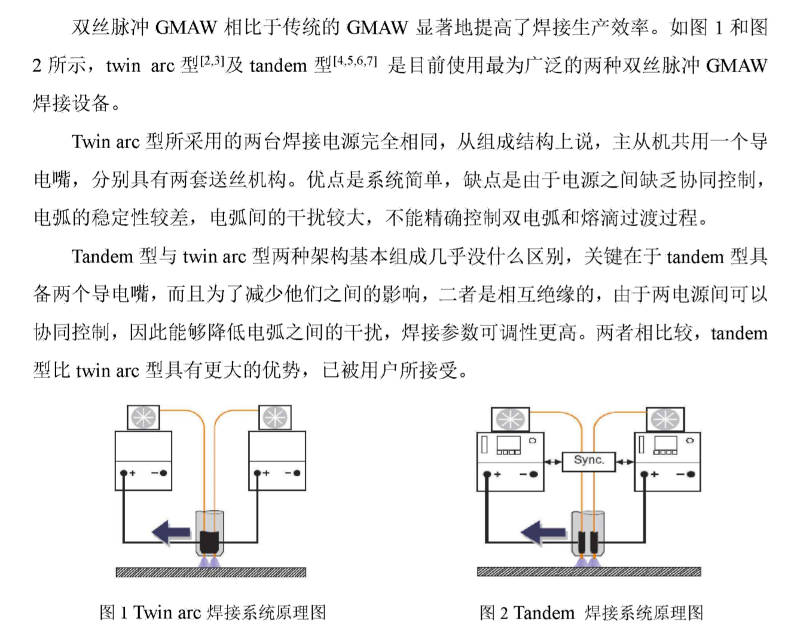

# 毕设文献阅读笔记

## 说明

- 摘录有用的值得引用的文献需要注明出自哪篇文章的哪个地方，具体到页数。写在tip中

- 自己看到的需要掌握或者理解的点标明理解同时也标明出处和位置

## 理解

### 相位

- 不同相位模式指的是主机输出的脉冲与从机输出的脉冲存在不同的时间差(0到T,T为脉冲的周期时间)。显然不同的相位模式必然会对焊接过程及焊接质量有不同的影响。
  
  
  
  
  
  > tip:双丝脉冲GMAW中值波形控制熔滴过渡研究_丁念(P13)

### 低频调制

- 高频脉冲进行低频调制（怎么调制）
  
  

- 高频同步下，即主从机高频脉冲同步，主从机低频同步和交替（同时高电平为同步，一高一低为交替）
  
  
  
  

### 同步和交替模式

- 问题，为什么不是交替的
  
  

## 摘录

- 双丝焊的优点
  
  

双丝脉冲焊接

> tip:双丝脉冲GMAW中值波形控制熔滴过渡研究_丁念(P1)

### GMAW焊接设备

### 焊接设备和更优的选择

- 电弧干扰和保护气体送气速率影响
  
  
  
  > tip:双丝脉冲GMAW中值波形控制熔滴过渡研究_丁念(P3)

- 焊接系统
  
  
  
  > tip:双丝脉冲GMAW中值波形控制熔滴过渡研究_丁念(P3)

- 断弧问题
  
  
  
  > tip:双丝脉冲GMAW中值波形控制熔滴过渡研究_丁念(P3)

- 双丝双脉冲GMAW用高速摄影在同步和交替相位时记录，同步相位更优，效果更好
  
  
  
  > tip:双丝脉冲GMAW中值波形控制熔滴过渡研究_丁念(P3)

- 大功率tandem GMAW
  
  

### 波形控制

- 双脉冲波形研究
  
  
  
  
  
  > tip:双丝脉冲GMAW中值波形控制熔滴过渡研究_丁念(P4P5)

- 双脉冲低频调制
  
  
  
  > tip:双丝脉冲GMAW中值波形控制熔滴过渡研究_丁念(P6)

- 脉冲波形控制的作用和影响
  
  
  
  > tip:双丝脉冲GMAW中值波形控制熔滴过渡研究_丁念(P7)

### 脉冲GMAW熔滴过渡

### 前中值波形

- 分为基值、中值、峰值。
  
  
  
  > tip:双丝脉冲GMAW中值波形控制熔滴过渡研究_丁念(P15)

- 有相位差双丝前中值波形相位模式示意图
  
  
  
  > tip:双丝脉冲GMAW中值波形控制熔滴过渡研究_丁念(P13)

### 国外对双丝双脉冲的研究

- 焊接设备
  
  
  
  > tip:大功率双丝脉冲MIG焊双电弧干扰及双脉冲优化控制研究_程佳(P3)

### 焊接工艺和试验

> tip:大功率双丝脉冲MIG焊双电弧干扰及双脉冲优化控制研究_程佳(P5)

# 专利阅读

### 一体化双丝变极性双脉冲MIG焊电源系统及控制方法_吴开源

- 公开了一种一体化双丝变极性双脉冲MIG焊电源系统及控制方法，同极性下对焊缝熔深更深、熔宽更小，反极性时熔池后方形成液 态金属流回流抑制驼峰焊缝形成，在双电弧的稳定控制和熔滴过渡的可控性得到了增强，兼具了高生产效率、电弧和熔滴过渡行为稳定控制和高焊接质量的优势。将生产效率高、电弧和熔滴过渡行为可控和焊接质量好等优点集中实现。

- 双脉冲波形在优化双电弧干扰、熔滴过渡和焊缝成形方面起着重要作用。

- 利用变极性双脉冲增强铝合金双丝焊双电弧稳定性、熔滴过渡可控性 和提高焊缝成形质量，并对熔池进行有规则的震荡，降低气孔发生率，细化晶粒，为双丝焊的优化应用打下基础。

### 高低频脉冲相位可调的大功率双丝双脉冲MIG焊电源系统_吴开源

- 高低频脉冲相位可 调的大功率双丝双脉冲MIG焊电源系统，该电源 系统包括STM32人机界面模块、主机电源和从机电源

- 该电源系统可实现 7种高低频脉冲相位模式，通过主从机两路低频 调制型双脉冲作用于大功率双电弧、双丝熔滴和 引起熔池共振，优化熔池温度场的温度梯度且减 少双电弧干扰，从而提高焊接过程稳定性、优化焊缝组织和提高焊缝成形质量。

### 大功率双丝脉冲MIG焊低频调制型双脉冲控制系统_吴开源

- 实现同步、交替及随机三种低频 调制型双脉冲，通过主从机两路低频调制型双脉 冲作用于大功率双电弧、双丝熔滴和引起熔池共 振，从而提高焊接过程稳定性、优化焊缝组织和提高焊缝成形质量。

# 每篇论文的专区

## 双丝脉冲GMAW中值波形控制熔滴过渡研究_丁念

- 焊接电源的主电路拓扑和软件框架

- 和焊接过程控制

- 中值波形负载试验，用于验证系统用来进行工艺试验的可行性
  
  - 中值时间一定，不通中值电流
  
  - 中值电流一定，不同中值时间的
  
  > 结论：模拟测试试验顺利进行，并得到了各自对应的电流电压波形、负载输出波形以及由采集到的电流电压数据得到的负载输出UI图。对试验结果进行了理论分析，焊机系统经验证稳定性较好，并且可以用于本课题的焊接工艺试验。

- 中值波形下中值时间不同MIG熔滴过渡
  
  - 使用高速摄影平台拍摄熔滴过渡
  
  - 熔滴过渡基本类型
    
    
    
    
  
  - 研究实验
    
    
    
    - 都实现了一脉一滴，但是过渡基本类型不同也会影响焊缝成形和焊接质量（P50）
      
      > 在中值时间一定的情况下，当中值电流为100A时，由于电流太小，容易出现端弧的现象；当中值电流为180A时，在本次焊接试验条件下,电流偏大，由电弧动态电阻分析系统的不稳定将会导致短路的现象，熔滴过渡出现了不理想的旋转射流过渡类型；当中值电流为260A时，同样熔滴过渡出现了不理想的旋转射流过渡类型，并且飞溅严重，焊缝质量极差，同时还出现了裂纹；因此本次焊接得出中值电流应大于100A,小于180A为宜。
      
      
      
      > 在中值电流一定的情况下，当中值时间为5s时，中值时间太短，并不能发挥中值阶段的作用，焊接效果不理想；当中值时间为12ms时，送丝速度有明显的改变，使得焊丝干伸长发生变化，射流过渡的临界值增大，焊接速度的增大适当的减少了热量在铝板内的积聚对焊接的影响，焊缝外观良好；当中值时间为18s时，由电弧动态电阻分析系统的不稳定将会导致短路的现象，且中值时间过长，中值阶段焊接热量过大，
      > 旋转射流过渡现象发生，飞溅严重，焊缝外形效果不好，同时飞溅严重；因此本次焊接得出中值时间为12ms为宜。
    
    结论：中值时间定的情况下，中值电流取值应当适中，取值太小和太大均不能发挥中值电流的作用取值太小其作用相当于基值电流，仅仅增加了维弧的时间，且容易断弧，取值太大其作用相当于峰值电流，增大了峰值电流的时间，使得热输入控制难度增加。在中值电流一定的情况下，中值时间的选取同样决定着焊缝成形的效果，影响焊缝的质量，中值时间太短，还没发挥中值阶段的作用就马上过渡到峰值阶段。中值时间太长，会导致中值阶段积蓄能量太大，导致焊接控制难度增加，有大颗粒飞溅，焊接过程不稳定，焊缝质量较差。

## Effects of the variables of the double wire MIG/MAG process with insulated potentials on the weld bead geometry

- 双丝焊效率更高，但有更多的参数和更高的设备要求和操作难度

- 电流脉冲移相用于减少电弧之间的电磁相互作用(磁爆)，使电弧具有更大的稳定性。

- 双丝焊缺乏技术和科学的研究，工作目标是研究这些变量(电流脉冲之间的相移、平均电流、电极相对于焊接位移方向的位置、弧的长度、电极的直径)对沉积几何轮廓的影响，并讨论该工艺的潜在应用。

## 高低频脉冲相位铝合金双丝双脉冲MIG焊研究_谢沛民

- 高低频脉冲相位双丝双脉冲MIG焊

- 双脉冲低频调制原理

- 高低频脉冲相位协同控制系统

- 搭建高低频脉冲相位铝合金双 丝双脉冲 MIG 焊的焊接工艺试验平台，为 7 种相位模式设计试验参数

- 低频同步和低频交替模式下，分析高频相角为0°、60°、120°和 180°的系统负载特性和U-I特性对焊接过程稳定性的影响
  
  - 结论：低频交替相 位比低频同步相位的输出特性更稳定，高频相位角越大，输出特性越稳定

- 高低频相位模式下电弧形态和熔滴过渡，总结出高低频相位模式对熔滴过渡的影响规律
  
  - 现象：高频相位角 0°和高频相位角 180°的 熔滴过渡方式主要为两脉一滴和一脉一滴，高频相位角 180°的熔滴过渡模式是交替过 渡，高频相位角 0°的熔滴过渡模式是同步过渡，且会相撞合并成一个更大的熔滴进入熔池，高频相位角 60°和 120°的熔滴过渡方式是多种过渡方式混合。
  
  - 结论：
    
    高频相位角 0°和高频相位角 180°的 熔滴过渡方式主要为两脉一滴和一脉一滴，高频相位角 180°的熔滴过渡模式是交替过 渡，高频相位角 0°的熔滴过渡模式是同步过渡，且会相撞合并成一个更大的熔滴进入熔池，高频相位角 60°和 120°的熔滴过渡方式是多种过渡方式混合。
    
    熔滴尺寸和高频相位角呈负相关。
    
    相位模式对热输入的 影响，低频交替高频交替 180°热输入在整个焊接过程中最为稳定

### 研究现状

- 双脉冲研究现状总结：双脉冲能够很大程度地改善电弧断弧和不稳定现象，能够增强对熔 池液态金属的搅拌作用，细化晶粒，从而提高焊缝机械性能；在焊接过程中有助于气孔 和一些有害的杂质及时析出；能够通过调节峰基值的时间来改变热输入，从而达到对熔 池的控制效果，进而能够得到较为美观的焊缝。因此双脉冲成为提高焊接稳定性和优化焊接质量的一种重要手段。

- 双丝脉冲MIG焊总结：焊接工艺在如何解决电弧稳定的燃烧 程度、熔滴过渡的动态行为以及焊接接头的质量等方面的研究是焊接研究人员的主要关注点，通过分析彼此的规律，为改善焊接电源系统，提高工业焊接生产能力提供依据

- 脉冲MIG焊熔滴过渡
  
  - 可以将脉冲 MIG 焊的熔滴过渡方式分为一脉一滴、一脉 多滴及多脉一滴三种。
  
  - 熔滴过渡分成三种 形式，这三种形式分别为：自由过渡、短路过渡和混合过渡
  
  - 国内外研究者多通过建立数学模型来进行研究，如双电弧干扰模型，熔 滴过渡模型，这些都为下面的试验现象提供了理论模型和科学解释，除了建立数学模型，
    研究者还相应将高速摄影和仿真技术结合起来，从而分析电弧形态和熔滴过渡行为。
  
  - 本文将重点研究 高低频相位铝合金双丝双脉冲对输出特性、电弧形态和熔滴过渡动态行为的影响，找出较优的脉冲相位和熔滴过渡规律，探究熔滴尺寸受高低频相位的影响，优化电流参数以得到平稳的熔滴过渡。

### 研究内容

1. 高低频相位协同，发挥高低频相位在焊接中的作用，进一步提高波形控制的精密性

2. 搭建硬件设备，主从协同控制设计软件程序，在软件上构建低频同步和低频交替7种高低频相位模式，构建反馈系统，采集焊接系统的输出信号

3. 双脉冲低频相位和高频相位不同相位模式进行工艺试验，析系统负载特性及U-I特性对焊接过程稳定性的影响，高低频相位模式对输 出特性的影响，分析电压和电流在脉冲切换过程的输出特性。

4. 搭建熔滴过渡拍摄平台拍摄 7 种高低频相位模式熔滴过渡图像
- 双丝双脉冲 MIG 焊系统硬件设计
  
  - 基于 DSP(TMS320LF2407A)而构建，IGBT作为主电路，采用PI算法，电流转电压采样，采样电弧电压反馈信号使用线性光耦进行隔离，电流采样周期为 50us

- 高低频相位协同控制系统
  
  - 高低频相位是指焊接电源主机与从机的电流在低频和高频输出分别存在时间差，主从机输出电流强脉冲和弱脉冲阶段的起始时间点不同，以及主从机输出电流峰值或基 值阶段的起始时间点不同，从周期性信号的角度来看，主从机的输出在低频和高频存在一个相位差。不同的相位差有着不同的工作模式，这对焊接过程有很大的影响。
  
  - 双脉冲低频调制原理：将单脉冲组合成具有周期性的强脉冲群和弱脉冲群，主从机在高频相位上具有同步、交替和随机三种相位，低频上也具 有同步、交替和随机三种相位。高频是以单个脉冲为单位，而低频则是以脉冲群为单位。高频脉冲群宏观上可以看成是低频脉冲。
    
    
  
  - 7种相位模式：
    
    1. 低频同步高频同步
    
    2. 低频同步高频交替
    
    3. 低频同步高频随机
       
       > 高低频相位双丝双脉冲工作模式下，在低频同步相位时，主机和从机需要同时处 于强脉冲阶段和弱脉冲阶段，并且这两个阶段依次交替。
       > 
       > 高频同步相位或高频交替相位是指高 频相位角分别为 0°和 180°。
    
    4. 低频交替（相位差180°）高频同步
    
    5. 低频交替高频交替
    
    6. 低频交替高频随机
    
    7. 低频随机高频随机
    
    > 同步是指同时出现脉冲峰值；交替是指脉冲峰值和基值交替出现，主机为峰值时，从机为基值；随机就是任意了
  
  - 主从机的高低频相位协同控制
    
    在强脉冲峰值阶段 开始，将定时器 2 设定为强脉冲峰值时间，当定时器 2 计数时间到，即强脉冲峰值时间 结束，进入定时器 2 的中断子程序，将定时器 2 设定为强脉冲基值时间，当定时器 2 计数时间到，即强脉冲基值时间结束，此时强脉冲计数器加 1。在峰值和基值切换的过程时，当强脉冲计数器的个数满足强脉冲的脉冲个数时，主机切换成弱脉冲阶段，弱脉冲 阶段脉冲切换过程和强脉冲阶段的脉冲切换过程相似。主机在弱脉冲最后一个脉冲的基 值时间结束，进入下一周期的峰值阶段时，触发延迟定时器，根据高频相位角的大小设 定延时时间，当延时时间到时，向从机发送协同信号，即改变从机脉冲切换标志，使从机也从峰值阶段开始，此时主机和从机完成高低频相位协同控制。
    
    相位角
    
    
  
  - 实验：在高频相位角 0°和 180°之间，以 60°为间 隔，分别在低频同步和低频交替相位模式高频相位角 0°、60°、120°和 180°下进行 8 组
    试验。
    
    - 相似法计算测量熔滴尺寸：通过 AutoCAD 测量高速摄影照片中焊丝直径 d1（试验中焊丝直径为 1.2mm）和熔滴直径 d2，再通过两者的比例关系，计算得到实际熔滴尺
      寸大小。
    
    - 引弧和收弧
      
      引弧：高空载电压作用，在 焊丝和母材之间形成电场，促使电子发射，从而形成连续燃烧的电弧。
      
      收弧：最后通过一段大电流从而填补弧坑，然后 再通过一个脉冲电流从而达到削去焊丝末端小球的作用。
    
    - 实验结论
      
      1. 分析了负载特性和电流电压输出特性对焊接过程稳定性的影响，低频交替相位模 式具有更好的稳定性，从机输出特性比主机输出特性更稳定。
      
      2. 脉冲切换过程中电流和电压的变化规律
      
      3. 主机在低频同步相位和低频交替相位中，强脉冲峰值阶段和弱脉冲峰值阶段电流畸形度变化规律相似。
    
    - 熔滴过渡研究
      
      - 概念：熔滴受到力场 和电磁场的作用，向熔池转移的动态行为称为熔滴过渡。
        
        
    
    - 焊缝特征规律
      
      - 低频同步高频相位角 0°和低频同步高频相位角 60°的焊缝成形较差，有相当大的飞溅。熔滴过渡存在主从丝熔滴互相碰撞的情形，主从丝熔滴互相碰撞形成一个较大的熔滴，大熔滴进入熔池时，产生较大的飞
        溅和咬边，因此焊缝成形比较差。
      
      - 随着高频相位角增加，飞溅和咬边逐渐减少，由于主从 丝熔滴碰撞的情况逐渐减少。
      
      - 低频交替高频相位角 0°的焊缝成形仍然有飞溅，但是相比于低频 同步高频相位角 0°模式，其飞溅和咬边更少。由低频同步高频相位角 0°模式的强脉冲和 弱脉冲阶段的高速摄影图 4-9 和图 4-10 可知，主从丝熔滴在过渡过程中发生碰撞。从低 频交替高频相位角 0°模式的强脉冲和弱脉冲阶段的高速摄影图 4-17 和图 4-18 可知，主从丝熔滴在过渡过程中的碰撞概率降低。
      
      - 低频同步相位模式下，随着高频相位角增加，由于主从丝熔滴碰撞的情况逐渐减 少，飞溅和咬边逐渐减少，焊缝成形也逐渐变好；在低频交替相位，相同高频相位角下， 飞溅和咬边相比于低频同步相位要少很多，由于处于低频交替相位时，主从丝熔滴脱落时间相比于低频同步更容易错开，更不容易发生碰撞；

### 结论

- 分析了脉冲切换过 程电流和电压的变化规律，低频交替相位模式有更好的稳定性，强脉冲阶段的平均阻值比弱脉冲阶段的平均阻值小，从机焊接输出特性比主机输出特性更稳定。

- 电流畸形度规律

- 由于热输入的影响，熔滴尺寸在一定的范 围内波动。

- 熔滴过渡动态行为受高频相位角影响，低频交替和低频同步熔滴过渡的区别主要体现在强弱脉冲阶段上。随着高频相位角的增加，主从电流的相位差增大，发生熔滴碰撞的概率也越低。两脉一滴过渡方式平均熔滴直径比一脉一滴方式的大。两脉一滴 或一脉一滴过渡方式下，随着高频相位角增加，主从丝熔滴在强脉冲阶段和弱脉冲阶段的直径也随之减小，即熔滴直径和高频相位角呈负相关。

- 低频交替高频交替 180°热输入在整个焊接过程中最为稳定。

- **低频同步或低频交替相位模式下，高频相位角越大，飞溅和咬边减少，焊缝成形 越来越好；在相同高频相位角下，低频交替相位的飞溅要比低频同步更少，且低频交替 相位的鱼鳞纹要比低频同步更清晰和明显。不同相位中，低频交替高频交替 180°的焊缝成形质量最好。**

# 开题报告想法

先说研究现状，再指出问题，最后说自己的研究和展望

- 双丝
  
  
  
  > tip:大功率双丝脉冲MIG焊双电弧干扰及双脉冲优化控制研究_程佳(P1、P10)
  
  - 双丝在大功率下会受到双电弧之间干扰的影响
    
    
    
    > tip:大功率双丝脉冲MIG焊双电弧干扰及双脉冲优化控制研究_程佳(P2、P6)

- 双脉冲GMAW焊

- 双丝双脉冲GMAW焊

- 双丝双脉冲低频调制GMAW焊

## 文献

## 硬件

> tip:双丝脉冲GMAW中值波形控制熔滴过渡研究_丁念(P11)

- 硬件系统框架图+硬件介绍

- 芯片选型

## 软件

- 软件框架+开发平台和开发流程

# 问题

## 电阻符号那个元器件的作用

- R29是相当于基极电阻吗

- -7V怎么产生的
