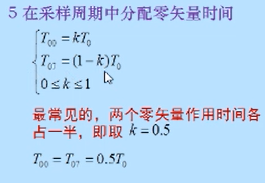

# FOC

## 基础理论

- 参考稚晖君等的讲解

  - https://blog.csdn.net/maijiayong/article/details/116116924

  - 对于为什么1相的幅值是2/3udc的解释，目前没有看懂

    https://zhuanlan.zhihu.com/p/56529497

    > 个人理解，将三个相的矢量进行合成，表示为极坐标的形式（幅值+相角），合成后可以看出合成的电压基本矢量的幅值为2/3Udc，Udc为直流电源电压，8个基本矢量也就是代入了不同的角度值获取的，对应的开关状态得到的电压也对应的代进去，得到8个基本矢量的极坐标表示，后续使用这些基本矢量去合成参考电压，因为只需要调整基本矢量的通断时间，同时进行0矢量的搭配，就可以形成所需的方向和大小的参考电压

    

    ​

    [第7讲 SVPWM调制矢量合成计算以及旋转坐标系_哔哩哔哩_bilibili](https://www.bilibili.com/video/BV13U4y1Z7Li/?spm_id_from=333.337.search-card.all.click&vd_source=36c127bc4125669fe0f4753003386afb)

  - 合成参考矢量的范围（正六边形）

    https://zhuanlan.zhihu.com/p/452972340

    为什么是六边形可以从合成的基本矢量极坐标表达式去分析。可以得到基本矢量的一个调制范围

  - TI电机课程

    https://www.bilibili.com/video/BV1eV411C7M2/?p=2&spm_id_from=pageDriver&vd_source=36c127bc4125669fe0f4753003386afb

## 控制思路

- 驱动电路还是使用三相逆变器

  参考稚晖君思路：[【自制FOC驱动器】深入浅出讲解FOC算法与SVPWM技术 - 知乎 (zhihu.com)](https://zhuanlan.zhihu.com/p/147659820)

1. 通过采样三相电流，进行clark变换得到两相正交的电流，使控制量减少一个，得到Iα、Iβ

   ​

2. Park变换，转换参考系，在同角速度旋转坐标系下观察两个同角速度的正弦矢量，结果就是两个常量

   由于旋转的角度是使得两个量落到Id和Iq方向，刚好是我们需要控制的量，旋转的角度是通过采样得到的，只要周期足够小，这两个旋转后的量是Id和Iq方向，若有较小偏差，后续PID闭环控制算法使之达到我们的理想值，也就是Id是我们的理想控制值，Id为0，全部都用来提供扭矩也就是磁场方向和永磁铁产生的磁场垂直。

   ​

3. 得到两个常量后就用于电流反馈回路，进行PID控制，输出Ud、Uq，再进行park逆变换，回到原本的坐标系Uα、Uβ

   

   

   

   ​

4. 通过这两个量Uα、Uβ合成Uref，这个就是目标参考电压矢量

5. SVPWM算法就是在已知角度的情况下，对Uref进行计算，得到需要的脉冲调制时间，如下的U*

   

   > 根据角度选择下面的切换顺序，需要使用的霍尔或者无感技术，对T1和T2的计算每个扇区都是一致的，算出T1和T2后是对开关的选择将PWM作用到对应开关上，时间的计算对每个扇区都是一样的

   

6. 后续就是使用定时器实现一个中心对称的PWM对矢量进行生产，PWM的占空比已经在上面计算完毕，T1和T2，使用零矢量加入到一个PWM周期中来控制输出的大小。T1和T2的比例决定合成矢量的方向，T0时间决定合成矢量大小。

   SVPWM讲解好课程：[第7讲 SVPWM调制矢量合成计算以及旋转坐标系_哔哩哔哩_bilibili](https://www.bilibili.com/video/BV13U4y1Z7Li/?spm_id_from=333.337.search-card.all.click&vd_source=36c127bc4125669fe0f4753003386afb)

   

   零矢量在合成时的分配：

   tip:零矢量的分配是区分各种调制的重要依据

   > PWM的周期长度可以根据处理器性能、MOS管的开关频率和电机转动丝滑要求程度决定。

##SPWM和SVPWM的区别

- SPWM是通过控制每一相单独输出一个正弦来控制电机的三相，也就是三角波和正弦波调制产生方波进行控制，本质是对正弦波的一个再现。

  

- SVPWM是从要合成的空间电压矢量出发，去控制开关管产生相应的电压矢量进而将电压矢量合成成所需的空间电压矢量

## 关于电压调制范围的理解

所以为了实现等幅调制，最大的输出为$$\frac { U _ { d c } } { \sqrt { 3 } }$$，即使基本矢量能发出$$\frac { 2 U _ { d c } } { 3 }$$的幅值，但是为了实现等幅调制，最终能到达的最大U~ref~只能达到$$\frac { U _ { d c } } { \sqrt { 3 } }$$

